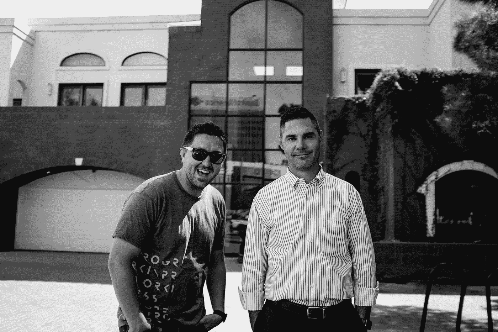

# 每个成功的产品团队都需要两种类型的软件工程师

> 原文：<https://levelup.gitconnected.com/the-2-types-of-software-engineers-every-successful-product-team-needs-11952e937def>

## 成功的应用需要两种类型的工程师。

在 [Unsplash](/s/photos/opposites?utm_source=unsplash&utm_medium=referral&utm_content=creditCopyText) 上 [NeONBRAND](https://unsplash.com/@neonbrand?utm_source=unsplash&utm_medium=referral&utm_content=creditCopyText) 拍摄的照片

当你想到软件开发人员时，你会想到什么？

好的。《星球大战》之外，热爱视频游戏的极客在黑暗的午夜编写刻板程序。

那是一种刻板印象..尽管，这是一个基本真实的刻板印象。

但是你还看到了什么？

大多数人看到的是两种人的其中一种。

你可能会看到一个超级友好和有创造力的人，他总是在创造新的东西。他们有许多不同的爱好&创造性的兴趣。他们会用吉他给你弹一首歌，然后向你展示他们的乐高堡垒。

或者。

你可能会看到一个更加保守的人，他非常聪明，但是有点喜怒无常。你不知道他们在讨论什么，但你知道一定是关于时间旅行的。你不敢要求澄清，因为你真的害怕看起来像个哑巴。

所以问题是“谁是对的，谁是更好的工程师？”

答案是两者都有。

这两种类型的工程师在软件开发中都很常见，也很成功。

优秀的应用程序开发人员有许多不同的类型和个性，但我相信我们都可以自然地分为两类。

移情的执行者&精确的系统化者。

# 执行者和系统化者。

所有的产品团队都必须有同理心的实现者和经验证的系统化者。从商业角度看待产品的工程师和从系统整体角度看待产品的其他人。

你不能向某个方向倾斜太多，否则你会危及整个应用程序的长期生存能力。

# 什么是实施工程师？

实施者从业务需求开始。

他们有很强的同理心。了解开发应用程序的原因。

他们考虑用户的需求。

他们希望解决现实世界中的问题，并且厌倦了诸如性能和安全性等技术障碍，如果这些问题目前不影响最终用户的话。

实施者是企业最好的朋友。

他们似乎是团队的一部分，乐于看到用户的成功。当你达成一笔大买卖或达到一个里程碑时，他们会出去和你一起狂欢。

他们将自己的价值观和成功与业务结合起来。

## 如何识别实现者

实施者本质上是创意者。在迈尔斯-布里格斯测试的感觉类别中，他们可能有中度到强烈的倾向。他们感同身受，是好的倾听者。

实施工程师通常在他们的职业生涯中走非常规路线。你会看到他们是自由职业者，通过项目、训练营和 Youtube 视频自学成才。

他们喜欢修补不同的框架。他们的副业项目由许多半成品的面向用户的应用程序组成，这些应用程序有很酷的概念，但缺乏深度。

他们对你的想法持乐观态度，并对你的产品如何对他们周围的世界产生积极影响感到兴奋。

## 实施者的优势

没有一个好的实现者，你不可能有一个产品。他们认为软件是解决人的问题的一种手段。

他们不喜欢仅仅为了达到一个性能基准而编写代码。他们的代码是有目的的，最终产品可供真实的人使用。

作为业务领导者，您不需要与实现者进行多次审查和澄清，因为您的需求马上就与他们“吻合”。他们感同身受，明白你想要什么。

您可能认为您应该雇佣一个实施团队。

你会犯一个可怕的错误。

## 实施者的弱点

如果将实施者独自留在孤岛上，他们将成为长期的负担。

他们编写代码来解决目前的问题和目标，可以忽略整个系统的需求。随着时间的推移，代码可能会变得混乱，难以维护。

管理和接纳新的团队成员可能会变得非常昂贵。

为了不断推出新功能，他们忽略了组织。

产品所有者对短期结果感到高兴，但随着时间的推移，看似基本的功能的成本开始增加，他们会变得沮丧。

那么还有什么选择呢？

系统化者。

# 什么是系统化者？

系统工程师关注平台和框架。他们是单元测试和性能基准的大力支持者。应用程序是他们的宝贝，他们的工作是培养它成为一个成功的独立的成年人。

你会发现大多数系统化人员都在讨论框架的内部运作。当你想向你的产品/他们的孩子介绍一项新功能时，他们会不知所措。

作为一个企业或产品所有者，你会和你的系统工程师发展出一种爱恨交加的关系。和他们讨论新功能的时候你会失去正能量。系统化者认为自己是“现实主义者”,但在讨论产品变更时更可能是悲观主义者。

的确，与系统工程师一起工作令人沮丧，但他们的话也是金。

你对实施者的信任将会慢慢消失，因为他们“敢做敢为”的态度会导致错过最后期限，但是你知道当一个系统工程师说某事将会发生。会发生的。

## 如何识别系统化者

你一和系统工程师交谈就知道他们是谁。

你提到你想制造一个产品，他们开始使用必须是外语的词汇。你不知道他们在说什么，但你知道这很重要。

当讨论任何复杂的事情时，你可能会认为系统化的人悲观、冷漠或傲慢。

这是一个不正确的假设，因为他们正在思考 5 层深度。

与他们的实现者兄弟相比，系统风格工程师通常来自传统的途径。他们很可能擅长数学，并拥有计算机科学学位。

他们喜欢有自己的私人空间和孩子来引导他们的注意力。无论是在生活中还是在工作中，当他们能够看到并管理他们所关注的领域时，他们就会表现出色。

## 系统化人员的优势

系统化者热爱产品和整个系统。

他们创建了驱动产品长期优势的应用程序的骨骼。

系统化人员在产品的性能、安全性和效率上花费的越多——你的系统化工程师就会越欣赏你并为你建立一个应用程序库。

那么问题出在哪里？

## 系统化者的弱点

不要期望系统化人员在没有修改的情况下，在任何短时间内构建特性。

你不会开心的。他们不会高兴的。

系统化者需要细节。

如果你需要他们创建一个功能，那么他们将需要用户故事，线框和原型。他们不能很好地处理不确定性，因为他们会想太多，对于简单的用户功能来说会花费太多时间。

他们要么忽视，要么不了解业务需求。您希望构建这个应用程序的全部原因。

用户和业务需求变成了一项烦人的维护任务。

正是平凡的待办事项将他们从构建强大系统的更重要的优先任务中抽离出来。

当被留在岛上时，系统化者会创造出一个过于复杂的平台。每当你只有一个主要关注系统的工程师时，你将很难把产品推向市场和建立一个企业。

那么，你应该雇用谁，是实施者前端开发人员和系统化后端？

# 实施者和系统化者与前端和后端

不要弄错了。实现者不是前端开发人员。系统化人员不是后端开发人员。

您的应用程序的整个堆栈中都需要这两者。

我真的很讨厌前端 vs 后端开发者的想法。这是一个过时的概念，因为你的产品的每个领域都需要这两种类型的开发人员。

实施者考虑用户和业务需求。他们可以做出真正有用的 API，就像漂亮而华丽的 UI 一样。

系统化者可以让你的 UI 像喷气式飞机一样快，同时还可以保护你的 API 和数据库。

将开发人员划分为“后端”和“前端”是一种糟糕的方式。

有些开发人员认为用户第一，有些开发人员认为系统第一。

# 执行者会变成系统化者吗，反之亦然？

简单的回答是没有…或者至少，我没有经历过。

我相信，你生来就有一种基于你的心理特征的特殊发展风格。

我在前面讨论实现者时提到过，他们在 Myers-Briggs 档案中倾向于“感觉”。这与我所经历的系统化者形成了对比，他们在个人资料中更倾向于“思考”。

从定义上来说，我是一个天生的 INTP，但是 T/F 总是在中间。我认为自己天生就是一个实现者。

将一个人归类为实现者还是系统化者并不总是像让某人接受迈尔斯-布里格斯评估那样简单。

人们总是比任何性格测试更复杂，但它确实表明我们生来就有某些理解世界的方式。

我没有看到实施者转变为系统化者，反之亦然。

但是…

## 高级软件工程师的标志是在相反的环境中成长

更大的答案是，一个高级软件开发人员应该努力在相反的环境中变得更强。

我不期望一个初级实现者在被雇佣时知道最佳性能和安全最佳实践。对于系统化者来说，情况正好相反。我预计他们将需要非常集中的用户故事和可能的几轮审查。

但对于高级工程师来说，情况并非如此。

一个高级工程师总是会有个人倾向。他们知道自己的优势，并擅长于此。但他们也知道自己的弱点。

他们努力去限制和克服它们。

# 实现者应该是你的第一个雇员，跟随社区系统化者的领导

所以问题变成了，“谁是适合你的雇员？”

如果你是一家初创公司，正在寻找合适的技术人才，你只能雇佣一个人。您应该从实现者开始，因为他们可以构建原型，将您的产品推向市场。

但要确保他们不是在筒仓里工作。

不管他们是喜欢 PHP，Node，Ruby，Python，Go 还是别的什么，一定要问他们用什么框架，跟谁学？

他们需要跟随一个比他们更强大的团体和领导。

这对所有应用程序开发人员来说都是正确的，但对你的创业来说极其重要。你不希望有一个开发人员在一个筒仓中编码。

你需要确保他们遵循已经建立了坚实框架的系统化者的经验证的基础。

你创业公司的第二个雇员，系统化人员，会感谢你的。