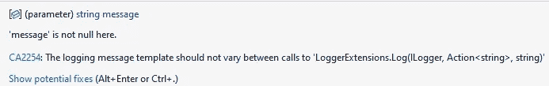
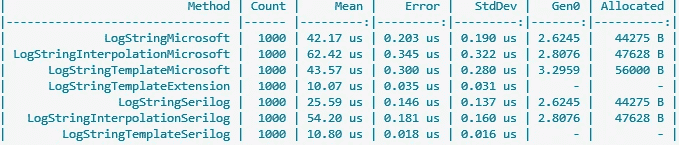

# 登录时你犯的两个最大的错误。网

> 原文：<https://levelup.gitconnected.com/the-2-worst-mistakes-you-do-with-logging-in-net-55e317392932>

## 如果您没有以正确的方式使用日志记录，将会损失很多性能！

照片由 [Aaron Burden](https://unsplash.com/@aaronburden?utm_source=medium&utm_medium=referral) 在 [Unsplash](https://unsplash.com?utm_source=medium&utm_medium=referral) 上拍摄

`[Microsoft.Extensions.Logging](https://www.nuget.org/packages/Microsoft.Extensions.Logging)` NuGet 包是仅次于`[Serilog](https://www.nuget.org/packages/Serilog/)`的 NuGet 下载量最多的日志包。作为最常用的一种，它也有一个陷阱，你很容易掉进去，这会让你损失很多性能。

## 1.不必要的日志调用

第一个也是可能最严重的错误是，由于`LogLevel`太低，对`ILogger`的调用太多，即使它们没有被处理。

通常，当您实现日志记录时，您需要区分不同的日志级别，从**跟踪**到**关键**。当您配置了您的日志记录器，只记录**错误**事件时，该级别下的所有内容都将被忽略。还是会？

通常情况下，`LogLevel`越低，您拥有的日志就越多，因为出于调试目的，您可能会记录所有内容。基本上这是没有错的，但是，你应该做得正确，并意识到副作用，当它是错误的。

看看下面的代码:

乍一看，这似乎是记录调试条目的合法方式。然而，这里有一个隐藏的陷阱:字符串插值。
插入一个字符串总是导致该字符串被[装箱](https://learn.microsoft.com/en-us/dotnet/csharp/programming-guide/types/boxing-and-unboxing)，从而被放入堆中。

现在想象一下，您正在调用这些日志方法几千次，并将您的`LogLevel`设置为**错误**。对于这里的每个调用，您都是在堆上分配内存，这些内存最终需要由垃圾收集器来收集。

> 在垃圾收集期间，你的应用程序完全停止执行！

这让你付出了极大的代价，你本可以很容易地节省下来。要么完全删除不必要的日志**，要么首先检查**，如果你必须在这里登录的话:

现在看起来很美，对吧？嗯，不完全是这样，但是我们会看到，在本文的后面我们可以做些什么。尽管如此，我们还是省去了大量的垃圾收集，因为字符串不会被插值，也不会被放到堆中。

## 2.不使用模板功能

您可能已经注意到，当您将一个简单的字符串作为`message`参数传递给日志记录函数时，您的 IDE 会警告您:

IDE 警告:消息模板

这是你的结果，使用日志功能错误的所有时间！不是仅仅将一个简单的字符串作为 log 方法的第一个参数，而是传递一个**模板**和模板的参数。使用日志功能的预期方式如下:

日志模板的正确使用

**ItemId** 和 **ItemName** 是命名参数，您必须按照参数在模板中出现的顺序在字符串后传递参数。

使用这种方法有几个好处，乍一看并不清楚:

*   外部**监控**工具(如 Azure AppInsights 或 AWS CloudWatch)除了记录日志消息之外，还会记录参数名称和值。然后，您可以在那里进行更详细的过滤。
*   在默认实现中，没有性能优势。但是，当将这种方法与 cutom 扩展方法结合使用时，这些参数可以是一般类型的，因此不会被装箱，从而在记录器不记录日志时节省堆上的内存。

让我们看看如何利用这些性能优势。

## 履行

既然我们已经确定了日志记录过程中的两个主要错误，那么让我们实现一个允许我们正确使用它们的解决方案:

这些是定制的[扩展方法](https://learn.microsoft.com/en-us/dotnet/csharp/programming-guide/classes-and-structs/extension-methods)，它们将替换原来对`ILogger`的`LogInformation`调用。请特别注意这里的泛型类型参数。由于它们是泛型的，它允许传递的参数**而不是**被装箱，从而节省了潜在的分配堆内存。

现在，您只需为所有的`LogLevel`创建所有那些扩展方法，就万事俱备了。还是有更快的方法？

您可以简单地使用 NuGet 包`[Serilog](https://github.com/serilog/serilog)`，而不是自己实现这个逻辑和其他许多现有的方法。这个包已经预先实现了所有的功能，具有很强的可扩展性，并且有很多已经过性能优化的特性。

## 基准

为了直观地显示这些错误真正造成的影响，让我用[BenchmarkDotNet](https://benchmarkdotnet.org/articles/overview.html)中的一些基准来测试一下:

在这里，我比较了所有提到的日志记录的变体，一次是用`Microsoft.Extensions.Logging.ILogger`(微软后缀)包括自定义扩展方法`Information()`，一次是用默认的`Serilog.ILogger` (Serilog 后缀)。

在我的机器上，这些基准测试产生了以下结果:

不同测井变化的对比

很明显，默认情况下，Serilog 在日志记录性能方面有一些优势。尽管如此，使用我们为 Microsoft ILogger 定制的扩展方法，我们可以实现大约相同的性能**和**无堆内存分配，当我们低于我们的`LogLevel`！这为您节省了大量的性能。

现在让我们做一些数学计算，我们只是(不)记录一个小字符串 1000 次，这已经有大约 50 KB 的总分配内存。当我们在一个`for`循环中调用`ILogger`时，循环次数增加了 10.000 次，我们使用了一个更大的字符串，我们已经有了 **1 GB** 的总分配堆内存，这些内存需要一直进行垃圾收集，因此每分钟暂停整个应用程序的时间超过了一秒钟！

我希望这些方法能帮助您识别应用程序中的一些性能灾难。对我来说，他们当然做到了！

感谢您花时间阅读这篇文章。我希望，你会觉得它有知识性、教育性和趣味性。非常感谢您的支持和参与。

如果您有兴趣了解干净架构、干净编码和最新技术栈的最新趋势、技巧和诀窍，尤其是在 C#环境中。净和有棱角——如果你考虑跟踪我，我会很感激。

祝你有美好的一天！

如果你还没有每天使用媒体来增长你的知识，现在是开始的最佳时机！借助 Medium，您可以轻松获得更多关于高度专业的主题的知识，发布高质量的内容，并接触到更广泛的受众。要开始，只需使用以下链接创建一个中型帐户:

[*现在加入介质*](https://medium.com/@tobias.streng/membership)

通过这样做，你将获得一个强大的平台，可以帮助你联系新的作者和读者，每天学习新的东西。