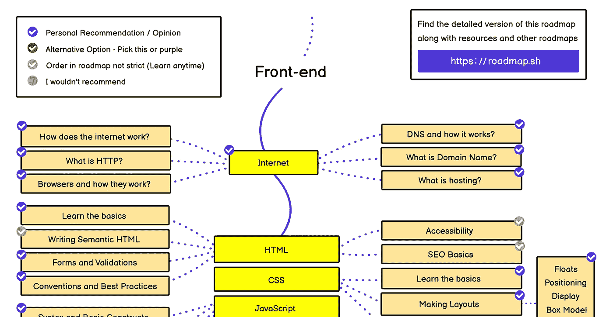
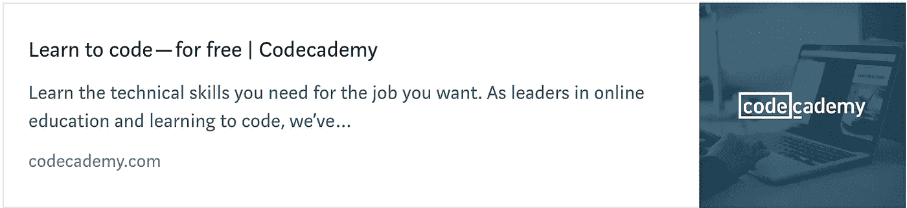
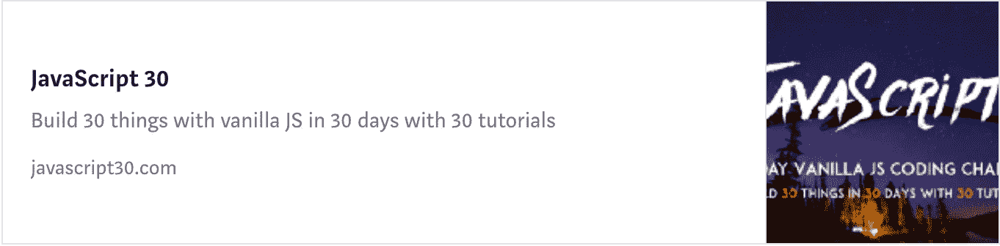
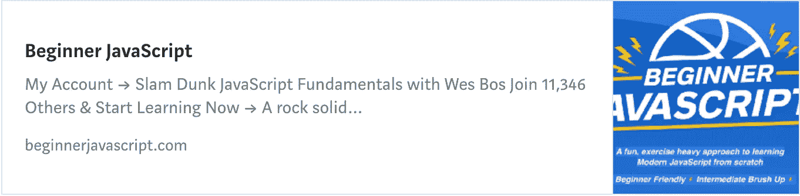
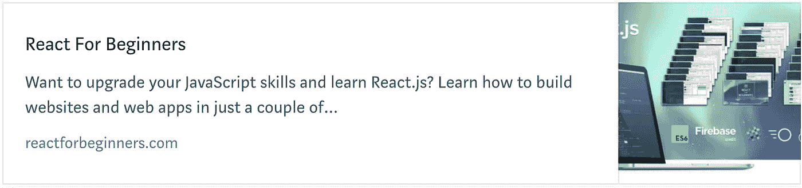
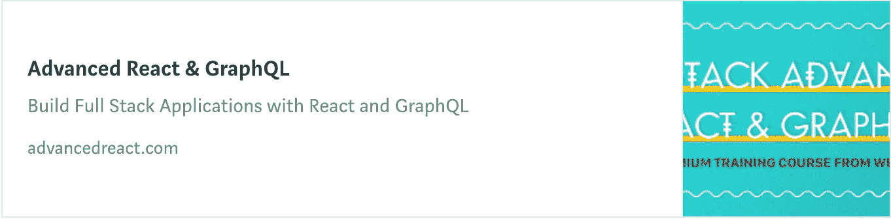
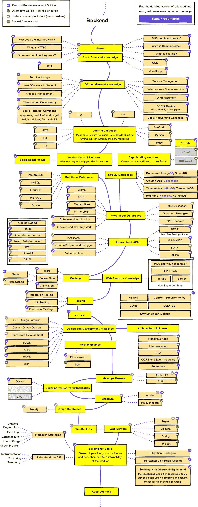
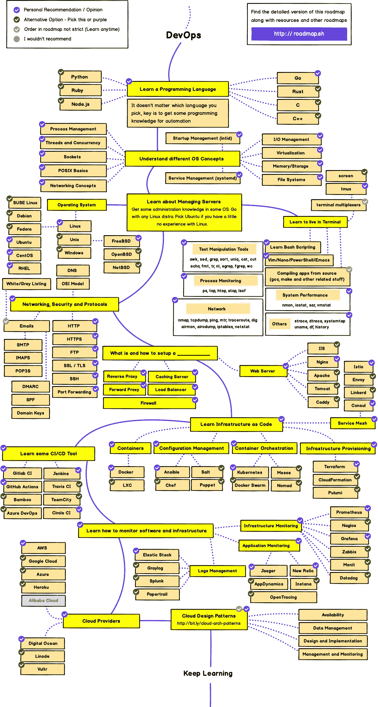

# 2023 年网络开发者路线图

> 原文：<https://levelup.gitconnected.com/the-2020-web-developer-roadmap-76503ddfb327>

## 通过本视觉指南，学习成为前端、后端、全栈或 DevOps 开发人员——不需要 CS 学位

学习编码或者转行到软件工程行业，这是前所未有的好时机。对网络开发人员的需求空前高涨，而且还在不断增加。网上有免费和高级教程，教你如何找到一份开发工作——不需要 CS 学位🤓。

我推出了一门课程！🙌端到端的 [**课程，掌握编码面试**](https://skilled.dev) 并获得软件工程师的下一份工作。👇

 [## 掌握编码面试| Skilled.dev

### 一个完整的平台，在这里我会教你找到下一份工作所需的一切，以及…

技术开发](https://skilled.dev) 

准备找工作了吗？[T5 加入升一级的人才集体🚀](https://jobs.levelup.dev)

本文详细介绍了有效学习所需的技能和相应的教程。插图指南由 [Kamran Ahmed](https://twitter.com/kamranahmedse) 提供，可在[roadmas . sh](https://roadmap.sh/)或 [GitHub repo](https://github.com/kamranahmedse/developer-roadmap) 上找到——Kamran 的工作非常出色，请务必开始回购并订阅他的简讯以支持他的工作。不要被地图吓倒。这可能看起来很多，但我会把它分解，这样你就可以一步一步地学习每一部分。

本文将分为以下几个部分:

1.  **:每个开发人员都需要了解的编程概念。**
2.  ****编程入门:如果你是一个全新的编程新手，从哪里开始？****
3.  ****[**前端开发**](#e558) :学习如何构建用户界面(UI)。****
4.  ****[**后端开发**](#eb3d) :学习如何构建 API，编写服务器代码。****
5.  ****[**DevOps 工程**](#de3f) **:** 学习如何管理基础设施、部署和系统。****
6.  ****[**JavaScript 与编码深度**](#ea23) :自上而下学习 JS。****
7.  ****[**软件工程书籍**](#423a) :我发现这些书籍通常有助于提高我对编程的整体理解，并对工作产生积极影响。([点击此处查看完整列表](https://amzn.to/2SdZtxI))****
8.  ****[**工作建议和总结**](#7eea) :一些关于如何寻找工作和作为开发人员继续成长的最后快速提示。****

> ****这些都是我个人推荐的产品。对于他们中的一些人，如果你使用文章中的链接，我会得到报酬。如果你确实找到了你喜欢的东西，你的支持会受到感激。****

# ****1.任何道路的必修课****

****我们将从每个开发人员都需要学习的技能开始，这些技能将用于所有途径——前端、后端或开发运维。****

****作为一名高效的开发人员，您应该精通命令行，知道如何使用 Git 对代码进行版本控制，并了解 web 的基础知识。****

## ****命令行****

****命令行是你运行代码的方式。您必须能够导航和执行所需的命令。你在命令行上做得越好，你作为开发人员的效率就越高。****

*   ****[**学够命令行才危险**](https://www.learnenough.com/command-line-tutorial) —一本学习命令行的优秀免费书籍。****
*   ****[**Linux 命令行基础知识**](https://bit.ly/2srCscc)****
*   ****[**Linux 命令行:完整介绍**](https://amzn.to/2W23LHD)****

## ****选择文本编辑器****

****VS Code 是 web 开发人员的首选，这使得它成为一个很好的起点——这是我个人使用的。它是免费和开源的，有很多插件可以让你更有效率。然而，有许多优秀的选项可用，如 [Atom](https://atom.io/) 、 [WebStorm](https://www.jetbrains.com/webstorm/) 或 [Vim](https://www.vim.org/) (针对硬核)。****

****文本编辑器是编写所有代码的地方，终端是执行代码的地方。作为一个开发者，这是你生活的地方。花些时间挑选合适的编辑器，设置插件，学习热键。拥有正确的工作流程可以显著提高您的工作效率。****

## ****Git 和版本控制****

****Git 是用于保存代码和创建不同版本的工具，允许您与其他开发人员协作。GitHub 是存储代码和协作开发开源软件的最佳场所。****

*   ****[**从 GitHub** 学习 Git](http://try.github.io/)****
*   ****[**排名饭桶教程**](https://gitconnected.com/learn/git)****
*   ****[**Git Complete:Git**](https://bit.ly/2HknNd8)的权威分步指南****

## ****网络基础****

*   ****[**HTTP**](https://en.wikipedia.org/wiki/Hypertext_Transfer_Protocol)**/[**HTTPS**](https://en.wikipedia.org/wiki/HTTPS)******
*   ****[**宋承宪**](https://en.wikipedia.org/wiki/Secure_Shell)****
*   ****[**字符编码**](https://www.w3.org/International/questions/qa-what-is-encoding)****
*   ****[**【模型-视图-控制器】**](https://en.wikipedia.org/wiki/Model%E2%80%93view%E2%80%93controller)****
*   ****[**休息**](https://en.wikipedia.org/wiki/Representational_state_transfer)****

# ******2。编程介绍******

****在您深入其中任何一条道路之前，您应该有一个坚实的编程基础。对于新开发人员，我强烈建议将 JavaScript 作为第一语言来学习。JS 可用于前端和后端开发人员，这意味着您可以成为全栈开发人员，同时能够专注于掌握一种语言。JavaScript 的好处是:****

1.  ****JavaScript 是一种相对容易学习的语言****
2.  ****JavaScript 是构建 web 应用程序所必需的，因为它是在浏览器中运行的编程语言****
3.  ****JavaScript 可以在前端和后端使用，允许您用一种语言编写全栈应用程序****
4.  ****JavaScript 开发人员有大量的工作****

> ****如果你知道你要么只想处理数据，要么只在后端工作，学习 Python 是适合初学者的另一个选择。****

****有很多高质量的免费选项可以用来开始编码。freeCodeCamp 和 Codecademy 是很好的选择，可以帮助你打好基础。****

**** [## 通过免费的在线课程、编程项目和面试准备学习编码…

### 通过免费的在线课程、编程项目和开发人员工作的面试准备来学习编码。

freecodecamp.org](https://freecodecamp.org) 

一旦你有了基本的东西，下一个伟大的步骤就是免费的 JavaScript 30 T1 课程或高级的 T2 开始 JavaScript30 课程。Web Bos 通过构建真实的项目来教你 JavaScript 的核心概念。你应该尽快尝试做真正的项目。项目是学习工作技能的最好方式，让你在开始面试时建立一个文件夹。

如果你想加快进度，这些是很好的高级课程，可以从 JS 初学者开始，快速进步。

[**现代 JavaScript 从头开始**](https://bit.ly/2T1cbNi)

 [## 现代 JavaScript 入门(包括 10 个真实项目)

### 用纯 JavaScript 学习和构建项目(没有框架或库)

udemy.com](https://bit.ly/2T1cbNi) 

[**【现代 JavaScript boot camp(2023)**](https://bit.ly/2AQcEL5)

 [## 现代 JavaScript 训练营(2023) | Udemy

### 通过构建真实世界的应用程序来学习 JavaScript。包括 3 个真实项目、80 个编程挑战和 ES6/ES7！

udemy.com](https://bit.ly/2AQcEL5) 

[**高级 Javascript**](https://bit.ly/2DobpVj)

 [## 高级 Javascript | Udemy

### 只需三个小时，你就能学会足够的 javascript，从初级 JS 开发人员变成高级 JS 专家

udemy.com](https://bit.ly/2DobpVj) 

如果你正在寻找一个可以带你从初学者到专业人士的课程订阅选项，一个很好的选择是 [Pluralsight](https://pluralsight.pxf.io/c/1304575/424552/7490) 。你必须注册订阅(提供免费试用)，但他们几乎在所有方面都有优秀的内容。

 [## Pluralsight —无限制的在线开发人员、IT 和网络安全培训

### 技术学习平台，提供网络开发，IT 认证和按需培训，帮助您的…

pluralsight.com](https://pluralsight.pxf.io/c/1304575/424552/7490) 

# 3.学习前端开发

前端开发是我们如何为 web 构建用户界面。你必须有扎实的 JavaScript 基础，并且理解 HTML/CSS 是如何工作的。

流行的客户端库——React、Angular 和 Vue——都是用 JavaScript 编写的。彻底了解普通的 JavaScript 对于提升和拥有构建复杂应用程序所需的技能是必不可少的。一旦你有了扎实的 JavaScript 基础，你就应该学习 [HTML](https://gitconnected.com/learn/html-5) 和 [CSS](https://gitconnected.com/learn/css) 。即使 UI 是用 JS 编码的，它仍然会生成 HTML，并由 CSS 进行样式化。

> 如果您需要更多关于 JavaScript 的工作，请参考“编程简介”一节中的参考资料。

[**2023 年网络开发训练营**](https://bit.ly/2D8kams)

最完整的网页开发课程。从 HTML 和 CSS 开始，学习 JavaScript 以及它如何与 DOM 交互，最终构建一个全栈的 web 应用。

 [## 完整的 2023 年网络开发训练营| Udemy

### 欢迎来到完整的 Web 开发训练营，这是您学习编码并成为全栈 web…

udemy.com](https://bit.ly/2D8kams) 

[**Web 开发者训练营**](https://bit.ly/2QZdHxG)

 [## Web 开发人员训练营| Udemy

### 学习 web 开发唯一需要的课程——HTML、CSS、JS、Node 等等！

udemy.com。](https://bit.ly/2QZdHxG) 

## HTML 和 CSS

HTML 和 CSS 通常是一起学习的。HTML 是赋予页面结构的骨架，CSS 是赋予页面风格的语言。

[**HTML 和 CSS 绝对初学者**](https://bit.ly/2CnsSv8)

 [## 一步一步 HTML 和 CSS 的绝对初学者

### 想学习如何创建网页，但对 HTML 和 CSS 感到害怕？不确定从哪里开始？循序渐进…

udemy.com](https://bit.ly/2CnsSv8) 

[**用 HTML5 和 CSS3**](https://bit.ly/2SYFgJu) 构建响应式现实世界网站

 [## 使用 HTML5 和 CSS3 | Udemy 构建响应性网站

### “在经历了其他平台上的其他相关课程后，我可以说这个课程是最实用和最容易的…

udemy.com](https://bit.ly/2SYFgJu) 

[**CSS:完全指南(高级 CSS)**](https://bit.ly/2FBcQRA)

 [## CSS:完整指南(高级 CSS)

### 第一次学习 CSS，或者温习你的 CSS 技能并深入学习。每个 web 开发人员都需要知道。

udemy.com](https://bit.ly/2CnsSv8) 

## 用户界面库(React、Vue、Angular)

现代 UI 开发已经趋向于一个组件模型，其中有三个库作为专业前端工程师使用的主要库——[React](https://gitconnected.com/learn/react)、 [Vue](https://gitconnected.com/learn/vue-js) 和 [Angular](https://gitconnected.com/learn/angular) 。你最好对其中一个库非常了解，而不是试图学习所有 3 个库。然后在工作中，如果公司使用你没有学到的框架，你将能够学到一些不同的东西。React 是最受欢迎的，但 Vue 和 Angular 都被迅速采用。

## 反应

[**官方反应过来介绍**](https://reactjs.org/tutorial/tutorial.html)

 [## 教程:反应简介-反应

### 本教程没有假设任何现有的 React 知识。在本教程中，我们将构建一个小游戏。你可能会…

reactjs.org](https://reactjs.org/tutorial/tutorial.html) 

[**React —完整指南(包括钩子、React 路由器、Redux)**](https://bit.ly/2W66AY3)

 [## React 16:完整课程(包括钩子、React 路由器、Redux)

### 投身其中，从头开始学习 React！学习 Reactjs、Hooks、Redux、React Routing、Animations、Next.js 等等！

udemy.com](https://bit.ly/2W66AY3) 

[**现代用 Redux**](https://bit.ly/2AQeBqT)

 [## 现代反应与 Redux | Udemy

### 掌握 React v16.6.3 和 Redux 用 React 路由器、Webpack、Create-React-App。包括钩子！

udemy.com](https://bit.ly/2AQeBqT) 

[**初学反应**](https://ReactForBeginners.com/friend/GITCONNECTED)

[**高级 React + GraphQL**](https://AdvancedReact.com/friend/GITCONNECTED)

## 某视频剪辑软件

[**Vue 学校**](https://vueschool.io/?friend=gitconnected)

 [## 向 Vue 学校的核心团队成员和行业专家学习 Vue.js

### 368 节课* 26 小时* 26 门课程全面学习 Vue.js:为了成为 Vue.js 专业人士，您将了解…

vueschool.io](https://vueschool.io/?friend=gitconnected) 

[**官方 Vue 介绍**](https://vuejs.org/v2/guide/)

 [## 简介- Vue.js

### vue . js——渐进式 JavaScript 框架

vuejs.org](https://vuejs.org/v2/guide/) 

[**Vue JS 2 —完整指南(包括 Vue 路由器& Vuex)**](https://bit.ly/2R2bOQX)

 [## 使用 Vue JS 2 开发(完整的 Vue 路由器和 Vuex 课程)

### Vue JS 是一个非常棒的 JavaScript 框架，用于构建前端应用程序！VueJS 混合了最好的角度+反应！

udemy.com](https://bit.ly/2R2bOQX) 

[**终极 Vue JS 2 开发者课程**](https://bit.ly/2DmWkU1)

 [## Vue.js Essentials — 3 门课程包| Udemy

### 通过使用 Vue 构建 3 个专业、真实的 web 应用程序来学习和掌握 VueJS！

udemy.com](https://bit.ly/2DmWkU1) 

[**Vue JS 必备带 Vuex 和 Vue 路由器**](https://bit.ly/2Ho3mfj)

 [## 带有 Vuex 和 Vue 路由器的 Vue JS Essentials | Udemy

### 学习 Vue、Vuex 和 Vue 路由器的时间有限？参加这个课程，11 个小时学会 Vue！

udemy.com](https://bit.ly/2Ho3mfj) 

## 有角的

[**棱角分明的 8—完整指南**](https://bit.ly/2Hn9mF6)

 [## 主角度 8(以前的角度 2):完整的课程

### 掌握 Angular (Angular 2+，包括 Angular 8 ),并使用 Angular.js 的继任者构建出色的反应式 web 应用程序

udemy.com](https://bit.ly/2Hn9mF6) 

[**完整角度教程:从初级到高级**](https://bit.ly/2RFP0M2)

 [## 完整的角度课程:初学者到高级

### 最全面的 Angular 4 (Angular 2+)课程。用 Angular，Firebase 和 Bootstrap 构建一个真正的电子商务 app

udemy.com](https://bit.ly/2RFP0M2) 

# 4.学习后端开发

后端是您与数据库通信、处理业务逻辑以及向前端发送必要数据的地方。

你的后端/服务器可以用任何语言编写。我的建议是从 Node/JavaScript 开始，因为它相对容易学习，而且非常强大。此外，您可以更容易地在前端和后端之间转换，因为您将使用相同的语言。我还将详细介绍学习后端开发的其他可能的语言——Python、Go、Ruby on Rails。

使用数据库是成为后端工程师的核心，我还将概述学习 SQL、NoSQL 和 GraphQL 的教程。虽然 NoSQL 变得越来越受欢迎，但 SQL 仍然是迄今为止使用最多的数据库类型，而且是必须学习的。

## 节点. js

[节点](https://gitconnected.com/learn/node-js)是我们在浏览器外执行 JavaScript 的方式，可用于在后端/服务器上构建 API。

[**【node . js 开发者教程全集(第三版)**](https://bit.ly/2RSOAkL)

 [## 完整的 Node.js 开发人员课程(第三版)

### 你以前学过 Node 吗？你开了一门新课程，老师让你安装一堆库…

udemy.com](https://bit.ly/2RSOAkL) 

[**NodeJS —完整指南(包括 MVC、REST APIs、GraphQL)**](https://bit.ly/2U46COi)

 [## NodeJS —完整的指南(包括 MVC、REST APIs、GraphQL)

### 主节点 JS，用 Node.js 构建 REST APIs，GraphQL APIs，添加认证，使用 MongoDB，SQL &等等！

udemy.com](https://bit.ly/2U46COi) 

[**学习节点**](https://LearnNode.com/friend/GITCONNECTED)

## 数据库

数据库是应用程序数据的永久存储。通常，后端会在 API 调用期间对数据库进行查询。有两种常见的数据库类型— SQL 和 NoSQL。

## PostgreSQL / MySQL

这是两个顶级的 SQL 实现，很可能是您将在大多数公司中看到的。

*   [**终极 MySQL 训练营:从 SQL 初学者到专家**](https://bit.ly/2R0Wfcj)
*   [**SQL & PostgreSQL 初学者**](https://bit.ly/2FEGeHs)

## GraphQL

GraphQL 本身不是数据库，而是数据库之上的查询语言。许多人认为这将会彻底改变应用程序开发，彻底改变我们构建 API 的方式。它正在迅速被科技巨头和顶级初创公司采用和利用。

*   [**现代 graph QL boot camp(Advanced node . js 和 Apollo)**](https://bit.ly/3eBtkbd)
*   [**GraphQL with React:完整开发者指南**](https://bit.ly/3ezTo6H)

作为奖励，[试试 Hasura](https://hasura.io/) 。它允许您使用 web UI 生成 GraphQL，并自动为您构建 Postgres 数据库。

## MongoDB

Mongo 是与 Node 一起使用的最流行的 NoSQL 数据库。它将数据存储在文档中，文档是容易映射到 JSON 和 JavaScript 对象的`key` / `value`对。这是一个

*   [**MongoDB —完全开发者指南**](https://bit.ly/2U3wOIJ)

## 计算机编程语言

Python 对初学者来说很容易，但也被科技巨头和初创公司广泛用于后端、数据科学和脚本编写。

[**完整 Python Bootcamp:从零到 Python 3 中的英雄**](https://bit.ly/2AWhgPW)

 [## 完整的 Python 训练营:学习 Python 编程和代码

### 像专业人士一样学习 Python！从基础开始，一直到创建自己的应用程序和游戏！

udemy.com](https://bit.ly/2AWhgPW) 

[**Python 和 Django 全栈 Web 开发者训练营**](https://bit.ly/2U0NNeQ)

 [## Python 和 Django 全栈 Web 开发人员训练营

### 欢迎来到 Python 和 Django 全栈 Web 开发者训练营！在本课程中，我们涵盖了您需要知道的一切…

udemy.com](https://bit.ly/2U0NNeQ) 

## Go (Golang)

围棋相对较新，但已被迅速采用。它是一种静态类型的语言，但对开发人员来说非常友好。这使它成为建筑服务的理想选择。

*   [**完成 Go 训练营:从零到英雄(Golang)**](https://bit.ly/2U464rH)
*   [**用 Google 的 Go 编程语言进行 Web 开发**](https://bit.ly/2QYgWFG)

## Ruby on Rails

Ruby on Rails 多年来一直是首选的启动语言。它的易用性和约定驱动的语言使得快速构建产品变得容易。

*   [**完整的 Ruby on Rails 开发者课程**](https://bit.ly/2CD3UIm)

# 5.学习 DevOps 工程

DevOps 管理公司的基础设施。他们设置了部署您的 web 应用程序和管理网站流量的流程。DevOps 工程师专注于让其他团队尽快将代码投入生产，并确保服务器始终正常运行，同时尽快将内容发送给最终用户。

DevOps 的领域非常广阔，他们做出的选择影响着每一个工程团队。作为开发运维工程师，需要学习的一些基本主题包括:

*   **Linux** : Linux 在 67%以上的服务器上使用，很有可能是您作为 DevOps 工程师使用的。彻底理解它是至关重要的。
*   **安全性** : 确保你的整个云是安全和加密的。还要设置 API，以便所有内容都通过 HTTPS 提供，并且不易受到常见攻击。
*   **命令行/终端** : 我们在第一节中介绍了命令行，但它对开发人员来说更为重要。您必须彻底理解它的工作原理和 Linux 命令，并准备好 SSH 到远程服务器。你还将为整个公司编写脚本和自动化程序。
*   **自动化测试** : DevOps 建立了一个自动化测试系统，这样所有进入生产的代码都经过了彻底的审查，减少了引入 bug 或回归的可能性。
*   **持续集成和持续交付(CI/CD)** :为部署建立一个管道，以便代码自动合并到产品中，同时减少单个开发人员的手动接触点。自动化测试在 CI/CD 中扮演着重要的角色。
*   **容器**:容器是基础设施的核心部分，大多数初创公司和科技巨头都以某种形式利用 Docker 和/或 Kubernetes。容器确保你的代码总是在一个干净的、可重复的环境中执行。
*   **云提供商**:了解如何使用 AWS、GCP 或 Azure 等流行的提供商管理云中的服务器。
*   日志管理:正确的日志记录是必不可少的。它允许您诊断 bug 并找到应用程序中任何问题的根本原因。

# **6。JavaScript 和深入编码**

我建议尽快着手真正的项目。然而，在某些时候，您会想要深入研究 JavaScript，并了解它是如何工作的。此外，了解数据结构、算法和其他一般计算机科学知识也很重要。

[**【你不知道的 JavaScript(YDKJS)**](https://amzn.to/2FwY6TO)**——这简直是关于 JavaScript 最好的书。如果你完全理解了这一点，你就会了解 JS 的整个核心语言。在 GitHub 上免费阅读[或](https://github.com/getify/You-Dont-Know-JS)[在亚马逊上购买实体或 Kindle 版本](https://amzn.to/2FwY6TO)。**

**[**TypeScript**](https://bit.ly/2UnQ0RZ) —这不是对初学者的要求(除非你用的是 Angular)，但是 TypeScript 的采用正在快速增长，已经消耗了 JS 世界。许多人认为这是 JavaScript 的未来。**

**[**JavaScript 中的数据结构**](https://bit.ly/2FNMZa9) —在 JavaScript 中从头开始构建最常见的数据结构。这个视频系列是建立你已经获得的知识的一个很好的扩展，也是一个很好的采访资源。**

**[**雄辩的 JavaScript**](https://amzn.to/2FsFJj7)**——又一本 JavaScript 工程师最爱的书。它涵盖了比 YDKJS 更广泛的主题，包括浏览器和节点。[在线免费阅读](http://eloquentjavascript.net/)或[在亚马逊上购买实体或 Kindle 版本](https://amzn.to/2FsFJj7)。****

****[**算法介绍**](https://amzn.to/2M8yfTx)——虽然不是最适合初学者的书，但它很全面。一旦你真的觉得是时候彻底理解算法了，就迈出这一步。****

****[**算法**](https://bit.ly/2R1fbr5) —本课程采用 Java 授课，但学习成果仍然有效。你对计算机科学中最重要的算法有了透彻的理解。该课程由普林斯顿大学在 Coursera 上教授。****

# ******7。软件工程书籍******

****这 5 本书将会使你成为一个更好的程序员，或者是你在职业生涯中的某个时刻，比如在面试中需要的一本重要的书。或者，查看[编程书籍推荐](https://www.amazon.com/ideas/amzn1.account.AHSFMOVW4P7NMOJ5UWMOKZ7BSOEA/2S0LJ6D2LK797/ref=as_li_ss_tl?ie=UTF8&linkCode=sl2&tag=treyhuffine-20&linkId=d73e8fd0b44c7ba47fdac76dbda9f84c&language=en_US)的完整列表。****

*   ****罗伯特·C·马丁 [**干净的代码**](https://amzn.to/2r4n5pr)****
*   ****[**实用主义程序员**](https://amzn.to/2Q7cp7r) 安德鲁·亨特&戴维·托马斯****
*   ****[**卓有成效的工程师**](https://amzn.to/2QgHXbf) 刘德明****
*   ****[**破解编码访谈**](https://amzn.to/2KjRRTY) 格利·拉克曼·麦克道尔****
*   ****[**计算机编程的艺术**](https://amzn.to/2M7apYu) 唐纳德·克努特著****

****如果你正在学习网络开发，你也很有可能对创业感兴趣。这些是一些关于创业和成功人士哲学的顶级书籍。****

*   ****[**精益创业**](https://amzn.to/2AIgwOs)Eric Ries****
*   ****[零比一**彼得·泰尔**T7](https://amzn.to/2M8ABSu)****
*   ****[**被 Nir Eyal 钩住**](https://amzn.to/2ST8tFt)****
*   ****[**牵引**](https://amzn.to/2VNxJ1K) 由加布里埃尔·温伯格和贾斯汀·马雷斯****
*   ****本·霍洛维茨 [**关于硬事物的硬事物**](https://amzn.to/2Fx26ni)****

# ****8。工作建议和总结****

****通过学习这些教程，你将会成为一名专业的 web 开发人员。确保尽快开始建立真正的项目，并开始申请工作。项目和部署的网络应用程序是向公司展示你一旦被录用就能做出贡献的最好方式。****

****找第一份工作总是一场数字游戏，所以你申请得越多，得到工作的机会就越大。这可能需要几个月的时间，所以要为漫长的道路做好准备。然而，你最终会得到一份工作，在得到第一份工作后，每一份工作都会变得容易得多。****

****工作提示:****

*   ****只关注几个技能:Ex。JavaScript，React，Node。不要试图什么都学——React、Vue、Angular、jQuery、Backbone 等。尽你所能学习最低要求的语言/库。走深，不走宽。****
*   ****建立一个投资组合网站，并使用[投资组合 API](https://gitconnected.com/portfolio-api) 来驱动数据。对招聘经理来说，展示你能构建应用程序的能力是至关重要的。****
*   ****申请尽可能多的工作，只要它们符合你的技能。不要放弃！如果你继续努力，你最终会找到你的角色。这是一条漫长而艰难的道路，但如果你对这个领域充满热情，那么努力是值得的。****
*   ****为面试而练习。使用“破解编码面试”和网站来轻松回答面试问题。****
*   ****阅读“你不懂的 JavaScript”系列。这将确保你对这门语言了如指掌。****
*   ****继续构建项目——项目是学习和展示你了解如何为现实世界构建应用程序的最佳方式。****

****—[@ trey huffine](https://twitter.com/treyhuffine)|[@ git connected](https://twitter.com/gitconnected)****

********

****创建和维护一份简历并不有趣。而是让我们为你生成一份牛逼的简历:) [**简历生成器>**](https://gitconnected.com/resume-builder)****

**** [## 软件工程师简历生成器和示例| gitconnected

### 使用您的个人资料中的详细信息构建一份有价值的简历模板。从你的投资组合网站链接到你的简历或…

gitconnected.com](https://gitconnected.com/resume-builder) ********