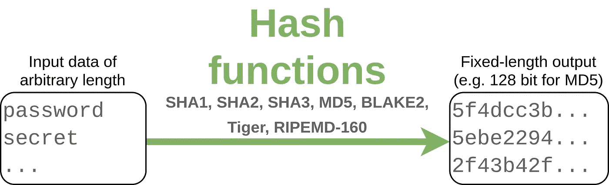
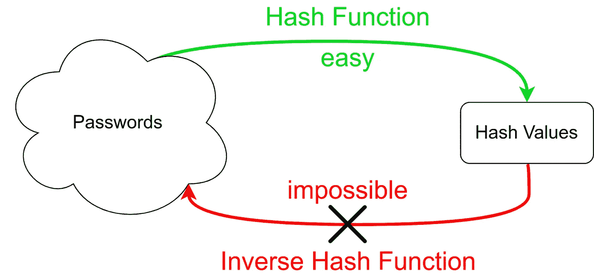

# 哈希函数的 3 个应用

> 原文：<https://levelup.gitconnected.com/the-3-applications-of-hash-functions-fab1a75f4d3d>

## 它们是什么，有哪些选择，以及它们为什么重要



图片作者:马丁·托马斯

哈希函数将任意多个字节作为输入，并产生一个固定长度的字符串作为输出。该字符串通常看起来完全随机，但是相同的输入总是生成相同的输出。对于不同的输入，它们通常会产生不同的输出，但稍后会详细介绍。

读完这篇文章后，你会知道散列函数的三种不同的应用。所有这些对于现代软件开发都是至关重要的。我们走吧！

# 平凡的散列函数

假设我们想要一个散列函数，它接受任意长度的输入并生成一个 128 位的输出。

计算散列的简单方法是查看 128 位数据块。如果输入不是 128 位的倍数，我们就用零填充它。然后我们对这些块进行异或运算:

这只是哈希函数的一个非常简单的例子。它有两个很好的特性:执行速度非常快，非常简单。

缺点也很明显:

*   通过更改输入来强制执行某个哈希值是很简单的事情
*   如果您使用散列函数进行错误检查，您将无法在相同的位置以散列长度为模捕获偶数个错误。因此，如果您在第 127 位和第 255 位有错误，哈希将与没有错误时相同。
*   短输入的哈希值(低于哈希值的长度)就是填充的输入。可以直接看。

# 应用 1:密码

当你在网站注册时，你通常需要输入密码。但是网站可能会被黑，攻击者可能会得到你的密码。为了保护用户，密码不以明文形式存储。它们也没有加密。相反，它们被散列。这意味着我们对它们应用一个**单向函数**。散列函数的一个典型例子是 MD5。在 Python 中，您可以像这样应用它:

```
# IMPORTANT: DO NOT USE MD5 FOR PASSWORDS!
>>> import hashlib
>>> hashlib.md5(b"unicorn").hexdigest()
'1abcb33beeb811dca15f0ac3e47b88d9'
>>> hashlib.md5(b"unicorns").hexdigest()
'02d8c4ac323c5df679077f020f170453'
```

您可以在这里看到两个关键属性:(1)输入的长度无关紧要；输出的长度是恒定的，并且(2)不同的输入映射到不同的输出。

您看不到的是哈希函数的单向特性:



图片作者:马丁·托马斯

计算给定密码的哈希值相对较快且具有确定性。给定哈希值，不可能确切知道原始密码。出现这种情况的原因是冲突:密码可以任意长，但是哈希值的长度是固定的。这意味着一定有一些(不同的)密码具有相同的哈希值。对于好的散列函数来说，这是超级不可能的。

通常，查找具有给定哈希值的密码的最佳选择是尝试每个可能的密码，直到看到相同的哈希值:

```
def inverse_hash(hashed_password):
    for password in generate_new_password():
        if hash(password) == hashed_password:
            return password
```

这比计算哈希值难多了。对于随机生成的密码，很可能您必须尝试数十亿个密码，直到您碰巧找到一个具有正确哈希的密码。

**密码哈希函数**是哈希函数，但并不是所有的哈希函数都是密码哈希函数。加密哈希函数需要的其他属性有:

*   **预镜像抗攻击能力**:给定`hash(m1)`，找不到`m1`。
*   **雪崩效应**:如果你改变输入中的单个比特，输出中的每个比特都有 50%的概率发生变化。这个属性是可取的，因为它表明您没有得到任何关于前映像的信息。
*   **抗碰撞攻击**:找不到哈希值`hash(m1) == hash(m2)`相同的`m1`和`m2`消息。
*   **选择前缀抗攻击**:这比碰撞抗攻击更一般。给定两个前缀`p1`和`p2`，找到两个消息`m1`和`m2`，使得它们的串联给出相同的散列:
    `hash(p1+m1) == hash(p2+m2)` ( [源](https://en.wikipedia.org/wiki/Collision_attack))

如果攻击者想要应用上面给出的`inverse_hash`,你应该让它成为一个超级耗时的操作。因此，通过应用哈希函数 1000 次，您可以将执行时间从大约 100μs 推到 100ms。

要了解更多细节，请阅读我的关于密码哈希的文章:

[](/password-hashing-eb3b97684636) [## 密码哈希😇

### 准备好被黑吧

levelup.gitconnected.com](/password-hashing-eb3b97684636) 

# 应用 2:完整性检查

有时你只想知道两个文件是否可能完全相同。例如，您可能希望创建一个程序来扫描目录和所有子目录中的重复文件:

在这个应用程序中，我们使用两个不同的哈希值通常意味着输入是不同的这一事实。哈希冲突很少发生。然后，您还可以比较`duplicate_set`中的文件，以确保它们确实是重复的。

这种方法也可以用来确保文件的完整性。想想你下载的大文件。您可以通过计算已下载文件的校验和与在线文件的校验和来检查下载过程中是否出现了问题。

# 应用 3:区块链中的工作证明

比特币和其他各种区块链使用一种叫做“工作证明”的概念。对于这些技术来说，能够证明你在一个问题上投入了一定的计算资源是很重要的。解决这个问题需要很难，但是容易产生问题实例。工作证明的一个常见选择是使用加密散列函数，并要求输入生成具有特定模式的散列值。例如:

> 找到一个字符串`x`，使得`y := sha256(x)`和`y`以`0000`开始

这种模式受到的限制越多，解决这个任务就越难。因此你必须投入更多的工作。

下面是一个解决此类任务的简短程序:

如果你想了解更多关于如何在区块链中使用工作证明的背景，可以看看我的介绍性文章:

[](https://medium.com/coinmonks/the-blockchain-473aac352e5) [## 区块链

### ₿区块链、比特币及相关概念介绍

medium.com](https://medium.com/coinmonks/the-blockchain-473aac352e5) 

# 额外收获:字典/地图/关联数组

**哈希映射**是一种数据结构，通常将字符串或数字映射到任何对象。它们在 Python 中称为字典，在 PHP 中称为关联数组，在 Java 中称为 HashMap/HashTable，在 C++中简称为 Map。概念超级酷；看看[维基百科的文章](https://en.wikipedia.org/wiki/Hash_table)。

如果你对 Python 是如何做到的感兴趣，那么 [Praveen Gollakota](https://medium.com/u/50a1e60db988?source=post_page-----fab1a75f4d3d--------------------------------) 写了一个[棒极了的 StackOverflow 答案](https://stackoverflow.com/a/9022835/562769)和 [Ian Clelland](https://medium.com/u/e72f14e8b4ab?source=post_page-----fab1a75f4d3d--------------------------------) 解释了[默认使用哪些散列函数](https://stackoverflow.com/a/8998010/562769)。

# 碰撞有多常见？

对于这个例子，我们只需要散列 466，550 个英语单词。一本相当全面的词典。

让我们首先了解一下概况:

```
Hash function        collisions      ns/value          bits
-------------------------------------------------------------------
sha512               0                1250.0 ns/value  512 bit
sha256               0                1039.0 ns/value  256 bit
sha1                 0                 884.0 ns/value  160 bit
RIPEMD160            0               13892.7 ns/value  160 bit
md5                  0                 857.8 ns/value  128 bit
crc32                23                596.3 ns/value   32 bit
adler32              227,149           660.9 ns/value   32 bit
char_xor             466,422           993.9 ns/value    7 bit
```

这里有几件事值得注意:

*   128 位或更高的哈希没有任何冲突。`char_xor`实际上只使用 7 位，因此最多只能编码 128 个不同的字。
*   RIPEMD160 比 SHA 哈希函数慢得多。很可能[英特尔 SHA 扩展](https://en.wikipedia.org/wiki/Intel_SHA_extensions)，也就是直接硬件支持，是速度如此之快的原因。沙的知名度极高，流传甚广。出于这个原因，我希望实现非常高效。

如果你好奇的话，这是 CRC32 的 23 次碰撞:

```
('Audras', 'bermensch')
('defeudalize', 'demobilisation')
('dyn', 'gigmanism')
('gigmaness', 'hyp')
('Endamoebidae', 'Ilysa')
('card-cutting', 'intertwinements')
('eminency', 'Kelcie')
('drift-netter', 'lattermath')
('meny', 'menthols')
('funerary', 'morenosite')
('envoyship', 'platycarpous')
('buckeroo', 'plumless')
('fetishists', 'precedential')
('penetration', 'prepituitary')
('death-polluted', 'rabbitoh')
('Bridget', 'slagging')
('bimasty', 'superspecial')
('droopingness', 'thalloid')
('coach-box', 'tythed')
('luminesce', 'twice-given')
('casewood', 'uncontorted')
('bronziest', 'unexigible')
('pachadoms', 'wind-changing')
```

# 下一步是什么？

我想过写一个关于开发者基础的系列。我可以想象一篇关于浮动的文章，一篇关于日期/时间、架构、网络的文章。让我知道你对什么感兴趣！