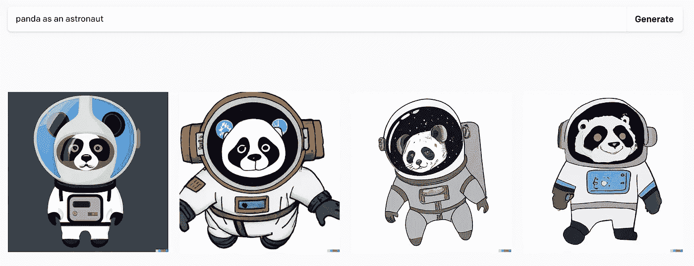
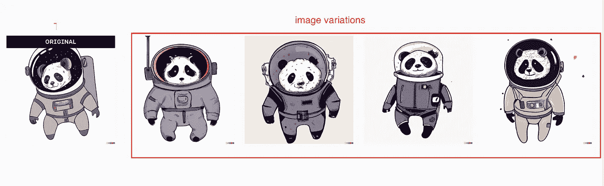
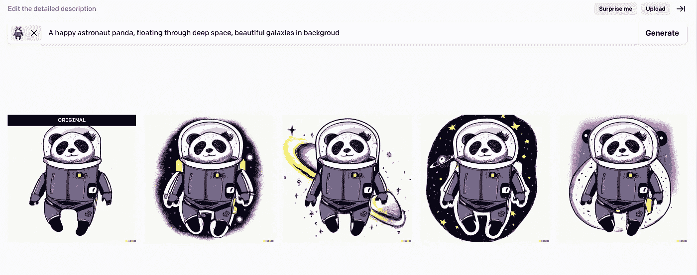
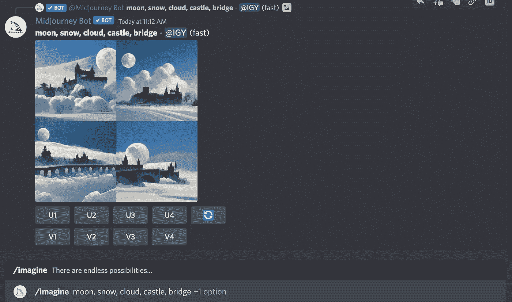
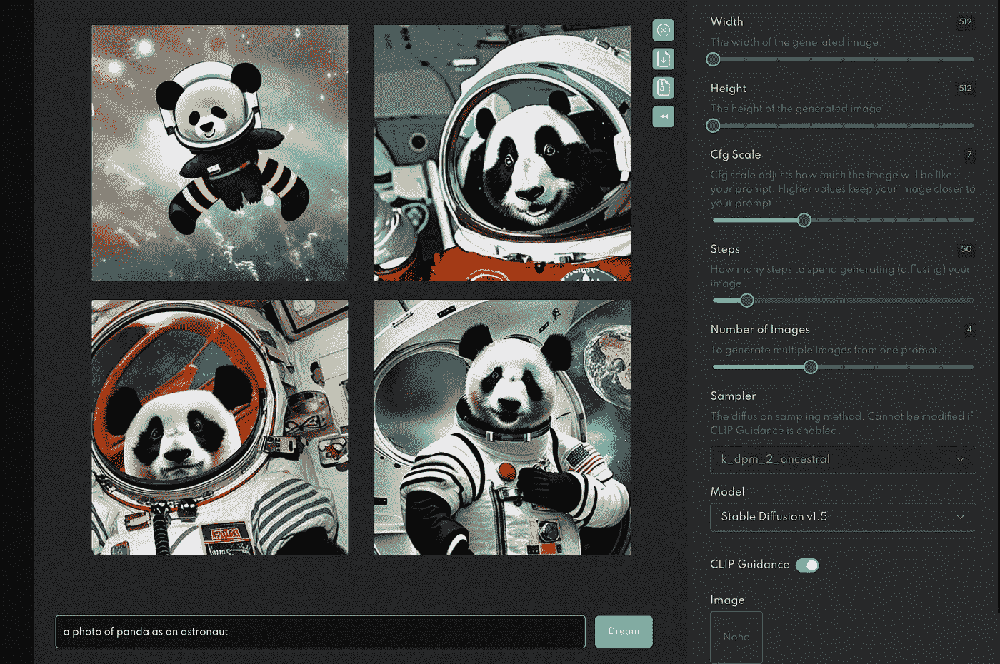

# 3 个最好的人工智能图像生成器

> 原文：<https://levelup.gitconnected.com/the-3-best-ai-image-generators-f08b03ba260f>

人工智能生成图像最近像病毒一样传播开来。这里有三个人工智能图像生成器，你可以看看:

1.  达尔-E 2
2.  中途
3.  稳定扩散

你也可以看看这个视频。

# 达尔-E 2

**DALL-E 2** 是由 [OpenAI](https://en.wikipedia.org/wiki/OpenAI) 开发的机器学习模型，用于生成数字图像。

使用 DALL E 创建人工智能图像非常简单。创建图像有三种主要方式:

## 通过文本提示

通过文本提示显示图像

您提供文本提示；DALL-E 2 会给你相应的生成图像。

## 通过图像变化

原始图像的四个图像变体

你也可以要求 DALL-E 2 生成原始图像的多个图像变体。

## 通过图像编辑

通过给出文本提示进行图像编辑是另一种智能的图像编辑方式。

# 中途

[Mid-journey](https://www.midjourney.com/home/) 是一款从文字描述中创建图像的产品，类似于 DALL-E 2。

目前只能通过他们官方 Discord 上的 Discord 机器人，通过直接向机器人发送消息，或者通过邀请机器人到第三方服务器来访问。

中途不和截图

你可以使用`/imagine`命令来生成图像并在文本提示中键入，就像其他 AI 艺术生成器工具一样。

# 稳定扩散

稳定扩散是 2022 年 8 月 22d 发布的另一个“文本到图像扩散模型”。

稳定扩散生成的图像

它类似于 Open AI 的 DALL-E 等模型，但有一个关键的区别:他们发布了整个东西，包括模型和重量。

你可以在你的电脑上运行它，或者在 [beta.dreamstudio.ai](https://beta.dreamstudio.ai/) 上在线试用。