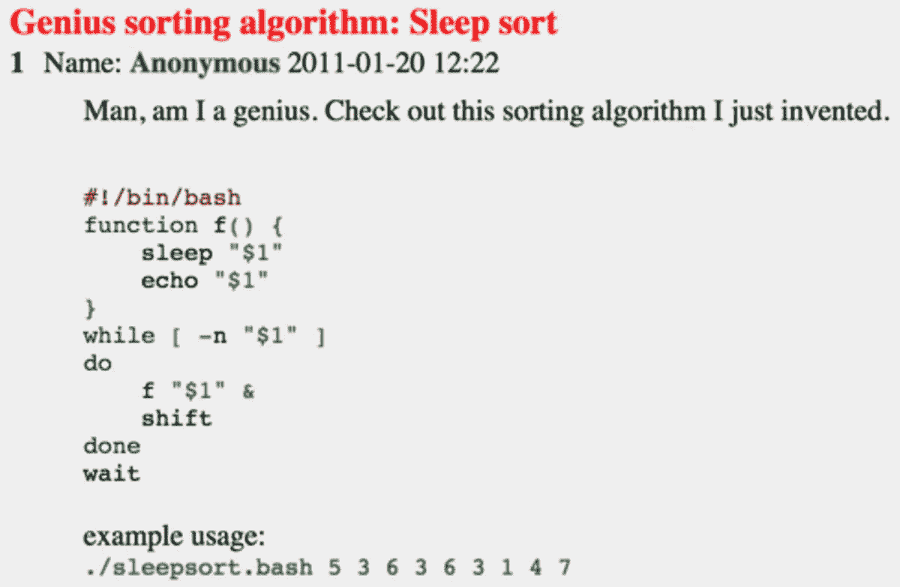

# 3 种最慢的排序算法

> 原文：<https://levelup.gitconnected.com/the-3-slowest-sorting-algorithms-f717052cb881>

## 幽默地看待排序


图片来自 [Pixabay](https://pixabay.com/?utm_source=link-attribution&utm_medium=referral&utm_campaign=image&utm_content=4340360)

作为软件工程师，我们总是想让我们的程序运行得更快。就这一次，让我们试着从相反的角度考虑一些事情。

你知道最慢的排序算法是什么吗？

让我们找点乐子，学习一些不寻常的时间复杂度分析。

# 博戈索特(又名猴子类)

Bogosort 基于生成和测试范式。

```
while not in_order(deck):
    shuffle(deck)
```

让我们用 Python 实现这个算法:

```
import randomdef bogosort(l):
    while not l == sorted(l):
        random.shuffle(l)
    return lx = [3,2,4,7,3,6,9,1]
print bogosort(x)
```

平均时间复杂度为 O((N-1)* N！).如果给定的数组已经排序，那么最好的情况就会出现。

你可能认为最坏的情况需要无限的时间。

理论上是对的。

实际上，对于任何固定大小的数组，算法的期望运行时间都是有限的。这是因为[无限猴子定理](https://en.wikipedia.org/wiki/Infinite_monkey_theorem)在实践中成立。

> 无限猴子定理指出，一只猴子在打字机键盘上随机敲击键盘无限长时间，几乎肯定会打出任何给定的文本，例如威廉·莎士比亚的全集。
> 
> *–来自维基百科*

如果给我们足够的时间，bogosort 排序几乎肯定会对数组进行排序。


图片由 [Gerd Altmann](https://pixabay.com/users/geralt-9301/?utm_source=link-attribution&utm_medium=referral&utm_campaign=image&utm_content=2853140) 来自 [Pixabay](https://pixabay.com/?utm_source=link-attribution&utm_medium=referral&utm_campaign=image&utm_content=2853140)

另一个变体是 [Bozosort](http://www.cs.toronto.edu/~guerzhoy/180/lectures/W10/lec3/Bozosort.html) ，它只交换两个元素，直到我们得到一个排序的结果。Bozosort 的运行时复杂度也是 O(N！).

# 睡眠排序

我们可以不用任何比较就对数组排序吗？

是的，有可能！

睡眠排序最初由 4Chan 上的匿名用户发布:



最初的 Bash 版本

为了在 Python 中实现它，我们为数组的每个元素生成一个线程，每个线程等待 **v** 秒开始，其中 **v** 是元素的值:

```
from time import sleep
from threading import Timerdef sleep_sort(values):
    sleepsort.result = []
    def add1(x):
        sleepsort.result.append(x)
    mx = values[0]
    for v in values:
        if mx < v: mx = v
        Timer(v, add1, [v]).start()
    sleep(mx+1)
    return sleepsort.resultx = [3,2,4,7,3,6,9,1]
print sleep_sort(x)#[1, 2, 3, 3, 4, 6, 7, 9]
```

这是一个用任何编程语言进行多线程编程的有趣例子，用你最喜欢的语言试试吧！

时间复杂度为 O(Max(array))，在性能上非常耗时！

# 慢速分类

[慢排序](https://en.wikipedia.org/wiki/Slowsort)是一个半开玩笑的分而治之的玩笑。这是一种递归算法，似乎类似于快速排序。

相反，它非常慢。

```
def slowsort(A, i, j):
    if i >= j:
        return
    m = (i+j) / 2
    slowsort(A, i, m)
    slowsort(A, m+1, j)
    if A[j] < A[m]:
        A[j], A[m] = A[m], A[j]
    slowsort(A, i, j-1)x = [3,2,4,7,3,6,9,1]
slowsort(x, 0, len(x)-1)
```

你能算出这个算法的时间复杂度吗？

老实说，我不能。根据维基百科，即使最好的情况也比冒泡排序差。

这个视频展示了它是如何工作的:

[提莫·宾曼](https://www.youtube.com/channel/UC9m2XDfCnrS4QTzVBTrD89w)

# 结论

虽然这些排序算法在实践中毫无用处，但是很有趣。

希望你喜欢，笑一笑。好好呆着！