# 程序员的三场战争以及它们将如何结束

> 原文：<https://levelup.gitconnected.com/the-3-wars-of-programmers-and-how-will-they-end-37fabaa0e37b>

## 程序员的生活

## 几十年来对琐事的争论，会结束吗？


图片来自 [Pixabay](https://pixabay.com/?utm_source=link-attribution&utm_medium=referral&utm_campaign=image&utm_content=469503) 的[像素员](https://pixabay.com/users/ThePixelman-406384/?utm_source=link-attribution&utm_medium=referral&utm_campaign=image&utm_content=469503)

程序员通常聪明、有逻辑，而且固执己见。他们几乎可以讨论任何事情。从架构到命名，到语言偏好，到语法等等。

有 3 场战争，大多数程序员要么站在一边，要么站在另一边。

看看你站在哪一边，如果你同意我对最终结果的预测…

# 1.制表符警告—制表符与空格


作者照片

对于大多数编程语言来说，缩进是编码的重要部分。它有助于反映一个人清楚地确定一个代码范围。

例如，通过查看下面的代码，我们可以清楚地看到单独的范围

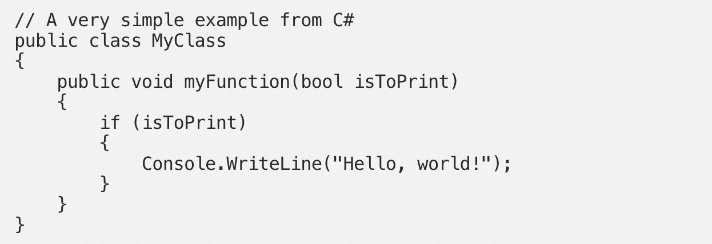

这在下面会更容易理解。

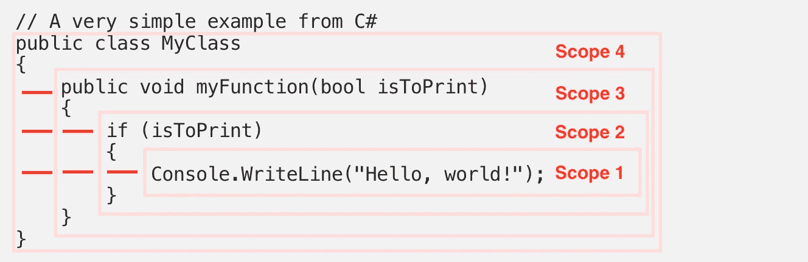

没有人质疑缩进的用处。但是应该用制表符还是空格来制作呢？

人们可以在互联网上找到许多辩论，下面是一个例子

[](https://softwareengineering.stackexchange.com/questions/57/tabs-versus-spaces-what-is-the-proper-indentation-character-for-everything-in-e) [## 制表符和空格——在任何情况下，什么是合适的缩进字符……

### 目前，这个问题不太适合我们的问答形式。我们期待答案有事实支持…

softwareengineering.stackexchange.com](https://softwareengineering.stackexchange.com/questions/57/tabs-versus-spaces-what-is-the-proper-indentation-character-for-everything-in-e) 

上面甚至还有一个 YouTube。看看这个。挺有娱乐性的。

## TAB 是首选

自从打字机问世[以来，TAB 被引入并广泛用于压痕。](https://www.allthingstypewriter.com/history/)

> tab 键是一种在打字时快速创建表格的方法(称为“制表”)…打字员也开始在缩进段落时使用 tab 键…

因此，程序员在开始时也使用 TAB 键进行缩进是显而易见的。原因如下

*   显然，TAB 之所以从第一天起就存在，是因为键入 TAB 只需要一次击键就可以得到一个完整的缩进，而使用空格则需要多次击键，如下所示😓

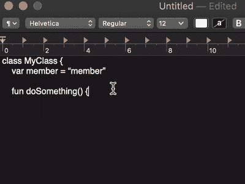

*   使用单个键表示缩进节省了存储代码的持久空间。在早期，持久空间是昂贵的

> 维基百科[:许多早期的程序使用](https://en.wikipedia.org/wiki/Indentation_style)[标签](https://en.wikipedia.org/wiki/Tab_key)字符来缩进，为了简单和节省源文件的大小

*   在普通编辑器中更容易定制，因为 TAB 键是比单个字符占据更宽宽度的单次击键，所以可以定义它的宽度，因此可以很容易地定制缩进。

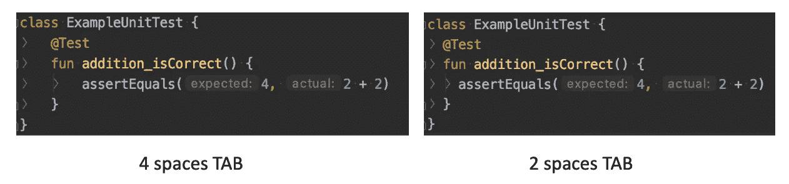

## 后来出现了空格

随着不同的操作系统开始发挥作用，他们决定有不同的宽度缩进。

> [维基百科](https://en.wikipedia.org/wiki/Indentation_style) : [Unix](https://en.wikipedia.org/wiki/Unix) 编辑通常将制表符视为等于八个字符，而 [Macintosh](https://en.wikipedia.org/wiki/Macintosh) 和 [Windows](https://en.wikipedia.org/wiki/Microsoft_Windows) 环境会将它们设置为四个，当代码在环境之间传输时会造成混乱。

为了解决这个问题，并确保代码无论来自哪个平台看起来都是一样的，建议用空格来代替代码的制表符。

简而言之，空格是首选，因为它被视为更具确定性(每个字符只有一个列字符)。它不仅在整个环境中保持一致，而且无论代码编辑器或查看器如何，它们都是相同的。

有些程序员喜欢没有外部影响(环境、IDE、阅读器、编写器等)的确定性结构。

## 今天过得怎么样？

从[最新的挖掘](https://insanelab.com/blog/notes/spaces-vs-tabs/)来看，似乎在 Github 上，用户正在使用空格而不是 TAB，如下所示(谷歌的一个发现)。

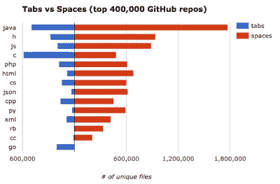

[*费利佩·霍法/谷歌*](https://static-ssl.businessinsider.com/image/57c730e009d2931a008b57aa-960/tabs%20spaces.png?_ga=2.251931145.1841524488.1598963796-643694330.1597980059)

为什么会这样？大多数程序员改变他们的偏好了吗？或者，与上一代相比，新一代程序员更喜欢使用空格？

下面是我的观点，我们来看看标签的原始优势

## Tab 只需要一次击键，缩进的空间也是如此

我们不能否认现在新一代的代码大多是用 IDE 代替普通的文本编辑器。即使是普通的文本编辑器，当它检测到一个正在编码时，它也会自动缩进。

看看下面的 GIF 代码，缩进会自动到位。默认情况下，它自动缩进 4 个空格。

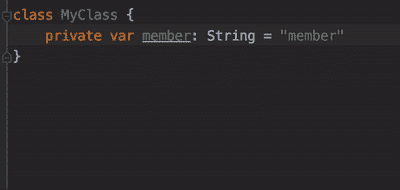

即使在键盘上键入一个制表符，它也会自动插入 4 个空格而不是一个制表符。

## 轻松定制空格缩进

旧时代的工具，改变缩进空间是不可用的。但是有了新的工具，这很容易实现，如下所示。

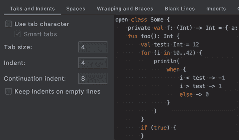

可以从 2 个空格缩进改为 4 个空格缩进，反之亦然

缩进空间的定制也变得很容易。

> 还要注意，如果愿意，可以将空格改为制表符。

## 存储空间成本显著下降

众所周知，磁盘空间和内存的成本都大幅下降。下面是 10 年前的图表。即便如此，与 30 年前相比，GB 的成本还是便宜了很多。

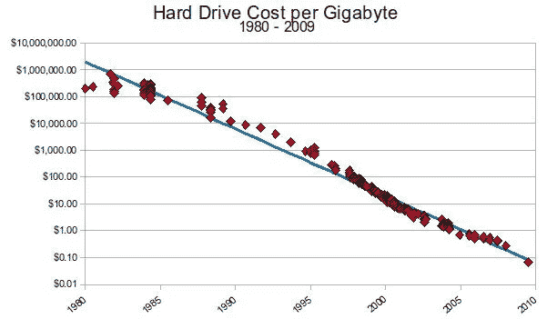

[https://www . tutor 2u . net/economics/blog/rare-earth-minerals-and-cost-of-hard-drive-space](https://www.tutor2u.net/economics/blog/rare-earth-minerals-and-the-cost-of-hard-drive-space)

因此，一个制表符上有 4 个空格不会浪费太多的内存或磁盘空间

> 计算能力正好相反，我们有足够的计算能力在一个选项卡上处理几个空格，而空格所需的额外处理时间可以忽略不计。

通过解决过去空格所具有的局限性，虽然空格也具有相对于外部工具或环境的确定性特征，但它确实认为空格将成为相对于 TAB 进行缩进的最终赢家。

我认为让所有的文本编辑器、阅读器和操作系统环境都同意标签的默认宽度比仅仅使用空格要花的时间长。😝

# 2.卷曲战争——左花括号应该在哪里


作者照片

早在 ALGO58 (1958)时代，就引入了块编程，用清晰的`begin`和`end`来反映块的开始和结束

```
if x > -1 then
     **begin**
          if x ≠ 0 then
          x := 1/x
     **end**;
```

## 卷发的引入

后来在 C 语言中，`{`和`}`被引入来表示程序块的开始和结束

```
if (x > -1) 
**{**
    if (x != 0) x = 1/x;
**}**
```

这太棒了，因为

*   它仅由单个字符组成，并且
*   按照 ALGO58，按照`begin`和`end`的约定，在左栏对齐，可以清楚地看到它们

## 保存一些行

然而，后来有些人觉得是拿走了太多的空间。例如

```
if (x < 0) 
**{**
    print("negative");
**}** else if (x > 0)
**{**
    print("positive");
**}** else
**{**
    print("zero");
**}**
```

如果我们能把它们浓缩成下面这样不是更好吗

```
if (x < 0) **{**
    print("negative");
**}** else if (x > 0) **{**
    print("positive");
**}** else **{**
    print("zero");
**}**
```

对于一些开发人员来说，这是紧凑的，仍然是整洁的。对一些开发者来说，这太可怕了！看起来很混乱，很难读懂。

于是战争开始了！

维基百科[分享了更多的变体。要阅读更多关于 Curlies 的内容，请查看下面的博客。](https://en.wikipedia.org/wiki/Indentation_style)

[](https://medium.com/better-programming/the-curly-story-of-coding-49a348a31cf2) [## 编码中花括号的故事

### 它从哪里来，怎么样，会持续吗？

medium.com](https://medium.com/better-programming/the-curly-story-of-coding-49a348a31cf2) 

## 今天过得怎么样？

就编译而言，所有语言的编译器似乎都能接受这两种形式。因此，这很大程度上取决于特定语言标准委员会的偏好来定义什么是首选，或者开发团队来定义适合他们的标准。

当由人来决定的时候，就会有战争！

尽管如此，幸运的是，到目前为止，除了语言指南本身，还有一些声明的偏好。

## 语言指南首选项

***对齐的花饰***

*   [C#编码指南](https://docs.microsoft.com/en-us/dotnet/csharp/programming-guide/inside-a-program/coding-conventions)

混合卷曲方法(两者兼有)

*   [Gnome C 编码标准](https://developer.gnome.org/programming-guidelines/stable/c-coding-style.html.en)
*   [C++编码指南](https://isocpp.org/wiki/faq/coding-standards)

***紧凑的卷边***

*   [Java 编码指南](https://docs.oracle.com/javase/tutorial/java/javaOO/methods.html)
*   [Scala 编码指南](https://docs.scala-lang.org/tour/basics.html)
*   [Swift 编码指南](https://docs.swift.org/swift-book/LanguageGuide/Functions.html)
*   [科特林编码指南](https://kotlinlang.org/docs/tutorials/kotlin-for-py/functions.html)
*   以此类推(Go、R、Rust、JavaScript、Dart)

通过观察采用哪种风格的语言，我们可以清楚地看到更新的编程语言的发展趋势。随着越来越多的人开始学习编程语言，他们将会接触到紧凑风格。不可否认，人们倾向于坚持他们最初学习的风格。

## 工具的影响

我们今天拥有的工具，也发挥着重要的作用，也塑造着一种风格如何优于另一种风格。

一些开发人员担心，如果`{`的开始与`}`不对齐，就不容易找到正确的块。为了解决这个问题，IDE 使代码块可以折叠和扩展，如下所示。

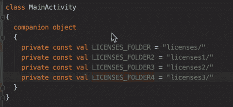

使用对齐的卷曲

这减少了对不能识别代码块的担心，并使代码看起来更简洁，即

```
companion object
{...}
```

如果使用 ***紧凑卷曲*** 样式，并执行相同的折叠，我们可以看到代码看起来更加简洁

```
companion object {...}
```

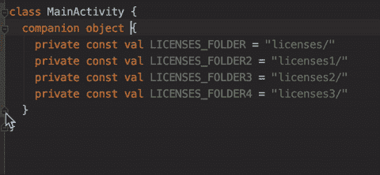

使用紧凑的卷曲

因此，大多数遵循默认语言约定的 IDE 将压缩版本作为默认格式，其中自动格式规则会自动将它们转换为该格式( ***压缩曲线*** 格式)

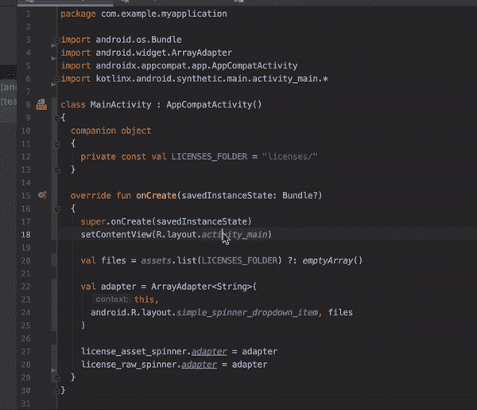

当然，如果用户愿意，IDE 也允许切换回 ***对齐的曲线*** ，以包含所有程序员的偏好。

## 一致性和简洁性是首选

哪个更符合？看着单个 ***对齐的卷边*** ，对比一下 ***紧凑的卷边*** ，似乎单个 ***对齐的卷边*** 更加一致

```
**// Looks more consistent as { and } are aligned**
fun doSomething() 
{
    print("something")
}**// Looks less consistent as { and } are not aligned**
fun doSomething() {
    print("something")
}
```

但棘手的是当我们有一些其他的考虑，如空函数，if-else-if，和链接功能代码。

```
**// Looks wasteful**
fun doNothing() 
**{
}****// Looks more compact**
fun doNothing() **{}**
```

如果-否则-如果

```
**// Looks wasteful** if (x < 0) 
**{**
    print("negative");
**}** else if (x > 0)
**{**
    print("positive");
**}** else
**{**
    print("zero");
**}****// Looks more compact** if (x < 0) **{**
    print("negative");
**}** else if (x > 0) **{**
    print("positive");
**}** else **{**
    print("zero");
**}**
```

链接功能代码

```
**// Looks wasteful (actually don't even compile in Kotlin)** listOfSomething
    .filter
 **{**
        it.goodStuff
 **}**
    .forEach
 **{**
        print(it)
 **}****// Looks more compact** listOfSomething
    .filter **{** it.goodStuff **}**
    .forEach **{** print(it) **}**
```

因此，为了补偿单行语句，随着函数式编程的发展，单行语句越来越成为一种模式，最好使用 ***紧凑曲线*** ，因为它使开始 **{** 始终与语句的状态在同一行。这使得它紧凑而一致。(即不混合两种风格)

## 缩进已经足够显示代码块了？

根据 WAR 1，我们已经知道缩进已经存在，以使代码块更加可见。卷曲似乎填充了另一行，这确实造成了缩进的冗余。像 Python 这样的语言已经完全放弃了卷曲。

但是作为程序员，我们已经对 curlies 根深蒂固很长一段时间了，我们很难放心在编码时看不到它。

我认为编码器仍然喜欢他们的卷发。所以它会在那里停留一段时间。但是我认为在 ***与*** 的战争开始之前， ***紧凑型轿车*** 将会是最终的赢家。

# 3.分号大战——结尾有分号；？


作者照片

如果您过去学习过编程，使用 GCC 编译 C 程序，那么您可能会在编译代码时遇到奇怪的编译错误，后来发现您遗漏了在代码语句的末尾添加一个小小的字符，分号`;`。

这种做法使得所有程序员现在在到达代码的语句结尾时自动键入`;`，甚至不需要考虑它。看不到行尾的`;`，让编码员觉得很奇怪。有些不对劲！

## 当时是；编程语言入门？

迈克尔·麦克米兰写了一篇精彩的介绍分号如何进入编程世界的文章

[](https://medium.com/better-programming/a-brief-history-of-the-8efda9dde2b8) [## 编程中分号的简史

### 分号的用法到底是从哪里来的？

medium.com](https://medium.com/better-programming/a-brief-history-of-the-8efda9dde2b8) 

它从 ALGO58 开始，分号用于语句分隔。

```
begin real a;
     a := 1;
     begin real a;
          a := 2;
          print(a)
     end;
     print(a)
end
```

然而，当 BCPL(在 B 和 C 语言之前)被引入时，分号在那种语言中是不需要的，因为有一些聪明的规则来识别语句的结尾。

为了使编程过程更有效，B 和 C 语言强制使用分号。那是 20 世纪 70 年代的事了。

> 尽管 BCPL 程序名义上是由一个无限制的字符流提供的，聪明的规则允许大多数分号在以行边界结束的语句后省略。b 和 C 省略了这种方便，用分号结束大多数语句。

## 分号作为语句分隔符或终止符

从此，很多编程语言都有了分号。但是，分号的用法在不同的语言中有所不同。最明显的区别是它们要么是

*   **充当语句分隔符:**这是针对一行有多个语句的情况，我们使用分号来区分它们。因此，如果语句以换行符结尾，则语句末尾不需要分号。

```
// Semicolon is needed when 2 statements in a line
class KotlinClass {
  val a = 10; val b = 20
  val c = 20
}
```

*   **充当语句结束符:**这是从高层次上看起来类似于语句分隔符，但是，它是语句末尾所必需的。因此，在语句的末尾需要分号，即使它已经是一行的末尾。

```
// Semicolon is needed at the end of every statement
public class JavaClass {
    int a = 10; int b = 20;
    int c = 30;
}
```

更多语言风格的终端，[参见此处的](https://en.wikipedia.org/wiki/Comparison_of_programming_languages_(syntax)#Statements)。

显然，这不是最近的新趋势。早在 Pascal 语言时期(早于 C 语言)，它就已经不使用分号作为语句终止符(即不要求在语句结尾)。

> [来自分号战争(American Scientis，2006)](https://www.americanscientist.org/article/the-semicolon-wars#:~:text=In%20Algol%20and%20Pascal%2C%20program,What's%20the%20difference%3F) :在 Algol 和 Pascal 中，程序语句必须用分号分隔。比如在 x:= 0；y:= x+1；z:=2 分号告诉编译器一条语句在哪里结束，下一条语句在哪里开始。C 程序中也夹杂着分号，但在 C 中它们是语句终止符，而不是分隔符。有什么区别？c 在最后一个语句后需要一个分号，但是 Pascal 不需要

所以在使用分号的编程世界里，也有关于我们是否应该在每一行末尾使用分号的争论。

## 历年来的语言偏好

基于这里的[列表](https://en.wikipedia.org/wiki/Comparison_of_programming_languages_(syntax)#Statements)，我绘制了一个图表，来看看不同语言对分号终止的偏好。

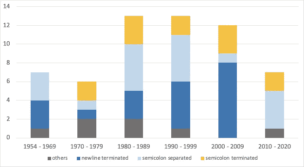

在 70 年代以前，语言要么使用新行终止，要么用分号分隔(Algo 等)。只是从 70 年代开始，C 语言才是第一种引入分号终止语句的语言，原因是为了更有效地处理语言。

从那以后，其他几种语言也开始使用 C 语言，例如 Basic、Python、PHP、Java 等，当然还有 C 语言的变体，例如 C++、C#和 Objective C。尽管相当多的其他语言都使用非分号终止语句，但是 C 语言的衍生物正在主宰着程序员的世界，因此在定义开发人员的偏好方面起着重要的作用。

从图表中，我们可以清楚地看到，坚持使用分号结束符的新语言的数量比几十年来试图不坚持使用分号结束符的语言要少得多。这种情况一直持续到最近十年，像 *Rust* 和 *Dart* 这样的新语言仍然需要分号语句终止。

与此同时，我们也看到越来越多不使用分号终止的语言在编程社区变得更加突出，比如 *Scala* 、 *Kotlin* 、 *Swift* 、 *Python* 等。

战争越来越激烈。

## 自动分号插入

正如我们所知，JavaScript 是一种如此通用和容错的语言(这无疑给许多人带来了相当大的痛苦)，引入这个概念[自动分号插入](https://stackoverflow.com/questions/2846283/what-are-the-rules-for-javascripts-automatic-semicolon-insertion-asi)也就是说，如果你忘记添加分号，编译器会添加一个。

鉴于语言本身并没有规定开发人员必须做什么，并且允许一个更宽松的指南，JavaScript 社区中的分号之战变得异常激烈。很明显，有一群人坚信只有在需要时才输入某些东西，而有一些人严格遵守规则，因为编译器会这么做。

这种不使用分号的尝试的缺点是，语言处理有一个错误，无法为下面的代码插入分号，导致运行时错误。

```
const name = "World"
["Hello", name].forEach(word => console.log(word))
```

感觉无分号终止党输了。

然而，在这种情况下， *TypeScript* 将会产生一个编译时错误。因此，有些人坚持认为战争还没有结束。

[](https://medium.com/@eugenkiss/dont-use-semicolons-in-typescript-474ccfe4bdb3) [## 不要在 TypeScript 中使用分号！//;

### “就用分号吧。这是一件小事，让代码更安全。”不要！人们为…而激动的事实

medium.com](https://medium.com/@eugenkiss/dont-use-semicolons-in-typescript-474ccfe4bdb3) 

尽管如此，语言处理器需要自动插入分号的事实，意味着这种消除分号的尝试并不是一个真正可靠的考虑，特别是考虑到仍然存在它会被遗漏的情况。这极大地阻碍了非分号终止社区向前发展的尝试。

## 句法糖导致分号的癌症

这是编程语言的先驱之一 Alan J . riskers 的话。很明显，在那些日子里，为了提高编程语言的可读性，改变了语法(这表示为语法糖)。那时分号被用来补偿这样的语法变化，以允许语言处理器仍然能够将它们处理成适当的结构，艾伦·J·珀利斯称之为癌症。

快进到今天，许多程序员已经根深蒂固地认为分号是编程语言中必不可少的，而在现实中，这是为了帮助语言处理器而添加的，而不是人类阅读代码所必需的含义。因此，毫不奇怪，许多语言继续试图消除分号的需要，同时使语言仍然对人类友好。

早期很难达到这种平衡，但随着我们的发展，我们现在可以看到许多人喜欢的几种简洁的编程语言(例如 *Kotlin、Swift、Scala* )可以实现语言的清晰和简单，同时不需要对语言的额外帮助，例如分号终止的语句。

我喜欢下面这段引自[罗曼·伊利扎罗夫](https://medium.com/u/4762e889f8fc?source=post_page-----37fabaa0e37b--------------------------------)(科特林语的创始人之一)的文字。

> 如果编译器和人都能很容易地猜出它，那么你就不应该在代码中明确地拼写出来。
> 
> 我们的目标不是通过使用试探法在各处自动插入分号来省略分号，而是确保遵循语言风格指南的每一个格式正确的代码都不需要包含分号。

我相信并同意他下面的文章，随着我们在增强编程语言方面的进步，编程语言的未来将不再需要分号作为语句结束符。

[](https://medium.com/@elizarov/the-end-of-the-semicolon-era-60ab95e669ab) [## 分号时代的结束

### 我们生活在分号时代的末期。配方就在那里。它成为…只是时间问题

medium.com](https://medium.com/@elizarov/the-end-of-the-semicolon-era-60ab95e669ab) 

战争并不总是坏事，尤其是在编程世界。这都是因为不同的观点和对更好的渴望，让我们前进。不是右，也不是左，而是从左到右和从右到左的运动推动我们前进。

然而，作为编程社区的一员，我有自己的信念和偏好。但事实上，15 年前我的信仰和立场是不同的，我已经变了。我相信世界也变了。时间会证明一切。

[](https://medium.com/swlh/the-7-coding-styles-that-are-dated-90eff1408d6e) [## 7 种过时的编码风格

### 我曾是他们的坚定信徒，但现在我改变了看法

medium.com](https://medium.com/swlh/the-7-coding-styles-that-are-dated-90eff1408d6e)