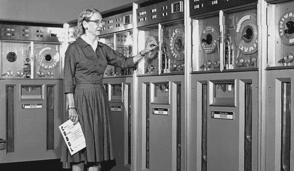

# 有史以来最有影响力的 30 位程序员

> 原文：<https://levelup.gitconnected.com/the-30-most-influential-developers-ever-581c373d1c87>

## 人类已知的最伟大的程序员名单

照片由 [mentatdgt](https://www.pexels.com/@mentatdgt-330508?utm_content=attributionCopyText&utm_medium=referral&utm_source=pexels) 从 [Pexels](https://www.pexels.com/photo/man-in-suit-jacket-standing-beside-projector-screen-2173508/?utm_content=attributionCopyText&utm_medium=referral&utm_source=pexels)

# 1.丹尼斯·麦卡利斯泰尔·里奇

[来源](https://www.cio.com/article/2403380/dennis-ritchie--father-of-unix-and-c-programming-language--dead-at-70.html)

他创造了 C 编程语言。他还参与创建了 UNIX 操作系统。他获得了无数奖项，其中包括图灵奖。

> " UNIX 非常简单，它只是需要一个天才来理解它的简单性."— **丹尼斯·麦卡利斯泰尔·里奇**

# 2.艾伦·施瓦茨

[来源](https://www.internethalloffame.org/inductees/aaron-swartz)

[程序员](https://en.wikipedia.org/wiki/Aaron_Swartz)，黑客主义者，政治组织者，他在 markdown，RSS 和 Reddit 上工作。他死后入选了互联网名人堂。

> "创造力来自于将你在其他领域学到的东西应用到你工作的领域中."— **艾伦·施瓦茨**

# **3。唐纳德**欧文**努斯**

[来源](https://cs.uwaterloo.ca/events/dls-donald-knuth-all-questions-answered)

计算机科学家，数学家，斯坦福大学退休教授。TeX、METAFONT 的创造者，理论计算机科学的贡献者。

> "过早优化是万恶之源."— **高德纳**

# **4。蒂姆·伯纳斯·李**

[来源](https://qz.com/1618993/tim-berners-lee-thinks-we-can-still-fix-the-internet/)

蒂莫西爵士是一名计算机科学家，因开发万维网而闻名。他致力于 HTTP 的实现，并进入了万维网名人堂。

> “我所设想的网络，我们还没有看到。未来还是比过去大那么多。”——**蒂姆·伯纳斯·李**

# **5。比雅尼·斯特劳斯特鲁普**

[来源](https://www.goodreads.com/author/show/64947.Bjarne_Stroustrup)

一位丹麦计算机科学家因创造 C++而闻名。他参与了创造、进化和首次实现。

> "世界上只有两种语言:人们抱怨的语言和没人使用的语言。"— **比雅尼·斯特劳斯特鲁普**

# **6。莱纳斯·托沃兹**

2020 年的莱纳斯·托沃兹— [来源](https://www.businessinsider.in/tech/news/linus-torvalds-creator-of-the-linux-operating-system-warned-developers-not-to-use-an-oracle-owned-file-system-because-of-the-companys-litigious-nature/articleshow/73235070.cms)

他是 Linux 内核的主要开发者，获得了 2012 年千禧年技术奖，也是 Git 的创造者。

> “糟糕的程序员担心代码。优秀的程序员会担心数据结构和它们之间的关系。”— **莱纳斯·托沃兹**

# **7。吉多·范·罗苏姆**

[来源](https://sr.wikipedia.org/wiki/%D0%93%D0%B2%D0%B8%D0%B4%D0%BE_%D0%B2%D0%B0%D0%BD_%D0%A0%D0%BE%D1%81%D1%83%D0%BC)

一个荷兰程序员，Python 和 Mondrian 的作者，一个谷歌的编码审查系统。

> "如果你决定设计自己的语言，业余语言设计者会遇到成千上万种陷阱."— **吉多·范·罗苏姆**

# 8.**詹姆斯·高斯林**

[来源](https://venturebeat.com/2011/08/30/java-creator-james-gosling-joins-ocean-robot-maker-liquid-robotics/)

Java 编程语言的创造者。新闻、PostScript 解释器、用于 UNIX 的第一版 Emacs 和卫星遥测技术的开发者。

> " Java 是没有枪炮、棍棒和刀子的 C++ . "— **詹姆斯·高斯林**

# 10.**理查德·斯托尔曼**

[来源](https://sh.wikipedia.org/wiki/Richard_Stallman)

自由软件基金会、GPL 许可证和其他 GNu 项目的创始人。被认为是开源运动之父。

> “分享是好事，有了数字技术，分享就容易了。”——**理查德·斯托尔曼**

# 11.布莱恩·柯尼根

[来源](https://en.wikipedia.org/wiki/Brian_Kernighan)

UNIX 的贡献者，旁边是 Ken Thompson 和 Dennis Ritchie。因其关于 C 的著作《C 编程语言》而广为人知。

> "不要评论糟糕的代码——重写它."布莱恩·w·克尼根

# 12.格蕾丝·默里·霍普

[来源](https://news.yale.edu/2017/02/10/grace-murray-hopper-1906-1992-legacy-innovation-and-service)

计算机先驱和海军军官。最早的现代程序员之一。致力于编程，开发手册，并为马克一冲床指令。

> 停泊在港口的船只是安全的，但那不是建造船只的目的——***格蕾丝·布鲁斯特·默里·霍普***

# *13.艾伦·凯*

**

*[来源](http://cyborganthropology.com/Alan_Kay)*

*PARC 的联合创始人，帕洛阿尔托研究中心，Smalltalk 和以太网的开发者。我在雅达利工作，开发了一个项目 ARPANet，后来被称为互联网。*

> *"预测未来的最好方法是创造未来."— [**艾伦凯**](https://www.goodreads.com/author/quotes/304595.Alan_Kay)*

# *14.尼古拉斯·沃斯*

**

*[来源](https://sr.wikipedia.org/wiki/%D0%9D%D0%B8%D0%BA%D0%BB%D0%B0%D1%83%D1%81_%D0%92%D0%B8%D1%80%D1%82)*

*开发了几种编程语言。以 ALGOL-W、MODULA 和 PASCAL 而闻名。Pascal 成为了每一种未来编程语言的基础。*

> **“软件变得比硬件变得更快更慢。”——****尼古拉斯·沃斯****

# *15.盖伊·斯蒂尔*

**

*[来源](https://www.computer.org/profiles/guy-steele)*

*孙研究员。研究编程语言、LISP 和其他方言。在各种书籍中分享他的知识。“*常用 Lisp* ”、 *C:参考手册*等。*

# *16.法布里斯·贝拉*

*法国计算机程序员。FFmpeg、QEMU 和 Tiny C 编译器的开发者。Amarisoft 的联合创始人。*

# *17.唐纳德·贝克尔*

**

*[来源](https://en.wikipedia.org/wiki/Donald_Becker)*

*为 Linux 编写以太网驱动程序。贝奥武夫集群的开发者。*

# *18.肯·巴彻*

**

*[来源](https://www.computerhope.com/people/ken_batcher.htm)*

*设计了大规模并行处理器。因奇偶合并排序和双音合并排序而闻名。*

# *19.约翰·卡马克*

**

*[来源](https://www.coindesk.com/legendary-game-programmer-john-carmack-guardedly-excited-bitcoin)*

*Keen 指挥官，Wolfenstein 3D，Doom，Quake 的首席程序员。id 软件联合创始人。Oculus VR 的 3D 计算机图形创新者和首席技术官。*

# *20.埃里克·雷蒙德*

**

*[https://usesthis.com/interviews/eric.s.raymond/](https://usesthis.com/interviews/eric.s.raymond/)*

*被称为 ESR。撰写关于开源开发的基础论文。几个开源项目的维护者。*

> *"每一个好的软件作品都是从搔开发者的痒处开始的."— **埃里克·s·雷蒙德***

> *“无论如何，在一个廉价电脑和高速互联网连接的世界里，我们发现唯一真正限制资源的是熟练的注意力。”— **埃里克·s·雷蒙德***

# *21.安德斯·海尔斯伯格*

**

*[来源](https://en.wikipedia.org/wiki/Anders_Hejlsberg)*

*编程语言和开发工具的共同设计师。以 Turbo Pascal 和 Delphi 著称。C#和 Typescript 的首席架构师。*

# *22.亚历山大·斯捷潘诺夫*

*俄裔美国程序员。C++ STL 的开发者，标准模板库。与 Bjarne 密切合作，为 C++添加新特性。*

# *23.查尔斯·巴贝奇*

**

*[来源](https://en.wikipedia.org/wiki/Charles_Babbage)*

*计算机之父。他开发了第一台机械计算机、差分引擎和现代计算的基本概念。*

# *24.艾伦·图灵*

**

*计算机科学家，逻辑学家，密码分析师。在理论计算机科学领域有很高的影响力。以图灵机而闻名，被认为是通用计算机。破译纳粹信息，帮助盟军赢得战争。*

> *“有时候，是那些谁也想象不到的人做了谁也想象不到的事情。”— **艾伦·图灵***

> *"那些能想象任何事情的人，能创造不可能."
> ——**艾伦·图灵***

# *25.罗纳德·L·李维斯特*

**

*[来源](https://people.csail.mit.edu/rivest/)*

*发表了许多关于密码学、计算机和网络安全、算法的论文。RSA 的首席开发人员。对称密钥加密算法(通常称为 Rivest 密码)的开发者。*

# *26.安德鲁·塔嫩鲍姆*

*以开发类似 Unix 的操作系统 MINIX 而闻名。在计算机科学领域极具影响力，但主要是针对分布式系统。*

# *27.莱斯利·兰波特*

*最著名的是他在分布式系统方面的工作。文件准备系统 LaTeX 的开发者。2013 年图灵奖得主。*

# *28.埃德格·w·迪克斯特拉*

**

*[来源](https://en.wikipedia.org/wiki/Edsger_W._Dijkstra)*

*荷兰计算机科学家。最著名的是 Dijkstra 算法。几个领域的基本贡献，编译器构造，操作系统，分布式系统。*

> *“简单是一种伟大的美德，但它需要努力才能实现，需要教育才能欣赏。更糟糕的是:复杂性卖得更好。”埃德格·w·迪克斯特拉*

# *29.约翰·冯·诺依曼*

*匈牙利科学家、数学家、物理学家。数字计算机通用结构的发展功不可没。合并排序的发明者。在人工智能领域与艾伦·图灵密切合作。*

> *“如果人们不相信数学是简单的，那只是因为他们没有意识到生活是多么复杂。”— **约翰·冯·诺依曼***

> *“当你甚至不知道自己在说什么的时候，精确是没有意义的”——约翰·冯·诺依曼*

# *30.基思·马祖洛*

*马祖罗算法的发明者。网络时间协议和 Windows 时间服务的一部分。*

# *结论*

*我们应该向他们多学习。他们影响了我们的计算机科学领域。他们带来了很多我们今天认为理所当然的东西。*

*我们已经在使用他们的功能了。我们在 Word 中使用 LaTeX，Dijkstra 的算法来导航，以及他们建立的操作系统。*

# *资源*

*[灵感](https://www.quora.com/Who-do-you-think-is-the-best-coder-Why)*