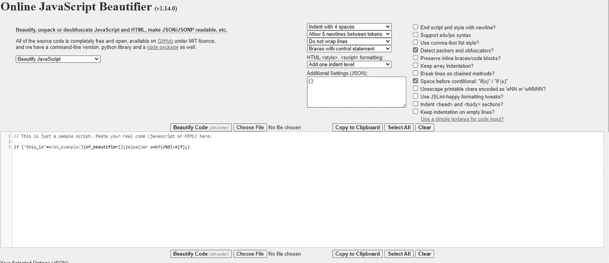
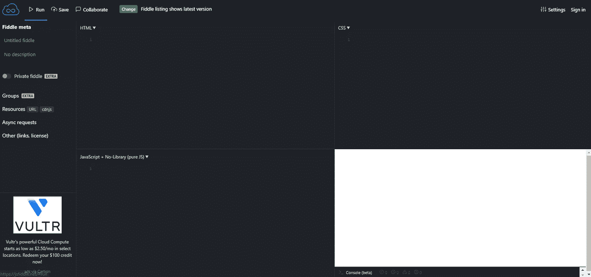
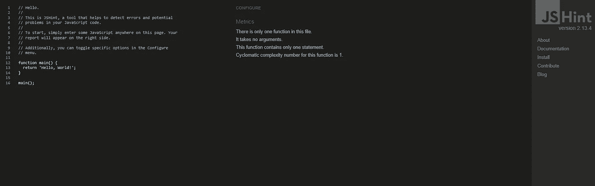
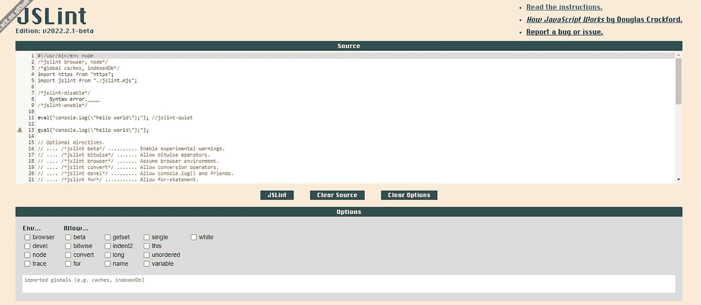
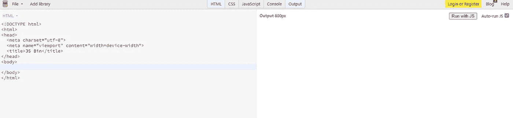

# 开发人员的 5 个最佳 JavaScript 工具| JS 备忘单

> 原文：<https://levelup.gitconnected.com/the-5-best-javascript-tools-for-developers-js-cheat-sheets-ed103b8a11fb>

## web 开发人员最好的朋友！

## 如果你是一名网络开发人员，你需要使用这些工具！

对开发者来说，最好的工具是什么？有很多很棒的资源，但它们并不总是容易导航或理解。这就是为什么我列出了我最喜欢的 JavaScript 工具&备忘单。

我喜欢使用 JavaScript，因为它允许我构建交互式网页，同时相对容易理解。这些年来，这种语言变得非常强大，现在创建动态网站比以往任何时候都容易。

有很多优秀的 JavaScript 工具，但是它们并不总是有清晰的说明或教程。这就是我进来的地方。我已经列出了我认为最好的 JavaScript 工具。

## [**JSS 美化者**](https://beautifier.io/)

这个工具对 JavaScript 的中级到高级用户非常有用，因为它将帮助他们美化、解包代码或使代码更具可读性。输出将会是 JSON 或 JSONP 文件，您将会看到明显的变化。

如果你愿意，你也可以使用这个工具来帮助你美化 HTML 或者 CSS 代码。有几个选项，你可以调整，使你得到最好的结果。要查看这个神奇的工具，请访问[此链接](https://beautifier.io/)。

## [JS 小提琴](https://jsfiddle.net/)

这是一个强大的工具，它将执行你的一堆事情，如在虚拟环境中运行代码，代码片段托管，错误报告，实时代码协作，在堆栈溢出时呈现代码，等等。这就像你简陋的代码操场，真的很有用。

还有很多很酷的功能，比如突出匹配代码标签的能力，实时代码验证，自动关闭 HTML 标签和括号，等等。要查看这个足智多谋的工具，请访问[此链接](https://jsfiddle.net/)。

## [JS 提示](https://jshint.com/)

JS Hint 是一个针对初学者的很好的工具，它所做的就是帮助他们指出代码中的语法或逻辑错误。它不仅检测错误，甚至检测代码可能存在的潜在问题。

这真的很简单，你所要做的就是将代码粘贴到应用程序的左侧，然后分析就会开始。结果将显示在右侧，同时还有一些提示和建议。如果您有一些 JS 代码需要检查，那么可以通过访问[这个链接进入工具。](https://jshint.com/)

## [JS 皮棉](https://www.jslint.com/)

本质上，JS Lint 工具与 JS Hint 工具相同，但是更高级一些。JS Lint 会检查您的代码是否有错误，但不保证您的代码 100%有效；但是，如果您的代码有问题，JS Lint 会告诉您问题出在哪里。

JS Lint 定义了 JavaScript 的一个严格子集，比 ECMAScript 编程语言标准定义的更严格。这样可以确保你得到最好的代码质量。还有几个选项可以调整，使程序尽可能好地适应您的代码。要查看该工具，请访问[此链接](https://www.jslint.com/)。

## [JS 斌](https://jsbin.com/?html,output)

JS Bin 是一个实时代码编辑器，它有很多有用的特性，可以帮助你完成 JS 程序。它拥有的一些最好的功能是实时编辑器、完整预览、控制台、对超过 15 个代码处理器的支持、自定义模板、拖放文件等等。

您可以使用该工具在真实环境中试验您的代码，并立即发现潜在的错误。这是一个节省时间的工具，我相信大多数开发人员都会非常欣赏。你可以通过访问[这个链接](https://jsbin.com/?html,output)来查看 JS Bin。

# 结束语

我希望这些工具能够帮助您解决开发需求。它们都非常有用，而且可以免费使用。我个人更喜欢 JS Fiddle，因为它很简单，速度也很快。

如果你对这篇文章有任何问题或建议，请不要犹豫，在评论区回复。喜欢你读的东西吗？为什么不关注我的媒体简讯，这样你就不会错过我未来的任何文章了？很简单，点击[这里](https://kgabeci.medium.com/subscribe)输入你的邮箱地址，按订阅。

你喜欢阅读媒体上的文章吗？考虑成为会员，有很多功能，你将获得所有创作者的内容，每月只需 5 美元。使用[这个链接](https://kgabeci.medium.com/membership)你也帮我赚一点佣金，点击成为会员，输入你的信息。