# 使用 SendGrid 发送 Blob 附件的 5 步指南(使用动态电子邮件模板)

> 原文：<https://levelup.gitconnected.com/the-5-step-guide-to-sending-blob-attachments-with-sendgrid-azure-using-dynamic-email-templates-a79598caa5bd>

> 每个通知系统的核心都有一封很棒的电子邮件。本文演示了如何使用 SendGrid 通过 blob 触发的无服务器功能发送精美的模板化电子邮件，并将 blob 附加到电子邮件中。

# 介绍

假设你正在为你的下一个项目实现一个事件驱动的架构。Blob 触发器是您的解决方案在运行业务逻辑以响应事件之前可能“监听”的许多事件类型之一。

这个故事表明，只需点击几个按钮，复制这种形式的电子邮件自动化是多么容易。

## 🛠你需要什么

1.  一款 **Azure 功能 App** (无服务器功能提供)
2.  一个**存储账户**(我们文件的云存储)
3.  一个 **SendGrid** 实例(现有实例或通过 Azure 提供的 SaaS)

为了节省时间，我提供了一个一键式部署脚本，其中详细列出了所发生的事情。下一节将详细介绍这一点…

## 🖼你将会建造什么

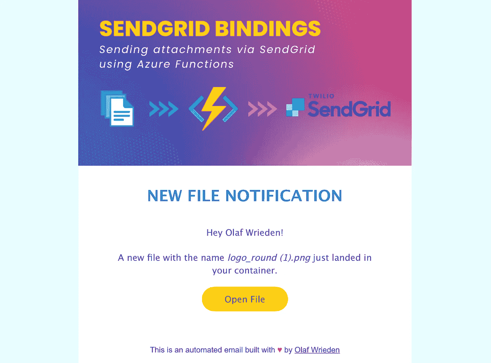

# 步骤 1:部署

让我们从创建 3 个资源开始:

1.  一个*存储帐户*带有一个名为“files”的容器，它将作为我们电子邮件功能的触发器。
2.  一个带有 SendGrid 输出绑定的*函数应用程序*,它将附加并发送上传的文件到一个或多个电子邮件地址。在部署期间，我选择了 Node.js 语言选项(但其他也支持 SendGrid)。
3.  一个 *SendGrid* 实例(或者使用您自己的)用于发送电子邮件。

**✅检查点:**这是您的资源组之后的样子。注意， *App 服务计划*是在部署功能 App 时自动创建的，因此不需要额外的部署步骤。

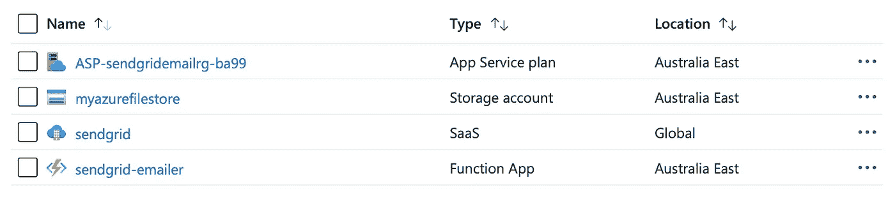

# 步骤 2:创建电子邮件模板

在 SendGrid 中，在 **Email API** 部分下，选择**动态模板**并为其命名。

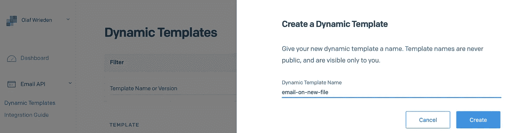

现在您需要复制**模板 ID** ，稍后您的函数将会引用它。点击**添加版本**继续。

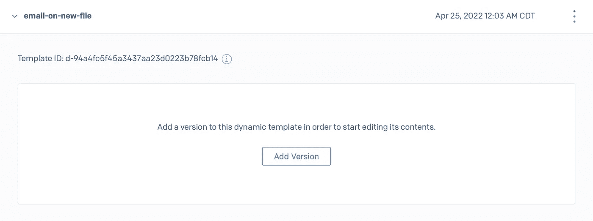

如果你已经有一个模板，选择它，否则点击**空白模板**和**代码编辑器**，然后从本文底部复制我的 HTML 片段。

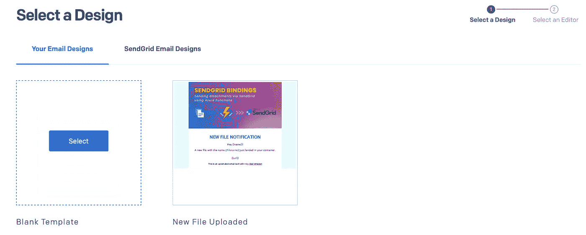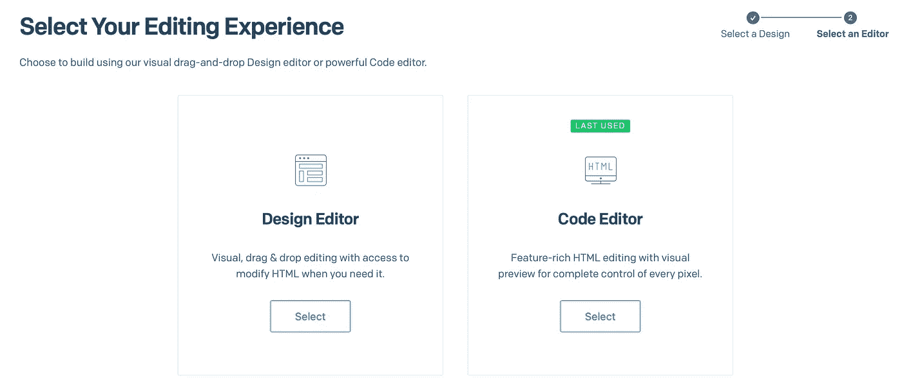

仔细检查 HTML 模板后，您可能会注意到`{{name}}` `{{filename}}`和`{{url}}`占位符。**测试数据**选项卡可以帮助你想象一旦提供了这些变量，你的电子邮件会是什么样子。

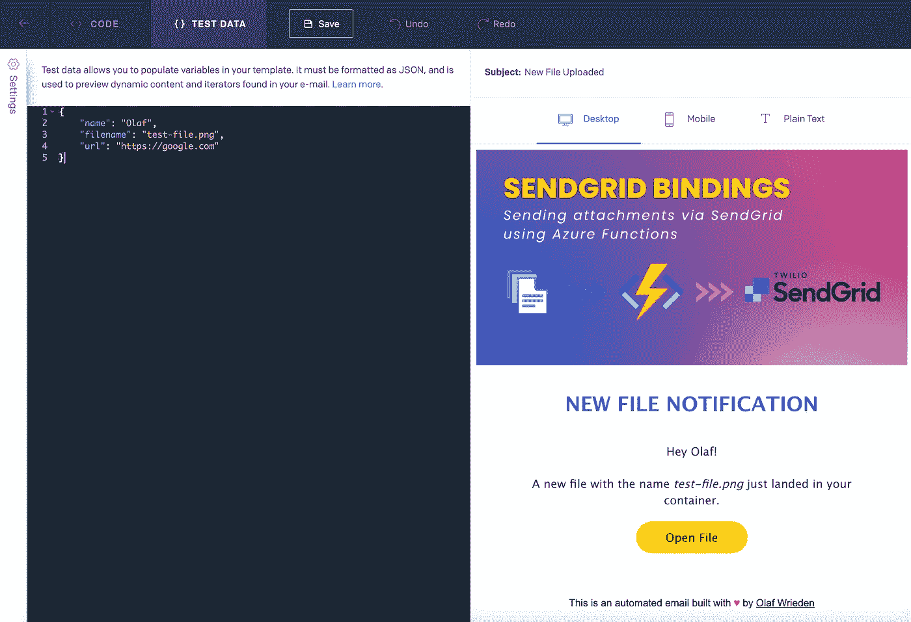

✅ **检查点:**到目前为止，我们已经部署了我们的资源，在 SendGrid 中创建了一个电子邮件模板，现在准备好以编程方式发送电子邮件。

# 步骤 3:可选—生成 SAS 令牌

如果一个电子邮件附件是不够的，你希望直接访问你的文件，你可以创建一个共享访问签名(有时间限制)并将其附加到你的网址。

要生成 SAS 令牌，请转到*存储帐户* > *文件*容器> *共享访问令牌*生成新的 SAS 令牌。您想要复制 **Blob SAS 令牌**以备后用。

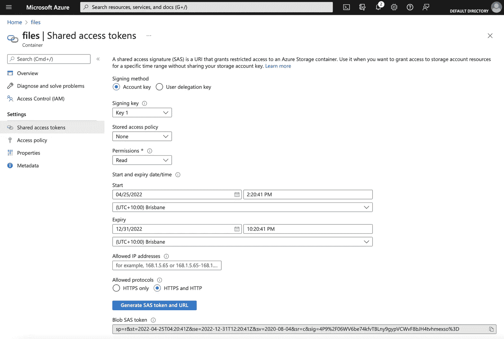

# 步骤 4:功能逻辑

这一步很简单。想象一个输入，在我们的例子中是一个 blob-trigger，中间有一些逻辑(我们一会儿就会讲到)，还有一个输出(或者电子邮件)。

使用 Node.js(这同样适用于 Python 或其他语言)，我们可以访问 blob 上下文和 blob 本身来执行额外的检查，例如文件是否有特定的扩展名，如果是图像，则只通过电子邮件发送给我们。

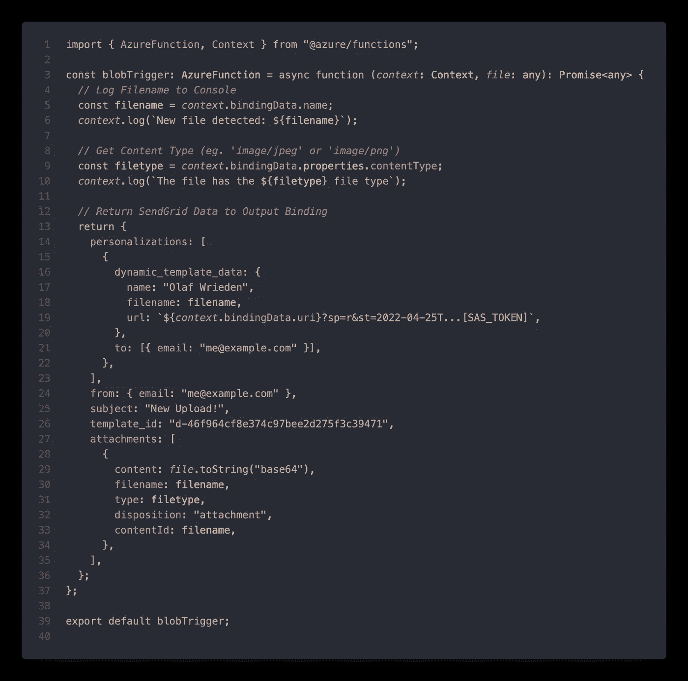

更详细地看，我们看到真正的工作是在这个函数的后半部分，在那里定义了与 SendGrid 兼容的输出。

✨ **要点:**azure 函数中的 SendGrid 绑定支持与手动或通过 SDK 调用的 SendGrid API 相同的规范。

## 📄发送附件

因为我们希望电子邮件的收件人可以访问我们的文件，所以我们选择通过`attachments: []`选项将其附加到电子邮件中。

更好的方法是为我们的文件(或容器)生成一个共享访问签名(SAS 令牌),并在电子邮件中链接它。如果我们希望对文件的访问进行时间限制，或者全部撤销，这是很容易做到的。

> 如果您完成了第 3 步，您可以在第 19 行添加这个 SAS 令牌，每当有人点击**打开文件**按钮时，他们就会被带到具有只读权限的 blob。

如果附件足够了，收件人可以直接打开它，因为我们把它附在了邮件里。

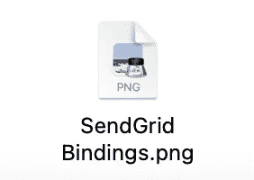

# 步骤 SendGrind 绑定

“中间的逻辑”完成后，我们终于可以更仔细地看看附带的 function.json 文件了，该文件指定了函数的输入和输出。

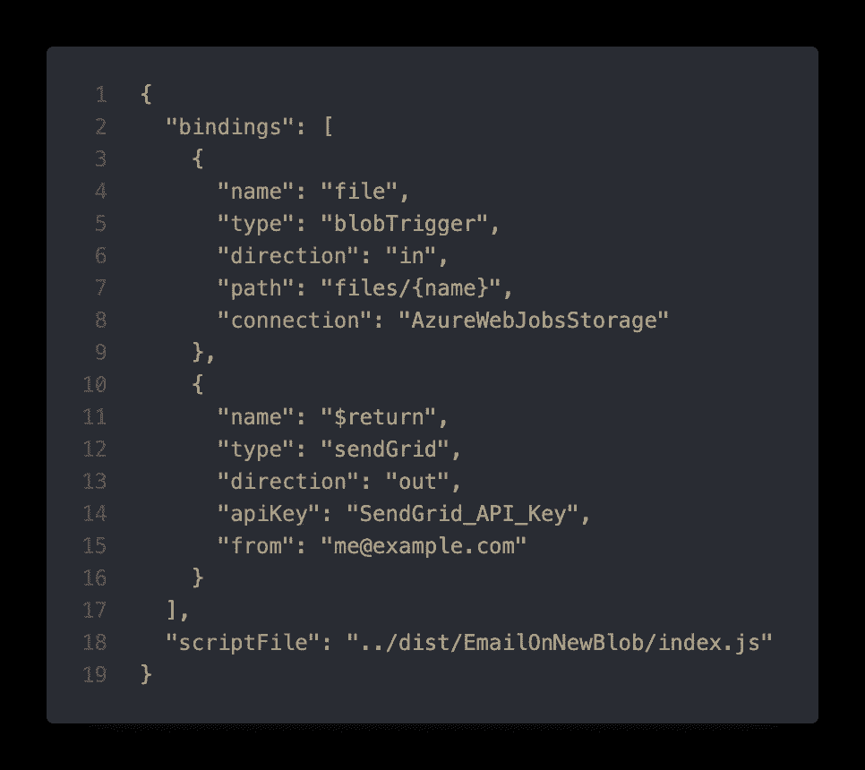

*   **输入:**这个函数的输入是一个 Blob 触发器，监听 files 容器中的文件。轻松点。
*   **输出:**该函数的输出是一个 SendGrid API 调用，它接收该函数的返回数据并将其发送给 SendGrid。

✨ **要点:**关于配置 SendGrid 绑定的高级细节，包括 JavaScript 以外的语言，可以在这里找到: [SendGrid 绑定文档](https://docs.microsoft.com/en-us/azure/azure-functions/functions-bindings-sendgrid)

## 关于 API 键和环境变量的一句话

您可能会注意到，上面的绑定包含一个连接字符串(用于存储帐户)和 SendGrid 的 API 键。两者都应该在功能 App 的*配置*选项卡中创建为*应用设置*。

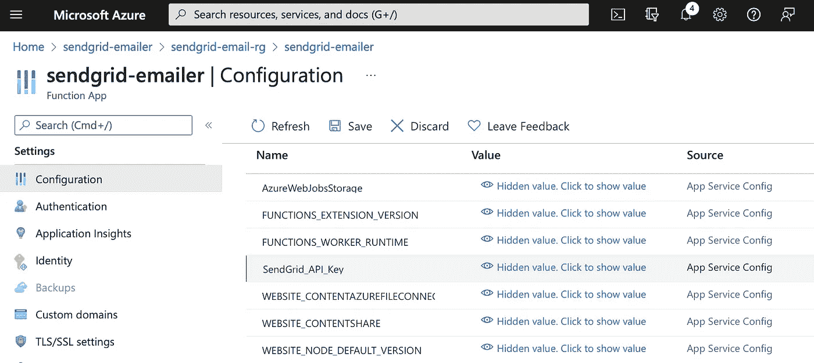

✅ **检查点:**我们现在有了一个有效的 Azure 函数，它可以为上传到 *files* 容器的每个文件发送一封电子邮件——附加文件。

# 瞧啊。—结果

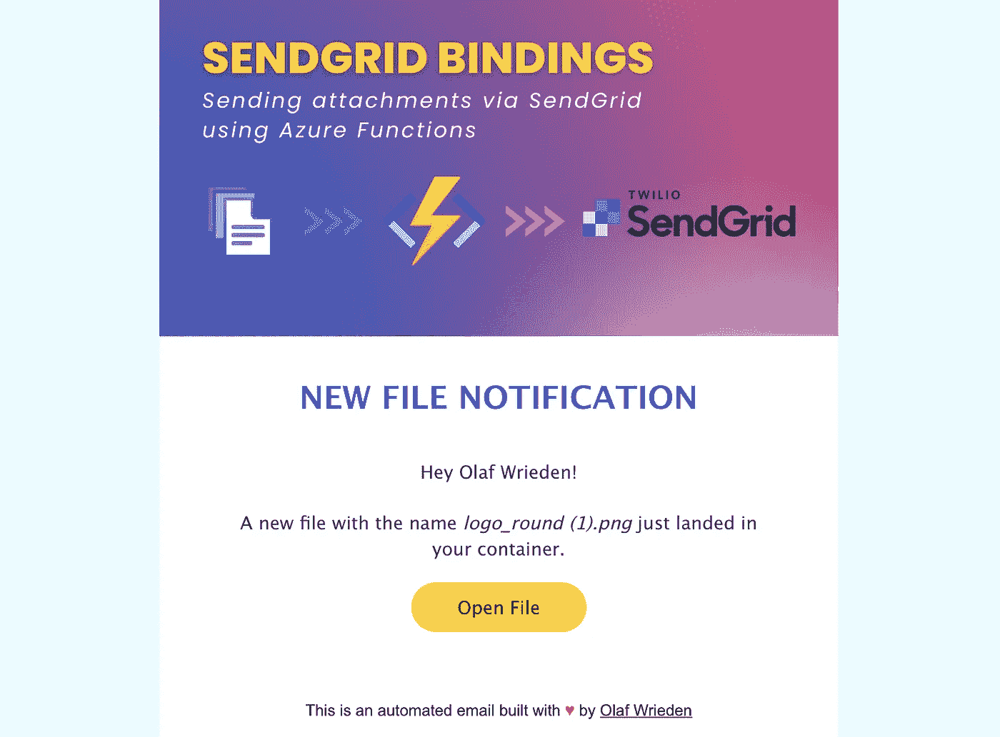

## 谢谢你👏🏼

你喜欢这样的内容吗？给我留言，关注类似的文章，或者在 LinkedIn 上与我保持联系。

# HTML 模板代码