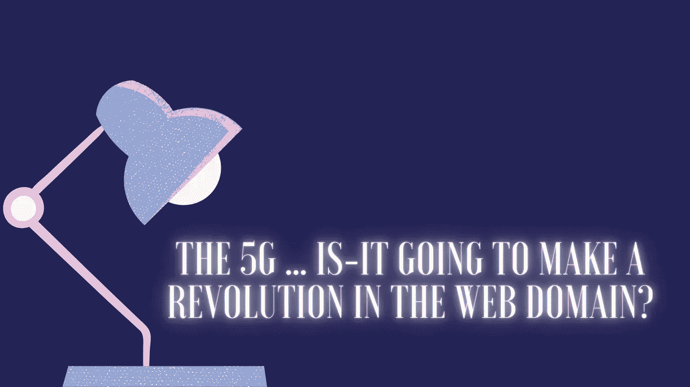

# 5G……它会在网络领域引发一场革命吗？

> 原文：<https://levelup.gitconnected.com/the-5g-is-it-going-to-make-a-revolution-in-the-web-domain-77184c3561a6>

## 关于这项新技术你应该知道什么

你听说过 5G 吗？你听过政府关于信息技术的影响和好处的辩论吗？我阅读和聆听了许多关于 5G 的文章和辩论。它的潜力非常惊人，公司和客户开始对机器学习和人工智能越来越有信心。5G 的出现让一些梦想成为可能和可行，比如自动驾驶汽车。

如果你想知道这项技术对网络领域会有什么影响，这篇文章是为你写的。

以下是我在本文中经历的计划:

*   **什么是 5G，它有哪些能力？**
*   **5G 将会给网络带来怎样的未来？**
*   **这项新技术给网络带来了哪些挑战？**
*   **总结**

# 5G 是什么，它有什么功能？

*   **5G**

5G 代表 ***第五代*** 。这是无线数据网络的下一次新发展。到目前为止，我们已经使用了 3G 和 4G。这里的区别是 5G 不是 4G 的修改版本(就像 3G 的情况一样)。相反，它是一种新的网络架构。这就是为什么它需要安装自己的基础设施和设备，以及适应这种新技术的智能手机。

*   **好处**

**用户体验:**用户将感受到并看到在加载时间、速度、视频流、浏览高质量在线图片、传感器数据等方面的巨大改进。

**AI 和 ML:** 在这个领域，已经有很多项目和牛逼的想法被连接和网速拖慢了。其中一个项目是汽车相互交谈以防止碰撞、虚拟现实流、增强现实和物联网。

由于 5G 的潜力，许多企业现在都在寻求能够为其产品和服务带来的创新。网络也不例外。这个领域也会有很大的变化。

*   **弊端**

5G 最大的问题是它是一项新技术。我们仍然不知道它的长期影响。有很多领域我们都有疑问，我们仍然不知道这项技术会带来什么后果。

健康:研究没有显示 5G 对人类健康有危险的任何证据。尽管如此，这项技术仍然是新的，我们仍然没有长期研究的结果。5G 电磁能量可能会导致某些类型的癌症和其他问题。

**环境:**在 5G 时代，我们需要新的基础设施和新的设备。可惜，这还不是全部！为了能够在智能手机上使用 5G，你需要一部支持这项技术的智能手机，这意味着到目前为止，所有创造出来的智能手机都将被扔掉，这是一个巨大而现实的电子垃圾问题。

# 5G 将会给网络带来怎样的未来？

有了 1G，我们的手机就有了相互通信和通话的能力。有了 2G，他们可以接收短信和连接互联网。紧随其后的是 3G。我们的手机可以看到图片和视频，大约 14.7 兆比特/秒。下一代的 4G 手机速度更快(大约 60 兆比特/秒)。我们可以听音乐，进行视频通话。

到目前为止，你可以看到每一代人都有新的功能和新的可能性成为现实。所以，你想知道由于我们手机上的 5G 会有什么新的变化吗？我也是！

有了 5G，我们可以达到大约 1Tbps/s。它比 4G 快 6 万多。OMG！你能想象吗？

这就是得益于这项技术将会成长并看到巨大变化的东西。

## **-提升 app UI**

对于 web 开发人员和设计人员来说，我们已经可以描绘出几乎零延迟的 web 应用的未来。应用程序将包含丰富的高质量视频和图片，以增强用户体验。毫无疑问，新的网络将鼓励开发者在很大程度上提升应用程序 UI。

## -更多移动应用

移动应用将会看到巨大的增长，因为没有延迟，我们可以打开更多可能性的大门，例如为旅游业的历史场所构建应用。提供独特的功能，如虚拟现实流..等等。

## - 3D 游戏

我们将会看到更多的 3D 游戏应用，因为几乎没有延迟，3D 渲染将会很快很快。

## 聊天机器人

聊天机器人已经很受欢迎，但随着 5G 的出现，我们可以基于幕后机器学习模型的不断自我学习，定制更多具有真实反馈的用户体验。

# 这项新技术给网络带来了哪些挑战？

当然，所有这些都很棒，但我们仍然需要记住，5G 将面临许多挑战，例如:

## -安全问题挑战

这是一项新技术，因此开发人员将面临维护应用程序安全可靠的安全挑战。

## -多应用版本挑战

有了 5G，如果我们想走在技术的前沿，我们将有更多的工作要做。并非所有人都配备了 5G，所以我们仍然需要记住，一些用户将是 4G 用户，无法浏览 5G 版本的应用程序。

# 总结

5G 肯定会为开发者改善他们的移动应用程序打开一个全新的可能性世界。它肯定会增强用户体验，让流媒体或应用程序加载的日常挫折感像魔法一样消失。

在我看来，5G 将带来最大的变化和革命的领域是人工智能、人工智能、虚拟现实和增强现实。由于所有这些领域都需要大量的数据和通信，这将通过 5G 得到解决。

坦白地告诉你的朋友，我对这项新技术的缺点有些担忧。

首先，在人类健康方面，因为我们不能马上看到它的后果。就像柴油一样。它是如此便宜，以至于我们都选择了这个解决方案，但是经过多年、长期的研究和反弹，我们发现我们正在如此严重地伤害这个星球。

其次，公司和企业都在匆忙，因为他们知道谁成功地使用这种新技术来销售创新产品或服务，将赢得更多的市场份额，并将在未来。

因此，经济利益将推动企业去制造东西和创新，而不必等待这种新技术的长期影响。

我是创新和智能应用的忠实粉丝，所以说实话，我迫不及待地想看看我能用这项强大的技术做些什么。但是，我仍然有一些无法证实也无法否认的疑问，不幸的是，现在。我们需要更多的时间来了解这项新技术。

就是这样。我希望你喜欢阅读这篇文章。请在下面的评论区分享你的观点。

亲爱的读者朋友们，感谢你们的支持和宝贵时间。我希望这对你有用和有帮助。

**关注我上** [**中**](https://medium.com/@famzil/) **，**[**Linkedin**](https://www.linkedin.com/in/fatima-amzil-9031ba95/)**，** [**【脸书**](https://www.facebook.com/The-Front-End-World) **，**[**Twitter**](https://twitter.com/FatimaAMZIL9)**查看更多文章。**

回头见(ﾉ◕ヮ◕)ﾉ*:･ﾟ✧)

**FAM**