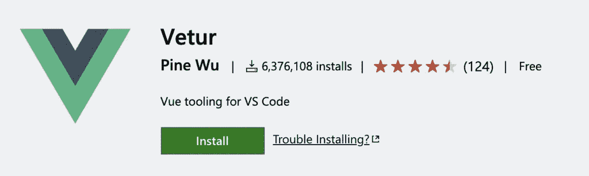
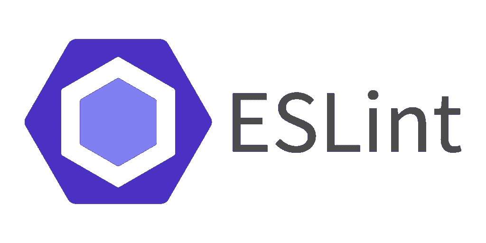
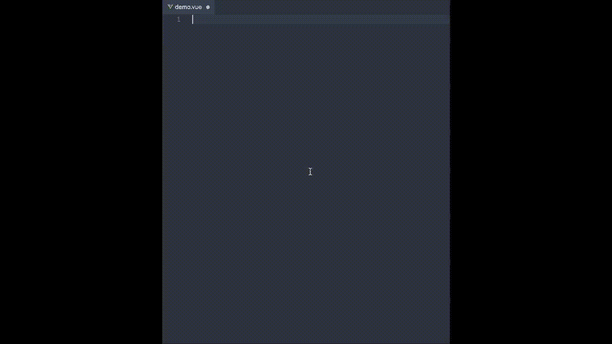
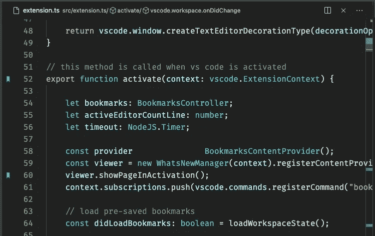
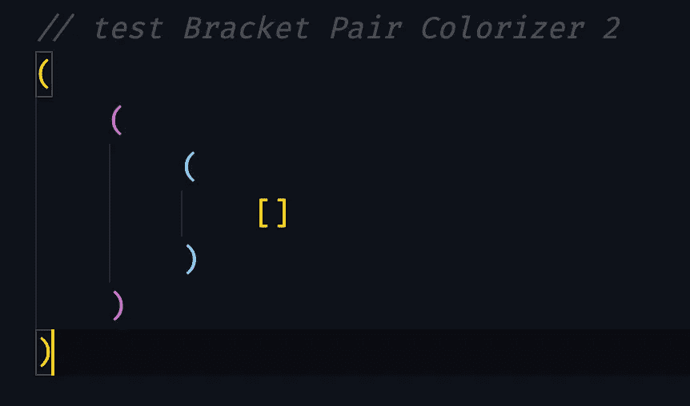

# Vue 开发人员的 7 个最佳 VS 代码扩展

> 原文：<https://levelup.gitconnected.com/the-7-best-vs-code-extensions-for-vue-developers-342b2ecd7e3f>

詹姆斯·哈里逊在 [Unsplash](https://unsplash.com?utm_source=medium&utm_medium=referral) 上拍摄的照片

向 Visual Studio 添加正确的 VS 代码扩展可以让您的开发人员生活变得更加轻松。

它们可以帮助格式化、可伸缩性、执行最佳实践，从而自动化我们开发过程中许多易被遗忘的任务。它们也可以是有趣的扩展，使我们的代码看起来更漂亮/更容易编写。

作为一个 Vue 爱好者，我花时间为 Vue 开发者寻找最好的 VS 代码扩展。这里有一些让我的生活变得简单多了。

准备好了吗？让我们直接开始吧。

## [韦图尔](https://marketplace.visualstudio.com/items?itemName=octref.vetur)

如果你从这个列表中下载一个 VS 代码扩展，它必须是 Vetur。

一个针对 VS 代码的 Vue 工具套件——它提供了 Vue 特定的语法突出显示、常见代码片段的代码片段，以及每个 Vue 开发人员需要的更多内容。

Vetur 得到了很好的维护——它甚至提供了对类型脚本的支持。

关于 Vetur，真的没有太多其他要说的了——只要明白就好。这会让你的发展更好。

## [ESLint 插件 VueJS](https://eslint.vuejs.org/)

大多数开发人员都熟悉 ESLint——最流行的 linter 工具之一，它帮助您的代码与最佳实践保持一致，并且在大型代码库中可读。

VueJS 有自己的 ESLint 插件来检查单个文件组件的语法。我认为它是编写可维护和可伸缩代码的最佳工具之一。

没有什么比看着一些旧代码，甚至不知道从哪里开始调试它更糟糕的了。

别担心！

ESLint 可以帮助你保持有序，随着对 Vue3 支持的增加，你将可以编写可扩展的 Vue 项目。

## [Vue vs 代码片段](https://marketplace.visualstudio.com/items?itemName=sdras.vue-vscode-snippets)

Sarah Drasner 的 VSCode 扩展将为您节省大量开发时间。

**它为常用的 Vue 用例提供了自动填充的片段。用她自己的话说…**

> 【Vue vs code Snippets】*从真实世界使用 Vue 的角度关注开发人员工效学。包括我个人讨厌打字的部分，以及有助于快速剔除的样板文件。*
> 
> [来源](https://marketplace.visualstudio.com/items?itemName=sdras.vue-vscode-snippets)

这对于编写快速 sfc、Vue 指令和快速访问生命周期挂钩来说非常有用。

## [书签](https://marketplace.visualstudio.com/items?itemName=alefragnani.Bookmarks)

许多面向 Vue 开发人员的 VSCode 扩展直到您进入大型项目时才真正显示出它们的全部潜力。

这正是书签的工作原理。这个扩展可以让你用**标记和命名代码**中的位置。然后，您可以在这些不同的“书签”之间跳转，以提高您的开发速度。

小心翼翼地上下滚动文件来查找某个特性的日子已经一去不复返了。

## [括号对上色器](https://marketplace.visualstudio.com/items?itemName=CoenraadS.bracket-pair-colorizer)

括号对着色程序确实如它所说的那样— **它接受匹配的括号，并给它们独特的匹配颜色。**

虽然这看起来像是一个小细节，但它确实可以帮助你修复讨厌的嵌套错误，也可以在你的 linter 不工作时帮助你。

我也非常喜欢它的视觉效果——让我的代码变得丰富多彩，又不会让人分心。

绝对值得一探究竟。

## [自动重命名标签](https://marketplace.visualstudio.com/items?itemName=formulahendry.auto-rename-tag)

Auto Rename Tag 是一个有用的 VSCode 扩展，有助于防止模板代码中出现错误。

每当你要改变一个 HTML 括号对中的一个标签(无论是开始标签还是结束标签)，自动重命名标签将会——你猜对了——自动重命名另一个标签。

这个小小的优化有助于避免如此多的错误，尤其是在处理大型模板时。

## [NPM 智能感知](https://marketplace.visualstudio.com/items?itemName=christian-kohler.npm-intellisense)

每当您在 Javascript 中编写导入语句时，npm 智能感知**会自动完成您的 NPM 模块**。

这可以节省您记住 npm 模块的确切名称的时间。我已经在我的许多项目中使用过它，它绝对是我已经非常习惯的东西。

## 结论

总的来说，对于 Vue 开发者来说，有很多 VS 代码扩展。

虽然这个列表中的许多内容起初可能看起来无关紧要，但是这些小变化可以为您节省大量的开发时间。我强烈建议至少尝试所有的方法。谁知道呢——你可能会爱上他们中的一些人。

如果您认为有任何其他 VS 代码扩展应该出现在这个列表中，请告诉我！

如果你有兴趣了解更多关于 Vue 3 的知识，请下载我的免费 Vue 3 备忘单，里面有一些基本知识，比如合成 API、Vue 3 模板语法和事件处理。