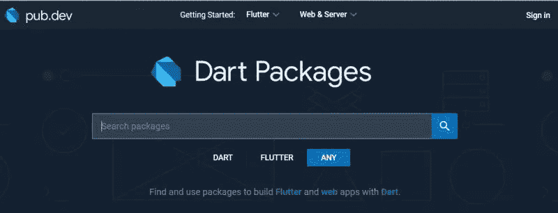
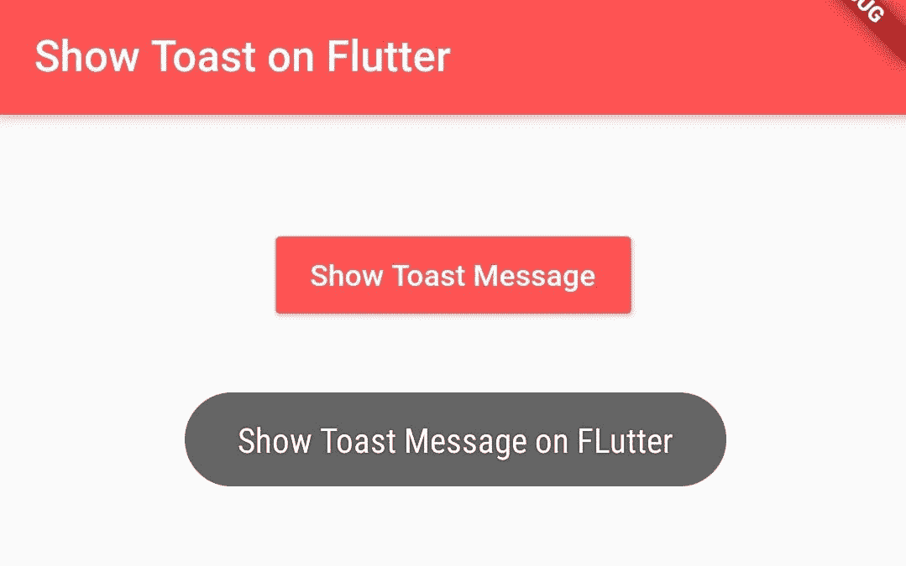

# 我不能没有的 7 个颤动的包裹

> 原文：<https://levelup.gitconnected.com/the-7-flutter-packages-i-cant-live-without-9c18ac8540bd>



互联网上最好的网站:)

一些 flutter 包是我创建的每个 Flutter 项目中的必备包，因为它们让开发变得更加容易。

无论是因为它们使本地数据存储变得容易，还是允许你用一个包完全替换你的应用程序的一部分，有一些包我甚至在开始编码之前就自动包含在我的 Flutter 项目中。

如果你正在开发一个应用程序，并且想要快速发布你的应用程序，你会想要了解这些 Flutter 包。

如果有任何包是你必须包括的，留下评论让我知道——我总是期待学习！

注意:所有的包现在都是空安全的！

## 1.蜂巢/蜂巢 _ 颤动


颤动蜂房

首先，我说我是*而不是*NoSQL 数据库的粉丝——我认为严格的模式创造了可预测性，定义了你的工作流，而不必担心丢失数据或不需要的未定义字段。

话虽如此，如果你是 NoSQL 的球迷，我能明白为什么！我不是在抨击 NoSQL——它有它的好处。*尤其是前端的*。

关系数据库的另一个额外好处是能够在同一个地方管理租赁和多人的数据——一个名为“聊天消息”的表可以保存来自每个组的每条聊天消息，如果您查询正确，您就不必担心会收到其他人的消息。

在前端，这不是一个问题，因为你只是在存储来自你或来自数据库的已经过滤过的数据。这意味着 NoSQL 有所有的优点，没有任何危险点…这意味着 Hive 是我在前端存储数据的首选解决方案。

简单的盒子可以作为数据库，允许绝对分离。数据总是以直观和可理解的方式存储——最重要的是，我们(大部分)是同步的！

如果你在客户端存储大量数据，比如聊天记录或缓存等。我强烈建议看看 Hive——对我来说，这是在前端存储数据的最好方式。

(注意:这个对我来说比较新！我是近一个月才开始用 Hive 的，但是爱上了，刚要补充到这里。如果你是一个有经验的 Hive 用户，让我知道你的提示和技巧！)

## 2.颤动吐司



我问你一个问题:在你写的上一个 Flutter 项目中，如果用户没有互联网连接会发生什么？

如果你回答了灾难性的失败，不要感到尴尬:你并不孤单。当开发人员开发一个应用程序时，错误处理通常是最后一步，而在理想情况下，它应该是快乐之路之后首先要考虑的事情之一。

但是给用户反馈是很难的。大多数时候，你需要在每一个页面上为每一个错误编写一个定制的消息，这对于希望开发 MVP 的人来说是不可行的。

相反，下面是我的`http_client`的伪代码:

```
try {
   http request
} on TimeoutError catch (e) {
 if (hasInternet) { //http_connectivity package
     toast("Servers down, sorry.")
 else {
     toast("Are you sure you're connected to the internet?")
}
rethrow
}
```

就是这样！我们处理了错误。我们的用户对所发生的事情有反馈:要么他们没有互联网，要么服务器关闭。这就是我们需要做的。

错误处理的最后一个技巧是:用 try catch 包装应用程序。然后，有一个向后端报告错误的方法，然后重新抛出错误。这样，您可以获得详细的错误日志，以便快速修复错误:)在这种情况下，您不是吞下错误(一种可怕、痛苦的代码味道),而是接受它们、报告它们、再抛出它们。您将错误日志移动到后端，这样开发人员就可以轻松地读取日志并迭代错误。

不过，Flutter Toast 不仅仅对错误处理有好处！如果用户做了一些事情，比如注销或更改他们的名字，他们希望得到即时反馈，知道这是有效的。你可以直接`toast("Logged Out.")`，而不是纠缠你的 UX 设计师如何去做。

## **3。迂腐**

代码风格很重要。有些人认为这是…嗯，学究气，但我发现保持项目代码风格对项目的健康非常重要——在应用程序的不同部分有不同的约定会造成连续性中断，使适应部分代码变得困难。

但是，再说一次，我们是忙碌的开发人员！我们没有时间担心使用单引号或双引号——我们希望我们的产品推出去。

输入迂腐。

迂腐严格地限制了你的整个项目——如果你忘了在可能是`const`的地方写`const`，迂腐会让你知道。

迂腐做了很好的工作，保持项目具有相似的代码风格，并阻止你的同事像`LINT: Use single quoted string where possible.`一样给你的公关添加评论。

## 4.自动路线


即使有了路由器 2.0，路由仍然很难。管理嵌套路由器，知道栈顶是什么，拥有正确的参数，这些都很困难。

除非你用 auto_route！

自动路由允许您在不增加复杂性的情况下扩展到大量页面，例如，您可以拥有嵌套的路由器、单独的转换，甚至选项卡式路由器，而不必担心管理参数或路径字符串。

auto_route 代码生成器会为你生成*很多*代码，应该会让你明白不使用会浪费很多时间。

到目前为止，我最喜欢的部分是严格类型化的参数。

这是我找到的包之一，而不是偶然发现的:我是将运行时问题转移到编译时的忠实粉丝，因为对于开发人员来说，调试“丢失的参数”比“尝试在 null 上调用 toString”要容易得多。

通过路由传递参数是您很快陷入 bug 的地方之一。假设您有一条需要字符串的路线:您需要手动确保每次推送路线时都包含一个字符串。你的编译器不会告诉你，你只需要*记住。*

添加 auto_route 是一个显而易见的过程，它允许*在不牺牲开发速度的情况下开发出优秀的*应用程序。

## 5.json _ 可序列化


这又是一个显而易见的问题。任何现代应用程序都连接到后端，并执行许多许多 http 调用。手动反序列化 json 字符串需要时间——尤其是在开发过程中，可能会添加更多的字段。

这个包允许开发者在一个类中添加 4 行代码，然后自动准备好通过 http 调用进行传输。

你将在这个列表中看到的一个大主题是将尽可能多的工作从开发者转移到编译器——这个也不例外。如果我有一个用户字段，并且我在后端添加了一个电子邮件，我需要去我的自定义反序列化器并添加电子邮件。如果我忘记了，我的电子邮件将永远是空的。如果我使用 json_serializable，那么编译器会告诉我“嘿…你的用户类有一个 email 字段，但是我们没有在序列化器中寻找它。也许您需要重新运行构建生成器？”

如果您正在进行任何 http 调用，我强烈建议您看看这个包。

## 6.google _ 登录


好吧，这个比一个 flutter 包更像 infra 但这仍然是我的用户管理登录系统。
为什么？首先，我不相信自己能够安全地管理用户。身份验证是一个雷区——如果您错误地散列密码，意外泄漏您的密码数据库，允许 IDOR，等等。你的安全问题很大。

其次，谷歌在简化这种认证方面做得很好:1 .创建隐私策略和 TOS(无论如何您都需要这样做)，2 .在 Firebase 上创建一个应用程序，然后允许 google 登录。3.必要时复制凭据。4.在后端验证访问令牌。

Home rolling auth 既困难又容易出错，所以使用提供者是下一个最好的选择。用苹果登录对 iOS 来说很棒，但是安卓呢？这个包使得创建认证系统变得非常容易，我强烈推荐走这条路，而不是手动登录。

此外，对您的用户来说，这要容易得多！大多数人都有谷歌账户，没有谷歌账户的市场份额对你的 MVP 并不重要(大多数情况下)。

Auth 通常是项目开发中*必须*完成的步骤之一，但是没有人愿意去做，因为它既困难又耗时。google_sign_in 让你跳过这一步！

## 7.颤动 _ 阻塞


如果你来自我的 2021 年的[颤振状态管理文章，你可能会奇怪为什么 bloc 在这个列表上而不是 riverpod。](/flutter-state-management-in-2021-when-to-use-what-98722093b8bc?source=your_stories_page-------------------------------------)

事实是:那篇文章应该更新了。在评价 cubit 之前，我还没有使用到我应该使用的程度。我认为 cubit 解决了 bloc 的大部分问题，在某种程度上，它使*真正*容易管理你的应用程序中的状态，你可以在 cubit 和 bloc 之间互换，这取决于你是基于事件还是基于状态的架构。

无论如何，这个名单上的位置不仅属于集团，而且属于*任何*国家管理层。我的首选状态管理解决方案是 bloc，但是每个解决方案都有自己的问题和用例，您应该根据您想要实现的目标来选择。

状态管理，在任何大型 app 中，都是一个需求。这是无法避免的:你不希望在每个类中克隆相同的用户对象，所以你必须让孩子可以访问它。

无论您使用继承的小部件还是全面的状态管理，以干净的方式管理状态都很重要，我认为，对我来说，bloc 做得最好:它和 cubit 允许干净有效的状态管理解决方案，并允许应用程序创建者更好地保持他们的数据干燥和可维护。

就是这样！从 flutter 发布到现在，我在自己开发的每个应用中都包含了这 7 个包。我认为它们使构建更健壮的应用程序变得更容易、更快捷。

我知道很多人反对使用包，虽然它们有缺点，比如依赖他人的代码，但我认为好处太大了，不容忽视。

你有推荐的套餐吗？你还有什么要补充的，或者不同的说法吗？请在评论中告诉我！我一直在寻求学习。