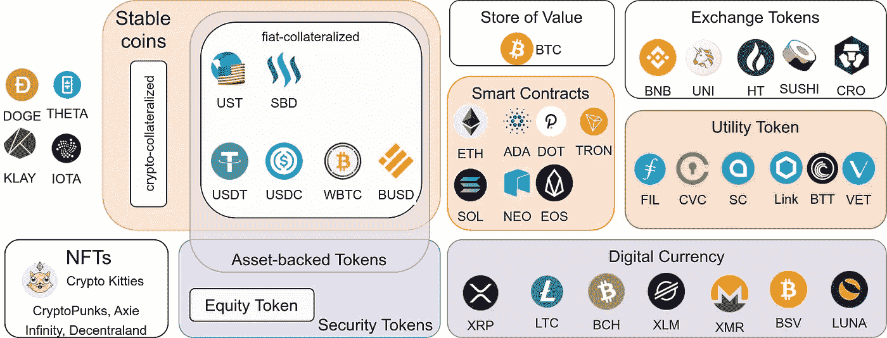

# 你必须知道的 7 种加密货币

> 原文：<https://levelup.gitconnected.com/the-7-types-of-cryptocurrencies-you-must-know-3b26b2ce0eb8>

## 硬币、公用事业和安全代币、稳定硬币和非金融交易:给生态系统带来秩序

30 大加密货币的分类+一些精选的。图片作者:马丁·托马斯

过去几年，加密生态系统发展迅速，以至于外人很难理解该领域的各种用例。读完这篇文章，你应该有一些心智模型来比较最新的区块链项目。我们走吧！

# 硬币与代币:技术上的区别

**硬币**是他们祖国区块链的资产，而**代币**是他们所居住的区块链以外的资产。硬币的例子有比特币区块链上的比特币和以太坊区块链上的以太。令牌的例子是作为多个区块链上的第二层令牌的系绳；UNI swaps“UNI”令牌和 chain links“LINK”令牌使用以太坊区块链。在以太坊顶上建造代币超受欢迎；大部分是所谓的 [ERC20 代币](https://ethereum.org/en/developers/docs/standards/tokens/erc-20/)。

请注意，在一些对话、文章和视频中，这两个术语可以互换使用。

虽然硬币和代币之间的区别是技术性的，但我们可以根据它们的预期用途对代币和硬币进行分类。虽然有很多用例，但有两个不同的大组:安全令牌*和实用令牌*。**

# *安全令牌*

*证券是一种可交易的金融资产。豪威测试有助于判断一项资产是否是证券:*

> *一份合同、一项交易或一项计划，根据这份合同、交易或计划，一个人将其资金投资于一家普通企业，并被引导期望仅从发起人或第三方的努力中获利，[根据美国证券法，这是一种担保]*

*这通常简化为:*

1.  *是否有资金投入？*
2.  *这笔钱是投资在一家普通企业吗？*
3.  *有利润预期吗？*
4.  *利润是完全来自发起人还是第三方的努力？*

*安全令牌的示例可以通过查找安全令牌提供(sto)来找到:[icoholder.com](https://icoholder.com/en/stos/past)、[coincodex.com](https://coincodex.com/sto-list/ethereum/)、。我在那里发现了两个最近的例子。*

*比特币不是一种安全令牌，因为这些钱不是投资于一个普通的企业。*

## *股票代币*

*股票代币是一种证券代币，允许持有者拥有一些所有权。虽然我发现这被提到过几次，但我还没有看到具体的公开例子。如果你知道一个，请分享！*

## *资产支持代币*

*资产的令牌化使其可以交易。你不是交易资产本身，而是交易代币。这类似于纸币:你交易的不是黄金，而是代表一定数量黄金的纸张。资产支持代币的问题在于缺乏监管。当然，代币的发行者可以声称资产是由任何东西支持的。没有实际的支票，这种索赔没有任何价值。*

*可以进行令牌化的资产有:*

*   ***贵金属** : [PAXG](https://coinmarketcap.com/de/currencies/pax-gold/) 和 [DGX](https://coinmarketcap.com/de/currencies/digix-gold-token/) 有黄金做后盾*
*   *公司股票:公司股票可以作为加密代币交易，而不是通过知名的交易所交易。我找不到一个这样做的例子。*
*   ***其他商品:**[Petro](https://en.wikipedia.org/wiki/Petro_(cryptocurrency))([XPD](https://coinmarketcap.com/currencies/petrodollar/))号称有石油和矿产储备做后盾。我没见过其他例子。*
*   ***房地产**:围绕房地产有[多种令牌](https://coinmarketcap.com/view/real-estate/)，一些国家考虑将房地产表示为加密令牌。 [IHT 币](https://ihtcoin.com/)看起来是往这个方向走，但也给人一种还没准备好的印象。这个概念很好，但据我所知没有现成的产品。*

# *实用令牌*

*证券代币被交易，期望从中获得直接利润。相比之下，效用令牌是带着获得某种效用的预期进行交易的。例如，一个 FIL([Filecoin](https://docs.filecoin.io/))token/[SC](https://coinmarketcap.com/de/currencies/siacoin/)([SIA](https://sia.tech/technology))可以用来存储一个文件。 [CVC](https://coinmarketcap.com/de/currencies/civic/) ( [Civic](https://www.civic.com/) )令牌可以用来验证用户的身份。或者说这就是我们的想法。我还没有看到关于如何实际做到这一点的明确说明。*

*在现实世界中，礼品卡和公共交通票都是公用代币的例子。*

*实用令牌的其他例子有[基本注意力令牌](https://coinmarketcap.com/de/currencies/basic-attention-token/)和[假人令牌](https://coinmarketcap.com/de/currencies/golem-network-tokens/)。*

# *不可替换令牌(NFT)*

*所有的硬币和大多数代币都可以互换。如果你有一美元，你用哪一美元买零食都没关系。然而，如果你购买艺术品、漫画、邮票或棒球卡等收藏品，你拥有哪一种就很重要了。不[梵高](https://en.wikipedia.org/wiki/Vincent_van_Gogh)和其他任何梵高都一样。数字等价物是 [CryptoKitties](https://www.cryptokitties.co/) 。这个想法就是你——只有你！—可能有一些数字价值。这一特性对电脑游戏尤其有吸引力，因为玩家已经为游戏中的稀有物品付了很多钱。把这些放在区块链上让玩家对资产有更多的控制权。也许甚至有可能在游戏间交易物品？*

*非战斗堡垒可以在以太坊区块链( [ERC-721](https://ethereum.org/en/developers/docs/standards/tokens/erc-721/) ， [ERC-1155](https://eips.ethereum.org/EIPS/eip-1155) )上创建。*

# *稳定的硬币*

*稳定硬币是法定货币的数字表示。他们分为三组:*

*   ***法定抵押**:加密货币由法定货币支持。例子是系绳(USDT)和双子座美元( [GUSD](https://coinmarketcap.com/de/currencies/gemini-dollar/) )。*
*   ***加密抵押**:加密货币由加密货币支持。一个例子是[戴](https://coinmarketcap.com/de/currencies/multi-collateral-dai/)。*
*   ***无抵押**稳定币依靠一份智能合约来买卖稳定币，以保持价格不变。*

*我推荐 [HyperQuant](https://medium.com/u/da4c15da74be?source=post_page-----3b26b2ce0eb8--------------------------------) 关于这个话题的文章:*

* [## 秘密抵押债券

### 这是一个由四部分组成的系列，是理解 stablecoins 基本原理的基础。

medium.com](https://medium.com/hyperquant/crypto-collateralized-stablecoins-129df769b089) 

[Coininsider](https://www.coininsider.com/what-is-a-non-collateralized-stablecoin/) 也帮我了解了一下。

有趣的是，几枚 stablecoins 其实并不是硬币，而是代币。stablecoins 的两个例子是 [TerraUSD](https://coinmarketcap.com/de/currencies/terrausd/) 和 [Steem Dollars](https://coinmarketcap.com/de/currencies/steem-dollars/) 。“稳定代币”的两个例子是 [Tether](https://coinmarketcap.com/de/currencies/tether/) 和 [USD Coi](https://coinmarketcap.com/de/currencies/usd-coin/) n。两者都是以太坊区块链上的 ERC20 代币。

# 其他硬币

你可能已经注意到我把 Dogecoin，Theta，Klay 和 Iota 放在盒子外面了:

*   [Dogecoin](https://coinmarketcap.com/currencies/dogecoin/) 是 Litecoin (LTC)的一个分支，因此应该放在“数字货币”部分。我把它放在一边的原因是，它看起来太像一个笑话。然而，有些人喜欢它。
*   对于 [Klay](https://coinmarketcap.com/currencies/klaytn/) 、 [Theta](https://coinmarketcap.com/currencies/theta/) 和 [Iota](https://coinmarketcap.com/currencies/iota/) 我怀疑它们是实用硬币，但在撰写本文时，我不确定你可以用实际硬币做什么。* 

# *摘要*

*要大致了解加密项目，您可以提出以下问题:*

*   *它是硬币还是代币？如果是代币，用的是哪个区块链？这个项目可能从以太坊的一个令牌开始，并计划随着时间的推移过渡到他们自己的区块链吗？这可以让你深入了解哪些类型的安全问题你可能需要担心，主要的工作将在哪里进行，以及以太坊和以太坊 2.0 的[高油价是否对该项目感兴趣。](https://www.reddit.com/r/ethereum/comments/lffh25/eth_gas_fees_are_too_d_high/)*
*   ***从 7 组**中选择:是数字货币、交换代币、智能合约区块链、NFT、资产支持代币、公用事业代币，还是其他不同的东西？答案可能会影响法规，并且应该有助于您理解项目如何为其用户提供价值。*

*如果你想看更多的类别，看看/r/cryptocurrency 上按用途/目的分组的[前 101 个硬币吧！](https://www.reddit.com/r/CryptoCurrency/comments/lgeots/top_101_coins_grouped_by_usagepurpose/)*