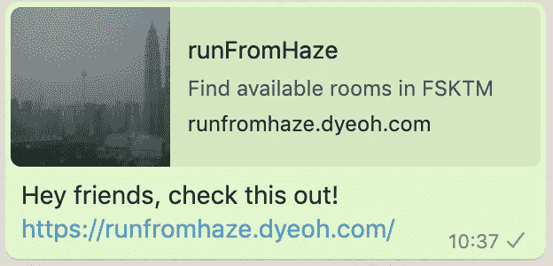
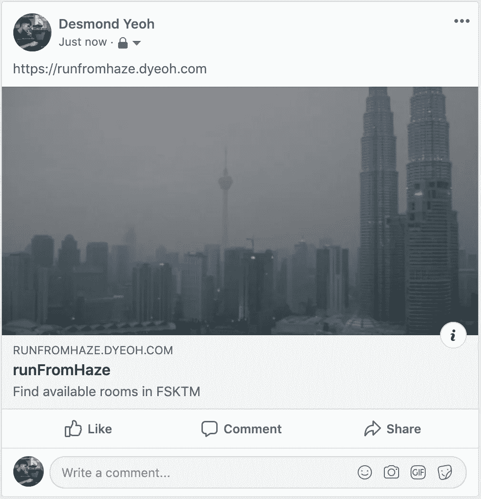
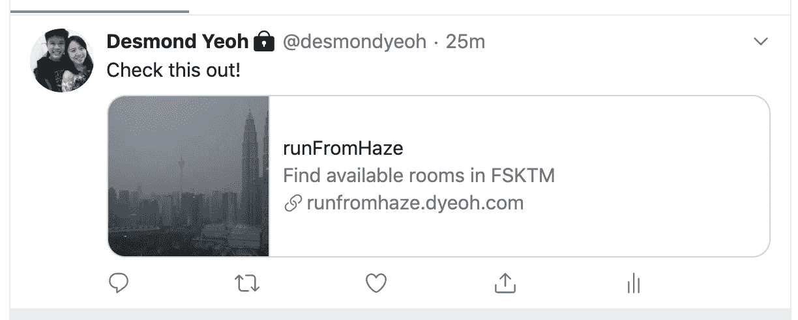
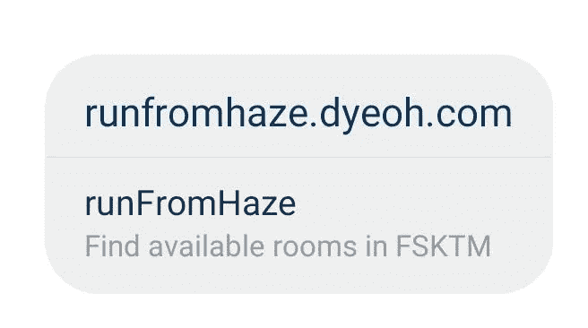

# 用来增加网站流量的 9 个 Meta 标签

> 原文：<https://levelup.gitconnected.com/the-9-meta-tags-to-use-to-increase-traffic-to-your-website-cb33b7c87f6d>

详细的帖子和模板代码——只需复制、粘贴和编辑！


来自 [pixabay](https://pixabay.com/photos/web-page-htlm-code-programming-2341973/) 的 Meta 标签

众所周知，访客流量是任何一个网站建设者都非常关心的问题。流量的大小会直接影响网站的盈利。因此，每个人都想建立能够产生尽可能多的访问者流量的网站。

# 增加流量的方法

有很多方法可以增加网站的流量，可以是付费的，也可以是免费的。以下是一些例子:

**💰付费的**包括从谷歌、YouTube、脸书、Instagram 购买广告，付钱给有影响力的人来推广网站，甚至给新用户巨大的折扣。

🆓**免费的**然而，依赖于搜索引擎优化(SEO)和口碑(现有用户在社交媒体上的分享)。一个最好的和无成本的方法是在网站上添加 Meta 标签。Meta 标签可以帮助提升 SEO，催化口碑推荐的数量。

## 搜索引擎优化的元标签

```
<meta name="title" content="WEBSITE_TITLE">
<meta name="description" content="WEBSITE_DESCRIPTION">
<meta name="author" content="AUTHOR_NAME">
```

这些是我经常添加的元标签，用来提高我的网站的 SEO 状态。这有助于搜索引擎更好地理解网站，并将其排在相关搜索的前面。这些字段非常简单明了——只需输入网站标题、网站描述和作者姓名。

## 手机的元标签

```
<meta name="viewport" content="width=device-width, initial-scale=1.0">
```

如果你正在为移动设备开发一个网络应用程序(好吧，移动优先的设计是今天的趋势)，这是一个应该包含的东西！*它会缩放您的网站以适应移动屏幕*，因此您的访问者不必不断放大才能看到内容。

## 社交媒体的元标签

一些元标签就像 YouTube 上的缩略图。他们就像广告牌，帮助潜在的新访客决定访问你的网站。

> 当观众找到你的一个视频时，缩略图通常是他们首先看到的，YouTube 上 90%表现最好的视频都有自定义缩略图。(来源: [Youtube 创作者学院](https://creatoracademy.youtube.com/page/lesson/thumbnails?cid=get-discovered&hl=en#strategies-zippy-link-2))

以下是一些我经常添加到我建立的网站上的 OpenGraph Meta 标签:

```
<meta property="og:type" content="website" />
```

⬆️:这是你的网站的类型，`content`可以是`“website”`、`“article”`或其他术语，如`“music”`或`“video”`。你可以在这里查看完整的列表([链接](https://ogp.me/#types))。

```
<meta property="og:site_name" content="SITE_NAME">
```

⬆️这是你的网站名称的地方，例如:“ **Facebook** 或“ **SomeStartupName** ”。

```
<meta property="og:title" content="TILTE" />
```

⬆️这是当人们分享你的网站时显示的主要标题。它应该很短，如果我认为`SITE_NAME`已经描述了网站的功能，我通常会用回`SITE_NAME`。

```
<meta property="og:description" content="DESCRIPTION" />
```

⬆️这是人们从社交媒体上看到的对你网站的描述(通常是灰色的)。让它足够短，告诉人们网站的目的是什么。

```
<meta property="og:image" content="IMAGE_URL" />
```

⬆️在这里你把缩略图的网址！记住 YouTube 上 90%表现最好的视频都有自定义缩略图！

*快速提示:如果你懒得制作自定义缩略图，可以尝试从 Google Image 搜索免费图片(提示:工具→使用权→标注重复使用)。只需右键单击并将链接复制到图像。*

# 一个简单的例子

在这里，我将展示我在为我的教员建立一个简单的网站时使用的元标签。这个网站帮助学生寻找目前空着的教室，这样他们就可以呆在室内，远离雾霾。

## 我添加的元标签:

```
<meta name="title" content="runFromHaze">
<meta name="description" content="Find available rooms in FSKTM">
<meta name="author" content="Desmond Yeoh">
<meta name="viewport" content="width=device-width, initial-scale=1.0">
<meta property="og:type" content="website" />
<meta property="og:site_name" content="runFromHaze">
<meta property="og:title" content="runFromHaze" />
<meta property="og:description" content="Find available rooms in FSKTM" />
<meta property="og:image" content="[https://upload.wikimedia.org/wikipedia/ms/0/0f/Jerebukl.jpg](https://upload.wikimedia.org/wikipedia/ms/0/0f/Jerebukl.jpg)" />
```

## 当它在社交媒体上分享时，它看起来是这样的:



关于 **WhatsApp**



上**脸书**



在**推特上**



在 **Instagram DM 上**

# 感谢阅读！🙇

还有很多元标签可以探索，但我认为这些是给网站带来流量的关键。它至少可以帮助搜索引擎匹配潜在的新访问者，并帮助当前的访问者鼓励他们的同行访问你的网站。

***最后一个小提示:在我公开我的网站之前，我会一直试着把它发布在脸书和推特上(把可见性设为“只有我”)；或者给空群发个 WhatsApp 消息，看看是什么样子。***

如果你喜欢这篇文章，并且认为它很有帮助，你知道你可以做些什么来鼓励我写更多！👏 😉