# 适配器模式示例

> 原文：<https://levelup.gitconnected.com/the-adapter-pattern-by-example-3f5b85aec76d>

照片由[期待最好的](https://www.pexels.com/@expect-best-79873?utm_content=attributionCopyText&utm_medium=referral&utm_source=pexels)来自 [Pexels](https://www.pexels.com/photo/architectural-design-architecture-banks-barclays-351264/?utm_content=attributionCopyText&utm_medium=referral&utm_source=pexels)

首先由“四人帮”描述，适配器模式是我们软件工程武库中真正有用的武器。通常在集成系统时，无论是我们自己的系统还是来自第三方的系统，我们都会遇到做同样事情但有不同 API 的库。

这就是适配器模式为我们提供帮助的地方，但是有时要准确地设想如何提供帮助可能有点棘手。

许多例子依赖于 UML 或真正抽象的概念(如果我读到另一个涉及形状的继承链，我想我会疯掉)，所以我在这里要做的是尝试提供一个相当现实的例子。

考虑一个必须与三家或更多银行集成的支付系统。每个银行都提供了一个 SDK(快乐的日子)，但是每个 SDK 都有不同的接口(悲伤的时光)，我们不能修改任何一个。

好的——让我们看看 SDK 给了我们什么:

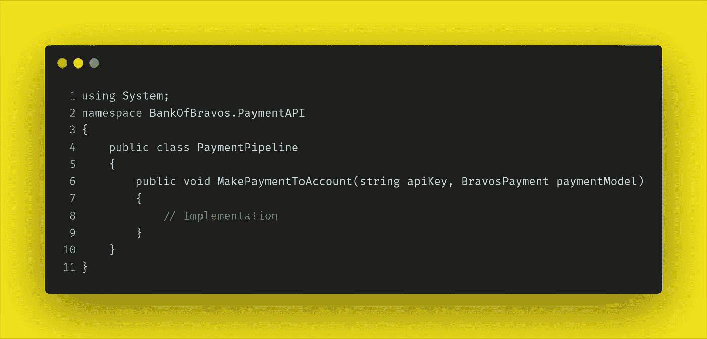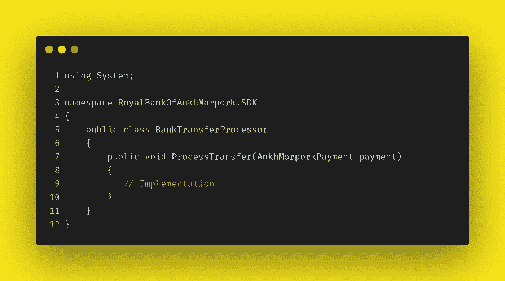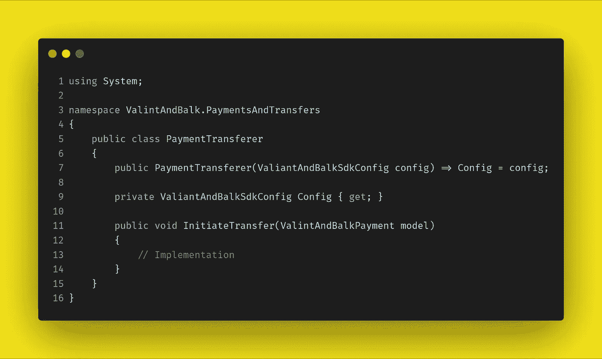

好的——这非常简单。它们都做类似的事情，即处理某种支付或转账。每种方法都将某种“模型”作为其参数，该模型封装了需要处理的数据，如下所示:

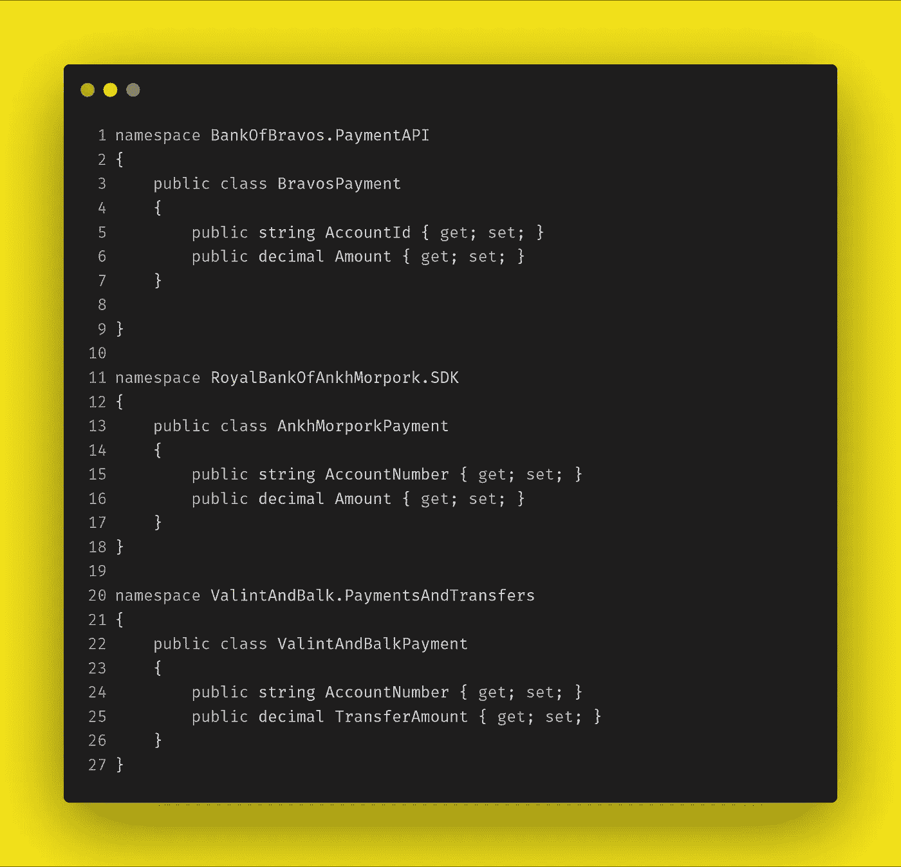

现在让我们看一下与 SDK 集成的类，以及两个支持结构，我们将了解适配器模式如何有所帮助。

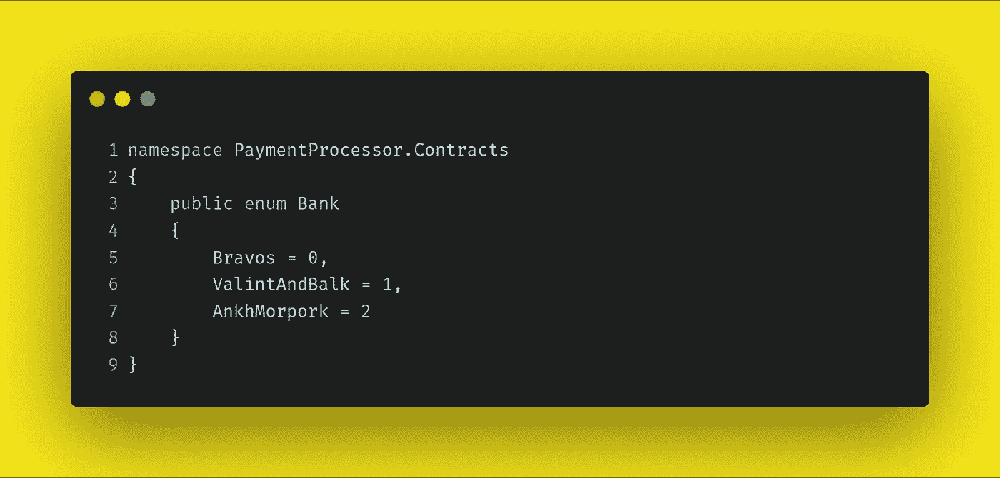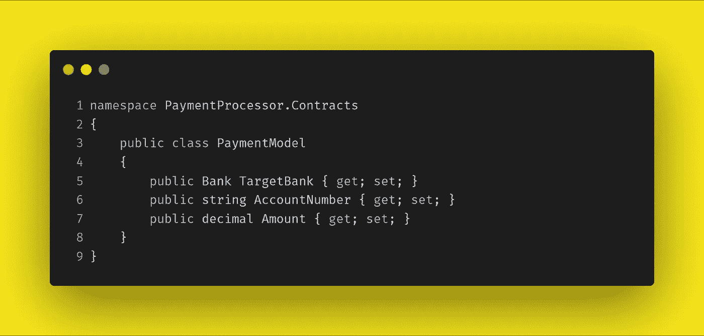

*银行*枚举和*支付模型*在我们的控制之下——它们是我们系统的一部分，由处理器使用，如下所示。

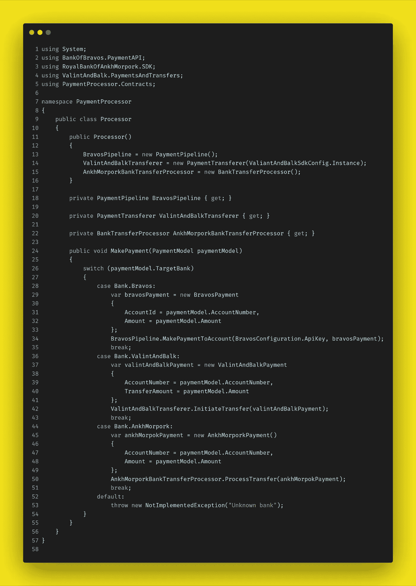

呃。什么？答:一团糟。

我们在这里能看到什么问题和潜在的问题？

*   至少可以说，那个 switch 语句是令人不愉快的。每一个新的 SDK，或者对现有 SDK 的更改，都意味着进入 *MakePayment* 方法的内部——这增加了引入 bug 的风险，更不用说测试负担了。
*   它有每个 SDK 的一个实例。这将导致可维护性的噩梦。新 SDK？重构该类以包含它并(手动)重新测试。很快你就会发现一些事情变得无法控制。
*   硬编码的依赖关系意味着这个类不能进行单元测试。

那么我们能做些什么呢，适配器模式有帮助吗？

例如，硬编码的依赖关系，我们是否需要一个模式来解决这个问题——我们不能直接注入它们吗？是的，我们可以这样做(即使我们暂时忽略其中两个方法依赖于静态)。虽然这只是转移了问题，但并没有让它消失。我们必须以某种方式将这些依赖关系引入到我们的类中。

依赖注入也不能解决可维护性问题。对于 SDK 的每次添加或更改，我们仍然需要添加新的属性，或者更改属性类型。而那个 switch 语句— DI 在这一点上对我们没有任何帮助。

说到那个开关声明。我确信我们在职业生涯中都遇到过这种事情——在事物美好、整洁和干净的早期阶段，在一个类生命的后期阶段，条件逻辑已经变成了一团乱麻。

干净、可读的代码很重要——当然从可维护性的角度来看，但从生产率的角度来看也是如此。事实上，对于一些干净的代码来说，它和工作代码一样重要(你可以在这里签署[声明](http://manifesto.softwarecraftsmanship.org))。

那么，适配器模式有什么帮助呢？我们能让我们的*处理器*类更易维护、可读性更强、更健壮吗？是的——我们可以。让我们做一些重构，看看怎么做。

首先，我们需要创建一个通用的界面——我们可以毫不费力地将我们的*支付模型*传递到这个界面中。

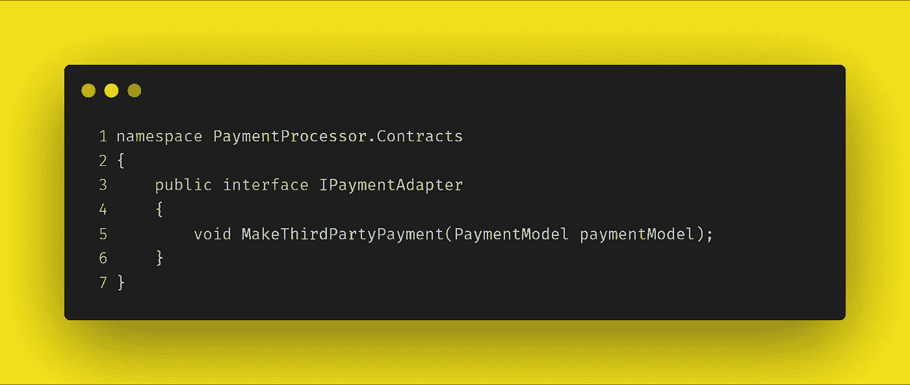

下一步是为实现 *IPaymentAdapter* 的三个 SDK 中的每一个创建一个适配器类。我们将在下面看到它们的样子:

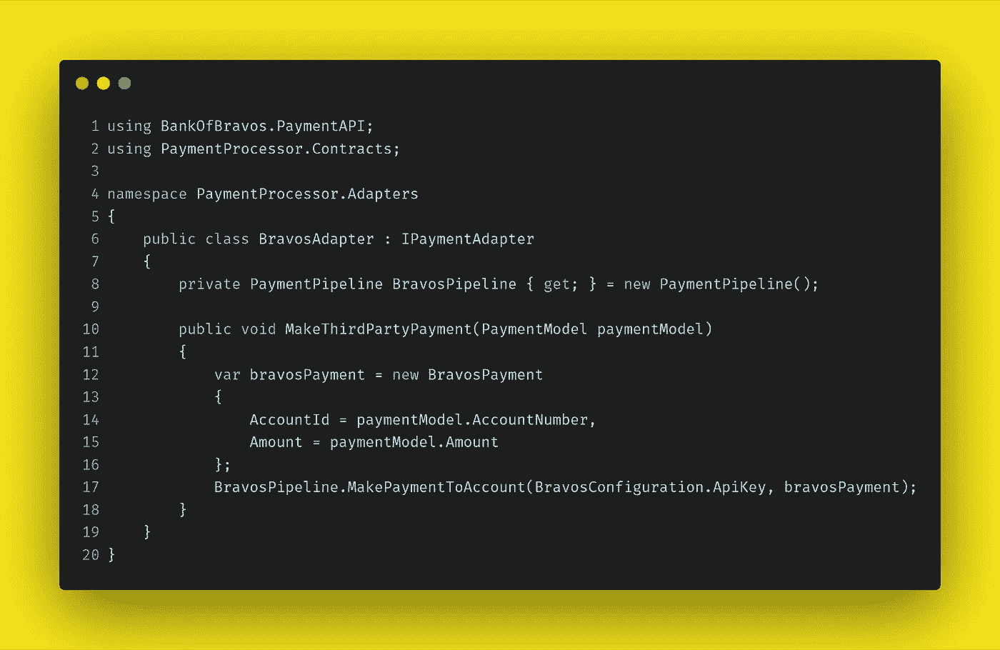

好的——这很容易理解。我们的适配器类实现了 *MakeThirdPartyPayment* 并调用了 SDK 的 *MakePaymentToAccount* 方法。我们在这里所做的是从*处理器*类中取出条件块，并将其封装在这个类中。

让我们看看其他适配器是什么样子的(剧透——它们非常相似)。

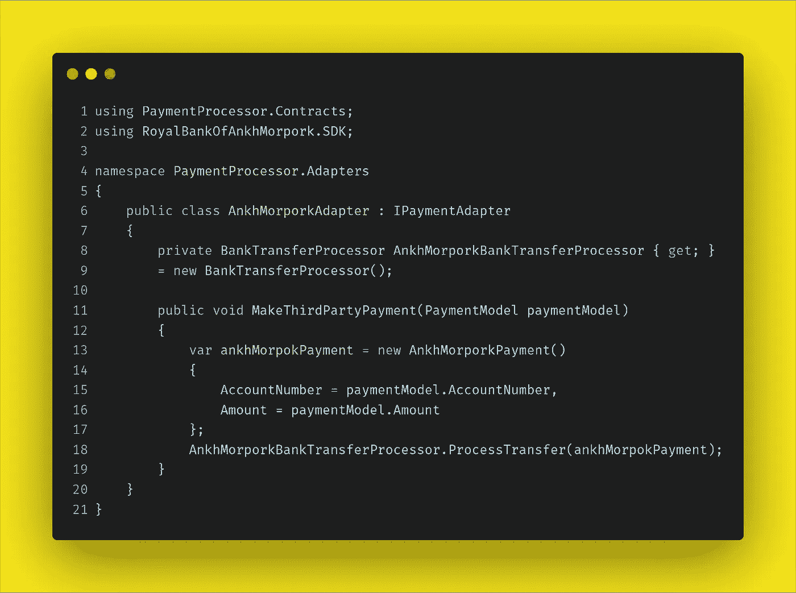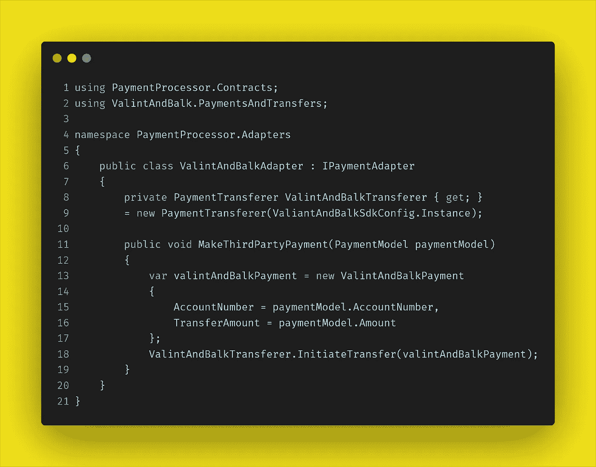

太好了。我们现在已经抽象出了每个 SDK 的功能，以及它们的实例化，并提供了一个公共接口。任务完成了吗？喝茶的时间到了吗？不太不幸。

还记得我们的处理器类吗？它依赖于三个 SDK。我们*现在可以*只注入我们的三个适配器。这肯定是一种改进——我们至少可以为它们提供模拟，并编写一些单元测试——但是我们仍然会面临 switch 语句和为每个适配器添加新依赖项的维护需求。

让我们现在就处理这两个问题，然后再开水壶。

我们将创建一个工厂，它将根据传递给处理器的 *MakePayment* 方法的 *Bank* 值来解析我们需要的适配器类型。我们还将为工厂创建一个接口。这些显示如下:

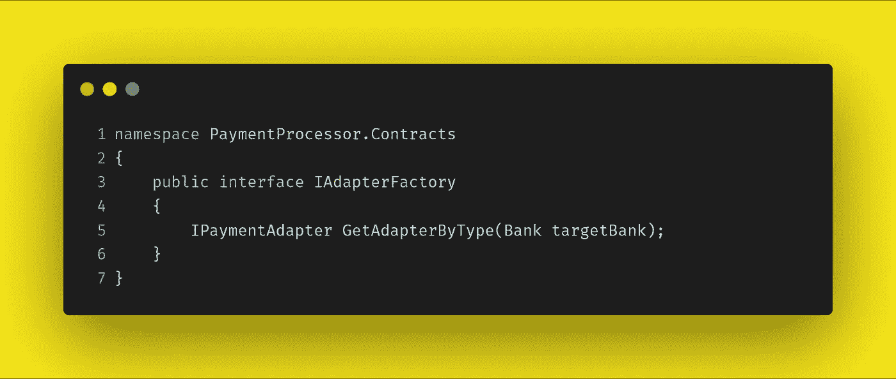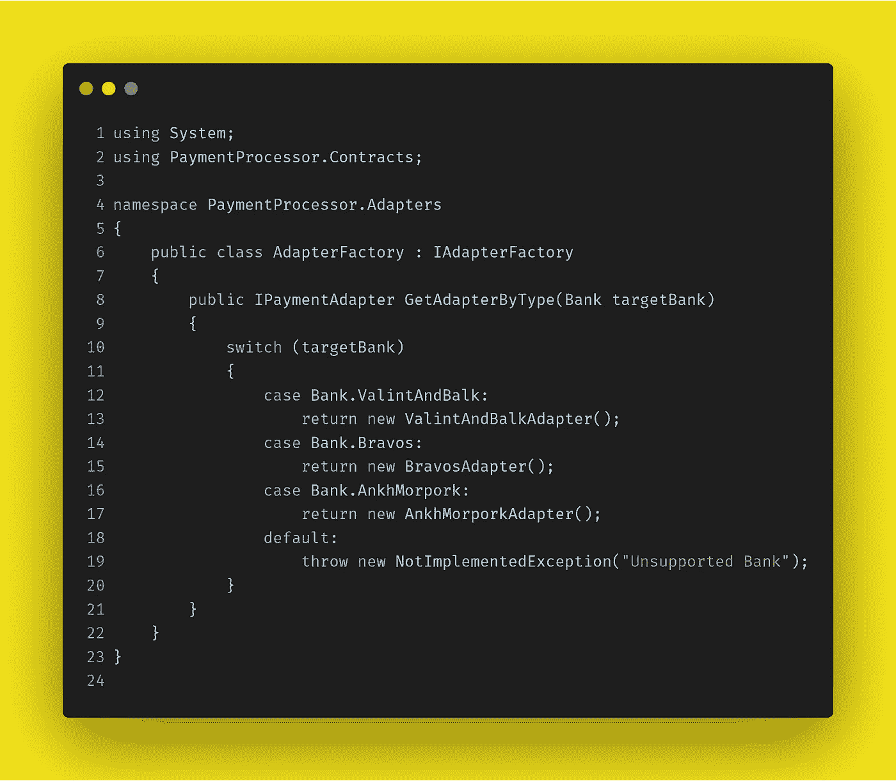

在工厂的 *GetAdapterByType* 方法中，我们从*处理器*类中得到一个非常精简的 switch 语句版本。由于封装了 SDK 类的创建和功能，我们不需要在每个条件块中瞎忙。这**可读性更强，而且因为我们的 case 块又细又好，更容易维护。**

请注意，有许多方法可以剥这只特殊的猫的皮。我选择使用 switch 语句实现工厂，因为这是最快、最清晰的演示方式。这种方法通常适用——不管具体实现如何，工厂都提供了一个薄层来解析适配器实例。

我们现在准备把这一切放在一起。让我们重构一下*处理器*类。

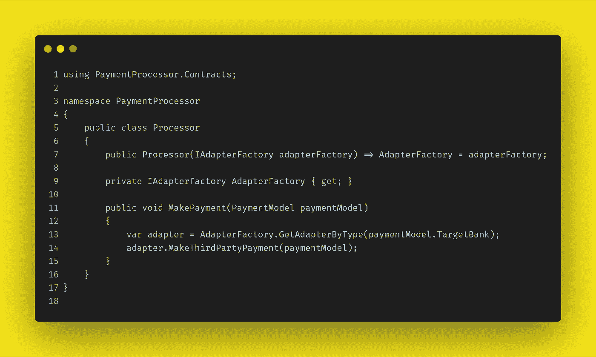

哇哦。负载清洁器。我们注入一个单一的依赖项(可以被模仿),而 *MakePayment* 方法只剩下两行代码——我们从 30 行代码开始。

# 结论

我们选择了一个混乱的、不可维护的、不可单元测试的类，并创建了一些不属于这些东西的东西。使用适配器模式，我们已经解决了前面强调的三个问题:

*   令人头疼的维护问题是 switch 语句
*   围绕依赖项硬编码的可维护性和可扩展性问题
*   缺乏依赖注入

一个听起来合理的批评可能是，我们所做的只是将所有这些问题转移到*适配器工厂*和各个适配器中，而我们并没有真正解决任何问题，只是将问题掩盖在抽象的地毯下。

这听起来很合理，但这不是对这种方法的有效批评。

以这种方式使用工厂是一条很好的途径(不管工厂是如何实现的),您和将来查看您的代码的开发人员都会很熟悉。

单个适配器本身只负责单个外部库，任何更改都局限于单个类。

现在，该喝杯茶了。