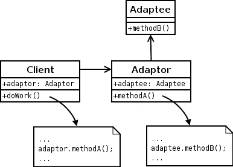

# Go 中的适配器模式

> 原文：<https://levelup.gitconnected.com/the-adapter-pattern-in-go-b400fdf6ff0a>

用同一枚火箭部署不同类型的卫星！


来自[太空新闻](https://spacenews.com/ariane-5-in-75th-straight-success-conducts-its-first-launch-of-europes-galileo-satellites/)

T 适配器模式是一种灵活的结构设计模式，允许您连接两个具有不同接口的对象。一个简单的例子是三脚墙壁插座到两脚墙壁插座的适配器。这种模式设计简单，但应用功能强大，因为它允许曾经不兼容的对象现在相互交互。

本文将由三个主要部分组成——我们将首先研究中介模式的真实用例。然后，我们将理解它的 UML 图，最后将我们的知识应用于 Go 中的一个实现，其中我们通过利用卫星适配器，用同一枚火箭发射不同类型的卫星。

三…二…一…点火！

# 真实世界的例子

适配器模式是我的最爱之一。当你有两个非常不同的对象或类而不能直接相互交互时，它经常被追溯使用。然后，您将创建一个适配器来允许它们彼此兼容。适配器模式的主要目标是将一个接口转换成另一个接口，以便它符合客户机的期望，而不改变客户机代码。

这与中介模式不同，因为适配器模式是为两个对象相互交互而构建的，而不是作为许多对象的中心通信源。关键的定义是适配器模式提供兼容性，而中介模式提供通信并避免紧密耦合。

适配器模式的几个例子包括:

*   **电源插座** —英国电源插座到美国，美国电源插座到欧洲甚至澳洲！世界各地的电源插座有各种不同的形状和大小，所以如果你要去旅行，你应该考虑带上一些适配器。
*   **数据转换** —假设您有一个将结果输出为 XML 格式的数据处理应用程序。如果需要不同的数据格式，比如 JSON，可以创建一个适配器，将 XML 数据转换成 JSON。
*   **单位转换** —一个正在运行的应用程序可能位于美国，并使用禁用的*英制标准*来记录您的统计数据。如果您想将市场扩展到欧洲，您可能想编写一个适配器类，它可以打开并将所有英制单位转换为公制单位。
*   **SDK 包装器** —如果您正在尝试使用旧的软件开发套件(SDK)，您可以添加一个适配器(也称为包装器)来标准化 SDK 以适应您的配件。

# UML 图

除了单例模式，适配器模式有一个最简单的 UML 图。回想一下，Go 没有类，所以我们将引用 UML *对象图*而不是类图。

假设我们有一些想要执行一些`methodB()`的`Client`代码，但是它只定义了一个`methodA()`的行为(这就像想要将一个三脚插座插入一个两脚插座)。为了执行`methodB()`,`Client`*拥有*一个`Adaptor`对象，该对象将实现`methodA()`的客户端接口。



来自[维基百科](https://upload.wikimedia.org/wikipedia/commons/d/d7/ObjectAdapter.png)

然而，`Adaptor`将实现*将* `methodA()`转换为`methodB()`的逻辑，而不是*应用* `methodA()`。`Adaptor` *有一个* `Adaptee`来应用这个翻译。真的就是这么回事！

# Go 中的实现

让我们让事情变得有趣一点，想象我们拥有自己的可重复使用的 SpaceX 火箭，能够将卫星部署到太空(我相信埃隆会给我们一个)。现在，SpaceX 外包了许多不同类型的卫星(以及他们自己的 Starlink 卫星)。

为了对所有这些不同类型的卫星使用相同的火箭，他们可能使用某种形式的适配器技术，允许另一家公司的卫星连接到他们的火箭。这省去了为每种类型的卫星制造单独火箭的费用，也是 SpaceX 如此改变游戏规则的部分原因。

注意:这里会有一些卫星术语，但我保证它不会偏离适配器的要点！

我跑题了，还是编码吧！首先是我们的项目结构..

```
$ mkdir adapter-pattern-go
$ cd adapter-pattern-go
$ touch main.go rocket.go satellites.go satelliteAdapter.go
```

## 火箭，走

好吧，让我们先做一个火箭。SpaceX 使用猎鹰 9 号火箭发射他们的 Starlink 卫星。因此，猎鹰 9 号火箭将作为我们的`Client`使用，它有办法将卫星插入 Starlink 端口。

我们也有一个有效载荷，它将接受一个通用类型，这是我在试图给火箭添加不同类型的卫星时学到的一个漂亮的小窍门。使用`[]interface{}`就像一个可以接受任何类型的切片，所以您可以自行决定是否使用！

## 卫星，开始

我们的`falcon9Rocket`将部署不同类型的卫星。它期待一颗 Starlink 卫星，但 SpaceX 公司承包了许多不同类型的卫星部署到轨道上！第一步是在第 5 行创建我们的`satellite interface`。同样，作为 SpaceX，我们希望将卫星插入 Starlink 端口。我们定义方法`insertSatelliteIntoStarlinkPort()`来接受对一个`falcon9Rocket`的引用，因为我们将添加到它的`payload`。

接下来的代码块是标准的，我们创建了一个`starlinkSatellite`卫星和一个`oco2`卫星(代表轨道碳观测站-2)。然后我们在第 16–25 行创建 Go 版本的构造函数(也称为简单的工厂)。

最后，我们通过在第 27 行接受对`starlinkSatellite`的引用来实现`insertSatelliteIntoStarlinkPort()`方法。我们还接受一个`falcon9Rocket`作为我们的参数，这样我们也可以将一个`starlinkSatellite`附加到`payload`上。这是一个我认为 Go 在接口实现上非常干净的领域。

注意`oco2Satellite`如何拥有自己的*独立功能*来插入卫星。更糟糕的是，它需要一个 OCO2 端口(实际上不是，为了举例，它只是有一个与 Starlink satellite 不同的函数签名/名称)。

当我们期待从我们的猎鹰 9 号火箭发射 Starlink 端口时，我们如何插入 OCO2 卫星？当然是带卫星适配器的！

## satelliteAdapter.go

我们的`oco2SatelliteAdapter`是接受引用`oco2Satelite`作为我们的`Adaptee`的`Adaptor`。从那里，当我们从适配器调用`insertSatelliteIntoStarlinkPort()`*时，我们实际上进行转换并调用方法来将卫星插入 OCO2 端口。*

*如果这有点模糊，看看我们是如何将这三个包编排在一起的。*

## *main.go*

*这是我们把一切联系在一起的地方。首先我们实例化我们的`falcon9Rocket`并打印出它的`payload`来验证它是空的。然后我们也实例化我们的卫星。*

*我们可以立即将一个`starlinkSatellite`插入到我们的`falcon9Rocket`中，没有任何问题。请注意，我们不能用`oco2Satellite`做同样的事情！*

*这就是`oco2SatelliteAdapter`发挥作用的地方。我们创建一个接受`oco2Satellite`的新适配器。参考前面在`satelliteAdapter.go`中的逻辑，我们做了修改，这样在第 22 行我们可以在一个`oco2SatelliteAdapter`上调用`insertSatelliteIntoStarlinkPort`。我们的适配器工作正常！*

*我们还得到火箭有效载荷，以验证我们已经增加了两个火箭发射。如果我们使用命令`go run *.go`运行这个程序，我们将得到:*

```
*Falcon 9 payload: []
Attaching satellite to Falcon 9 Rocket.
Starlink satellite is attached to Falcon 9 Rocket.
Attaching satellite to Falcon 9 Rocket.
Satellite adapter converts Starlink port to OCO2 port.
OCO2 satellite is attached to Falcon 9 Rocket.
Falcon 9 payload: [%!s(*main.starlinkSatellite=&{Starlink Satellite}) %!s(*main.oco2Satellite=&{OCO2 Satellite})]*
```

*嘣！您现在知道了如何在 go 中利用适配器模式。*

*我希望你喜欢这篇文章。有很多方法可以扩展这个例子，比如添加工厂模式来动态创建卫星、火箭和适配器，以满足您的空间探索需求。如果你看到任何你喜欢的东西或者任何你想了解更多信息的部分，请在下面留下评论！感谢阅读。*