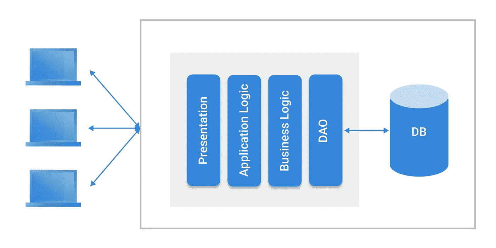
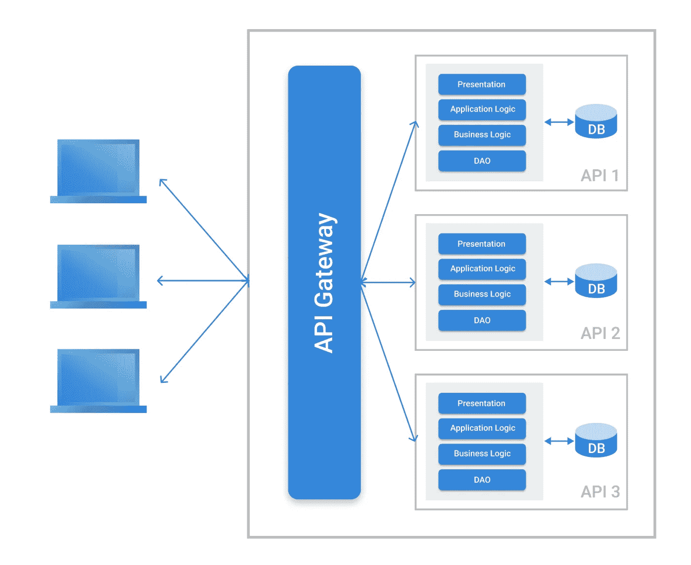
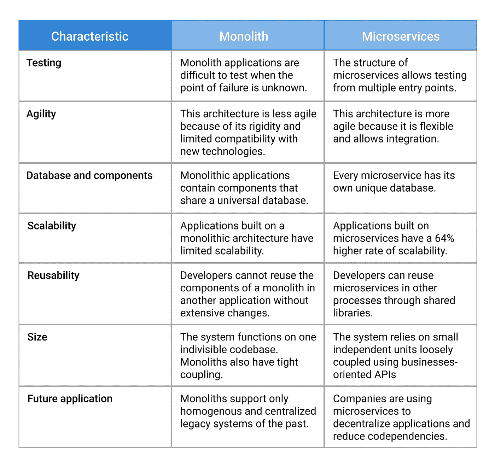

# 微服务相对于整体架构的优势

> 原文：<https://levelup.gitconnected.com/the-advantages-of-microservices-vs-monolithic-architectures-94ce25ae3fd>

随着亚马逊和谷歌等公司转向微服务，关于单片和微服务架构的辩论最近越来越激烈。虽然讨论的一方更喜欢单片应用程序的稳定性，但另一方更喜欢微服务提供的灵活性。

这就提出了一个问题:开发者应该使用单片架构还是将他们的应用拆分成微服务？

在本文中，我们将探讨单片和微服务应用的定义和工作原理。继续阅读，找出使用这两种软件开发模型的利弊。

# 什么是整体架构？

当您在相互依赖的组件的单层上构建应用程序时，这种体系结构被称为整体式体系结构。

顾名思义,“单片”架构由不可分割的单元组成，这些单元耦合在一起处理应用程序中的不同操作。

# 整体架构的核心工作原理

在其核心，一个单体架构包括[用户界面](https://intexsoft.com/blog/design-for-emotions-experiences-interfaces/)，一个服务器端应用，和一个数据库([本地托管或基于云的](https://intexsoft.com/blog/cloud-vs-on-premise-servers-which-is-best-for-your-data/))。

1.  用户界面包含客户端或用户可以看到的 HTML、CSS 和 Javascript 代码。
2.  服务器端应用程序执行后端操作，如处理 HTTP 请求和从数据库中检索信息。
3.  数据库存储、接收和处理所有传入和传出的数据。

整体架构缺乏[模块化](https://www.javatpoint.com/what-is-modular-programming)，因为你不能将组件解耦成独立的部分。

# 单片架构的优势

# 易于开发

大多数开发人员和工程师更喜欢整体架构，因为这是构建软件程序的传统方式——整个应用程序使用单一的代码库。

# 易于调试

由于您正在使用单个代码库，调试过程变得更加线性和简单。测试人员还可以在应用程序的整个架构中运行端到端的测试服务。

# 无需部署

单片应用程序易于使用，因为您只需要部署一个文件或目录。此外，模块化的缺乏使您可以专注于单一的集中式生态系统。

# 适合小型项目

当在一个小项目上工作时，比如说[一个最小可行的产品或者概念验证](https://intexsoft.com/blog/ways-to-validate-your-app-idea-poc-prototype-mvp/)，你可以为应用程序使用一个整体架构。通过这样做，您将节省成本并及时交付 MVP。

# 适应严格的项目

如果您想构建一个不需要伸缩的应用程序，单片软件架构可以解决您的问题。

# 较少的网络问题

虽然可能会出现网络延迟等问题，但它们不像微服务那样频繁。

# 整体架构的缺点

# 逐渐退化

由于不断添加新组件，单芯片架构会随着时间的推移而逐渐退化。最终，应用程序恶化到需要更长时间来处理请求的状态。

# 要求理解

随着代码库的增长，架构变得更加复杂难以理解。例如，开始一个新项目的新开发人员将很难理解整个代码库的变化——即使有严密的文档。

# 难以扩展

单一应用程序由于其刚性而存在可伸缩性问题，这对于寻求增长和扩展其服务的公司来说是一个大问题。

# 难以维护

尽管大多数单片应用程序都是从简单的单元开始的，但是体系结构会随着时间的推移而变得越来越复杂。因此，任何修复工作都需要大量的时间和资源投入。

# 难以升级

整体式应用程序的升级具有挑战性。首先，你需要找到要更新的模块；然后，您必须实现创造性的方法来集成新的服务，而不破坏整个应用程序。在做出更改后——无论多么微小——您必须重新部署整个应用程序。

# 易受软件漏洞的影响

由于整体软件通常只有一个故障点，任何错误或恶意软件攻击都可能使整个系统崩溃。即使有严格的测试，有经验的 QA 专家也可能很难找到这个软件故障的根源。

# 什么是微服务？

如果您的应用程序包含多个独立的单元，这就是微服务架构模型。微服务执行由每个组件的独特数据库控制的特定功能。

# 微服务架构的核心工作原理

当一个应用被分成微服务时，独立的单元执行独特的功能。每个单元都包含彼此独立的服务器和数据库，因此可以在其他流程中重用。

最重要的是，微服务架构依赖于[面向业务的 API](https://experienceleague.adobe.com/docs/campaign-classic/using/configuring-campaign-classic/api/business-oriented-apis.html?lang=en)，这些 API 将所有东西组合成一个内聚的应用。这使它们比整体架构具有更高的模块化水平。

# 微服务的优势

# 独立的、可重用的组件

微服务架构的所有组件都是独立的，允许您在其他应用程序中重新部署它们，而不会影响其他单元。

# 易于调试

由于每个微服务单元都是一个独立的实体，开发人员和工程师可以很容易地发现应用程序中的缺陷，并迅速修复它们。他们还可以跨多个单元进行全面测试，或者查明问题所在。

# 易于扩展

由于每个微服务都独立运行，您可以选择组件进行扩展或保持原样。该属性为您的应用程序提供了更多的灵活性，并使其具有可伸缩性。

# 易于理解

如果你对架构有基本的了解，微服务是很容易管理的。这种清晰性有助于开发人员和测试人员更快地发现问题，并解释实现解决方案的方法。

# 高度敏捷

任何使用微服务的应用都是敏捷的。对一个微服务进行更改可以让您在不中断其他组件的情况下重新部署它。此外，您可以轻松地添加和测试新技术。

# 微服务的缺点

# 太复杂了

随着系统的扩展，微服务架构需要更多的组件，这使得管理更加困难。您还必须独立部署每个服务(微服务)。

# 要求测试

当应用程序出现故障时，在某些情况下，诊断问题和调试代码可能是一个巨大的挑战。例如，如果系统分布在多个复杂的微服务中，测试人员可能无法找到简单的修复方法，通常需要单独调试每个单元来查明问题的根源。

# 维护费用昂贵

由于每个微服务都需要单独的服务器和数据库来运行特定的操作，因此随着单元数量的增加，成本也会增加。此外，您可能需要为特定的微服务雇用工程师，这增加了总体维护成本。

# 易受安全问题的影响

分布式系统中多个单元的存在在微服务架构中引入了各种故障点和漏洞。即使一个微服务受到影响，其他微服务也会继续运行。

# 软件开发过程中微服务和整体架构的区别

如今，大多数科技公司都在精益、瀑布或敏捷方法的基础上对他们的软件开发过程建模。有些公司还拥有专门用于软件开发的独特的 DevOps 方法。

但是由于 71%的公司使用敏捷模型，让我们探索一下它是如何适用于单片和微服务的。

# 哪种类型的架构更适合您的企业？

据[奥赖利](https://www.oreilly.com/radar/microservices-adoption-in-2020/)称，61%的公司在过去五年中实施了微服务，有 55%的“完全成功”率。此外，来自 [DZone](https://codeandpepper.com/companies-using-microservices/) 的数据显示，73%的公司认为微服务将成为构建下一代软件应用不可或缺的工具。

随着优步、网飞、亚马逊和 Spotify 等公司转向微服务，众所周知，钟摆正在朝着微服务架构的方向摆动。

此外，微服务允许您在考虑失败的情况下构建应用程序。通过考虑可能的停机和维护，您可以更好地控制未来前所未有的缺点。

但这并不意味着巨石柱的绝对末日。开发人员仍然可以使用单一架构来构建不需要更新的轻量级应用程序，例如计算器应用程序。

此外，拥有小团队的公司——从事简单项目或创建概念验证——可以构建整体应用程序。这种架构提供了更好的性能，因为共享内存访问比进程间通信更快。

最重要的是，工程师和开发人员已经在探索将单片和微服务结合到[模块化单片](https://www.kamilgrzybek.com/design/modular-monolith-primer/)中的想法，这是一种混合模块，其中的代码支持单个应用程序，并在不同领域之间强制执行严格的边界。

[Shopify 的](https://shopify.engineering/deconstructing-monolith-designing-software-maximizes-developer-productivity)使用模块化整体结构显示出以下领域的前景:

*   改进的可扩展性
*   复杂性降低(与微服务和传统整体式服务器相比)
*   降低成本
*   [严格绑定依赖关系](https://medium.com/@dan_manges/the-modular-monolith-rails-architecture-fb1023826fc4)
*   更好的代码组织

# 结论

在单片和微服务之间进行选择应该遵循解决特定软件开发问题的系统方法，而不是简单地跟随趋势。尽管科技巨头正在采用微服务，但你的公司或初创公司可能不会从采用这种架构中受益。

咨询您的工程师和开发人员，为您的开发过程确定最佳的行动方案。最重要的是，开始致力于模块化整体架构，以获得两个世界的最佳效果。