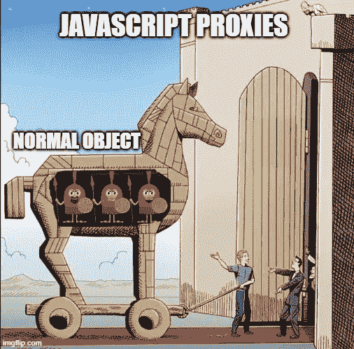
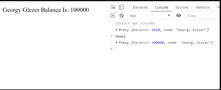

# JavaScript 代理的惊人力量

> 原文：<https://levelup.gitconnected.com/the-amazing-power-of-javascript-proxies-aa27c6d06bcb>

今天我们将学习 ECMAScript 6 **代理**。我们将在本文中讨论以下主题:

*   什么是代理
*   代理诉讼
*   谁使用代理
*   使用案例和示例
*   资源

我们开始吧:)

# 什么是代理

如 [MDN](https://developer.mozilla.org/en-US/docs/Web/JavaScript/Reference/Global_Objects/Proxy) 网站所述:

> `Proxy`对象使您能够为另一个对象创建一个代理，它可以截取并重新定义该对象的基本操作。

有点可笑的是，他们在解释什么是**代理**时说它创建了一个**代理**。当然，他们并没有错，但是我们可以简化这种说法，让它更友好一些:

> `*Proxy*`对象使您能够包装目标对象，通过这样做，我们可以截取并重新定义该对象的基本操作。

基本上，这意味着我们将获取一个对象，用一个**代理**包装它，这将允许我们创建一个“隐藏的”门，并控制对所需对象的所有访问。

一个小的旁注，**代理**也是一种软件设计模式，你一定要阅读它([维基百科链接](https://en.wikipedia.org/wiki/Proxy_pattern))。

## 一个`Proxy`由两个参数创建:

*   `target`:要包裹的原始对象(代理)
*   `handler`:一个对象，定义了哪些操作将被拦截，以及如何重新定义被拦截的操作，这些操作也可以称为“陷阱”。

大多数浏览器都支持代理，但是有几个旧的不支持(当然是 IE)，你可以在这里查看完整列表。谷歌有一个代理的聚合填充，但是它并不支持所有的代理特性。

现在我们知道了什么是**代理**，我们想看看我们能用它做什么。

# 代理诉讼

假设我们是一家银行或者一个焦虑的女朋友。我们想知道每次访问银行账户余额的时间，并在。我们将使用最简单的**处理程序**操作/陷阱: [**获取**](https://developer.mozilla.org/en-US/docs/Web/JavaScript/Reference/Global_Objects/Proxy/Proxy/get)

在上面的例子中，我们有一个银行帐户对象，其中包含我的名字和余额 2020。

这次 handler 对象正在实现 **get** 操作/trap，它接收一个有 3 个参数的函数和 **get** 的返回值:

*   **目标**:正在被访问的对象(我们包装的对象)。
*   **prop** :在我们的例子中被访问的属性——这里是“balance”。
*   **接收者**:代理或者从代理继承的对象。

我们定义了一个条件，如果被访问的属性是“*balance”*，我们将通知(记录)余额和当前用户名，并返回属性*“balance”*。

正如您在输出中看到的，一访问“balance”属性，我们就通过使用一个**代理**并设置一个 **get** 操作/陷阱来通知(记录)有关访问的信息。

让我们继续我们的银行想法，并要求每次有人从银行账户取钱时，我们都要得到通知。另一个限制是银行不允许负结余。为此我们这次将使用 [**设置**](https://developer.mozilla.org/en-US/docs/Web/JavaScript/Reference/Global_Objects/Proxy/Proxy/set) 处理程序/陷阱。

在上面的例子中，我们通知了当前余额和取款后的新余额，我们还通知了新余额是否为负并中止了取款操作。

我们正在使用 **set** operator/trap，它是一个函数，如果更新操作成功与否，它将返回一个布尔值(真/假)。它接收以下参数:

*   **目标**:正在被访问的对象(我们包装的对象)。
*   **prop** :在我们的例子中，被访问的属性是“balance”
*   **值**:应该更新的新值。
*   **接收者**:最初分配的对象。这通常是代理本身。但是也可以通过原型链或其他各种方式间接调用`set()`处理程序。

你可以看到它和 **get** 真的很像，只是多接收了 1 个新值的参数。

这两个操作符/陷阱是最常见的，如果你有兴趣找到所有现存的操作符/陷阱，你可以在这里查看。

# 谁使用代理

许多流行的库使用这种技术，例如:

*   [MobX](https://github.com/mobxjs/mobx)
*   [Vue](https://github.com/vuejs/vue)
*   [Immer](https://github.com/immerjs/immer)

还有更多……他们中的大多数利用了代理给我们的惊人的力量，为我们提供了令人敬畏的库。

# 使用案例和示例

我们已经看到，我们可以将代理用于:

*   记录(通知银行)
*   验证(阻止负余额更新)

## 贮藏

我们将再次使用 **get** 操作符/陷阱，并将属性“美元”赋予我们的对象。在每次访问“美元”资产时，我们都要计算我们的余额值多少美元。因为计算可能是一个繁重的操作，我们希望尽可能多地缓存它。

正如您在示例中看到的，我们有一个缓存对象，它保存当前的银行余额和美元余额。每次有人访问"*美金"*属性我们都会进行第一次计算，然后缓存。

## Dom 操作

每当我们的余额发生变化时，我们都希望更新屏幕上的文本。我们将使用一个 **set** 操作符/陷阱，在每次值改变时，我们将更新屏幕上的 DOM 元素。

这里我们创建了一个助手函数，这样我们就可以存储 DOM 元素 ID，并在 set 操作符/trap 中添加了一行简单的代码来更新 DOM 元素。很简单，对吧？且看结果:)

# 摘要

总之，我们了解了 ECMAScript 6 代理，我们如何使用它们，以及用于什么目的。在我看来，代理是一个神奇的工具，你可以用它来做各种各样的选择，你只需要想想什么最适合你:)

如果你喜欢这篇文章，请随意关注并鼓掌👏

# 资源

*   [MDN 代理](https://developer.mozilla.org/en-US/docs/Web/JavaScript/Reference/Global_Objects/Proxy)
*   [“代理棒极了”Brendan Eich 在 JSConf 上的演讲](https://www.youtube.com/watch?v=sClk6aB_CPk)
*   [代理设计模式](https://en.wikipedia.org/wiki/Proxy_pattern)

# 分级编码

感谢您成为我们社区的一员！ [**订阅我们的 YouTube 频道**](https://www.youtube.com/channel/UC3v9kBR_ab4UHXXdknz8Fbg?sub_confirmation=1) 或者加入 [**Skilled.dev 编码面试课程**](https://skilled.dev/) 。

 [## 编写面试问题

### 掌握编码面试的过程

技术开发](https://skilled.dev)