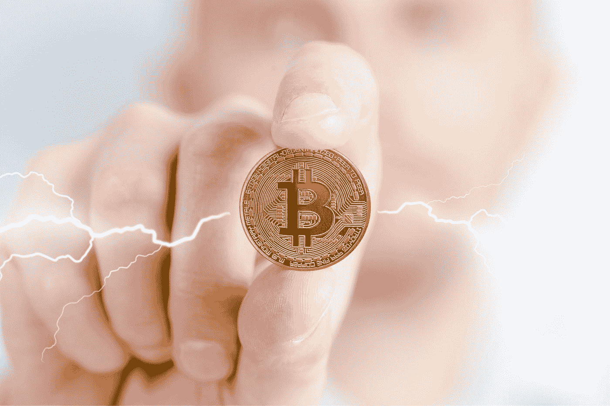

# 作为货币策略的一部分，美国城市正在尝试比特币挖矿

> 原文：<https://levelup.gitconnected.com/the-american-cities-that-are-experimenting-with-bitcoin-mining-as-part-of-their-monetary-strategy-23e44d388d97>

## 并且作为更有效地使用能源的一种手段

图片由[穆罕默德·哈桑](https://pixabay.com/users/mohamed_hassan-5229782/?utm_source=link-attribution&utm_medium=referral&utm_campaign=image&utm_content=6005122)拍摄，来自[皮克斯拜](https://pixabay.com/?utm_source=link-attribution&utm_medium=referral&utm_campaign=image&utm_content=6005122)

T 政治家可以通过许多方式赢得民众的好感——勇敢果断的领导力、同理心、同情心以及乐观积极的态度都是关键的品质。田纳西州杰克逊市市长斯科特·康格(Scott Conger)在比特币问题上采取了大胆的立场，展示了其中的许多方面。

联邦政府在决定其对比特币的立场时继续摇摆不定。珍妮特·耶伦(Janet Yellen)、杰罗姆·鲍威尔(Jerome Powell)和拜登政府中担任重要职务的其他人一再被虚张声势和花言巧语分散注意力，求助于同样令人厌倦的标题声明——这是犯罪的[工具](/cryptocurrency-is-not-just-a-tool-for-criminality-6996c949c42)、[等待发生的环境灾难](/is-bitcoin-an-environmental-disaster-waiting-to-happen-d770e4bea5e9)或者只是因为它太不稳定，不能用作投资资产或货币。

与此同时，美国各地的政治领导人，包括肯塔基州、佛罗里达州、怀俄明州以及现在的田纳西州的领导人，对领导力缺乏耐心，他们看到了比特币提供的可能性——不仅是加强资产负债表的一种手段，也是鼓励经济增长和稳定的一种手段。

4 月 21 日，康格在推特上清楚地表达了他的意图，然后修改了他的个人资料图片，加入了比特币粉丝在网上喜欢的习惯性的“[激光眼](https://www.forbes.com/sites/joewalsh/2021/02/19/heres-why-2-members-of-congress-have-laser-beam-eyes-on-twitter/?sh=af73967293b2)”:

来源:[推特](https://twitter.com/MayorConger/status/1384691758936825857?s=20)

# 这对田纳西州意味着什么？

康格是杰克逊的第三代市长，他采取了与迈阿密市长弗朗西斯·苏亚雷斯相似的立场——苏亚雷斯也一直乐观地宣布他的城市对比特币友好。这些有远见的市长们看到了比特币带来的无数机遇。他们打算把它作为一种可选的设施提供给他们的雇员，作为支付账单、税收和服务的一种手段。最后，他们像许多私人公民和上市公司一样，将其视为一种投资工具，用以保护他们的金融稳定和对冲通货膨胀。

考虑到美联储在新冠肺炎事件后为了刺激疲软的经济而不断印刷额外的美元，对国债的保护作为一个用例尤为重要。由此产生的通货膨胀和收回这笔钱的迫切需要(包括拜登的[新资本收益税](https://www.bloomberg.com/news/articles/2021-04-22/biden-to-propose-capital-gains-tax-as-high-as-43-4-for-wealthy)等手段)无疑将在未来几年对整个国家产生财政影响。公民会感到手头拮据，但地方政府也会如此。

受到创收前景和减少对联邦政府领导的依赖的推动，特别有趣的是，像[迈阿密](https://dailyhodl.com/2021/03/30/miami-mayor-pushing-to-make-his-city-a-bitcoin-mining-hub-for-national-security/)和现在杰克森这样的市政府正在将自己定位为比特币挖掘中心。

# 比特币挖矿造福城市

比特币挖矿是创造新比特币的过程。采矿还提供了基础设施，在一定程度上支持全球分散的计算机网络，这是比特币本身的生命线。

矿商将高规格的计算机处理能力用于维护比特币账本的副本——整个网络中使用比特币完成的所有权和交易的不可辩驳的相同副本。挖掘节点还承担着解决复杂计算的任务，竞争成为最快解决散列算法的节点。这些活动的回报是以新铸造的比特币支付给矿工(每个最快解决哈希问题的矿工)，以及维护账本的交易费分成。

对于像杰克逊和迈阿密这样正在考虑运营比特币采矿业务的城市来说，机会似乎很诱人——专用计算能力可以由它们集中负责地管理，作为为城市创收的一种手段。这项活动让他们在比特币网络中拥有股份，增强了他们的金融稳定性，并建立了一部分以比特币持有的国库——这种资产在 2021 年每枚比特币的价值已经攀升了 29，000 美元。

肯塔基州采取了一种略有不同的方法——他们的州长已经签署了一项比特币采矿[激励法案，使之成为法律](https://www.nasdaq.com/articles/kentucky-governor-signs-bitcoin-mining-incentive-bill-into-law-2021-03-26)，为采矿公司提供优惠的能源税，希望将它们吸引到该州。

采矿的成本(除了硬件成本)来自其能源使用——比特币的这一方面受到了最多的批评。[这种能源使用也是比特币最被广泛曲解](/is-bitcoin-an-environmental-disaster-waiting-to-happen-d770e4bea5e9)、误解和错误引用的“效果”之一。聪明的尼克·卡特在回应《纽约时报》一篇令人惋惜的文章时发了一条推文，很好地洞察了理解比特币的人对那些以环境为由批评比特币的人的感受:

来源:[推特](https://twitter.com/nic__carter/status/1382633356001738755?s=20)

虽然能源成本可能被认为很高，特别是对那些不了解其好处的人来说，但比特币采矿实际上可以通过一些方式实现对清洁能源的更有效使用。在某些情况下，它甚至可以通过平滑供求关系的波动来避免采矿造成的能源浪费。

# 比特币作为一种积极的环保力量

比特币挖矿操作不一定要位于人口中心附近，必要时可以通过卫星连接到网络。因此，采矿企业可以位于可再生和清洁能源的附近，否则由于能源在发电和使用之间需要运输的距离，这些能源作为能源是不可行的。

根据 Coinshares 报道的这项研究，全球许多比特币开采业务已经使用绿色和可再生能源——约占所有能源使用量的 74%。一半的比特币开采在中国四川地区进行，而[那里 95%的电力来自水力发电](https://moneyweek.com/investments/alternative-finance/bitcoin/602678/bitcoin-energy-consumption)。虽然比特币作为一个单一实体使用的能源无疑很高(一些比较将其等同于面积相当于阿根廷的国家[)，但出于道德和经济原因，矿工们通常会尽可能多地使用可再生能源。](https://www.bbc.co.uk/news/technology-56012952)

根据能源的可用性灵活地迁移和扩大规模，使得中国的一些采矿作业在一年中的特定时间[搬迁](https://blog.bitmex.com/mining-incentives-part-2-why-is-china-dominant-in-bitcoin-mining/)，在潮湿天气时在不同地点之间迁移，增加了可用性，降低了水电成本。这提供了进一步的经济效率。

图片来自 [Pixabay](https://pixabay.com/?utm_source=link-attribution&utm_medium=referral&utm_campaign=image&utm_content=3080552) 的 [WorldSpectrum](https://pixabay.com/users/worldspectrum-7691421/?utm_source=link-attribution&utm_medium=referral&utm_campaign=image&utm_content=3080552)

# 比特币挖矿实现了可变供给的高效利用

由于采矿作业可以很容易地建立和重新定位，它们也是充分利用可变电源的好方法。发电，特别是来自可再生能源的发电可能会有所不同，并不总是符合现有的需求。电力在某些时候是充足的，但并不总是需要的，所以就浪费了，因为它不能被储存或重新分配。相反，在其他需求较高的时候，不增加成本并转嫁到最终消费者身上，生产就不可能一直扩大。

为了克服这一点，比特币采矿业务可以通过改变这种能源的使用方式来运行——在供应有限的时候，矿工们只是暂时缩小他们的运营规模。当供应充足时，矿商很乐意加快开采速度，并利用否则会浪费掉的能源。

这种使用是通过矿工和供应商之间的能源合同来强制执行的——在西德克萨斯的所谓的 HODL 牧场已经实施了一项计划。

# 比特币采矿降低碳成本

比特币的能源优势甚至超过了使用更清洁的能源。在某些情况下，比特币采矿实际上已经被证明是 T2 减少排放和降低石油开采碳成本的一种手段。

通常情况下，油矿会“燃烧”石油开采过程中产生的副产品——多余的干气，并在现场燃烧。当比特币矿场位于油井附近时，这种污染活动以及甲烷气体直接排放到环境中的情况可以避免。原本[要燃烧的天然气被用来产生能量](https://coinshares.com/research/closer-look-environmental-impact-of-bitcoin-mining)为采矿设备提供动力，避免了浪费和污染。

俄罗斯石油天然气公司 Gazprom 最近宣布在西西伯利亚成功试运营了这一项目。

# 田纳西州的比特币开采

鉴于田纳西州大约八分之一的能源来自水力发电，杰克逊的采矿业务有机会主要通过清洁能源获得动力。在供应充足且成本较低的情况下，根据可负担得起的可再生能源的可用性灵活扩展采矿业务的前景，将是该市获取清洁电力的一种有效方式。这将使他们的采矿业务更有利可图，在财政上有利于城市。

此外，对比特币采取积极的态度，并寻求从中受益的方式，而不是像联邦政府那样怀疑和愤世嫉俗地对待它，似乎是一个有远见的举动。这意味着这座城市可以将自己定位为比特币的全国领导者，就像迈阿密等城市以及肯塔基州和怀俄明州所做的那样。

大胆而有远见的行动当然会带来风险，尤其是对政治家来说——他们的决定可能会招致批评和支持。在这种情况下，Scott Conger 似乎采取了一个大胆但可能有回报的步骤，这可能会给杰克逊市带来巨大的好处，如果清洁能源可以用来为其采矿业务提供动力，也会给环境带来好处。

如果你喜欢阅读这样的故事，并且愿意支持 Medium 上的作家，考虑注册成为 Medium 会员。一个月 5 美元，给你无限的故事。如果你注册使用我的链接，我会赚一小笔佣金。

 [## 阅读托比·黑兹伍德(以及媒体上成千上万的其他作家)的每一个故事

### 作为一个媒体会员，你的会员费的一部分会给你阅读的作家，你可以完全接触到每一个故事…

tobyhazlewood.medium.com](https://tobyhazlewood.medium.com/membership) 

注:*本文仅供参考。不应将其视为财务或法律建议。在做任何重大财务决定之前，先咨询财务专家。*

## [如果你喜欢这篇文章，我希望你能加入我的邮件列表。](http://bit.ly/TobyHazlewoodList)