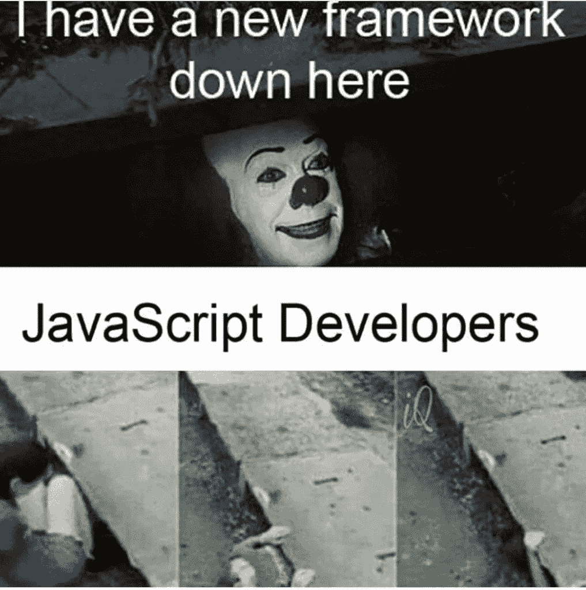

# 应用程序开发流程

> 原文：<https://levelup.gitconnected.com/the-app-development-process-5295a76a454>

## 第 1 部分——理念和规划

在 App Store 开发和发布我的第一个应用程序之前，我不知道这意味着什么。—这是一个谜。

现在，我已经开发并发布了几个应用程序，我注意到它们都遵循相同的模式。以下是我对开发和启动移动应用程序的了解。

在这一部分中，我们将介绍应用程序开发旅程的第一阶段，想法和计划。—这是任何应用程序的基础，不要忽略这些步骤非常重要，因为它们可能会在未来为您节省大量时间和精力。

# 这个想法

所以你有了一个想开发并与世界分享的应用程序的想法。太好了！现在，在投入大量时间之前，问问自己— *我为什么要开发这个应用程序？*

也许你想解决一个尚未解决的问题，或者你只是想开发一个有趣的应用程序。也许它会对你的简历有所帮助，或者你想和你的朋友分享。

不管是哪种情况，陈述一个清晰的目标**为什么你的申请应该存在** ，因为它会让你在整个过程中保持动力和专注。

动机不明的

如果你一开始就不知道为什么要开发应用程序，那么不完成应用程序的可能性会成倍增加。

有动机的

大胆梦想，保持动力！

> 关于验证你的想法还有另外一个话题，但是我们不在这个系列中讨论。我们正在经历开发和启动应用程序的过程。我强烈推荐阅读[妈妈考](https://www.momtestbook.com/)；一本关于验证你的想法避免偏见的书。

# **策划**

无论你做什么，不要跳过这一步。

## 定义 MVP(最小可行产品)

我们喜欢做梦，不幸的是，我们有时会想入非非。

只为你的应用定义**基本特性**！—不多也不少。

尽早做到这一点非常关键，因为我们往往会过于兴奋，甚至在发布第一个版本之前就不断添加新功能。—我们称之为[开发地狱](https://en.wikipedia.org/wiki/Development_hell)。

我们的目标是在最多 2 个月内完成整个过程。我犯了一个错误，把一个失败的创业公司的**应用程序开发过程**延长到一年半以上，请不要犯同样的错误。

我们可以随时**迭代**和**推送更新**，充分利用这一点！

您的应用程序的第一次迭代将远非完美，这没关系。

Henrik Kniberg 关于 MVP 的插图

> "如果你对你产品的第一个版本不感到尴尬，那你推出得太晚了."—雷德·霍夫曼

## 使用什么技术？

熟悉你将需要的技术是很重要的。试着将你的应用程序分解成核心组件:前端的**和后端的**。****

> **前端**

如果你想构建一个*原生应用*，你肯定会在 iOS 上使用 **Swift** ，在 Android 上使用 **Kotlin/Java** 。

如果你想构建一个 c *跨平台应用*，你将需要像 **React Native** 或 **Flutter** 这样的东西。

如果你想构建一个*混合应用*，你将会发现一大堆框架，我不想在本文中讨论。

> **后端**

你可以构建你自己的后端，然而，如果你的想法允许的话(MVP 肯定会这么做)，我会推荐你首先使用 **BaaS(后端即服务)**，比如 **Firebase** 或 **MongoDB Realm** 。创建你自己的后端可能会花费大量的时间、精力和金钱。您可以在以后构建它。

大多数 **BaaS** 遵循一个非常慷慨的**随用随付**模式，所以在最初的几个月你可能不用花一分钱。

Firebase Firestore 计费仪表板

## 团队

你现在应该对你的应用程序应该是什么样的，不应该是什么样的，以及开发它需要什么有一个很好的想法。

没有人比你更了解你的能力，所以决定你的角色是什么，你需要(或不需要)谁的帮助。

> **在团队中工作**

在团队中工作非常有利于互相称赞对方的技能。

也许你擅长**前端**开发，但不擅长**后端**，因此，与优秀的**后端**开发人员合作似乎是正确的选择。

也许你在用户界面设计方面很糟糕，所以和一个更艺术的人合作会有好处。

在团队中工作还能让你获得灵感，并从整体上获得对你的工作和产品的反馈。

在团队中工作时，你会不断得到反馈

> **单独工作**

也许你的应用程序不需要外界的帮助，可以完全由你自己开发。对您的应用程序拥有完全的所有权和信誉也是很棒的，然而，它也有其公平的挑战，因为您将需要戴上所有的帽子。

独自工作时，你要对所有的角色负责

无论哪种情况，每个决定都有自己的利弊，也许我会在以后的文章中讨论这个话题。

在下一部分，我们将介绍 **UI/UX 设计**，敬请关注！