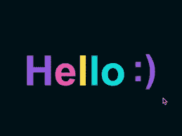
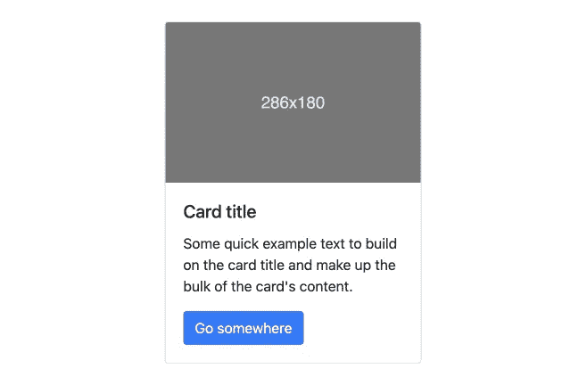
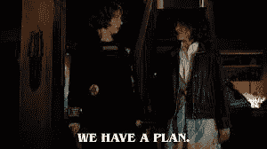
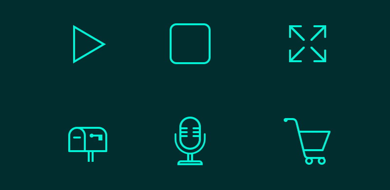

# 学徒(船)第 2 集

> 原文：<https://levelup.gitconnected.com/the-apprentice-ship-episode-2-f1a0f650d960>

在接下来的 4 周里，学徒们接触到了关于 HTML、CSS、SASS/SCSS 等方面的最佳实践。

## 第三周

涵盖的课程:

*   **标记**
*   **BEM 命名惯例**

本周致力于 HTML。我们从基础开始，创建了一个基本卡来保存一堆事件信息。我们有一些设计作为灵感，这张卡片的第一个版本只使用了语义 HTML。然后，我们上了一堂关于 [BEM 命名](https://sparkbox.com/foundry/bem_by_example)的课，不得不重构我们的卡片。学习 BEM 很有意思，也很有意义。我认为一旦我们到达那里，它将对 CSS 选择器有所帮助。

这是一个你可能在网站上找到的“卡”的例子，取自引导程序文档

我们要观察两次全体会议。一个是演示，一小组开发人员和设计人员展示了某些项目的进展。这是一种非常随意的方式，可以看到我们的客户团队在做什么。我们看到设计师展示他们的作品，开发者展示一些代码。一些项目正在进行，一些正在生产。学徒们还参加了一次“全团队月度更新”，会上领导层与我们谈论了我们正在进行的一些项目，即将到来的合同，任何团队更新(比如新员工)，甚至“问我任何问题”

我第一次与技术总监进行一对一的交流(我认为他们有点像工程经理)。除此之外，我每周还会和我的导师进行 1:1 的谈话，以及和全职开发人员进行 1:1 的谈话。这个人大约 6 年前也参加了学徒计划，这给了我很大的希望！这整个过程让我变得更加自信，同时也变得不那么自信了。我将每周会见四位技术总监中的一位，这样他们可以跟踪我们的进展，坦率地说，可以更好地了解我们。让我们现实一点:在考虑全职职位的时候，他们的声音在学徒期结束时会很重要。

## 第四周

涵盖的课程:

*   **CSS I (ITCSS)**
*   **可访问性介绍**

接下来的一周，我们再次重复这些事件卡。因为我们讨论了 [ITCSS 结构](https://www.xfive.co/blog/itcss-scalable-maintainable-css-architecture/)，我们可以开始给我们的事件卡添加样式。CSS 本身对我来说已经够简单了，但是要弄清楚哪些元素位于 ITCSS 组织的样式表中的什么位置，却花了我一点时间(这里的“组织”是正确的术语吗？).再说一次，ITCSS 的概念非常实用。通过组织你的 CSS，从最一般的(设置>工具>通用)，到更具体的(元素>对象/布局>组件>供应商>实用程序)，你是在用级联*工作，而不是不断地对抗它。我从未听说过这个，但它看起来非常聪明。*

Sparkbox 引以为豪的最大的事情之一是我们的可访问性意识。我们有相当多的 [IAAP 认证的](https://www.accessibilityassociation.org/s/)开发者，他们对于如何适应以及为什么无障碍技术如此重要的知识让我震惊。仅仅是和他们交谈，让他们向我展示一些辅助工具，就让我对我的活动卡有了完全不同的看法。不用说，在我们的可访问性讨论之后，并且完成了所有的 [WCAG 需求](https://www.w3.org/WAI/standards-guidelines/wcag/)，我们做了另一个重构。

学徒们也开始了一个大的 CSS 项目。我们的一位前端设计师有一套关于数字海洋的[精彩教程](https://www.digitalocean.com/community/tutorial_series/how-to-style-html-with-css)。他们是彻底的，他们是详细的，我喜欢他解释*为什么*事情需要特定的方式。这也是习惯在终端中使用 Git 的一个很好的借口。除了浏览文件夹之外，我从未使用过命令行来做任何事情。此外，我只使用过 GitHub 桌面应用程序，所以我需要一段时间来习惯使用命令行推拉。有这么多教程要看，肯定有一个明确的首要目的:更好地掌握 Git！

就个人而言，八月初是艰难的。我已经在 Sparkbox 工作了 3 周，我知道我想继续为这个新的职业而努力。发展是惊人的:我喜欢解决问题，我喜欢每个人对同样问题的创造力，我完全投入其中。话虽如此，我最终还是不得不递交了辞呈。这是我已经做好心理准备要做的事情，但当我打电话告诉我的老板时，我还是在电话里流下了眼泪。他不仅是我的系主任，还是我学生教学期间的指导老师。我和他密切合作了 8 年。我看着他的孩子经历我们的节目，他已经成为一个朋友。这是我经历过的最艰难的对话之一。在我向学区递交辞呈之前，我警告了我的音乐部门我的决定。这又是我写过的最艰难的邮件。我一遍又一遍地强调，试图找到合适的词。他们是了不起的人，这就是为什么很难承认我要离开。作为一个了不起的人，他们祝贺我并祝我好运。🥰:我终于感觉到自己在职业发展道路上取得了真正的进步，这种感觉棒极了，但不得不和我的工作朋友们说再见也是苦乐参半。

## 第五周

涵盖的课程:

*   **CSS II**
*   **无障碍测试**
*   **项目管理简介**

我们在 CSS 教程中不断进步，Git 越来越好。我不得不写出 Git 流程大约 7 次。谢天谢地，我们有一些超级棒的 Git 人员——他们和我一起工作，按照正确的顺序拖动我完成各个步骤，直到我理解为止。每次我离开配对环节，我都会更好地理解一个`git pull`、一个`git rebase -i main`或一个`git push —-force-with-lease`背后的原因，并且`git merge -—ff-only.`我感谢他们在我挣扎的时候陪着我坚持下来！即使是现在，两个月过去了，我仍然有时会挣扎，但我通常会打个拍子，想想我想做什么，最终靠自己到达那里。我肯定已经在更容易`git branch -D`的地方搞砸了一个分支，删除它，然后重新开始！

我们基于上周的可访问性讨论，了解了更多关于可访问性工具的知识。我学会了如何使用 Mac 语音屏幕阅读器。呀！我用它测试了我的个人网站，上面有一半的东西我都无法访问！我喜欢这是这个团队提出的东西，并有目的地融入他们的项目。我也学到了一些关于[灯塔](https://developer.chrome.com/docs/lighthouse/accessibility/)和 [Axe 开发工具](https://chrome.google.com/webstore/detail/axe-devtools-web-accessib/lhdoppojpmngadmnindnejefpokejbdd?hl=en-US)的知识。我还没怎么接触过这些，但是我们即将到来的顶点项目围绕着 [a11y](https://www.a11yproject.com/) (我觉得用这个很酷😉)，我相信我会得到更多的实践。

我们使用一个叫做 Lattice 的程序，所有的反馈(正式的和非正式的)都在这里。我的这个星期是非正式的，和我配对的人基本上都给了我他们的第一印象。很难听到人们谈论我，尤其是当我对自己有不同的看法时。直截了当地说:冒名顶替综合症开始肆虐。我得到了一些不错的反馈，总体来说很开心。在整个项目中，我将有两次正式的回顾会议。

我不得不考虑的最后一件事是一个副业！我们就项目管理进行了简短的讨论，因为所有的学徒都将做单独的项目。这可能是任何事情，所以我会见了我的导师和技术总监，讨论一些想法。我想出了一个神奇宝贝游戏！我希望这有点像老游戏男孩神奇宝贝游戏，在那里你战斗！这将是一个玩家对电脑。更多信息请见下文…

## 第六周

涵盖的课程:

*   **CSS III**
*   **SCSS/萨斯**

几年前，就在我开始学习开发的时候，我完成了一门关于 Sass 和使用 SCSS 的课程。但是我后来学的课程还是用的香草 CSS，所以坦白说，我没有继续用。Sparkbox 对此早有计划！我被重新介绍给 SCSS，哇，我错过了什么？我们对我们的事件卡做了一些最终的重构，实现了一个 SVG，写了一些动画(使用`prefers-reduced-motion`查询)，并最终将我们所有的普通 CSS 重构为 SCSS。

我们有我们的第一个学徒演示和复古！这与全团队演示非常相似，但只是让学徒们单独展示一些工作。我的第一个演示是在我的 event card 上，这是我将事情重构为更具语义的 HTML 和 BEM 类名时学到的。向所有这些我现在尊敬的人展示这一点令人难以置信地害怕。我知道的不像他们那么多，所以我真的很害羞，试图确保我真的很清楚，实际上引用了正确的东西。不过，我认为这是很好的练习。当我得到一份全职工作时，我可能不得不在客户或其他利益相关者面前展示，所以这种做法，在一个更安全、要求略低的环境中，是非常有价值的。

我很熟悉什么是复古(又名回顾)，在我们的第一次，我发现它很有趣。我喜欢把自己想象成一个反思者，所以这是一个完美的机会，融入到我的一周中，确保我在反思。想出事情可以“改善”的方法有点挑战性，但我认为随着我们的继续，这些将变得更加明显。

我从 HTML & CSS 阶段最大的收获是思考我正在构建的东西的上下文。我刚刚开始，没有太多的计划，但我需要花时间来理解我在构建什么，以及它将如何被使用。如果我能提前更好地组织事情，一个可访问的网站会变得更容易，代码也更容易更改或维护。

这一周也是我的学徒期中复习。它被正式化了，我可以向全职开发人员请求评审。我最终从 8 个人那里得到了 Lattice 的评论:我的学徒领导，我的技术总监，和我合作过的开发人员。总的来说，这是非常积极的。这是令人鼓舞的，但也让我哭了！听到积极的反馈让我意识到我怀疑自己的能力和进步。很高兴听到我的领导认为我做得很好，但我知道我必须做得更好，才能在我在这里的时间结束时获得一份工作。我还有很长的路要走。

JavaScript 是下一个！

