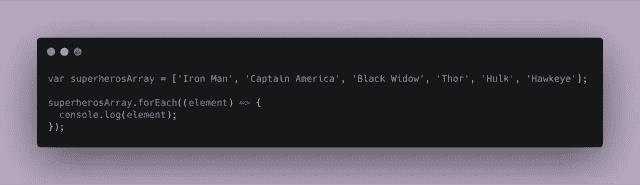
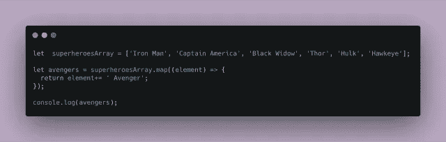
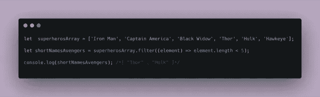
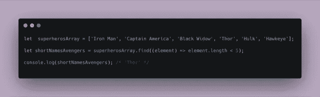
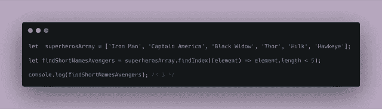
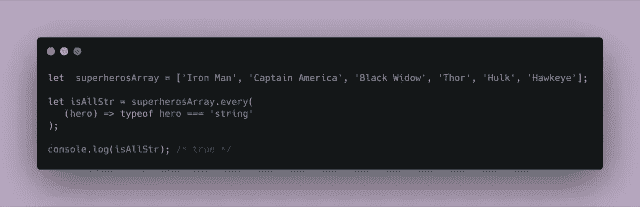
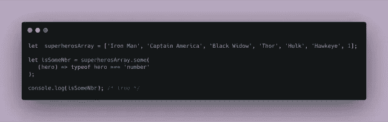

# JavaScript 的数组迭代器清单

> 原文：<https://levelup.gitconnected.com/the-array-iterators-cheatsheet-javascript-9d0cfa03f4>

嗨！😄为了理解 JS 中一些最流行的内置迭代器，我创建了一些超级英雄的例子！😄

这些内置方法帮助我们遍历数组，被称为“迭代方法”或“迭代器”。迭代器是在数组上调用的方法，用来操作元素并返回一些值。

## **Array.forEach()**

方法名:forEach
返回:未定义

—

该方法对数组的每个元素执行一次代码片段(或函数)。

例如:

对超级英雄数组调用 forEach 方法。`forEach()`方法的参数是一个*回调*函数。对数组的每个元素都执行这个函数。每个元素都作为参数传递给这个回调函数。这通常用来替代标准的`for`回路。

## **Array.map()**

方法名:map
返回:一个新数组

—

在对数组中的每个元素调用回调函数后，这个方法**返回一个包含更新元素的新数组**。

在超级英雄数组上调用 map 方法。这个方法有一个回调函数作为参数。Map 返回一个*新的*数组，该数组将字符串‘Avengers’串联在原始值中！原始数组不变。这用于单独改变每个项目，以创建新的转换后的数组。

## **Array.filter()**

方法名:filter
返回:一个新数组

—

此方法检查数组中的每个元素，看它是否满足条件。它返回一个包含满足条件的元素的新数组。

根据元素长度是否小于 5，`.filter()`方法的回调函数应该返回`true`或`false`。
**将导致回调函数返回 true 的元素添加到新数组中。**

## **Array.find()**

方法名:find
返回:该元素第一次出现的值，如果该元素不存在，则返回`undefined`

—

该方法返回满足条件的数组的第*个*元素的**值**。如果没有一个元素满足这个条件，该方法将返回`undefined`。

## **Array.findIndex()**

方法名:findIndex
返回:该元素第一次出现的索引，如果该元素不存在，则返回-1

—

类似于查找方法。它们的区别在于，这个方法返回满足条件集的数组的第一个元素的**索引。如果没有一个元素满足条件，该方法将返回 *-1* 。**

## **Array.reduce()**

方法名:reduce
返回:单个值

—

`reduce`方法用于将数组缩减为单个值。它为数组的每个值执行一个提供的函数(从左到右)。函数的返回值存储在累加器中。

在这个例子中，Reduce 接受两个参数，累加器(all)和当前元素(hero)。reduce 方法以 for 循环的形式遍历数组中的每个元素。在累加器中，我们存储连接的字符串。

## **Array.every()**

方法名:every
返回:boolean

—

`every`方法测试数组中的所有元素是否都通过了一个条件。返回值是布尔值。

## **Array.some()**

方法名:some
返回:布尔值

—

`some`方法测试数组中的一些元素是否通过了一个条件。如果任何值满足条件，它将返回`true`。返回值是布尔值。

希望你喜欢！🦊