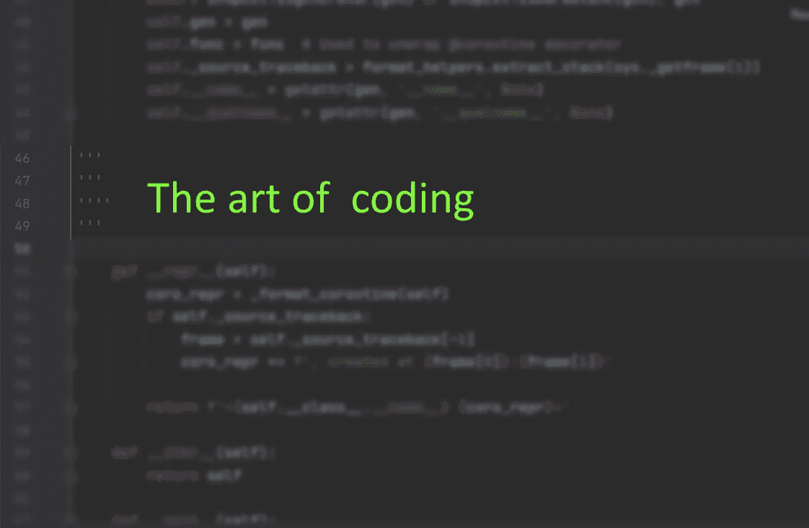
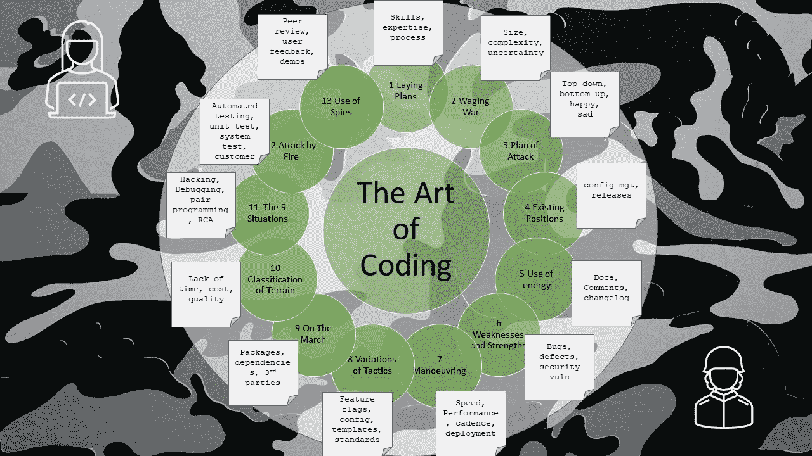

# 编码的艺术——导论

> 原文：<https://levelup.gitconnected.com/the-art-of-coding-an-introduction-796a8c1edaf3>

## 《孙子兵法》中一系列应用于编码的经验教训

作者格雷格·比灵顿的图片

这组文章的灵感来自于我最终阅读了一本名为《战争的艺术》的书。我知道这本书已经很多年了，并且一直认为这将是一本充满难以解读的理论的巨著，因为它可以追溯到公元前 600 年的中国。事实上，中国的军事将领*孙子*成功地以一种非常紧凑和符合逻辑的方式传递了丰富的知识。它是如此紧凑，以至于今天我们称之为“**带兵**小抄”。它已经被翻译成英语几次，我用它作为灵感的基础，因为两支军队之间的比较可以被认为是你这个编码者对敌人(不起作用/不执行的代码)。

我遵循了与这本书相同的章节结构，并将类比应用于编码。开始时是一个有趣的实验，实际上已经变成了一个反思的时间和一个捕捉想法和最佳实践的新方法。

# 13 章

*   [第 1 章](/the-art-of-coding-laying-plans-9b0eae0953ce) — **铺设计划** —决定结果的因素和要素，即技能、专业知识、纪律、流程。
*   [第 2 章](/the-art-of-coding-waging-war-9589b313e25f) — **发动战争** —解释成本和成功需要快速参与，即规模、复杂性和不确定性，即 MVP。
*   [第 3 章](/the-art-of-coding-plan-of-attack-d740a101117d) — **攻击计划** —通过团结的力量，而不是规模、成功因素，即自上而下、自下而上、自由形式、快乐路径、悲伤路径。
*   [第 4 章](/the-art-of-coding-tactical-dispositions-18c45998731b) — **现有职位的重要性**又名配置管理和发布。
*   [第 5 章](/the-art-of-coding-energy-884b7f6cf41e) — **能源使用**又名意见、预先记录、事后记录、无记录、实时记录，
*   [第六章](/the-art-of-coding-weaknesses-and-strengths-410dbcf24574) — **弱点和优点**又名 bug、缺陷、安全漏洞、第三方、互联。
*   [第 7 章](/the-art-of-coding-manoeuvering-6966db623f3b) — **机动**又名各种形式的速度——性能、节奏、部署
*   [第 8 章](/the-art-of-coding-variations-of-tactics-d2a4b73a4365) — **战术的变化**又名特性标志、配置、回滚、模板、编码标准、日志记录。
*   [第 9 章](/the-art-of-coding-on-the-march-2c3d45df8c08) — **行进中**又名包、依赖和第三方接口。
*   [第十章](/the-art-of-coding-terrain-6b28ac70fe1) — **地形分类**又名缺乏时间、成本、质量。
*   [第 11 章](/the-art-of-coding-the-9-situations-235a368f7a15)—**9 种情况**又名黑客、技术债务、调试、公正、结对编程、根本原因分析、优化
*   [第十二章](/the-art-of-coding-attack-by-fire-4bedafa48a27) — **火攻**又名自动化测试、手动测试、冒烟测试、单元测试、集成测试、客户测试
*   第十三章——**使用间谍**又名通过同行评审、用户反馈、演示获取信息

图片作者格雷格·比灵顿

# 为什么是这本书？

《孙子兵法》这本书讲的是如何变得聪明，知道何时以及如何参与才能取得成功。它已被应用于管理原则和教育，法律文章，以及涵盖战略和战术的电子竞技战略。因此，这似乎是一个很好的参考工作，看看它是否可以应用于软件编程。

# 为什么是编码而不是软件开发？

这本书和原则可以很容易地应用到一般的软件开发中，然而，更有趣的是只对编码元素进行比较和应用。尤其是，开发工程师花在创建和编写应用程序上的时间占了很大一部分。

# 为什么文章很短？

它试图反映《孙子兵法》中篇幅较短的章节，并以简短易懂的方式灌输最大的冲击力和价值。作为工程师，我们的生活很忙，所以在通勤或等待咖啡机时，很容易阅读快速片段。

# 章节的链接

[第一章铺设计划](/the-art-of-coding-laying-plans-9b0eae0953ce) | [第二章发动战争](/the-art-of-coding-waging-war-9589b313e25f) | [第三章进攻计划](/the-art-of-coding-plan-of-attack-d740a101117d)

[第四章战术部署](/the-art-of-coding-tactical-dispositions-18c45998731b) | [第五章能量](/the-art-of-coding-energy-884b7f6cf41e)

[第六章——弱点和优势](/the-art-of-coding-weaknesses-and-strengths-410dbcf24574) | [第七章机动](/the-art-of-coding-manoeuvering-6966db623f3b)

[第八章战术](/the-art-of-coding-variations-of-tactics-d2a4b73a4365) | [第九章行军](/the-art-of-coding-on-the-march-2c3d45df8c08) | [第十章地形](/the-art-of-coding-terrain-6b28ac70fe1)

[第十一章——九种情况](/the-art-of-coding-the-9-situations-235a368f7a15) | [第十二章火攻](/the-art-of-coding-attack-by-fire-4bedafa48a27) | [第十三章奸细](/the-art-of-coding-use-of-spies-9c3037919c47)

[亚马逊上也有印刷版](https://www.amazon.co.uk/gp/product/B09CRXYK36/ref=as_li_qf_asin_il_tl?ie=UTF8&tag=osduk0a-21&creative=6738&linkCode=as2&creativeASIN=B09CRXYK36&linkId=942973c2c3b88688414f71f0e3f2a5ac)

# 进一步阅读

 [## 孙子兵法。由莱昂内尔贾尔斯翻译-免费电子书下载

### 24，157 个单词(1 小时 28 分钟)，阅读难度为 67.59(平均难度)，由莱昂内尔·贾尔斯翻译。孙…

standardebooks.org](https://standardebooks.org/ebooks/sun-tzu/the-art-of-war/lionel-giles)  [## 编码的艺术——制定计划

### 第 1 章—技能、专业知识、纪律、流程

levelup.gitconnected.com](/the-art-of-coding-laying-plans-9b0eae0953ce) 

# 关于作者的更多信息

Greg 是一名经验丰富的软件专业人士，也是外包公司的首席技术官。他曾在多家公司工作过，现在热衷于帮助他人在软件开发、管理和外包方面取得成功。

如果你喜欢这篇文章，请鼓掌👏和**跟着**我。

*或者你可以从亚马逊购买这一系列博客的纸质书*

 [## 编码的艺术:计划，战略和战术，以创造大量的程序员来开发健壮的…

### 购买《编码的艺术》:计划、战略和战术，创建程序员大军，开发健壮的代码来打败…

www.amazon.co.uk](https://www.amazon.co.uk/gp/product/B09CRXYK36/ref=as_li_qf_asin_il_tl?ie=UTF8&tag=osduk0a-21&creative=6738&linkCode=as2&creativeASIN=B09CRXYK36&linkId=942973c2c3b88688414f71f0e3f2a5ac)