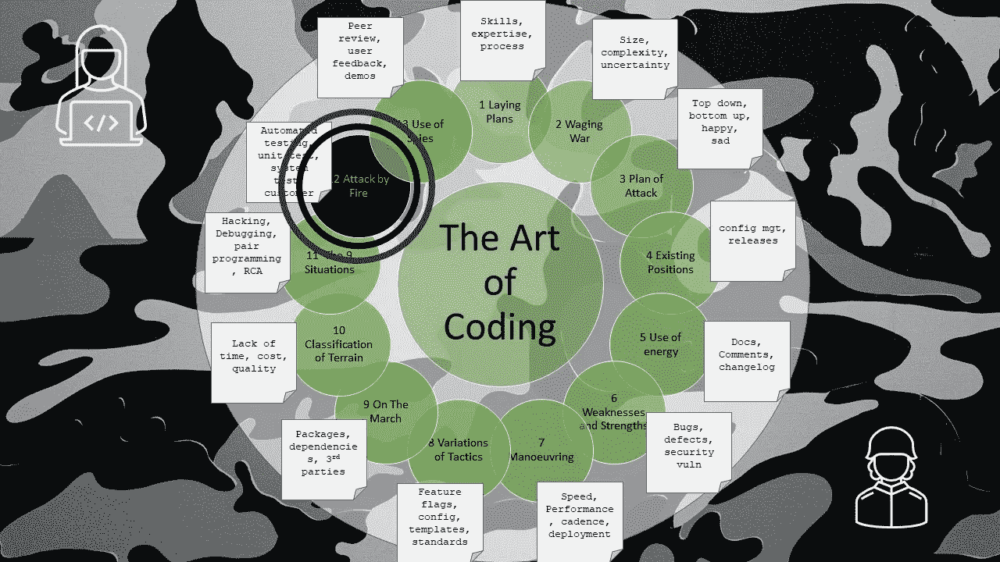

# 编码的艺术——火攻

> 原文：<https://levelup.gitconnected.com/the-art-of-coding-attack-by-fire-4bedafa48a27>

## 第 12 章—测试工具

这是关于编码艺术的第 12 章，按照古代书籍《孙子兵法》的格式编排，是一系列文章的一部分，这些文章捕捉了关于如何编写软件代码的良好意图和观点。

使用测试技术攻击代码有多种方法。通过了解这些方法，一个编码人员将有能力保护他们的代码。

主要策略包括:

*   v 型
*   测试到需求的可追溯性
*   BDD 行为驱动开发
*   测试驱动开发

战略使用各种战术，包括:

*   单元测试
*   集成测试
*   系统试验
*   烟雾测试
*   探索性测试
*   回归测试
*   负载测试
*   性能试验
*   可用性测试
*   兼容性测试

这些策略基于以下核心原则:

*   黑盒测试
*   白盒测试
*   灰箱测试
*   覆盖率测试
*   基本路径测试

以及以下基本知识:

*   快乐路径测试
*   悲伤路径测试
*   边界案例测试
*   模糊测试
*   Bug 复制和调查

为了进行试验，我们必须有可用的手段。测试材料应该保持可用，包括环境、数据、测试计划、测试管理工具和记录结果的方法。

测试有一个适当的季节，开始争吵也有几天。

开始测试的适当季节是:

*   在开发过程中，编码人员应该知道所需的强度，并在调试时非正式地尝试组合。-
*   在开发结束时，编码人员应该更正式地确保他们的代码按照预期运行，并处理意外情况。
*   一旦一个单独的特性、变化或错误被编码和调试，测试就应该开始
*   一旦一整套变更组合起来成为发布候选，那么就应该开始更广泛和正式的测试。

烟先于火，因此烟测试很有价值，应该首先进行。如果一个程序员透过调试的热霾看到一缕烟，那么只有傻瓜才会忽略它。

一旦测试开始，编码人员应该准备好响应:

*   有了关于所需变更、实际实现了什么、所做的假设以及如何调试系统的更多信息。
*   保持开放并接受来自测试者的反馈。
*   优雅地承认一个正式的失败结果，调查并匆忙地修改代码以纠正问题，这样测试就可以完成。
*   确定他们是否执行了单元测试(如果没有的话),然后确定他们是否以及如何发现问题。
*   回顾和反思任何失败，不是作为批评，而是作为进一步改进的机会，以便任何未来的代码都是健壮的。

除非看到有利条件，否则不要发布。

如果你发现一个微不足道的小错误，不要停止发布，因为代码肯定会有更多的错误，时间会无情地流逝。

如果你遇到一个小但有影响的错误，不要通过释放来满足你的感觉，因为严重伤害你的客户的东西也会伤害你。今天的愤怒会及时带来喜悦，因为他们在你的决定中看到了意义。

名声已经被毁掉的软件永远无法复活，死人也无法复活。

因此，开悟的团队，留心并充满谨慎。这是生产好软件、拥有和平的客户、保持团队完整和快乐的方法。

# 进一步阅读

 [## 孙子兵法-十二:火的攻击

### 孙说:用火攻击有五种方法。第一种是在他们的营地烧死士兵；692 第二…

standardebooks.org](https://standardebooks.org/ebooks/sun-tzu/the-art-of-war/lionel-giles/text/chapter-12)  [## 编码的艺术——导论

### 《孙子兵法》中一系列应用于编码的经验教训

levelup.gitconnected.com](/the-art-of-coding-an-introduction-796a8c1edaf3)  [## 编码的艺术——间谍的使用

### 第 13 章—情报和信息反馈

levelup.gitconnected.com](/the-art-of-coding-use-of-spies-9c3037919c47) 

# 关于作者的更多信息

**Greg** 是一名经验丰富的软件专业人士，也是[**outsource . dev**](https://outsource.dev/)**，**的首席技术官，他曾在多家公司工作过，现在热衷于帮助他人在软件开发、管理和外包方面取得成功。

如果你喜欢这篇文章，请鼓掌👏和**跟着**我。

*或者你可以从亚马逊购买这一系列博客的纸质书*

 [## 编码的艺术:计划，战略和战术，以创造大量的程序员来开发健壮的…

### 购买《编码的艺术》:计划、战略和战术，创建程序员大军，开发健壮的代码来打败…

www.amazon.co.uk](https://www.amazon.co.uk/gp/product/B09CRXYK36/ref=as_li_qf_asin_il_tl?ie=UTF8&tag=osduk0a-21&creative=6738&linkCode=as2&creativeASIN=B09CRXYK36&linkId=942973c2c3b88688414f71f0e3f2a5ac)