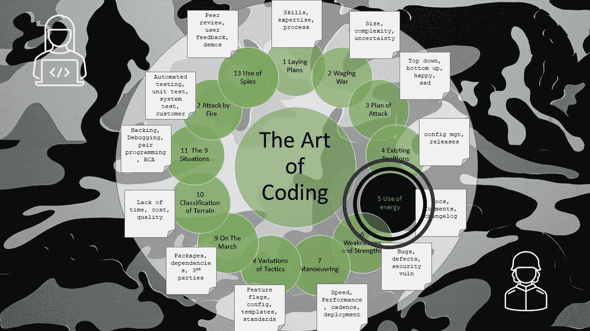

# 编码的艺术——能量

> 原文：<https://levelup.gitconnected.com/the-art-of-coding-energy-884b7f6cf41e>

第 5 章—文档、注释和变更日志

这是关于编码艺术的第 5 章，按照古代书籍《孙子兵法》的格式编排，是一系列文章的一部分，这些文章捕捉了关于如何编写软件代码的良好意图和观点。

控制一个大团队和一个小团队是一样的原则，这仅仅是一个减少他们人数的问题。

大型团队的编码类似于小型团队的编码，它只需要清晰的交流和术语的标准化，尤其是单词“ **Done** ”。

只有五种颜色，但它们可以组合成数千种色调。

字母表中只有 26 个字母，但它们可以组合成数百万个单词和短语。

软件根据两种形式的指令执行:

*   **直接**——来自编译或解释的源代码。
*   **间接** —来自文档中描述的指令、意图和愿望。这可能以规范文档、wikis、过程、订单、bug 和变更单、路线图、代码注释的形式出现。

编码的开始就像一股洪流，在其过程中会产生函数和子程序。

一个熟练的开发人员需要在他们的编码中保持清晰和精确，并且在任何编码决策中保持清晰。

为了防止拥挤的团队出现混乱，决策应该被记录下来，所以**代码注释**可以解释混乱和无序或者不合逻辑的实践，或者不明显的幻数值的原因。

架构和框架上的命令同样应该由架构师来记录。不是为了子孙后代，而是为了团队的清晰排列，这样他们可以朝着同一个方向前进。

设计、文档和交流的结合是值得的。像水一样的信息流动成为一种自然行为，就像滚动的木头需要较少的能量来保持动量。代码的本质不是清晰、紧凑或注释，而是使用重构、注释、设计文档意味着编码需要更少的能量。就像在平地上自然停止滚动的圆木在滚下斜坡时更容易移动。

这种能量像河流一样向下流，流向最终的水池，就像变更流入发布一样，然后一个**变更日志**捕获这种能量，让所有人看到。一个变更日志是一个熟练的开发者对所有添加内容的诚实描述，无论是 bug、变更还是技术改进。一个明智的开发人员会尽可能自动创建变更日志。不管从小的修饰到大的新特性的变化有多大，它都应该包含在变更日志中。在对外发布之前，这个变更日志可能需要来自营销部门的更多能量。

# 进一步阅读

 [## 战争的艺术- V:能量

### 孙说:控制一支大部队和控制少数人是一样的道理；这只是一个问题…

standardebooks.org](https://standardebooks.org/ebooks/sun-tzu/the-art-of-war/lionel-giles/text/chapter-5)  [## 编码的艺术——导论

### 《孙子兵法》中一系列应用于编码的经验教训

levelup.gitconnected.com](/the-art-of-coding-an-introduction-796a8c1edaf3)  [## 编码的艺术——缺点和优点

### 第 6 章—错误、缺陷和安全漏洞

levelup.gitconnected.com](/the-art-of-coding-weaknesses-and-strengths-410dbcf24574) 

# 关于作者的更多信息

**Greg** 是一名经验丰富的软件专业人士，也是[**outsource . dev**](https://outsource.dev/)**，**的首席技术官，他曾在多家公司工作过，现在热衷于帮助他人在软件开发、管理和外包方面取得成功。

如果你喜欢这篇文章，请鼓掌👏和**跟着**我。

或者你可以从亚马逊购买这一系列博客的纸质书。

 [## 编码的艺术:计划，战略和战术，以创造大量的程序员来开发健壮的…

### 购买《编码的艺术》:计划、战略和战术，创建程序员大军，开发健壮的代码来打败…

www.amazon.co.uk](https://www.amazon.co.uk/gp/product/B09CRXYK36/ref=as_li_qf_asin_il_tl?ie=UTF8&tag=osduk0a-21&creative=6738&linkCode=as2&creativeASIN=B09CRXYK36&linkId=942973c2c3b88688414f71f0e3f2a5ac)