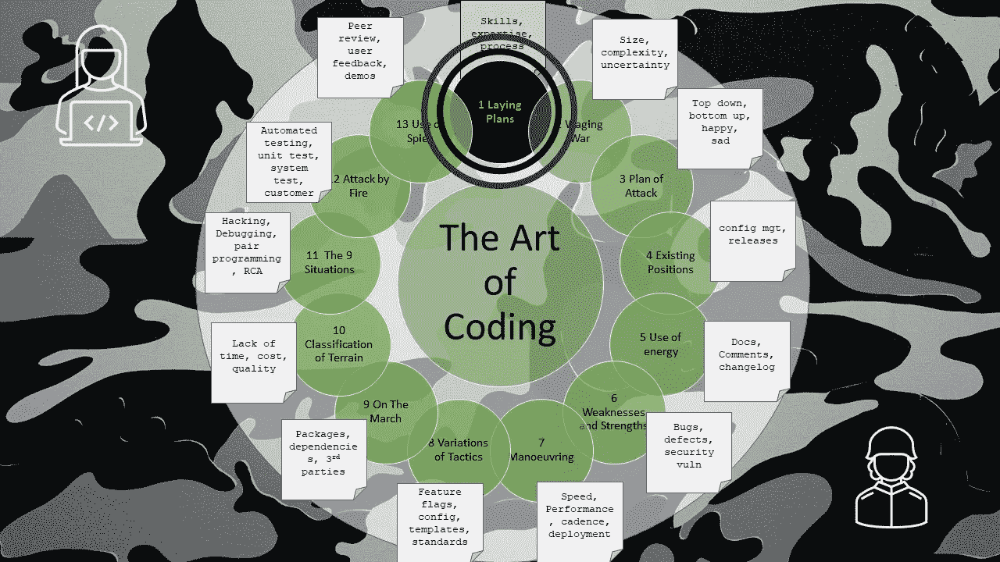

# 编码的艺术——制定计划

> 原文：<https://levelup.gitconnected.com/the-art-of-coding-laying-plans-9b0eae0953ce>

## 第 1 章—技能、专业知识、纪律、流程

作者格雷格·比灵顿的图片

这是关于编码艺术的第一章，按照古代书籍《孙子兵法》的格式编排，是一系列文章的一部分，这些文章捕捉了关于如何编写软件代码的良好意图和观点。

编码艺术对于软件开发和为全世界创造产品和应用程序至关重要。

这是一条通往荣耀和成功的道路，或者是地狱和无尽的调试。

它由多种因素控制:

*   **道德法则**——人们期望软件能够工作。
*   **目标环境** —软件应该运行的地方。
*   开发环境(Development environment)—软件被创建的地方，从业务到团队，再到拥有编程技能的人所坐的椅子。
*   **代表智慧、仁爱和严格的指挥官**(CTO/首席架构师/开发经理)。(我不确定仆人领袖是在公元前 600 年使用的一个术语…)
*   **方法与学科**将思想和智慧转化为文字再转化为十六进制数字的流程和步骤，这可能会影响 CPU 的方向，称为软件开发和编程。

所有的技术领导(将军)和他们的程序员大军都应该知道这些因素。

然后我们可以考虑:

1.  哪个高级经理已经根深蒂固了道德法则(软件应该正确工作)？
2.  哪个技术主管最有能力？
3.  哪个开发和生产环境最好？
4.  哪支队伍准备最充分，表现最好？
5.  哪一方更强——编码人员还是测试人员？
6.  哪边训练最多？
7.  对成功的奖励和对 bug 的惩罚一样强烈吗？

基于这些考虑，我们可以预测(或试图提高)胜利和成功的机会。

留意这份指导中的智慧，但是要敞开心扉去抓住环境，改变你的计划。(及时行乐)

所有的编码都是基于欺骗(有多复杂？你写了多少？复制/粘贴了多少？它真的有用吗？)

交付的团队已经计划并准备好了，失败的团队很少计划。

> 计划失败，就是计划失败

# 进一步阅读

 [## 战争的艺术- I:制定计划

### 孙对说:孙子兵法对国家至关重要。这是一个生死攸关的问题，一条通往…

standardebooks.org](https://standardebooks.org/ebooks/sun-tzu/the-art-of-war/lionel-giles/text/chapter-1)  [## 编码的艺术——导论

### 《孙子兵法》中一系列应用于编码的经验教训

levelup.gitconnected.com](/the-art-of-coding-an-introduction-796a8c1edaf3)  [## 编码的艺术——发动战争

### 第 2 章—规模、复杂性和不确定性

levelup.gitconnected.com](/the-art-of-coding-waging-war-9589b313e25f) 

# 关于作者的更多信息

**Greg** 是一名经验丰富的软件专业人士，也是[**outsource . dev**](https://outsource.dev/)**，**的首席技术官，他曾在多家公司工作过，现在热衷于帮助他人在软件开发、管理和外包方面取得成功。

如果你喜欢这篇文章，请鼓掌👏和**跟着**我。

或者你可以从亚马逊购买这一系列博客的纸质书。

 [## 编码的艺术:计划，战略和战术，以创造大量的程序员来开发健壮的…

### 购买《编码的艺术》:计划、战略和战术，创建程序员大军，开发健壮的代码来打败…

www.amazon.co.uk](https://www.amazon.co.uk/gp/product/B09CRXYK36/ref=as_li_qf_asin_il_tl?ie=UTF8&tag=osduk0a-21&creative=6738&linkCode=as2&creativeASIN=B09CRXYK36&linkId=942973c2c3b88688414f71f0e3f2a5ac)