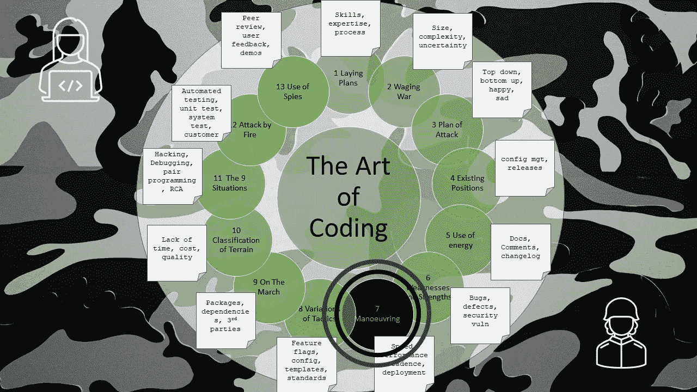

# 编码的艺术——操作

> 原文：<https://levelup.gitconnected.com/the-art-of-coding-manoeuvering-6966db623f3b>

## 第 7 章—速度、性能、节奏、部署

图片由文章作者格雷格·比灵顿提供

这是关于编码艺术的第 7 章，按照古代书籍《孙子兵法》的格式编排，是一系列文章的一部分，这些文章捕捉了关于如何编写软件代码的良好意图和观点。

在软件开发中，团队从产品管理组接收指令。

组建了团队，集中了资源，并提出了要遵循的流程，然后…

在将悲伤(一个有问题的版本)转化为收获(一个有更少错误的新版本)的过程中，出现了战术机动。

有一个最佳的前进速度，太快了，软件将是不可靠的，匆忙的，并容易出现错误。团队的成员以不同的速度工作，有些人会完成他们的目标，有些人很匆忙，有些人在发布前没有达到目标。

当涉及到产品的速度和代码执行的性能时，总是要为最终的性能而编码。根据泥泞的战场，代码可能会随着时间的推移而变慢，并且在实际使用中无法达到预期。明智的团队总是储备软件性能以取得成功。

该团队还需要其他业务部门的相关支持、与客户沟通的客户服务、推广新功能的营销、为客户编写新培训材料的文档、更新课程的培训师以及确保客户准备就绪的项目经理。如果这些相关的团队不能以与开发团队相同的速度前进，那么一切都将是徒劳的。

为你的团队寻找并设定节奏，不要太快，也不要太慢。一种节奏，可以适应发布的各种原因，可以是新功能、错误修复或系统更新和维护。还有，让节奏不要像岁月或季节那样缓慢。

在发布之前要深思熟虑。

团队合作，例如高级开发人员支持和指导初级开发人员。作为一个团队前进，而不是作为个人。

远程工作时，通过在线聊天使用清晰易懂的标志和信号进行频繁沟通。

一个开发者在早上是最敏锐的，所以这是一个“每日站立”的好时机。

当客户第一次使用软件时，新版本的问题很容易出现，这很可能是在早上。因此，明智的做法是在工作时间之外进行部署，并使用蓝绿色部署的黑色斗篷，这样就可以秘密地发布新版本。开发人员应该集合起来，平静地等待新版本发布的喧嚣。

如果环境没有准备好，客户没有准备好，或者怀疑代码的质量，那么明智的团队会推迟发布。

当人们热衷于发现问题和质量低下时，不要追求目标

当一个特性没有完成并且客户有很高的期望时，不要追求一个发布

不要直接在一个活动的服务器上快速地修改代码，而是以一种经过考虑和计划的方式小心谨慎地修补它。

不要给绝望的团队领导或开发团队太大压力。

这就是编码的艺术。

# 进一步阅读

 [## 战争的艺术- VII:机动

### 孙说:在战争中，将军接受君主的命令。345 收集了一支军队和…

standardebooks.org](https://standardebooks.org/ebooks/sun-tzu/the-art-of-war/lionel-giles/text/chapter-7)  [## 编码的艺术——导论

### 《孙子兵法》中一系列应用于编码的经验教训

levelup.gitconnected.com](/the-art-of-coding-an-introduction-796a8c1edaf3)  [## 编码的艺术——策略的变化

### 第 8 章—特征标志、配置文件、模板、标准

levelup.gitconnected.com](/the-art-of-coding-variations-of-tactics-d2a4b73a4365) 

# 关于作者的更多信息

**Greg** 是一名经验丰富的软件专业人士，也是[**outsource . dev**](https://outsource.dev/)**，**的首席技术官，他曾在多家公司工作过，现在热衷于帮助他人在软件开发、管理和外包方面取得成功。

如果你喜欢这篇文章，请鼓掌👏和**跟着**我。

*或者你可以从亚马逊购买这一系列博客的纸质书*

 [## 编码的艺术:计划，战略和战术，以创造大量的程序员来开发健壮的…

### 购买《编码的艺术》:计划、战略和战术，创建程序员大军，开发健壮的代码来打败…

www.amazon.co.uk](https://www.amazon.co.uk/gp/product/B09CRXYK36/ref=as_li_qf_asin_il_tl?ie=UTF8&tag=osduk0a-21&creative=6738&linkCode=as2&creativeASIN=B09CRXYK36&linkId=942973c2c3b88688414f71f0e3f2a5ac)