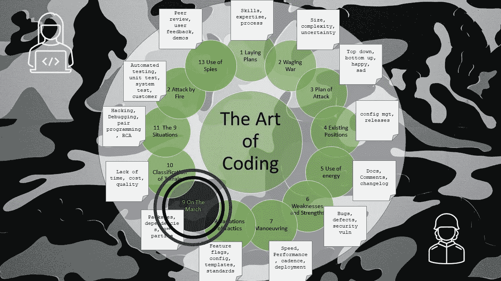

# 编码的艺术——在行进中

> 原文：<https://levelup.gitconnected.com/the-art-of-coding-on-the-march-2c3d45df8c08>

## 第 9 章—包、依赖项、第三方

图片由文章作者格雷格·比灵顿提供

这是关于编码艺术的第 9 章，按照古代书籍《孙子兵法》的格式编排，是一系列文章的一部分，这些文章捕捉了关于如何编写软件代码的良好意图和观点。

在开发软件时，有一些区域需要避免或小心，但是由于它们提供的东西，它们是必须处理的项目，尤其是当考虑到环境和地形时。

注意你使用的**外部库**。

*   检查和审查任何许可证
*   确保它们相对稳定，并且它们的变化率不会太高
*   研究它们是否是最新的，是否仍在积极使用和维护
*   控制更新的方式和时间
*   管理您的构建中使用的版本
*   经常监视您使用的库是否是最新的
*   准备花大力气跟上时代
*   不要低估快速库更新的影响

如果你的软件邻居通过 API 使用**第三方服务**:

*   为暂时停机或不可用服务做好准备，并妥善处理它。
*   允许自动地和定期地检测服务不可用性，即使它当时没有被使用。
*   确定如何针对服务的各种用途(如开发、测试和生产环境及数据)隔离和存储数据。
*   通过使用与代码分开存储且只有相关人员知道的凭证，防止访问生产系统使用的服务(即，如果您没有实时服务的密码，您就不能破坏它，因此是安全的)。
*   确定如何跟踪服务使用情况。
*   计划从一个系统到另一个系统的日志记录和跟踪，并在它们之间建立某种关联(除了时间戳)。
*   确保所有系统都参照统一协调时
*   如果代码中一个微不足道的编码错误导致使用量和支出激增，通过发出警报来保护自己。
*   通过该服务的外观隐藏所有供应商，以便更容易转换供应商。

带着热情和信念阅读和解释所有问题(潜在错误)的**迹象。**

*   在问题单中仔细记录细节、假设和假设。
*   不要妄下未经证实的结论。
*   准确复制出现问题的环境和数据。
*   以开放的态度对待报道的真实问题和缺失的事实。
*   允许从不同角度的替代上下文视图报告真实问题的可能性。“情人眼里出西施”。
*   接受客户可能没有时间或能力为你重复或深入研究。
*   一个聪明的开发人员会在没有任何可能性出现时，对所有可能性进行头脑风暴。
*   看不到问题并不意味着没有问题。
*   一个聪明的开发人员会从根本原因中寻求启发，而不仅仅是掩盖症状。
*   一个非常罕见但有问题的问题应该被视为一个挑战，而不是一个烦恼。
*   如果您可以夸大情况，使问题频繁出现和重复，那么您就真正了解了问题的根源。

让大批测试人员开心，但同时也面临着在你的工作中寻找错误的挑战:

*   **调试**是移除不想要的 bug(它们不是想要的 bug)
*   bug 是函数实现中的编码错误
*   缺陷是对某一特性要求的错误或遗漏。
*   调试您的代码以确保它正确执行。
*   在恶劣和极端的条件下调试代码(比生产环境更恶劣)。
*   保持和管理任何测试载体的安全，以便它们可以重复使用。
*   将任何测试向量传递给测试人员(作为友好的姿态)。
*   向测试人员保证，在将代码交给他们进行正式和严格的试验和测试之前，您已经测试了代码。以一种解释你工作的广度和深度的方式来做这件事，用你喜欢的代码、注释或标签。
*   单元测试是一种真正的美德，也是一个优秀开发人员的标志。

如果代码在测试中失败了，就要采取强有力的措施，并把它送回给编码人员返工。提升需求中的模糊性，并在回顾中强调想法以减少这种情况的发生。不要简单地让代码在没有纪律的情况下溜走。

作为一个你认为合适的团队，执行这些和其他标准。所有人都根据它们编写和调试代码，如果有人不符合标准就声明，不是为了贬低他们，而是为了保护软件的神圣性。那么它将符合工作软件的道德法则。

# 进一步阅读

 [## 孙子兵法-九:行军中的军队

### 孙曰:“今可屯兵观察敌情。430 快过去吧…

standardebooks.org](https://standardebooks.org/ebooks/sun-tzu/the-art-of-war/lionel-giles/text/chapter-9)  [## 编码的艺术——导论

### 《孙子兵法》中一系列应用于编码的经验教训

levelup.gitconnected.com](/the-art-of-coding-an-introduction-796a8c1edaf3)  [## 编码的艺术——地形

### 第 10 章—缺少时间、成本或质量

levelup.gitconnected.com](/the-art-of-coding-terrain-6b28ac70fe1) 

# 关于作者的更多信息

**Greg** 是一名经验丰富的软件专业人士，也是[**outsource . dev**](https://outsource.dev/)**，**的首席技术官，他曾在多家公司工作过，现在热衷于帮助他人在软件开发、管理和外包方面取得成功。

如果你喜欢这篇文章，请鼓掌👏和**跟着**我。

*或者你可以从亚马逊购买这一系列博客的纸质书*

 [## 编码的艺术:计划，战略和战术，以创造大量的程序员来开发健壮的…

### 购买《编码的艺术》:计划、战略和战术，创建程序员大军，开发健壮的代码来打败…

www.amazon.co.uk](https://www.amazon.co.uk/gp/product/B09CRXYK36/ref=as_li_qf_asin_il_tl?ie=UTF8&tag=osduk0a-21&creative=6738&linkCode=as2&creativeASIN=B09CRXYK36&linkId=942973c2c3b88688414f71f0e3f2a5ac)