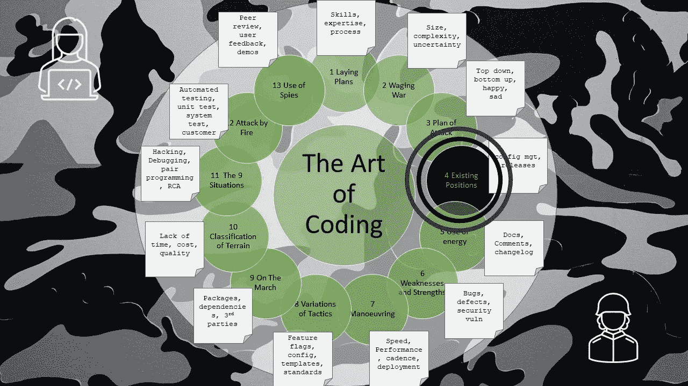

# 编码的艺术——战术部署

> 原文：<https://levelup.gitconnected.com/the-art-of-coding-tactical-dispositions-18c45998731b>

第 4 章—配置管理、发布和版本

图片由文章作者格雷格·比灵顿提供

这是关于编码艺术的第 4 章，按照古代书籍《孙子兵法》的格式编排，是一系列文章的一部分，这些文章捕捉了关于如何编写软件代码的良好意图和观点。

保护自己免受失败是我们自己可以控制和掌握的。

俗话说:

> 一个人可能知道如何做，但可能做不到

坚强地面对失败意味着只部署成功中的强项，即已知编码良好并经过彻底测试的东西。

强大的防御能力，能够抵御来自错误用户输入、数据通信损坏、存储数据损坏、错误或无效处理结果的错误。

这应该以一种不慌张的方式来实现，软件应该轻松地防御问题。

**应该使用配置管理**来允许前进到经过测试和健壮的源代码的位置。

所有的**版本**都将从一个特定的构建号开始构建，并有一个精确的版本号。

应该使用内部版本号来标识和显示软件的每个内部版本。

**版本**编号应用于明确所实现的版本以及与先前版本相比的变更程度。

标准约定如下:主版本号、次版本号、补丁号。

*   **主**号只会增加一个突破性的变化。
*   无论是新特性还是错误修复，每个新版本的**次要**号都会增加
*   **补丁**号只会在临时修改时增加

上述规则只有在 most high 或市场部的指示下才能灵活运用。

成功来自**而不是**犯错误，因此熟练的开发者遵守道德法则(软件必须工作)，并确保发布也符合道德法则。

发布将根据测量、估计、计算、审查、成功的过程发生。

发布将遵循路线图中定义的节奏，并且应该像鼓声一样有规律。

一个成功发布的突进导致了进一步的成功发布和客户的喜悦。

# 进一步阅读

 [## 孙子兵法-四:战术部署

### 孙说:古代的好战士首先把自己置于失败的可能性之外，然后等待一个…

standardebooks.org](https://standardebooks.org/ebooks/sun-tzu/the-art-of-war/lionel-giles/text/chapter-4)  [## 编码的艺术——导论

### 《孙子兵法》中一系列应用于编码的经验教训

levelup.gitconnected.com](/the-art-of-coding-an-introduction-796a8c1edaf3)  [## 编码的艺术——能量

### 第 5 章—文档、注释和变更日志

levelup.gitconnected.com](/the-art-of-coding-energy-884b7f6cf41e) 

# 关于作者的更多信息

**Greg** 是一名经验丰富的软件专业人士，也是[**outsource . dev**](https://outsource.dev/)**，**的首席技术官，他曾在多家公司工作过，现在热衷于帮助他人在软件开发、管理和外包方面取得成功。

如果你喜欢这篇文章，请鼓掌👏和**跟着**我。

*或者你可以从亚马逊购买这一系列博客的纸质书*

 [## 编码的艺术:计划，战略和战术，以创造大量的程序员来开发健壮的…

### 购买《编码的艺术》:计划、战略和战术，创建程序员大军，开发健壮的代码来打败…

www.amazon.co.uk](https://www.amazon.co.uk/gp/product/B09CRXYK36/ref=as_li_qf_asin_il_tl?ie=UTF8&tag=osduk0a-21&creative=6738&linkCode=as2&creativeASIN=B09CRXYK36&linkId=942973c2c3b88688414f71f0e3f2a5ac)