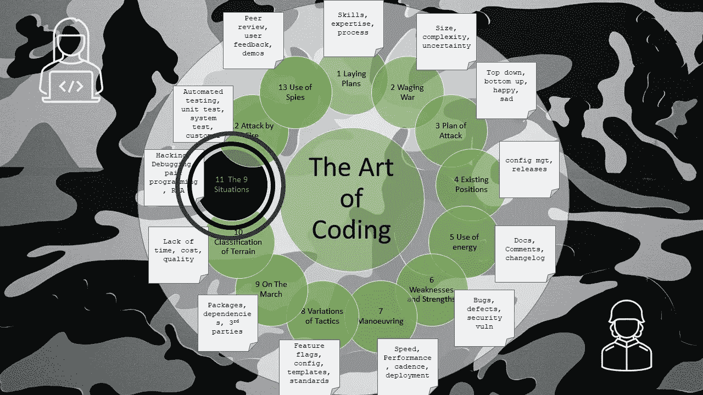

# 编码的艺术——9 种情况

> 原文：<https://levelup.gitconnected.com/the-art-of-coding-the-9-situations-235a368f7a15>

第 11 章——黑客攻击、调试、结对编程

这是关于编码艺术的第 11 章，按照古代书籍《孙子兵法》的格式编排，是一系列文章的一部分，这些文章捕捉了关于如何编写软件代码的良好意图和观点。

编码的艺术认识到编码可能发生的 9 种变化:

1.  砍
2.  结对编程
3.  问题解决
4.  重构提高速度
5.  重构尺寸
6.  清晰的重构
7.  错误处理的重构
8.  爱好和学习
9.  有计划的结构化开发

****结对编程**将两个开发人员结合在一起，一个负责打字和创新，另一个负责阅读、反思和指导改进。这个双头怪物看起来很可怕，但很容易驯服，所以当左右手完美协调时，他们可以开发更快更干净的代码。**

*****解决问题*** 应该将侦探般水平的法医调查与科学假设相结合，从而获得完整的理解。然后进入实验(试错法)或外推法来解决假设。只有当一个解决方案被编码、调试，并被证明在最大压力下成功时，代码才应该被登记回配置管理中。正如医学格言所说“无害”，确保任何改变都是有益的。**

*****重构求速度*** 需要结构化的过程。精心准备重复场景，使用详细的仪器和测量。分析指标以确定关注领域，并进行批判性思考以了解原因。只有这样，才能对变化进行推测、试验和测试。虽然我不会在没有知识和奢望的情况下胡乱修补。**

*****重构尺寸*** 是在时间的旅行中遗失的技能。由于不断增加的磁盘大小，这项任务并不经常完成，当然，重新编写汇编程序以节省空间已经成为历史。这是一种技巧，代码压缩经常会意外地导致混淆，因此需要谨慎对待。**

*****重构清晰*** 是一门艺术也是一门科学。同样，很难为你的孩子选择名字，也很难为方法和变量命名。与其选择季节的名称或流行的东西，不如选择清晰、相关、不言自明的名称。一个聪明的人是他们所能调查的国王，就像一个聪明的开发人员只把在一个屏幕上能看到的源代码放进一个函数一样。**

*****爱好和学习*** 是一个不应该有限制的领域。自由表达会导致混乱，但是通过混乱会带来学习和清晰。明智的开发人员会从错误中吸取教训。仅仅在一个安全纯净的世界里学习，并不会教你危险或者如何对抗危险。那些从零开始并自己安装的公司将会胜出。**

*****有计划的结构化开发*** 是一个专业的世界。这是最适合成功的地方。**

**当肥沃的土地充足的时候，突袭补给你的队伍。给他们最好的笔记本电脑，配备大量的内存、高速磁盘和屏幕。他们古老而可靠的武器可能会传递给其他人，这些人不在战场的最前沿，只使用办公应用程序。**

**开发商在绝境中失去了恐惧感。它们可能会对生产系统的轻率和突然的变化开放，这可能会有所帮助，但应该谨慎使用，并且只有在情况危急时才使用。**

**禁止预兆和未来的怀疑，让**不是**存在:**

*   **代码中留下的任何“TODO”。**
*   **代码块被注释掉，因为该函数已被移除，但对后面的函数来说是无用的。**
*   **对每一行代码进行注释，以不同的语言重复该行代码。**
*   **任何对以前编写这个怪物的开发者产生怀疑的评论。**
*   **任何评论说“我不知道为什么这有效，但它确实有效”**

**管理团队和制造产品的原则是设定一个所有人都必须达到的标准。构建您的产品时:**

*   **使它变得脆弱，容易在任何意想不到的机会破裂和停止。任何错误的血碾乐队信息和最大定义的记录日志。姑且称之为“**发展阶段**”。**
*   **让它在战斗中变得坚强，在全面失败时变得强健，在挣扎中继续前进。对敌人隐藏任何担心的理由，并继续使用可用的最佳路径。只记录最严重的错误，以免有人太快填满日志。让我们称之为“**生产**”。**

**当你从开发之地旅行到生产之地时，它们可能是中间的其他地方。土地越多越好，因为他们都有自己的属性，这使得他们更容易穿越。这些区域可能包括功能测试、系统测试、单元测试、客户演示、客户验收测试、试运行、生产的环境。**

*   *****特性测试*** —应该只关注一件事。**
*   ***系统测试——应该确保产品的所有部分都按照道德法则正常工作***
*   ******单元测试***——应该检查单个方法是否满足其义务***
*   ******客户端演示*** —应包括便于客户端使用的数据集，能够展示所有功能(铃声和哨声)，并在视觉上吸引人，带有客户的品牌以获得额外的分数。最重要的是，这必须在需要时发挥作用。***
*   ******客户验收测试*** —这必须顺利工作，因为奖金和里程碑的支付依赖于它。***
*   ******生产*** —这必须是所有环境中最快、最健壮的，它必须是安全的、始终运行的，并且不会受到意外干扰。***

***计划必须灵活且适应性强，团队必须在他们的在线 backlog 工具中添加一个仪表板。与主人和利益相关者共享此仪表板(或简化版本)。燃尽图之书是一本巫师历书，需要保护，所以只有编码和信仰的人才能看到它。***

***如果敌人“虫子”开了一扇门，你必须冲进去修理它们。***

***通过确保你的客户处于掌控之中来预先阻止一个有缺陷的发布，并且适应这个问题，直到你可以用一个决定性的新发布来战斗，如果不能，那么就编码并测试一个快速补丁。***

# ***进一步阅读***

 ***[## 战争的艺术- XI:九种情况

### 孙说:孙子兵法讲九种地:(1)分散地；(2)肤浅的理由；(3)…

standardebooks.org](https://standardebooks.org/ebooks/sun-tzu/the-art-of-war/lionel-giles/text/chapter-11)*** *** [## 编码的艺术——导论

### 《孙子兵法》中一系列应用于编码的经验教训

levelup.gitconnected.com](/the-art-of-coding-an-introduction-796a8c1edaf3)  [## 编码的艺术——火攻

### 第 12 章—测试工具

levelup.gitconnected.com](/the-art-of-coding-attack-by-fire-4bedafa48a27) 

# 关于作者的更多信息

**Greg** 是一名经验丰富的软件专业人士，也是[**outsource . dev**](https://outsource.dev/)**，**的首席技术官，他曾在多家公司工作过，现在热衷于帮助他人在软件开发、管理和外包方面取得成功。

如果你喜欢这篇文章，那么请鼓掌👏和**跟着**我。

或者你可以从亚马逊购买这一系列博客的纸质书。

 [## 编码的艺术:计划，战略和战术，以创造大量的程序员来开发健壮的…

### 购买《编码的艺术》:计划、战略和战术，创建程序员大军，开发健壮的代码来打败…

www.amazon.co.uk](https://www.amazon.co.uk/gp/product/B09CRXYK36/ref=as_li_qf_asin_il_tl?ie=UTF8&tag=osduk0a-21&creative=6738&linkCode=as2&creativeASIN=B09CRXYK36&linkId=942973c2c3b88688414f71f0e3f2a5ac)***