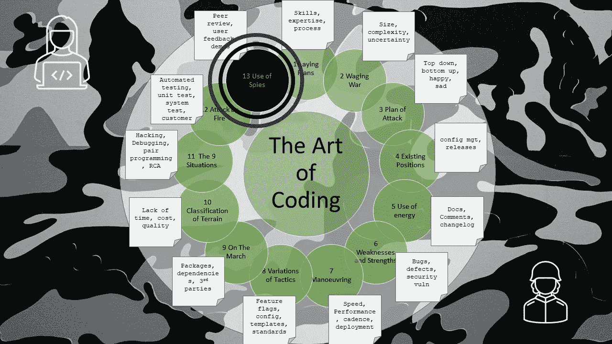

# 编码的艺术——间谍的使用

> 原文：<https://levelup.gitconnected.com/the-art-of-coding-use-of-spies-9c3037919c47>

## 第 13 章—情报和信息反馈

这是关于编码艺术的第 13 章，按照古代书籍《孙子兵法》的松散格式编写，是一系列文章的一部分，这些文章捕捉了关于如何编写软件代码的良好意图和观点。

开发一个大规模的软件产品，并雇佣大量的开发人员、测试人员、架构师、devops 工程师是一件成本高昂的事情，并且要使用大量的资源。账单会很快堆积起来，投资者会焦急地摇着手指，经理们会紧张得汗流浃背，开发商们会在采煤工作结束后筋疲力尽。

在接下来的几年里，软件中的错误和问题会不断涌现。既然如此，对问题的可能原因或模糊的需求保持无知，就会吝惜收集情报的费用和努力。

为了达到超过普通开发者的水平，智者寻求预知。这种知识不能凭空得出，不能通过经验推断或获得。

模糊需求的知识只能从客户和用户那里获得。

这意味着使用其他人的服务来收集需求信息:

*   **产品经理**收集市场需求和趋势，以及任何竞争对手的详细信息(不诉诸非法间谍活动)。
*   **产品负责人**和项目经理收集客户的想法和愿望。
*   业务分析师和架构师从客户那里获得更多的细节。
*   **客户服务代理**从用户那里获得反馈(好的或不好的)。

这些人需要一定程度的聪明才智来梳理出精细而详细的知识，这些知识可以编织成清晰的网络，可以包含所有的需求。

它还需要利用其他人的服务来收集关于缺陷和错误可能性的信息:

*   与**一起的编码人员审查代码**并识别不良结构和薄弱环节
*   架构师检查代码时遵循习惯用法和实践，这使代码具有内在的健壮性
*   测试人员探查代码中潜在的弱点。
*   QA 专家审查缺陷数据和历史信息，以突出潜在的关注领域。

这些信息应该被秘密地编辑和使用，这样它的消息就不会泄露给那些害怕它的发现或者恶意使用它们的人。

因此，只有一个开明的团队会使用最高的智能来引出清晰的需求、错误的准确细节以及可能升级为缺陷的缺点。

# 脚注

与编码相比，关于间谍和间谍活动的章节是一个棘手的问题。单词“ **intelligence** ”是一个更容易使用的单词，所以我希望这一章听起来不要太像詹姆斯·邦德电影中的东西，但出于艺术趣味，我在标题中保留了间谍这个词。

# 进一步阅读

 [## 孙子兵法-十三:间谍的使用

### 孙曰:“起兵十万，长途行军，必损兵折将。”

standardebooks.org](https://standardebooks.org/ebooks/sun-tzu/the-art-of-war/lionel-giles/text/chapter-13)  [## 编码的艺术——导论

### 《孙子兵法》中一系列应用于编码的经验教训

levelup.gitconnected.com](/the-art-of-coding-an-introduction-796a8c1edaf3) 

# 关于作者的更多信息

**Greg** 是一名经验丰富的软件专业人士，也是[**outsource . dev**](https://outsource.dev/)**，**的首席技术官，他曾在多家公司工作过，现在热衷于帮助他人在软件开发、管理和外包方面取得成功。

如果你喜欢这篇文章，请鼓掌👏和**跟着**我。

或者你可以从亚马逊购买这一系列博客的纸质书。

 [## 编码的艺术:计划，战略和战术，以创造大量的程序员来开发健壮的…

### 购买《编码的艺术》:计划、战略和战术，创建程序员大军，开发健壮的代码来打败…

www.amazon.co.uk](https://www.amazon.co.uk/gp/product/B09CRXYK36/ref=as_li_qf_asin_il_tl?ie=UTF8&tag=osduk0a-21&creative=6738&linkCode=as2&creativeASIN=B09CRXYK36&linkId=942973c2c3b88688414f71f0e3f2a5ac)