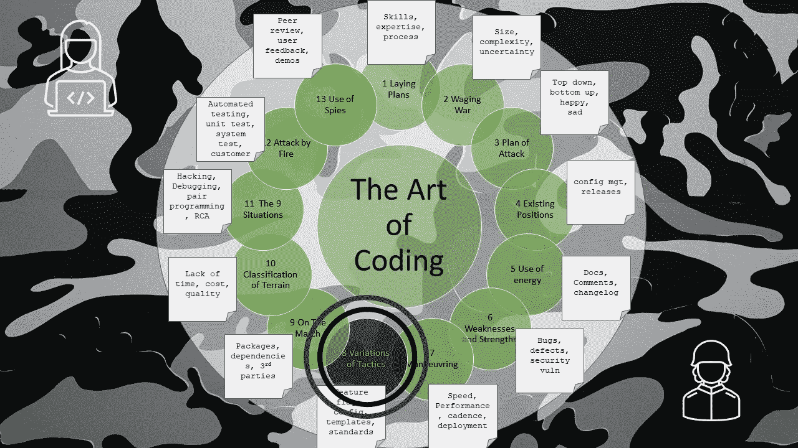

# 编码的艺术——策略的变化

> 原文：<https://levelup.gitconnected.com/the-art-of-coding-variations-of-tactics-d2a4b73a4365>

## 第 8 章—特征标志、配置文件、模板、标准

图片由文章作者格雷格·比灵顿提供

这是关于编码艺术的第 8 章，按照古代书籍《孙子兵法》的格式编排，是一系列文章的一部分，这些文章捕捉了关于如何编写软件代码的良好意图和观点。

在发展困难的地区，不要磨蹭。

如果代码是复杂的，有曲折的逻辑或计算，那么就寻求同盟来审查和测试。

当代码具有未知性能时，不要犹豫，快速进入实际的性能测试。

当代码依赖于其他系统和 API 时，不要犹豫，立即编写详细的日志和错误处理，并为大量的调试做好准备。

在代码已经完成一半并且需要发布的地方，不要逗留，用**特征标志**隐藏新的操作，并且黑暗启动。

在代码有未知影响的地方，考虑 A-B 原位测试，同样**特性标志**可能有所帮助。

有些集成不应该尝试，有些错误应该小心处理，有些重构不应该尝试，明智的团队领导知道如何避免这些。

一个明智的编码员会综合考虑优点和缺点。

他将利用以下优势:

*   用他们精通的语言编码。
*   为所有团队使用**代码模板**以确保一致性。
*   使用支持静态代码分析的 IDE(或通过使用插件)来发现代码气味、错误和漏洞。
*   使用带有内置调试器的 IDE 来实现快速的编辑-编译-调试循环。
*   使用源代码配置管理来跟踪变更。
*   使用拉式请求，以便团队分担责任并主动检查质量。
*   将所有的**配置属性**放在一个位置，这样当升级到一个新的环境时，可以很容易地修改它们。

编码的艺术告诉我们不要依赖无错误的代码，而是要做好准备来减少和防止错误。

有五种危险的错误可能会影响开发人员:

*   **鲁莽**——对错误处理的漠视。
*   **怯懦**——对不完整的构建、对实时生产代码的修补或延迟提交拉取请求过于迟钝。
*   急躁的脾气——太急于说“这对我有用”,而没有考虑到情况或环境的方方面面。
*   **缺乏荣誉感**——太快地对任何团队的成功做出个人声明，直接向客户引用对一项任务的草率估计。
*   贪吃——太快地宣称新工作中最有趣的领域，并逃避 bug 修复和维护。

当一个版本失败了，并且发现了错误，原因肯定会在这些危险的错误中找到。沉思它们。

# 进一步阅读

 [## 孙子兵法-八:战术的变化

### 孙说:在战争中，将军接受君主的命令，收集他的军队，集中他的…

standardebooks.org](https://standardebooks.org/ebooks/sun-tzu/the-art-of-war/lionel-giles/text/chapter-8)  [## 编码的艺术——导论

### 《孙子兵法》中一系列应用于编码的经验教训

levelup.gitconnected.com](/the-art-of-coding-an-introduction-796a8c1edaf3)  [## 编码的艺术——在行进中

### 第 9 章—包、依赖项、第三方

levelup.gitconnected.com](/the-art-of-coding-on-the-march-2c3d45df8c08) 

# 关于作者的更多信息

**Greg** 是一名经验丰富的软件专业人士，也是[**outsource . dev**](https://outsource.dev/)**，**的首席技术官，他曾在多家公司工作过，现在热衷于帮助他人在软件开发、管理和外包方面取得成功。

如果你喜欢这篇文章，请鼓掌👏和**跟着**我。

*或者你可以从亚马逊购买这一系列博客的纸质书*

 [## 编码的艺术:计划，战略和战术，以创造大量的程序员来开发健壮的…

### 购买《编码的艺术》:计划、战略和战术，创建程序员大军，开发健壮的代码来打败…

www.amazon.co.uk](https://www.amazon.co.uk/gp/product/B09CRXYK36/ref=as_li_qf_asin_il_tl?ie=UTF8&tag=osduk0a-21&creative=6738&linkCode=as2&creativeASIN=B09CRXYK36&linkId=942973c2c3b88688414f71f0e3f2a5ac)