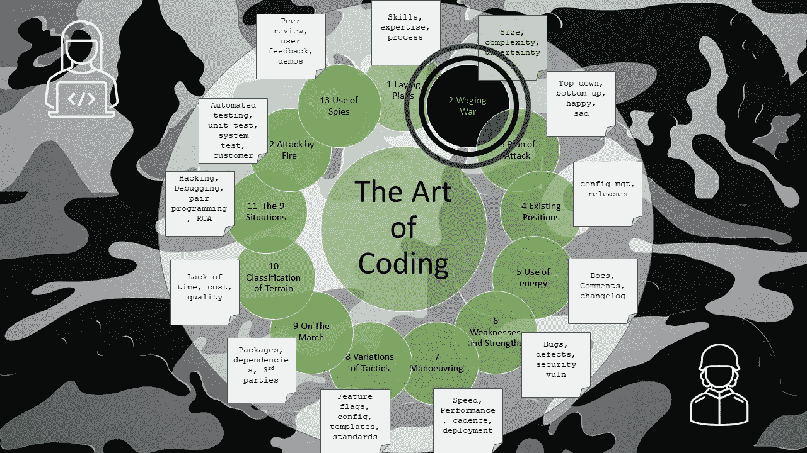

# 编码的艺术——发动战争

> 原文：<https://levelup.gitconnected.com/the-art-of-coding-waging-war-9589b313e25f>

第 2 章—规模、复杂性和不确定性

图片由文章作者格雷格·比灵顿提供

这是关于编码艺术的第 2 章，按照古代书籍《孙子兵法》的格式编排，是一系列文章的一部分，这些文章捕捉了关于如何编写软件代码的良好意图和观点。

在创建一个产品或应用程序的软件开发操作中，可能有数百人、数十个团队、数十名经理、大量开发人员和测试人员。产品有一个不断积累的**规模和复杂性**。结合建筑师、安全顾问、质量检查员的专业分工。他们需要装备、喂食、浇水，还需要电脑、鼠标、椅子和堆积如山的软件工具。这就是开发软件的成本。

当你从事开发的时候，如果时间太长，那么工具就会变钝，团队就会失去热情。如果你不得不在里程碑的防御工事上花费过多的劳动，并且过多地与变化的**和不确定的**需求开会，那么你的力量就会被耗尽。

如果这个项目是长期的，那么你的公司或客户的资源可能无法满足。

虽然在一项任务中仓促行事是不明智的，但在整个战役中却不是这样。缩短项目或计划以控制成本总是明智之举。

熟练的人不会要求更多的钱，也不会计划重复他们的任务两次。

> “正确的第一次”是一句唱得很好的咒语。

最后期限的临近也导致价格上涨。

随着这种枯竭，其他项目和内部培训的预算将被用于支付这场运动。

明智的领导者利用开源代码，重用和回收代码，并在现有项目中寻找代码。

为了赢得比赛，球队必须精神饱满，充满活力，并受到可能的奖励的激励。

> 在发展中，结果而不是产出才是关键。

团队的领导者是命运的仲裁者，命运是他们的仲裁者。

# 进一步阅读

 [## 战争的艺术-二:发动战争

### 孙说:在战争中，有一千辆战车在战场上，就有一千辆战车在战场上

standardebooks.org](https://standardebooks.org/ebooks/sun-tzu/the-art-of-war/lionel-giles/text/chapter-2)  [## 编码的艺术——导论

### 《孙子兵法》中一系列应用于编码的经验教训

levelup.gitconnected.com](/the-art-of-coding-an-introduction-796a8c1edaf3)  [## 编码的艺术——攻击计划

### 第 3 章——自顶向下、自底向上、存根——如何开始编写代码

levelup.gitconnected.com](/the-art-of-coding-plan-of-attack-d740a101117d) 

# 关于作者的更多信息

**Greg** 是一名经验丰富的软件专业人士，也是[**outsource . dev**](https://outsource.dev/)**，**的首席技术官，他曾在多家公司工作过，现在热衷于帮助他人在软件开发、管理和外包方面取得成功。

如果你喜欢这篇文章，请鼓掌👏和**跟着**我。

*或者你可以从亚马逊购买这一系列博客的纸质书*

 [## 编码的艺术:计划，战略和战术，以创造大量的程序员来开发健壮的…

### 购买《编码的艺术》:计划、战略和战术，创建程序员大军，开发健壮的代码来打败…

www.amazon.co.uk](https://www.amazon.co.uk/gp/product/B09CRXYK36/ref=as_li_qf_asin_il_tl?ie=UTF8&tag=osduk0a-21&creative=6738&linkCode=as2&creativeASIN=B09CRXYK36&linkId=942973c2c3b88688414f71f0e3f2a5ac)