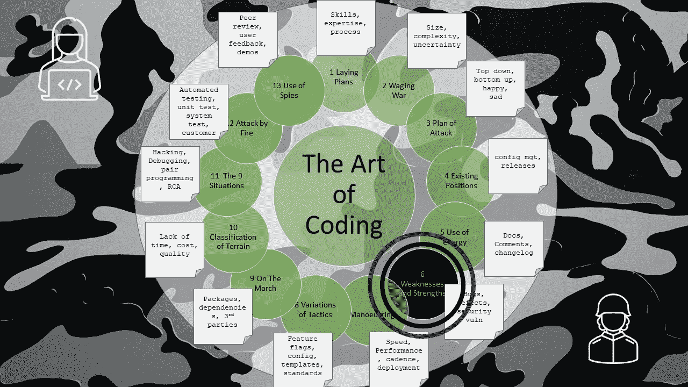

# 编码的艺术——缺点和优点

> 原文：<https://levelup.gitconnected.com/the-art-of-coding-weaknesses-and-strengths-410dbcf24574>

## 第 6 章—错误、缺陷和安全漏洞

图片由文章作者格雷格·比灵顿提供

这是关于编码艺术的第 6 章，按照古代书籍《孙子兵法》的格式编排，是一系列文章的一部分，这些文章捕捉了关于如何编写软件代码的良好意图和观点。

谁的代码是“ **Done** ”，谁先发布谁就新鲜，谁是第二个，谁必须赶紧交付，谁就会筋疲力尽地到达。

聪明的开发人员按照可靠的计划和时间表工作，不允许压力影响他们或导致他们偷工减料。

如果你加强已知的薄弱环节来防止攻击，你一定会成功。

如果软件的编码没有错误，那么你就可以交付大量的软件，这样你的团队就不会在你前进的过程中不断地被错误修正所分心和减慢。

一个熟练的开发人员知道要保护什么以及如何保护:

*   **OWASP 十大**是对抗安全漏洞和攻击策略的重要来源
*   所有的**数据，无论是用户输入的**，从导入的文件中输入的，通过 API 接收的，还是存储系统本身内部的，都应被视为不可信和损坏的，直到每次使用时都经过检查。
*   **应防止用户类型或角色的假冒**。
*   **密码**绝不应该是简单的或者明文存储的。使用复杂的策略，很长的长度，并且只存储为一个带 salt 的 hash。
*   **认证**和授权是不同的主题，需要特别注意。
*   应处理意外和**中断的用户流**。
*   **电子商务**需要特别注意支付信息和支付交易的分离，最好是通过独立的系统或来自专家方的服务。

熟练的开发人员不应该通过以下方式暴露弱点:

*   添加涉及个人或公司的评论，使用诽谤性的语言，会被认为是不专业的。
*   使用没有**派生**或归属的复制代码
*   使用受**版权保护的代码片段**
*   使用来自互联网的代码片段，这些代码片段是盲目复制的，没有经过测试。
*   使用未经商业使用许可的代码库

一个熟练的测试人员应该像一个敌人一样攻击软件，但是也应该具备软件是如何构建和操作的知识。测试人员应该消息灵通，并且能够利用任何可能的弱点。

> 努力训练，轻松战斗

软件应该整体测试，也可以部分测试。因为问题会攻击部件并试图分裂和分割软件，从而导致不正确的操作。

软件应该按照预期用途进行编码和测试(快乐之路)。

应对软件进行编码，并针对非预期用途进行测试(sad 路径)。

软件应该验证快乐的路径是用户想要的。

编码者不应该为未来过度增加灵活性和选项，也不应该过度整理产品(镀金)。

开发人员应对全球化有一个合理的理解，并使用框架和语言的可用功能(如以下领域的资源文件)做最少的准备:

*   翻译所有字符串的能力
*   日期格式
*   时间格式
*   电话号码
*   邮政编码
*   征税
*   货币符号和小数点分隔符

编码人员应该将所有不属于软件责任的属性或完全固定的属性委托给软件外部的配置元素(文件或数据库),例如:

*   服务器名称和 URL
*   用户名和密码
*   数据库驱动程序连接字符串

被强烈防御的地区不应该公开宣布以保持他们的强大。

数量上的优势来自于让对手在各个领域努力寻找弱点。

了解你的敌人，尤其是黑客，这样你才能防御他们。保护您的系统免受间谍的攻击。渗透测试仪和服务应被视为准备工作的重要组成部分。

没有一成不变的条件，所以随着软件、架构和环境的发展，防御和测试的策略也应该发展。随着整体服务让位于微服务，防御性的编码和测试也应该随之改变。

# 进一步阅读

 [## 孙子兵法-六:短处与强处

### 孙说:谁先到战场上，等待敌人的到来，谁就会精力充沛。不管是谁…

standardebooks.org](https://standardebooks.org/ebooks/sun-tzu/the-art-of-war/lionel-giles/text/chapter-6)  [## 编码的艺术——导论

### 《孙子兵法》中一系列应用于编码的经验教训

levelup.gitconnected.com](/the-art-of-coding-an-introduction-796a8c1edaf3)  [## 编码的艺术——操作

### 第 7 章—速度、性能、节奏、部署

levelup.gitconnected.com](/the-art-of-coding-manoeuvering-6966db623f3b) 

# 关于作者的更多信息

**Greg** 是一名经验丰富的软件专业人士，也是[**outsource . dev**](https://outsource.dev/)**，**的首席技术官，他曾在多家公司工作过，现在热衷于帮助他人在软件开发、管理和外包方面取得成功。

如果你喜欢这篇文章，请鼓掌👏和**跟着**我。

*或者你可以从亚马逊购买这一系列博客的纸质书*

 [## 编码的艺术:计划，战略和战术，以创造大量的程序员来开发健壮的…

### 购买《编码的艺术》:计划、战略和战术，创建程序员大军，开发健壮的代码来打败…

www.amazon.co.uk](https://www.amazon.co.uk/gp/product/B09CRXYK36/ref=as_li_qf_asin_il_tl?ie=UTF8&tag=osduk0a-21&creative=6738&linkCode=as2&creativeASIN=B09CRXYK36&linkId=942973c2c3b88688414f71f0e3f2a5ac)