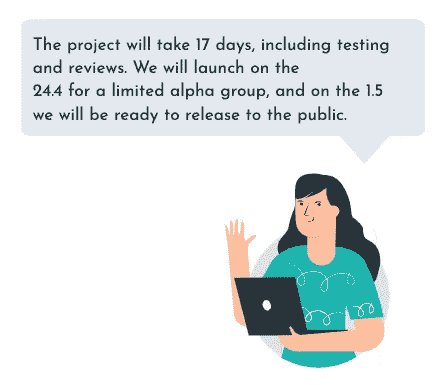

# 埃塔的艺术

> 原文：<https://levelup.gitconnected.com/the-art-of-eta-6ec69664ee89>

如何为你的特性给出精确的开发时间估计

克里斯汀·休姆在 [Unsplash](https://unsplash.com?utm_source=medium&utm_medium=referral) 上拍摄的照片

# 许下你无法兑现的承诺

想象以下场景:Greg 是一家初创公司的前端开发人员。他被赋予了一项新的功能。他的经理 Anne 正在问他估计时间。Greg 检查了设计并估算了“5 天”。安妮对他表示感谢，并继续向她的经理汇报。

Greg 和我们大多数人一样，做了他一直做的事情——试图估计他将花费的总时间，并给出一个非常粗略的估计。
这个问题？这项功能实际上将花费 Greg 14 天的时间。它需要由 QA 测试，由设计师和产品经理评审，并逐渐发布到测试组，直到发布完成。

结果呢？Greg 开始开发这个功能，但由于一些他“无法预测”的问题，他一直在推迟发布日期。为了腾出时间，他不得不在周末工作，他的经理安妮对这种拖延感到沮丧。

如何避免这种情况？很简单——Greg 应该在给出 ETA 之前完成适当的技术设计流程，更好地与 Anne 沟通。

# 什么是“埃塔”？

ETA 代表预计到达时间。在开发领域，它通常指项目的预计到期日。当被要求给出一个 ETA 时，你被要求估计一项任务的**努力**和随后的**时间**它将花费你去完成它。

# 预计到达时间和截止日期有什么不同？

用技术术语来说，截止日期是项目必须完成的不可协商的日期。几乎没有协商最后期限的余地——大多数时候，它们是由外部因素设定的，如公开发布日期、活动、竞争、董事会和各种其他因素。

ETA 要灵活得多，它取决于你对特性的*内部*估计。顾名思义，这是一个*估计值*——它可能会有所不同，最终可能会更短或更长。这并不意味着给出准确的估计不重要；eta 依赖于 sprint 规划和其他部门的路线图。

# 为什么我要给出精确的估计？

## 这是一种罕见的反映你职业素养的技能

当你给出评估并始终如一地贯彻执行时，你会被认为更负责、更可靠、更专业、更技术化。你的经理依赖于你的评估——遵守他们意味着遵守你的诺言。

## 它制造更好的产品

您进行评估的过程将会带来更好的产品，因为您会花时间根据代码架构来计划它，而不会因为时间限制或事后拼凑而做出草率的决定。

# 获得良好的时间估计

给出一个好的评估的关键是在开发开始之前做出核心决策，确保回答任何公开的问题。

## 1.投机

每个特性都应该从一个合适的规格开始。规格是一个书面文件，通常由产品经理创建，详细描述特性。它通常会解释特性的动机和预计会产生影响的度量标准。它作为**特性需求的一个真实来源**,将描述用户流和 UI 的预期行为。

在没有规范的情况下开始技术设计过程是一个麻烦的处方，因为你将依靠*对设计的*理解或即兴陈述来工作——这可能与产品经理的愿景不匹配。

## 2.开球

启动会议是向所有将参与开发过程的人展示特性的会议。它有时先于可能在启动后创建的规范。会议的目标是展示特性并解释其动机；它将解决哪些难题？它针对的是哪些用户？

在会议期间，通常会提出一个初始设计或线框，并描述一般流程。所有利益相关者都应该出席这个会议——产品经理、设计师、开发人员(前端和后端)、QA 人员、BI 人员以及其他任何相关人员。这是一个让所有人了解特性、提问和提出潜在问题的机会。

## 3.技术设计

这就是奇迹发生的地方。技术设计是由开发人员对功能进行处理的过程。它将最终产生一份文件，详细说明需要进行的开发更改。
这是*你的*时间来规划你的代码架构，规划逻辑，并确保你明白你要构建什么以及如何构建。

在技术设计文档中，我建议写下以下内容，这将有助于您制定开发计划:

**特性描述** 描述特性以确保你理解主要目标和它将产生的影响。注意谁将是你的合作者——谁将做前端、后端、QA 或 PR 审查。

**目标用户
请确保您了解该功能是为哪些用户提供的，因为它可能会影响开发。**

**第三方工具** 了解你是否能够并且想要使用任何外部工具或软件包来实现特性的某些部分。比较各种选项，选择最符合您需求的选项。

**当前代码结构** 如果你正在重构一个已有的特性或者在一个已有的特性上添加新的特性，这是很重要的。理解当前的代码很重要，最好与原始代码所有者交谈，以便更好地理解它。

**API 契约** 决定后端/前端通信的 API；您需要从哪些路由创建或获取数据，以及响应对象看起来像什么。

**开发变更**(是的，这是最难的部分)规划好你的架构——应该添加的组件、对象类型、类、DB 变更、将要添加的文件。描述此功能将需要的代码中的主要变化。

**移动/商务智能/测试** 了解移动网络所需的任何变化，或者它与移动应用程序的关系(如果存在)。了解出于分析目的需要跟踪哪些事件，以及需要添加哪些单元/E2E 测试。

**任务分解** 将开发变更提取到有序的任务列表中。想一想为了使特性完整你需要采取的步骤，以及你执行这些步骤的逻辑顺序。这种分解可以在以后转化为你的任务管理平台上的任务(比如吉拉或 Asana)。

## 4.设计评论

设计评审是您的团队成员评审您所做的技术设计。它可以是一个会议，在这个会议上，您向其他几个开发人员展示设计评审文档，让他们给出反馈。如果做一个演示听起来有些过火，那么分享文档以供评论也可以。有时候，这是确保你没有错过任何东西并让另一双眼睛看到它的最后机会！

# 估计工作量

在您审查了技术设计并有了最终版本后，您可以开始评估整体工作。你应该从任务分解开始——将每项任务分解成更小的子任务，评估完成它们需要的时间。小的子任务比大的任务更容易估计。

当你有了带有工作量估算的任务和子任务列表，你就可以把它们加起来——这是你最初的估算。

考虑一下审查你的 PRs 所需要的平均时间。请确保将该时间添加到评估中，同时添加 QA 轮次、与设计师和产品经理一起评审或团队工作流程中的其他流程的时间。如果你正在钻研一个不熟悉的代码库或者第一次使用一个新工具，我也建议你多花些时间。

# 给出最终的估计

现在是时候做出你的估计(假设是 14 天)并在日历上展开了。只计算工作日(没有周末)，并考虑短时间、假期或会议繁忙的日子，在这些日子里你不会做很多事情。这就是你的最终预计到达时间！

# 传达预计到达时间

当向你的经理或同事传达预计到达时间时，使用*日期*而不是天数。当谈到日期时，一切都将在什么时候完成就更加清楚了。我也建议解释发布过程，如果你的最终 ETA 是公开发布日期或首次发布。

## 推后

通常情况下，你会因为你的综合评估而受到反驳和质疑。当你基于技术设计给出一个深思熟虑的评估，并且包括测试、公关时间和评论时，就是这种情况——它变得更长和更现实。

我认为最好给出一个真实的、有计划的估计，这个估计可能会比一般的(大多数是错误的)短期估计长几天，而短期估计最终会膨胀和增长。

当面对推回时，让人们参考技术设计。解释你所做的过程和特征中包含的内容。理想情况下，让你的经理参与设计评审，这样他们就能确切地看到工作的组成部分。

祝你好运，享受这个过程！

*注:这是我给以色列女子科技团*[*Baot*](https://extend-tech.com/baot)*做的一个* [*Talk*](https://youtu.be/8Ozo4WYR5lE) *的总结。*