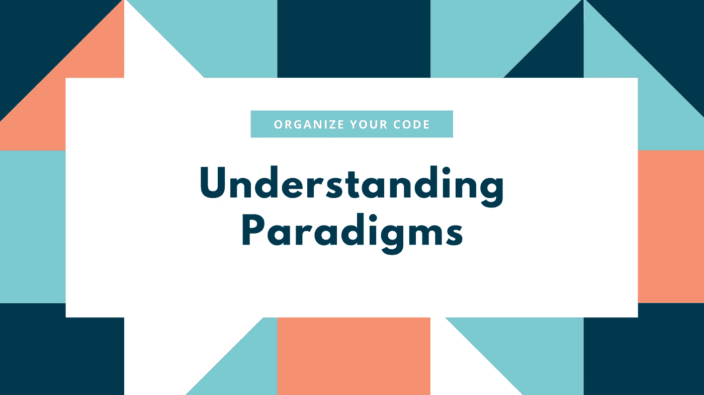

# 组织和编写代码的艺术:范例

> 原文：<https://levelup.gitconnected.com/the-art-of-organizing-and-writing-code-paradigms-c97ea429334d>

我一直强调我的文章围绕代码的'**可读性'**、'**可维护性'**、**、【可伸缩性'**，因为这些是决定我们正在开发的代码库质量的支柱。一个伟大的开发人员不是只知道多种语言和技术的人，而是一个精通并有效地利用他们所拥有的技术堆栈组织代码的人。

效率来自于**了解**不同的策略和技术，这些策略和技术使我们的代码库更加 *'* **'结构化'**和'**有组织'，**更重要的是**学习**根据项目的**范围**和**规模**引入哪种技术。

这些技术包括使用'**架构'**、**、'模式'**和'**范例'**，帮助我们将我们的应用拆分和组织成多个更小的组件/片段，这促进了'**可重用性'**、**可读性'、**、**可扩展性'、**以及、**可维护性'**。

在本文中，我们将讨论'**范式'**'是什么，为什么，以及如何。

## 什么是范式？

> 范式是一种构造、组织和编写代码的方式。

在这个现代时代，机器和语言变得如此强大，以至于它们可以很容易地理解和执行我们的代码，甚至忽略我们的某些错误，但正如一句古老的格言所说的那样—

> 任何傻瓜都能写出计算机能理解的代码。优秀的程序员编写人类能够理解的代码。”—马丁·福勒

范例允许我们编写更加**结构化、组织化、**和**可理解的代码。**它们使得应用程序中的数据流和状态变化更加“可预测”。

我们知道，编写任何程序的目的都是为了解决一个特定的问题，我们可以有多种方法来解决这个问题。因此**、范型**可以被视为解决问题或开发应用**的**‘方法】**。**

这些**【范例】**或**【方法】**大致分为以下几类

1.  **命令式范式，和**
2.  **陈述范式。**

## 命令范式

在**命令式**编程中，我们编写的逻辑是关于如何解决问题的一步一步的指令。开发人员必须编写一个完整的'**算法'**，这将产生预期的结果。

让我们用一个例子来理解它——下面定义的函数将使用“**命令式范式”简单地对数组中的每个值进行平方。**

**注意** —出于演示目的，我将使用 Javascript。你可以使用任何你想要的语言。**范例**的使用与语言的选择无关(*语法可能不同*)。

**命令式编程**

在上面的例子中，我们对循环使用了一个“**”，在这里我们需要指定**初始条件**(*I = 0*)**测试条件**(*I<values . length*)**步骤**将如何更新( *i++* )等等，以得到想要的结果。所以，在**命令式**编程中，我们必须更加关注**如何**。**

## 陈述范式

在**声明式**编程中，我们编写的逻辑将给出我们想要的结果，而无需编写逐步指令或**算法**。例如，下面定义的函数将使用'**声明范例'**作为 **—** 来解决上述问题

**声明式编程**

在上面的例子中，我们不需要指定**初始条件**、**测试条件**、**更新步骤**等来得到想要的结果。' **map** '方法会自动算出来。所以，在**声明式**编程中，我们必须更加关注**什么**。

**重要—**

*   在**命令式范例**示例**、**中，我们直接对**‘值’**数组**进行了更改。**但是在**声明性范例**示例**，**中，我们使用了另一个变量**‘squared values’**来存储期望的结果，因为——
*   在**命令式**编程中，允许直接改变原来的**状态** ( *值*)，但在**声明式**编程中，不建议直接改变**状态**。如同
*   对**状态**的直接更改使得我们的代码更少'**可预测'**，因为**状态**可以从应用程序的不同部分直接操作，而**声明性** **范例**使得我们的代码更少'**可预测**'和'**可管理**'。
*   **命令式**编程比**声明式**编程更能提高你解决问题的技能，因为概念逻辑被用来编写**算法**。另一方面，**声明式**编程使得开发过程更快。
*   **命令性的**代码很容易变成**广泛性的**和**迷惑性的**，这也增加了出错的风险，使得调试代码变得困难。另一方面，**声明性**代码比**短**，更容易理解和调试。

因此，两种**范式**都有各自的优缺点，但是学习为您的应用选择正确的**范式**的艺术将使您作为一名开发人员成长，这将来自于试验和经验。

**命令式** **范式**最流行的例子是— **过程式**和**面向对象编程、**和**声明式** **范式**是— **功能式**和**逻辑式编程**。

最后一点，有些语言只支持一种**范式**的使用，如 **Smalltalk** (面向对象) **Haskell** (函数式)，也有一些语言促进多种**范式**的使用，如 **Javascript** 、 **Python** 、 **C++** 、 **Java**

本文到此为止。**面向对象**和**功能性** **编程**将在后续文章中讨论。如果你觉得这篇文章有帮助，请告诉我。敬请期待！！！