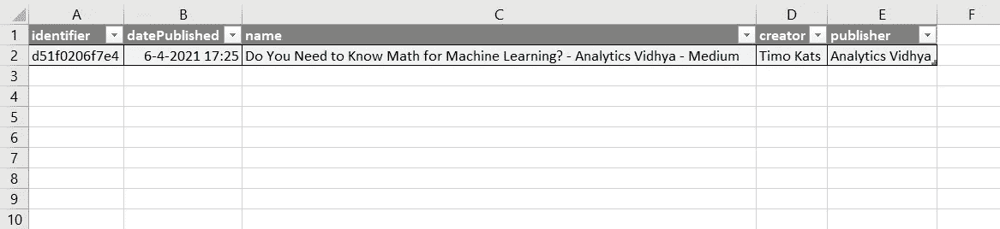

# 网络搜集的艺术

> 原文：<https://levelup.gitconnected.com/the-art-of-webscraping-716a69916c>

## 如果数据是新的石油，那么网络搜集就是新的压裂法


雷蒙·克拉文斯在 [Unsplash](https://unsplash.com?utm_source=medium&utm_medium=referral) 上拍摄的照片

## 介绍

大约 15 年前 [Clive Humby](https://en.wikipedia.org/wiki/Clive_Humby#:~:text=In%202006%2C%20Humby%20coined%20the,it%20cannot%20really%20be%20used.) 创造了一个短语“数据是新的石油”。这句话后来被麦可尔·柏默进一步阐述，他说就像石油一样，数据只有在正确处理后才是有用的。而且，石油和数据的共性不止于此，因为就像石油一样，数据也有供应链。

这个供应链始于从给定来源获取数据。迄今为止，获取数据的最大来源是互联网。最近的计算估计，2020 年互联网总容量为 40 兆字节。这么多零啊！

为了释放这些海量数据的潜力，我们需要以一种可用于进一步分析的方式获取和格式化这些数据。这个过程通常被称为**网络抓取**。在本文中，我们将通过收集和格式化我不久前写的一篇名为；“机器学习需要懂数学吗”。

[](https://medium.com/analytics-vidhya/do-you-need-to-know-math-for-machine-learning-d51f0206f7e4) [## 机器学习需要懂数学吗？

### 是啊！…不…这很复杂…

medium.com](https://medium.com/analytics-vidhya/do-you-need-to-know-math-for-machine-learning-d51f0206f7e4) 

## 获得所有需要的工具

有许多方法可以使用从网站收集数据，但在本文中，我们将使用 Python。Python 是一种非常流行的编程语言，它有许多对网络抓取非常有用的库。本文中使用的库有: [BeautifulSoup](https://pypi.org/project/beautifulsoup4/) ，请求，json 和 re。

默认情况下，Python 环境中唯一可能不包含的库是 BeautifulSoup。如果您想将这个库添加到您的环境中，只需使用 *Python 包安装程序*(又名 pip)。如果您使用 PyCharm(或任何其他 IDE ),那么请遵循他们的软件包安装指南。

```
pip install beautifulsoup4
```

安装完包之后，我们可以开始编写 scraper 了。这里唯一真正的需求是我们想要从中抓取数据的页面的 URL(重申一下；我前面提到的文章)。您可以想象，对于大型 webscrapers 来说，为了收集某个域中的大量页面，可以将这个 URL 自动化，但是在这个例子中，我们将只使用一个页面。

```
from bs4 import BeautifulSoup
import requests, json, reurl = "https://medium.com/analytics-vidhya/do-you-need-to-know-math-for-machine-learning-d51f0206f7e4"page = requests.get(url)
soup = BeautifulSoup(page.content, 'html.parser')
```

## 获取数据

安装并设置好您的环境后，您可以开始抓取 URL。重要的是要记住，网站本质上是由浏览器翻译成网页的大量文本。要了解这篇文章的内容，只需在这篇文章上点击`f12`。那是一大堆行话！

在浏览所有这些文本时，需要记住的一条重要规则是，没有找到所需内容的黄金法则。网站存储数据的方式不同，如果你想抓取它们，你必须适应这一点。

这对于中等的文章也是一样的。经过一段时间的修补和搜索，我发现 medium 将其数据保存在 html 标签`<script data-rh="true" type="application/ld+json">` 和`</script>`之间代码顶部的 json 字符串中。

这是一个网络抓取的好机会，当你自己尝试这个过程时，认识到这一点是很重要的。为了将这个 json 字符串从代码的其余部分中分离出来，我们可以简单地使用字符串索引将其剪切出来。为此，请使用下面的代码片段。

```
**def** get_json(soup):
    index_1 = soup.find('<script data-rh="true" type="application/ld+json">')
    index_2 = soup.find('</script>', index_1)
    json_string = soup[index_1 + 50:index_2]
    **return** json.loads(json_string)soup = str(soup) # required to use string functions
json = get_json(soup)
**for** item, value **in** json.items():
    print(item, value, sep=' = ', end='**\n\n**')
```

这输出了 medium 在这个 json 中提供的所有元数据(很多！).

```
@context = http://schema.org

@type = NewsArticle

image = ['https://miro.medium.com/max/1200/1*IHv0J-i2WvawIxU9MEAe8Q.png']

url = https://medium.com/analytics-vidhya/do-you-need-to-know-math-for-machine-learning-d51f0206f7e4

dateCreated = 2021-04-06T15:25:58.210Z

datePublished = 2021-04-06T15:25:58.210Z

dateModified = 2021-04-06T18:36:25.041Z

headline = Do You Need to Know Math for Machine Learning? - Analytics Vidhya - Medium

name = Do You Need to Know Math for Machine Learning? - Analytics Vidhya - Medium

description = Machine learning has become a popular field in the tech industry. Nowadays almost the exclusive majority of computer science related studies have a machine learning course in their curriculum. Most…

identifier = d51f0206f7e4

keywords = ['Lite:true', 'Tag:Machine Learning', 'Tag:Computer Science', 'Tag:Programming', 'Tag:Python', 'Tag:Math', 'Publication:analytics-vidhya', 'Elevated:false', 'LockedPostSource:LOCKED_POST_SOURCE_UGC', 'LayerCake:3']

author = {'@type': 'Person', 'name': 'Timo Kats', 'url': 'https://timokats.medium.com'}

creator = ['Timo Kats']

publisher = {'@type': 'Organization', 'name': 'Analytics Vidhya', 'url': 'https://medium.com/analytics-vidhya', 'logo': {'@type': 'ImageObject', 'width': 208, 'height': 60, 'url': 'https://miro.medium.com/max/416/1*66g0UGKgu4oopIC0ahQuXw.png'}}

mainEntityOfPage = https://medium.com/analytics-vidhya/do-you-need-to-know-math-for-machine-learning-d51f0206f7e4

isAccessibleForFree = False
```

## 格式化数据

既然已经获得了数据，我们可以开始格式化它了。由于数据是从 json 字符串中提取的，这实际上并不必要，因为 json 已经是一种很好的格式了。但是，在这个例子中，我们将数据重新格式化为一个 csv 文件，包含以下字段:标识符、发布日期、名称、创建者、发布。为此，我们首先需要从 json 文件中选择这些字段，然后将它们写入 csv 文件。让我们从第一部分开始。

当查看收集的 json 字符串中的字段时(参见上面的代码片段),很明显有些字段有多个值，而有些字段是单个的。因此，我们需要做一些定制的搜索来获得我们想要的值。此后，这些值被转换成字典。这最后一部分不是强制性的，但它确实使将数据写入 csv 文件变得容易多了。

```
selected_fields = [**'identifier'**, **'datePublished'**, **'name'**, **'creator'**, **'publisher'**]
data = {}
**for** field **in** selected_fields:
    **if** field == **'creator'**:
        data[field] = json[field][0]
    **elif** field == **'publisher'**:
        data[field] = json[field][**'name'**]
    **else**:
        data[field] = json[field]
```

既然数据已经加载到字典中，我们最终可以将其导出到 csv 文件中。

```
csv = open(**'medium_article.csv'**, **'a'**, encoding=**'utf-8'**)
**for** key **in** data.keys():
    csv.write(key + **','**)
csv.write(**'\n'**)
**for** value **in** data.values():
    csv.write(value + **','**)
```

最后，我们有了一个包含前面提到的字段的 csv 文件！因为数据中只有一行，这可能看起来有点乏味，但是想象一下对给定出版物中的所有文章都这样做。对于许多与媒体文章相关的数据科学项目来说，这可能成为一个非常好的数据源！



excel 中创建的 csv 文件的屏幕截图

## 最后的话

这篇文章有望展示网络抓取是多么简单和有用。如果您想使用本文中提供的代码在您自己的 webscraper 上工作，请随意，下面给出了本文中使用的代码的完整版本。感谢您阅读本文！