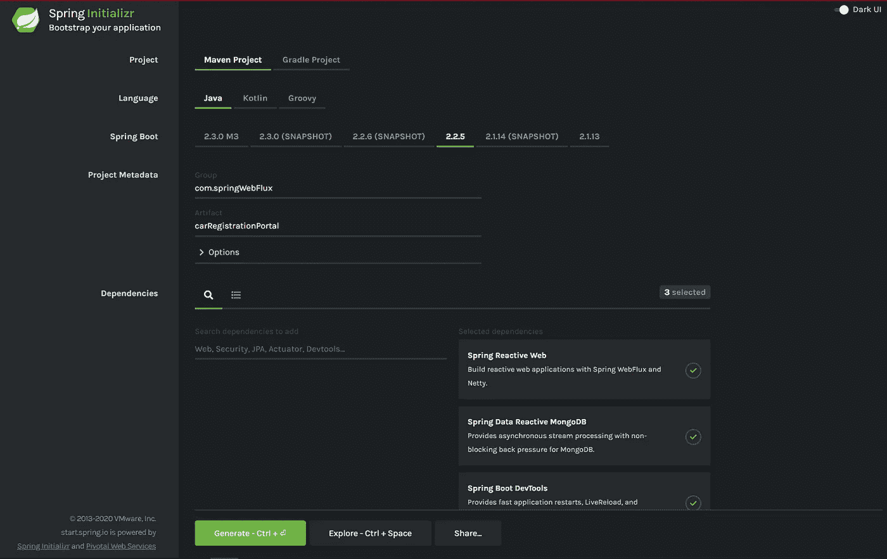
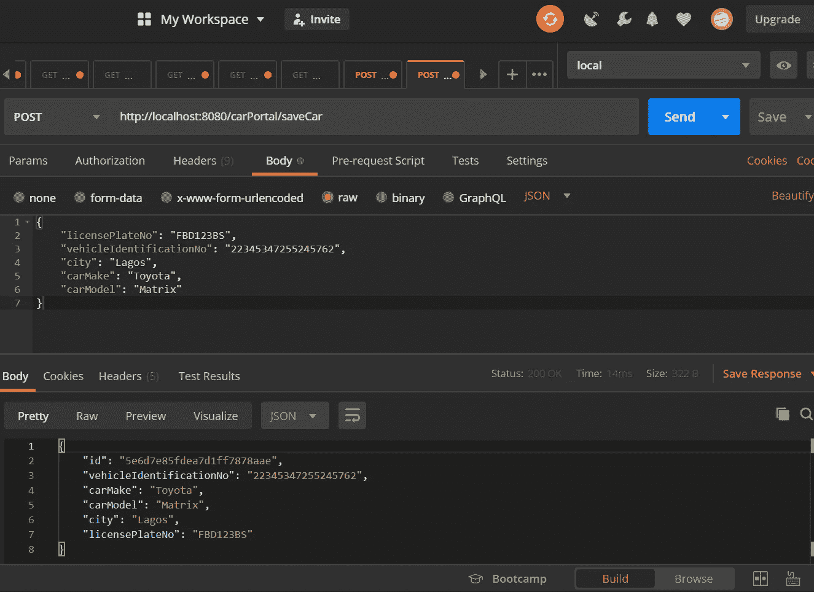
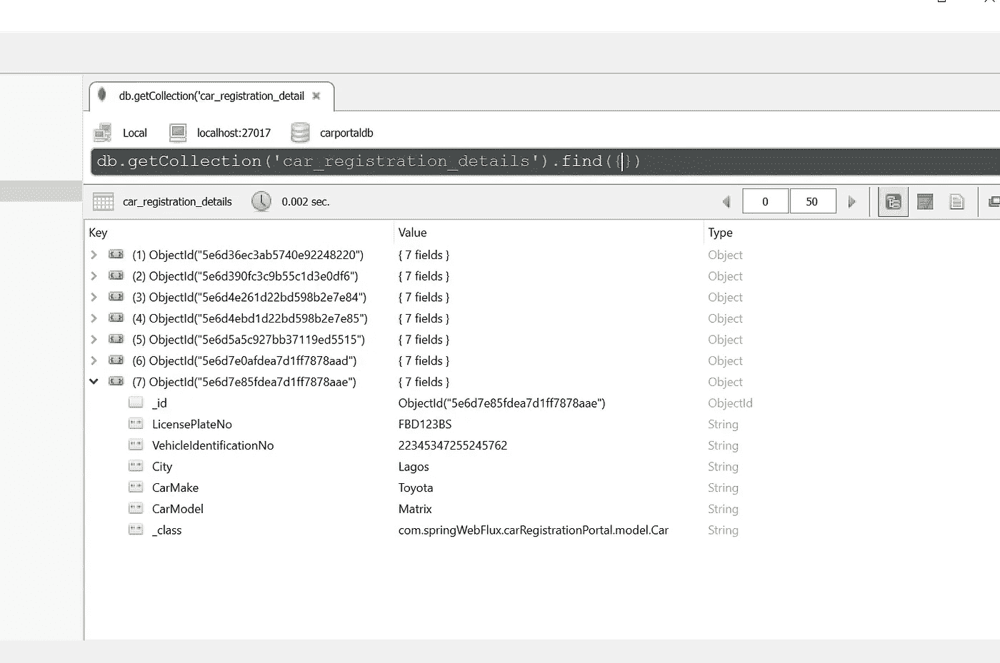

# i-Rob 的异步故事

> 原文：<https://levelup.gitconnected.com/the-asynchronous-tale-of-i-rob-64bcfe48575f>

了解反应流和 Spring WebFlux 的基础知识

照片由[亚历山大·奈特](https://www.pexels.com/@agk42?utm_content=attributionCopyText&utm_medium=referral&utm_source=pexels)从[派克斯](https://www.pexels.com/photo/high-angle-photo-of-robot-2599244/?utm_content=attributionCopyText&utm_medium=referral&utm_source=pexels)拍摄

让一个看起来像人类的机器人听你的请求，并在特定的时间框架内执行它们，这不是很好吗？让我们称我们想象中的机器人为 i-Rob(想不出更好的名字了)。i-Rob 可以在特定的时间内，比如一个小时内，按照你的要求打扫卫生、做早餐和洗衣服。然而，i-Rob 需要完成清洁，然后继续做早餐，然后按顺序整理衣物。只要 i-Rob 在一个小时内完成全部三个任务，你就好了。这太棒了，下一个场景变得更有趣了。

i-Rob 同时执行所有三项任务。因此，在这种情况下，i-Rob 足够直观地为早餐烧开水，同时将脏衣服放入洗衣机，开始洗衣，继续清洗，最后足够聪明地知道水已烧开并完成早餐，所有这一切都在 40 分钟内完成。太好了！做同样的工作，效率更高，时间更短。这正是反应式编程的概念。

反应式编程促进了异步、非阻塞和事件驱动的数据处理方法。

现在想象一下，你分配的任务比 i-Rob 在一段时间内能处理的还要多，i-Rob 告诉你…“哦，我的责任已经够多了；但是，一旦我完成了前面的任何一项任务，我就会开始下一项任务”。通过这种方式，i-Rob 不会承担超过它一次可以完成的任务，从而使它效率低下。这简称为**背压**。

# 背压

这个特性是控制生产者和消费者之间流量的反应性方法。生产者在这种情况下是你，消费者是我。为了避免某些问题，消费者只会在那个时间点从生产者那里得到他们需要的东西。一个很好的例子就是内存不足的问题。

现在让我们开始吧！

> 芝麻开门…

# 反应流

图片来自 [Pixabay](https://pixabay.com/?utm_source=link-attribution&amp;utm_medium=referral&amp;utm_campaign=image&amp;utm_content=332857) 的[约翰·霍华德](https://pixabay.com/users/jonbonsilver-236141/?utm_source=link-attribution&amp;utm_medium=referral&amp;utm_campaign=image&amp;utm_content=332857")

Reactive Streams 是为具有非阻塞背压的异步流处理提供标准的一项倡议。反应流 API 定义了四个接口:

## 出版者

发布者是根据订阅者的需求发出有序元素的提供者。

它只有一个方法。

Publisher 只有一种方法

# 订户

接收从发布者发出的事件。

它有四种方法。

预订，下一次，错误，完成

正如您从方法名中可以猜到的，它们可以根据需求执行不同的操作。

# 签署

它定义了发布者和订阅者之间的连接。它有两种方法，请求数据和取消需求。

两种方法—请求和取消

# 处理器

处理器代表一个处理阶段，它既是订阅者又是发布者，并遵守双方的约定。

处理器

# 弹簧网流量

Spring WebFlux 使用 reactor 库实现了无阻塞的反应流。这意味着它的所有操作都是非阻塞的，并且支持背压，如上所述。它使用 Netty 作为内置服务器来运行反应式应用程序。

为了确保应用程序是完全反应性的，它的所有组件必须是非阻塞的。因此，本质上，控制器、客户机和数据库都必须是非阻塞的。

Spring WebFlux 有两个主要发行商:Mono 和 Flux。

# 单声道的

单声道只返回 0 或 1 个元素。这意味着您一次最多只能发布一个项目。

这是一个直观的表示:

单声道的

# 流量

通量返回 0 到 n 个元素。

流量

焊剂可以发射的元素数量没有限制。它会一直发出所有的元素，直到它到达终点，然后相应地发出通知。

为了更好地展示以上观点，让我们用 Spring WebFlux 编写一个简单的反应式程序。我们将使用 MongoDB 作为数据库创建一个汽车注册应用程序。

# **让我们开始**

我们首先使用 [Spring 初始化器](https://start.spring.io/)创建一个新项目。请确保添加“Spring Reactive Web”、“Spring Data Reactive MongoDB”和“Spring Boot 开发工具”作为必需的依赖项。

见下文:

生成后，将项目导入任何合适的 IDE。我将在本教程中使用 IntelliJ。

POM 文件如下所示:

pom.xml

让我们创建将公开可用端点的控制器类。

CarController 包含五个端点(getAllCars、saveCar、getCarById、updateCarById 和 deleteCar)

接下来，创建“Car”模型类。@Document 注释将确保在数据库中创建名为“car_registration_details”的集合。

汽车模型

扩展 ReactiveMongoRepository 的汽车仓库。

汽车服务。

MongoDB 配置将放在您的“application.properties”中。

本地主机的 Mongo 数据库设置

和主类。

主类

现在运行应用程序，并继续使用合适的 rest-client 测试任何端点。

邮差请求拯救一辆新车:

保存汽车

MongoDB 上捕获的汽车细节

恭喜你！！您已经成功设置了您的第一个完全反应式应用程序。

感谢您的宝贵时间！

> **资源**

源代码:[汽车-注册-申请](https://github.com/Oyeyinka/car-registration-app)