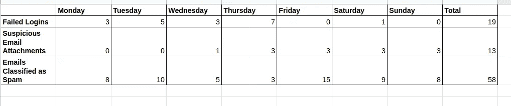
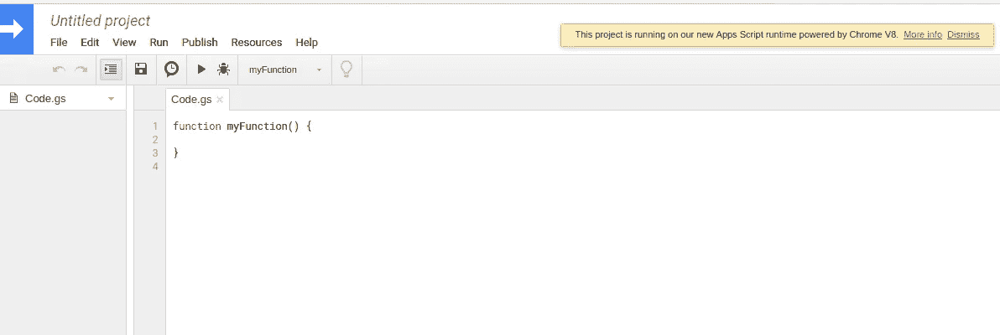
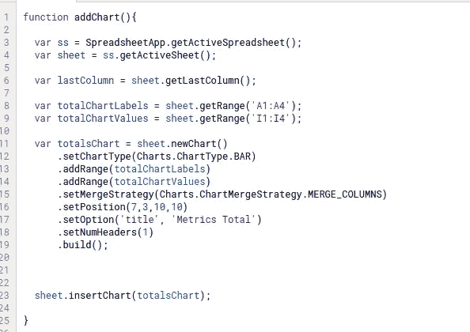
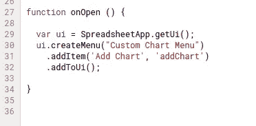
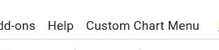
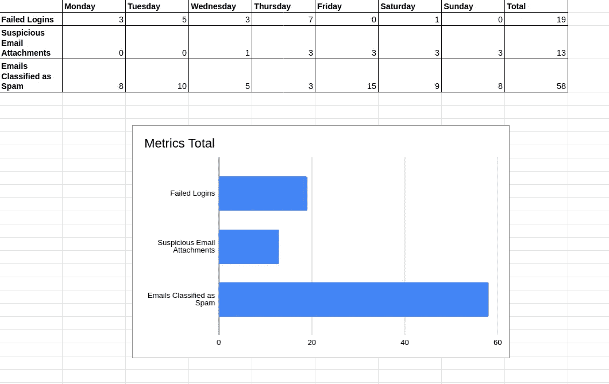

# 应用程序脚本的自动化世界

> 原文：<https://levelup.gitconnected.com/the-automated-world-of-apps-script-7e1553c3fcac>

斯蒂芬·菲利普斯的照片

“忙碌”最近已经成为一种新的趋势，虽然忙碌绝对没有错，但富有成效仍然是努力工作的人的第一清单。虽然高效意味着努力工作，但也意味着聪明地工作。

如果你每天都在使用谷歌服务，尤其是谷歌表单、谷歌文档，而你从未听说过应用脚本，那么我可以说:“欢迎使用所有自动化的东西”。

## 什么是应用程序脚本？

Apps Script 是 Google 提供的一个工具，可以让您构建解决方案来促进协作和提高工作效率。它允许您编写脚本和创建自定义函数来自动化您的部分工作。它可以让你集成许多不同的谷歌应用程序，使它们可以互相访问。

这意味着你可以为你的谷歌文档创建一个附加组件，你可以通过点击一个按钮从你的谷歌管理安全仪表板检索数据到你的谷歌表，你可以建立一个 Hangouts 聊天机器人，如果你认为你需要从你的谷歌应用程序中自动化，你会问自己“我可以自动化吗？”，我就不麻烦你了，答案大概是肯定的。

## 给我应用程序脚本标题

要立即开始使用 Apps Script，您需要了解以下几点:

*   您可以编写两种类型的脚本，*出站脚本*和*入站脚本*。**出站脚本**意味着您可以重用该脚本，并将其应用于几个 Google 应用程序，而**入站**意味着该脚本附加到特定的应用程序。例如，如果您通过在浏览器中键入 *sheets.new (* 另一个技巧)来打开一个新的 Google Sheet，然后从那里单击**Tools->Script Editor**，这将把您带到可以编写脚本的窗口，这种类型的脚本称为 inbound，因为您是从文档内部编写的。另一方面，如果您通过导航到您的驱动器来打开它，并从那里打开**New->More->Script Editor**，您将创建一个出站脚本，该脚本可以附加到您的驱动器或文件夹中您从中打开脚本的所有文档。
*   你可以在[脚本项目目录](https://script.google.com/)中找到你所有的脚本

我知道，这看起来不是很多，但真的，这是你开始使用 Apps Script(和一些基本的 JavaScript 知识)所需要知道的。网上有大量的 Java 脚本课程，浏览这些课程可以更新你的知识，甚至可以帮助你开始使用 Apps Script 编写你的第一个脚本。

## 基本应用程序脚本项目

如果你仍然有疑问，不相信我，直到你看到它，这里有一个快速的项目，让你走上探索自动化事物宇宙的轨道。

让我们打开一个新的 Google 工作表并创建一个表格。创建的表包含一周的数据，其中失败的登录、可疑的电子邮件附件和被分类为垃圾邮件的电子邮件是被跟踪的指标。

我们要做的是创建一个图表，我们将使用表中的最后一列和第一列为我们提供该周这些指标的统计数据。这不是科幻小说，但是这个工具的强大之处在于，只要我们想点击一个按钮，就可以随时生成图表。

为此，我们从 Google 工作表的菜单中选择工具，然后点击脚本编辑器。这是应该打开的窗户。

在这里，我们将编写代码来获取图表。

为此，我们将编写两个函数。一个用于创建和定制图表，另一个用于从工作表的主菜单中生成图表。

这是第一个函数，我们在其中指定数据范围、将用于构建图表的列、位置、合并策略和标题。

这里的新功能是`SpreadsheetApp.getActiveSpreadsheet();` ，它只获取活动的电子表格，因此脚本知道您引用的是哪个工作表，然后`.getActiveSheet()`获取活动电子表格中的活动选项卡。在我们创建图表之后，使用函数`sheet.insertChart(chartName);`我们将构建好的图表插入到工作表中。

有两种方法可以将此图表插入工作表。通过在脚本编辑器中运行函数`addChart()`，通过选择函数`addChart()`并运行它，或者，更优雅的方式是打开工作表并直接在工作表中运行该函数。

方法是在电子表格中创建一个自定义菜单。这就是为什么我们需要第二个函数。

上面的函数创建了用户界面，并在电子表格中添加了自定义菜单。用`.addItem(‘Add Chart’, ‘addChart’)` 我们告诉这个函数，在我们的自定义图表菜单中，我们想要一个标题为“添加图表”的项目，它将执行 Add Chart 函数。

在脚本编辑器中执行`onOpen()`功能，在电子表格中创建以下菜单:

当我们单击“自定义图表”菜单时,“添加图表”按钮出现，当我们单击“添加图表”按钮时，这个自定义图表被创建并直接放置在工作表中。

此图表是从固定单元格创建的，但如果您愿意，您可以选择单元格，然后执行该函数。当然，您需要在之前对代码做一些修改。然而，当你深入到应用程序脚本和它所能做的一切，甚至天空也不是极限。

对于到达天空，这个文件是一个很好的出发点。