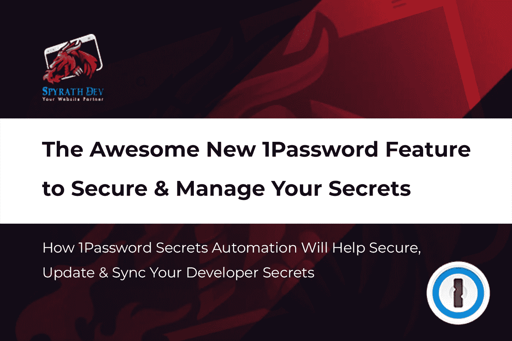
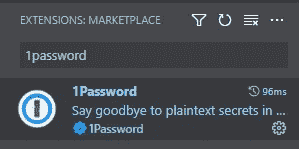
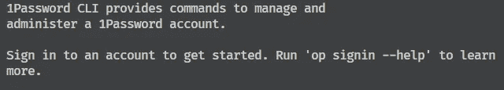
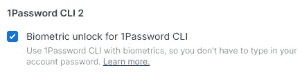
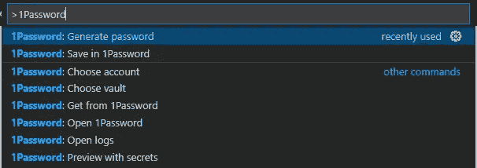
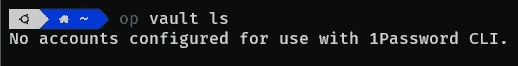

# 令人惊叹的新 1 密码功能，可帮助开发人员保护和管理您的秘密

> 原文：<https://levelup.gitconnected.com/the-awesome-new-1password-feature-for-developers-to-secure-and-manage-your-secrets-b583e47e8693>

## 1 密码保密自动化如何帮助保护、更新和同步您的开发人员密码



## **秘密的问题**

作为一名开发人员，您不可避免地会接触到秘密。敏感信息，例如 API 密钥、用户凭证和数据库 URL 等等。但是如何最好地保护它们呢？

毕竟，`.env`文件只是一个隐藏的文本文件。能够访问服务器或开发文件系统的黑客将能够读取这些信息，并且通常在记录时会泄露环境变量。

Docker secrets 等替代软件的问题在于，它们依赖于你在所有项目中使用特定的工具或软件。它不是跨平台的。

保持更新也是一个挑战。如果您在开发机器或服务器上修改了您的秘密，那么您也需要在生产中改变它。这在团队工作中尤为普遍。如果您可以在开发和生产中轻松地保护您的秘密，并在团队中共享它们，会怎么样？

密码管理器 [1Password](http://1password.com) 最近发布了一个很棒的新功能来解决这个问题:[1 password Secrets Automation](https://1password.com/products/secrets)。

## **什么是 1 密码保密自动化？**

1 密码保密自动化是指 1 密码能够安全地存储、同步和检索密码的方法。它背后有一系列不同的工具、扩展和插件，允许你在任何需要的地方使用秘密，比如代码编辑器和云服务器等。

其核心是秘密引用。机密引用是 1Password 存储机密的数据形式。它们由三部分组成:保管库、项目和字段。保管库指的是 1 您存储密码的保管库，项 1 密码条目和字段的名称，存储密码的字段的名称。

一个秘密参考大概是这样的:`op://Vault1/Sample API Key/api_key`。机密引用是您代码中的内容，1Password 会将其转化为您的真实机密。

## **我们如何将 1 密码集成到我们的代码编辑器中？**



1 密码与代码扩展

第一个问题是，我们如何开始 1 密码保密自动化？我们通常通过代码编辑器在本地或远程开始开发。Visual Studio Code (VS Code)是最受欢迎的代码之一，有一个扩展允许我们使用 1Password 来存储我们的秘密。

首先，我们需要通过 VS 代码扩展市场安装 1Password 扩展。打开 VS Code 并转到 Extensions 选项卡。在搜索中键入 1 密码并安装扩展。

## 安装 1 密码 CLI



1 密码 CLI 介绍文本

如果您之前没有使用过 1Password 的开发人员端，则会在右下角出现一个弹出窗口，通知您未安装 CLI。

1Password CLI 是 1Password 的命令行界面，是包括 1Password Secrets Automation 在内的大多数开发人员集成所必需的。点击按钮:[打开安装文档](https://developer.1password.com/docs/cli/get-started/#install)，按照 OS(操作系统)的说明进行操作。

安装 1 密码 CLI 后，VS 代码上将出现另一个弹出窗口，提示您选择帐户。点按您想要使用的帐户并验证您自己。



1 密码 CLI 的生物识别解锁选项

您不仅仅需要使用您的密码来验证 VS 代码扩展。您还可以在 1 密码>设置>开发者中为 1 密码 CLI 启用生物识别解锁，以使用您已经在 1 密码桌面应用程序中使用的任何生物识别身份验证方法，如指纹(触控 ID 和 Windows Hello)、PIN、面部识别(Face ID 和 Windows Hello)或 Apple Watch。

最后，选择您希望使用的 1 密码存储库。如果你与一个团队合作，那么选择一个共享库，这样你的秘密就可以在你的团队成员之间共享。这就是 1 密码扩展的全部设置。

## 创建新的秘密引用



1 密码与代码扩展命令

我们可以创建一个新的密码参考，使用 1Password 为我们生成安全密码(这对于为 API 密钥或其他开发人员软件等服务创建用户凭据非常有用),或者在 1Password 中保存现有密码，并用密码参考替换现有密码。

要创建新的安全密码并将其保存为秘密参考，请打开命令调板并访问 1Password: Generate Password。输入参赛作品的标题后，1Password 将生成一个安全密码，将其存储在您的保管库中，并将秘密参考添加到您的代码中。

## 将现有机密转换为机密引用

API 密钥秘密参考示例

要在 1 密码中保存现有密码，请突出显示您希望添加的密码。如果您希望将多个秘密添加到同一个条目中，因为它们是相关的(例如，使用需要 URL、电子邮件和 API 密钥的 API，然后使用多个光标突出显示它们)。

接下来，打开命令调板，转到 1 密码:保存在 1 密码中。对话框将要求您输入条目的名称和字段的标题。一旦完成，你的秘密将被替换为秘密参考。

点击参考，显示 1 密码项目名称、创建日期、上次更新时间和密码内容。

该扩展的一个很大的优点是，如果我们已经在代码中添加了秘密，该扩展将检测到它们，并建议我们应该将它们转换为秘密引用。点击 1 密码中的保存以启动该流程。

## **但是我们的远程服务器呢？**

1Password Secrets Automation 如何在远程无头服务器上工作？当我们将代码部署到生产环境中时，通常是在云中的远程无头服务器上。

由于它们是无头的并且没有 GUI(图形用户界面)，我们无法在它们上安装 1Password Desktop 来验证我们自己，因此我们无法检索我们的秘密参考的正确值，是吗？

1 密码 CLI 有解决方案。

## **在远程服务器上设置 1 个密码 CLI**



1 密码客户端无账户提示

首先，在您的远程服务器上安装 1Password CLI，就像我们在您的主机操作系统上安装 VS 代码一样。然后运行`op vault ls`。这将提示您添加 1 密码帐户。我们无法进行生物识别认证，因为我们使用的是远程服务器，但我们可以手动添加我们的帐户。

接下来，添加您的 1 密码帐户的登录地址。如果您在默认地区使用个人或家庭账户，这将是[https://my.1password.com](https://my.1password.com/)。您可以检查您的登录地址，方法是打开 1Password 桌面应用程序，单击左上角的用户名>设置另一台设备，并记下您的登录地址。

您还需要您的电子邮件地址、密钥和主密码。这些都可以在您的 1 密码帐户条目中找到。如果您已经为您的帐户激活了 2FA(双因素身份验证),还可能会要求您输入六位数字的身份验证代码。

一旦您添加了您的帐户详情，请按要求运行`eval$(op signin)`。最后，您需要再次输入密码，然后登录到您的 1 密码帐户。运行`op vault ls`进行确认。您现在应该会看到您的 1 密码保管库列表。

## **在远程服务器中集成 1 密码**

带有秘密引用的 Env 配置文件示例

在生产环境中，通常所有的秘密都位于一个 env 文件中。在这种情况下，我们可以使用 1 密码机密引用将该文件安全地提交到源代码管理，这样每个人都可以访问最新版本(否则团队成员将会遇到运行最新代码而没有更新机密的问题)，而不会暴露他们的真实值。

通过 VS 代码创建一个新的 env 文件并创建相关的秘密引用，或者您可以通过远程服务器中的 1 密码 CLI 来完成此操作。如果您想使用 CLI 方法，请访问[文档](https://developer.1password.com/docs/cli/create-item)。

最后，在运行应用程序时，我们需要将 1 密码 CLI 的 run 命令与您的应用程序的 start 命令结合使用，从而将秘密引用替换为真实的秘密值。`op run —-env-file .env (your app's start command)`。输出任何秘密值的日志现在应该显示`<concealed by 1Password>`。

## 恭喜您，您已经设置了 1 密码保密自动化

恭喜你。现在，您已经在代码编辑器和远程服务器中设置了 1 密码加密自动化。您的秘密是安全的，可以在多个环境中安全地共享和更新。

```
**Want to Read More?**Subscribe to my [newsletter](https://medium.com/subscribe/@louisefindlay23) for more technical guides and tutorials for developers.
```

## 资源

[1Password Visual Studio 代码公告](https://blog.1password.com/1password-visual-studio-code/)

[1 密码 VS 代码文档](https://developer.1password.com/docs/vscode)

[开始使用 1 密码 CLI 2](https://developer.1password.com/docs/cli/get-started)

[手动登录 1 密码](https://developer.1password.com/docs/cli/sign-in-manually)

[将机密加载到配置文件| 1 密码 CLI 文档](https://developer.1password.com/docs/cli/secrets-config-files)

# 分级编码

```
Thanks for being a part of our community! More content in the [Level Up Coding publication](https://levelup.gitconnected.com/).Follow: [Twitter](https://twitter.com/gitconnected), [LinkedIn](https://www.linkedin.com/company/gitconnected), [Newsletter](https://newsletter.levelup.dev/)**Level Up is transforming tech recruiting** 👉 [**Join our talent collective**](https://jobs.levelup.dev/talent/welcome?referral=true)
```