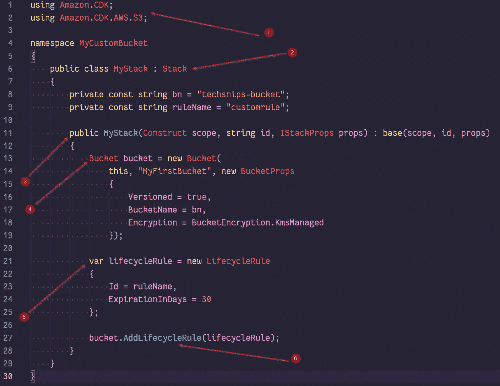
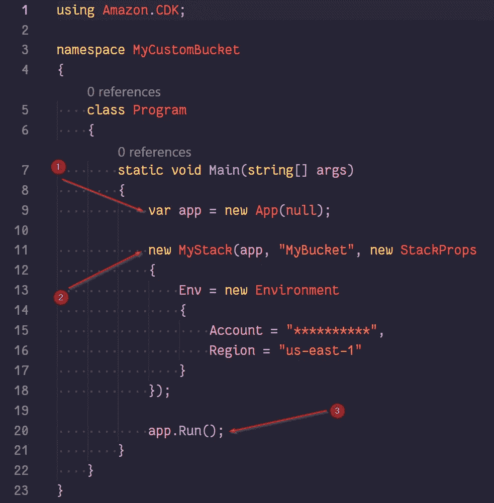
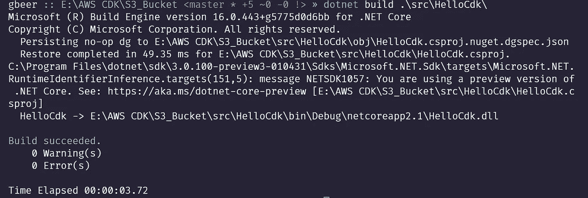
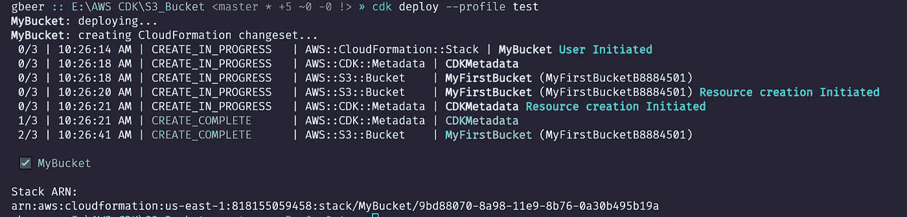
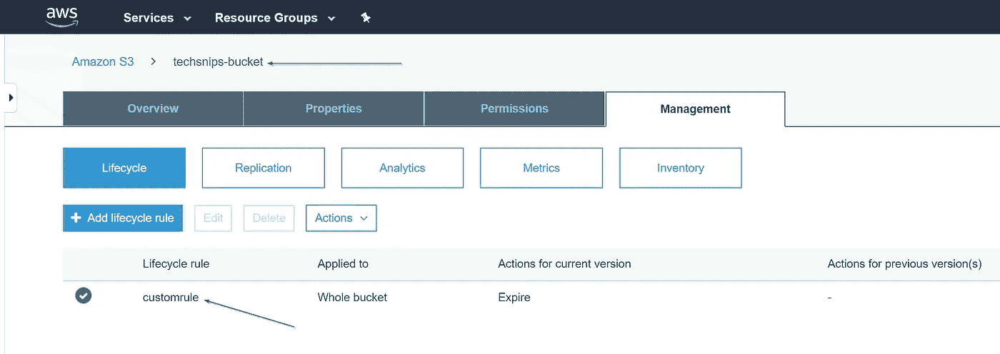
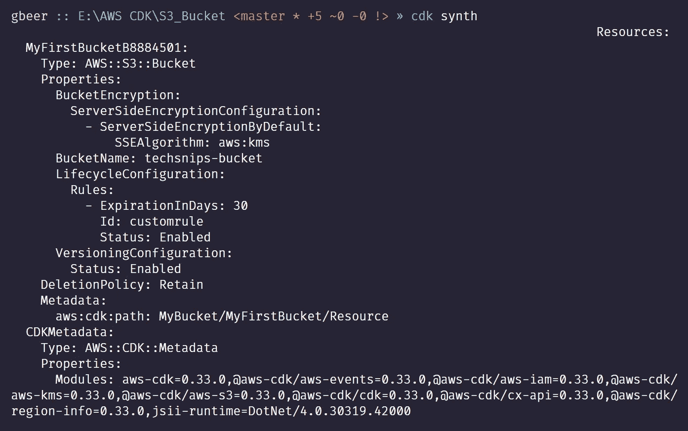

# 使用 C#的自动气象站 CDK

> 原文：<https://levelup.gitconnected.com/the-aws-cdk-using-c-ce959f678347>

如果您想在 AWS 中自动化基础设施的供应，您可以使用 CloudFormation。您可以使用 CloudFormation 模板语言编写一些甚至所有的基础设施，这种语言是用 YAML 或 JSON 编写的。JSON 和更多的 YAML 非常易读，也提供了一种记录基础设施的方法。JSON 和 YAML 的缺点是缺乏通用语言的抽象和重用，比如 C#、GO、PowerShell 等等。很多时候，其中一种语言的几行代码比 JSON 或 YAML 的要多得多！

亚马逊似乎注意到了这一点，随着 Pulumi 的出现，它开发了 AWS 云开发工具包(CDK)。对于 AWS 客户来说，CDK 的优势在于它是一个开源项目，所以不需要更多的成本。

AWS 云开发工具包(CDK)是一个软件框架，允许您使用通用语言编写代码，然后通过 CloudFormation 提供这些代码。从版本 0.33.0 开始，您可以在 CDK 中使用五种不同的通用语言。它们是 TypeScript、JavaScript、Java、Python 和我将要演示的 C#。

我不会详细介绍如何开始设置您的环境，以使用您选择的语言的 CDK，因为 AWS 本身做得很好，这在这里详细介绍[开始使用 AWS CDK](https://docs.aws.amazon.com/cdk/latest/guide/getting_started.html) 。

我将通过创建一个应用程序，初始化，编译和部署来讲述。我将演示的应用程序将创建一个 S3 桶，它将被版本化，命名和加密。此外，我将添加一个生命周期规则，使任何内容在 30 天内过期。

使用 CDK 时需要考虑三个部分，它们是构造、堆栈和应用程序。AWS CDK 中的一切都是一个构造。一个构造是一个 AWS 云组件，我们将使用它来创建一些东西，在这个例子中，是一个 S3 桶。栈是你的根结构。它将包含您用来定义 AWS 环境的构造。CDK 的主要工件是应用程序，它是部署堆栈的包装器。

开始需要您创建一个新文件夹并初始化一个空的 Git 存储库。完成后，使用 AWS 云开发工具包命令行调用命令`cdk init --language csharp`创建应用程序。

我将使用的两个主要文件当然是 program.cs 和我们自己的堆栈 cs 文件。编译应用程序的工作已经完成。NET core 的 dotnet 命令行。同样值得指出的是，这个演示是使用。网芯 3 预览版 5。

在定义 Program.cs 文件之前，让我们创建我们的堆栈。我将展示完整的 MyStack.cs 文件，并分解主要区域。

1.  C# using 指令添加了使用所需构造来构建环境所需的名称空间。AWS CDK 有许多可用的名称空间，这里详细介绍 [CDK。净参考](https://docs.aws.amazon.com/cdk/api/latest/dotnet/api/index.html)。要添加名称空间，可以使用 dotnet 命令行。`dotnet add package amazon.CDK.AWS.S3`就是这样做的。
2.  通过继承 stack 类可以创建自己的堆栈。在这个例子中，我创建了名为 MyStack 的派生类。
3.  我们用派生类 **MyStack** 继承的堆栈构造函数签名有三个主要参数，你会在所有构造上注意到:
    **scope** —这个堆栈的父类，通常是一个程序实例。
    **名称** —云形成堆栈的名称。
    **道具** —堆栈属性。
    这些是在我们初始化我们的 **MyStack** 类时填充的，我们将会讲到。
4.  bucket 也是一个构造，它是 **amazon.cdk.aws.s3** 名称空间的一部分。bucket 构造是堆栈的一个子元素。MyFirstBucket 是存储桶构造的 id。bucket props 类( **BucketProps** )为我们提供了命名 bucket 的选项(第 17 行)。对于这个桶，我启用了版本控制和加密。
5.  生命周期规则的声明发生在第 21 行，其中定义了 **Id** (规则的命名)和**expiration nings**的属性。
6.  bucket 类上的方法 **AddLifecycleRule** 被调用来添加我们之前在步骤 5 中创建的生命周期规则。

现在我们有了 **MyStack.cs** 文件，我们可以设置 **program.cs** 。这是如何做到的:

1.  从 App 类创建一个新对象。当使用`cdk init`命令创建一个新项目时，这行代码已经存在。这是一个 CDK 计划的代表。
2.  我们现在使用我们编写的 MyStack 类来创建我们的 bucket。 **StackProps** 类用于允许我们定义 AWS 帐户 Id 和将要创建存储桶的区域。通过以这种方式利用 **StackProps** 类，通过建立一个新的环境，我们可以跨多个帐户和区域创建存储桶。
3.  最后，调用 run 方法来调用构建我们的 bucket 的过程。

为了将所有这些整合在一起，我们需要构建项目及其所有依赖项。这是通过从我们的 Csharp 文件、 **program.cs** 和 **MyStack.cs** 的目录中运行 dotnet build 命令来完成的:

我们现在有一个成功的**构建**，所以让我们部署我们的应用程序吧！从根文件夹运行，运行`cdk deploy`命令:

上面的屏幕为我们提供了部署和步骤的详细信息。注意，除了创建 bucket 之外，我们还创建了 CloudFormation 堆栈。从控制台内部检查，我可以看到我们的工作是成功的:

两个箭头指向我们附加的 bucket 名称和定制生命周期规则。

查看我们的代码创建的 CloudFormation 模板可以通过 CDK 命令行输入`cdk synth`来完成:

我希望这篇文章展示了 AWS CDK 的巨大潜力。AWS 的文档已经有了很大的改进，其中 CDK 的参考文献最为突出。您可以对 CDK 做更多的事情，甚至可以创建自己的构造。所以，看一看，开始建设吧！

如果你想亲自尝试这个演示，显示的代码在我的 GitHub 帐户上。 [GitHub 链接到项目](https://github.com/Graham-Beer/AWS_CDK_S3Bucket)

*原载于 2020 年 1 月 12 日*[*https://Graham-beer . github . io*](https://graham-beer.github.io/2020/aws-cdk-csharp-8/)*。*