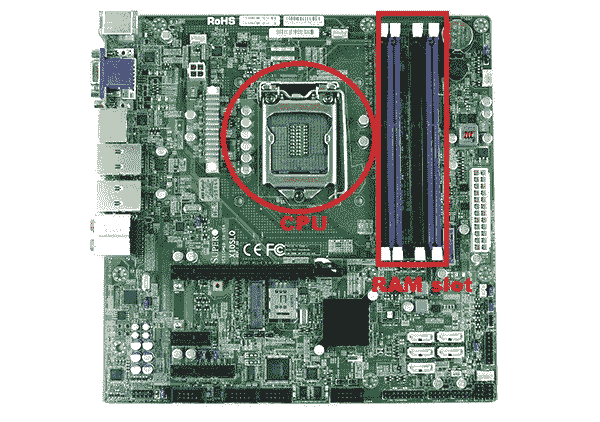

# 操作系统的基本概念

> 原文：<https://levelup.gitconnected.com/the-basic-concepts-of-operating-systems-os-975f8993d9d5>

作者图片

# 介绍

操作系统(OS)利用一个或多个处理器的硬件资源向系统用户提供一组服务[1]。

操作系统是一个**程序**，可以在硬件和软件之间起到中间作用。

图一。操作系统关系[2]

# 基本要素

在[顶层](https://www.clicours.com/a-top-level-view-of-computer-function-and-interconnection/)，计算机由一个**处理器(CPU)** 、**主存储器(RAM)** 和输入/输出( **I/O)** 组件组成，每种类型都有一个或多个模块。这些组件以某种方式相互连接，以实现计算机的主要功能，即执行程序。因此，有四个主要的结构要素[1]:

图二。主板[3]

**1。处理器**:控制计算机的运行并执行其数据处理功能。当只有一个处理器时，它通常被称为中央处理器(CPU)。

**2。主存储器:**存储数据和程序。这种存储器通常是易失性的；也就是说，当计算机关机时，内存中的内容就会丢失。相比之下，即使计算机系统关闭，磁盘存储器的内容也会保留。主存储器也被称为真实存储器或主存储器。

**3。I/O 模块:**在计算机及其外部环境之间移动数据。外部环境由各种设备组成，包括辅助存储设备(如磁盘)、通信设备和终端。

**4。系统总线:**提供处理器、主存储器和 I/O 模块之间的通信。

图 3。计算机组件:顶级视图[1]

观看我在 YouTube 上关于计算机架构的视频:

# 高速缓冲存储器

虽然高速缓存对操作系统是不可见的，但它与其他内存管理硬件相互作用。

我们面临着速度、成本和内存大小之间的权衡。理想情况下，主存储器应采用与处理器寄存器相同的技术构建，使存储器周期时间与处理器周期时间相当。这一直是一个成本过高的策略。解决方案是通过在处理器和主存储器之间提供一个小的、快速的存储器，即**高速缓存**【1】，来利用局部性原理。

图 4 描述了高速缓存/主存储器系统的结构。主存储器由多达 **2** 的 **n** 次方个可寻址字组成，每个字都有一个唯一的 **n 位**地址。出于映射的目的，该存储器被认为是由多个固定长度的块组成，每个块有 **K** 个字。

那就是:

摘自[1]

图 4。缓存/主存结构[1]

**缓存原理:**

高速缓存包含主存储器的一部分的副本。当处理器试图读取存储器的 [**字节**](https://en.wikipedia.org/wiki/Byte) 或**字**时，会进行检查以确定该字节或字是否在高速缓存中。如果是，该字节或字被传送到处理器。如果不是，则由某个固定数量的字节组成的主存块被读入高速缓存，然后该字节或字被传送到处理器。由于引用的局部性现象，当一个数据块被提取到高速缓存中以满足单个内存引用时，很可能许多不久的将来的内存引用将指向块中的其他字节[1]。

图 5。高速缓存和主存储器[1]

# 成分

操作系统的所有组件都是为了使计算机的不同部分协同工作而存在的。所有用户软件都需要通过操作系统才能使用任何硬件，无论是简单的鼠标或键盘，还是复杂的互联网组件。

**内核:**内核是 OS 的核心；它对计算机的所有硬件设备提供最基本的控制。它管理 [RAM](https://en.wikipedia.org/wiki/Random-access_memory) 中程序的内存访问，它决定哪些程序可以访问哪些硬件资源【4】。

图 6。内核[5]

**内存管理:**在一个[**uniprogramming**](https://dextutor.com/uni-vs-multi-vs-time-sharing/#:~:text=Uni%2Dprogramming%20%E2%80%93%20In%20uni%2D,forms%20a%20batch%20of%20jobs.)**系统中，主内存分为两部分:一部分用于操作系统(常驻监控器，内核)，另一部分用于当前正在执行的程序。在一个 [**多道程序**](https://whatis.techtarget.com/definition/multiprogramming#:~:text=Multiprogramming%20is%20a%20rudimentary%20form,simultaneous%20execution%20of%20different%20programs.&text=To%20the%20user%20it%20appears,executing%20at%20the%20same%20time.) 系统中，内存的“用户”部分必须进一步细分以容纳多个进程。细分的任务由操作系统动态执行，称为内存管理[1]。**

****

**表 1。内存管理技术[1]**

**操作系统管理内存，并负责将该进程放入主内存[1]。**

**无论如何，处理器硬件和操作系统软件必须能够将程序代码中的内存引用翻译成实际的物理内存地址，反映程序在主内存中的当前位置[1]。**

****中断:**几乎所有的计算机都提供了一种机制，通过这种机制，其他模块(I/O、内存)可以中断处理器的正常序列。提供中断主要是为了提高处理器利用率[1]。**

****

**图 7。中断引起的存储器和寄存器的变化[1]**

**程序执行、模式、虚拟内存、多任务、磁盘访问、文件系统、网络、安全、用户界面和设备驱动程序是操作系统的其他组成部分[4]。**

**希望这篇文章对你的计算机基础知识有所帮助；请关注我们的媒体账号，将这篇文章分享给你的朋友和同事。**

# **确认**

**作者感谢 [Hossein Araghi](https://hossara.com/) 和 [Hamed Younesian](https://dehcode.com/teacher/hamedunesian/) 两位好心的助手教我一块主板的某些部分。**

# **参考**

**[1]操作系统:内部结构和设计原则(第 8 版)，William Stallings**

**[[2]https://www . uow . edu . au/student/learning-co-op/technology-and-software/operating-systems/](https://www.uow.edu.au/student/learning-co-op/technology-and-software/operating-systems/)**

**[3][https://www . alamy . com/stock-photo-computer-motherboard-printed-circuit-board-173091365 . html](https://www.alamy.com/stock-photo-computer-motherboard-printed-circuit-board-173091365.html)**

**[4]https://en.wikipedia.org/wiki/Operating_system**

**[5]https://www.javatpoint.com/what-is-kernel**

# **作者:Melanee**

**联系人: [GitHub](https://github.com/Melanee-Melanee)**

** [## Melanee-Melanee -概述

### 我的链接:💎我是 Melanee，是一个在计算机和自然科学之间的跨学科领域非常积极的人…

github.com](https://github.com/Melanee-Melanee)**