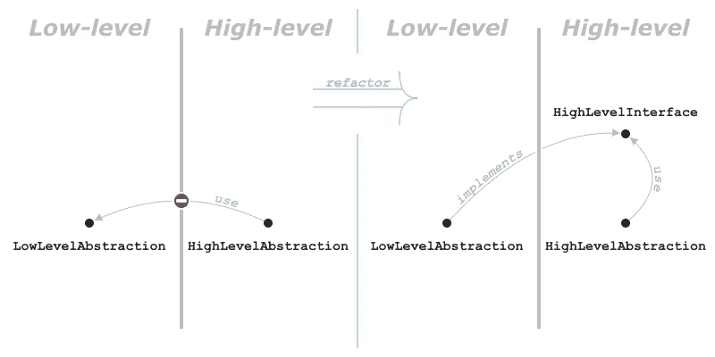
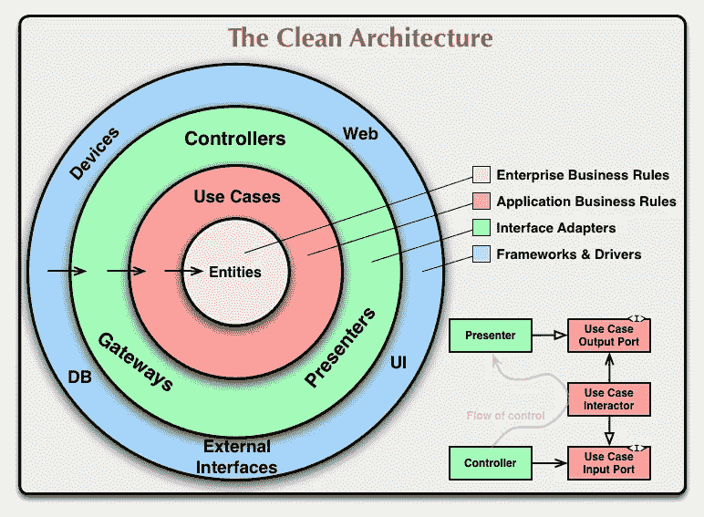
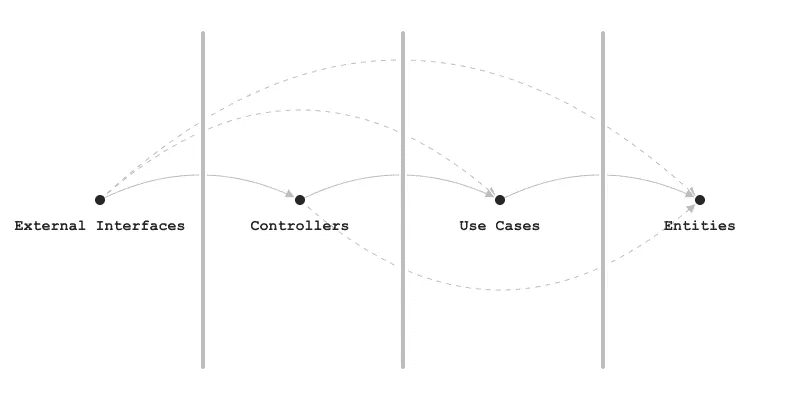
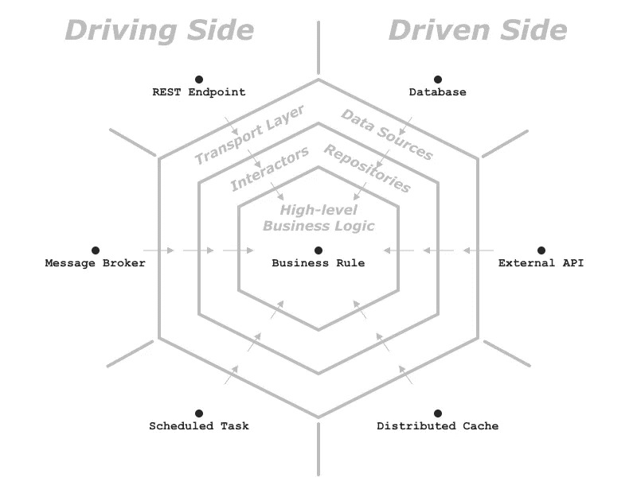

# 软件架构的基本前提

> 原文：<https://levelup.gitconnected.com/the-basic-premise-of-software-architecture-cfd6a69d3e16>

# 摘要

在一个系统的软件架构中，所有的抽象都可以通过它们的抽象级别来分类；即，根据它们与系统域的接近程度:

*   **高层**抽象，代表领域语言和业务规则；
*   **低级**抽象，表示各种实现细节。

抽象也可以按照我们期望它们在系统生命周期中改变的频率来分类:

*   **易变的**抽象概念，即经常变化；
*   **稳定的**抽象，很少改变。

整个软件架构规程都基于这样的假设:

> 高层抽象是稳定的

# 基本前提的重要性

为了认识到基本前提的重要性，让我们先来看看软件架构的定义。有多种相互竞争的定义，但出于我们的目的，我们可以使用以下定义:

> 一个系统的软件架构是一组抽象和它们之间的关系，以及管理这两者的法则，是对系统进行推理所需要的。

我们自然希望根据相应的领域语言来推理我们感兴趣的系统。因此，我们倾向于关注高层次的抽象，较少关注实现细节。我们也不想让不稳定抽象的涟漪扩散到我们的系统，把它撕裂。基本前提允许我们通过禁止从高级抽象到低级抽象的依赖性来实现这两个目标。知道了高层次的抽象总是稳定的，我们就不需要猜测我们的哪些抽象从长远来看是易变的。我们可以做一个合理的假设，所有的低级抽象迟早都会改变，但是高级抽象只会增加数量，很少会改变。

让我们看看这个前提是如何影响不同的建筑方法的。

*本文使用*[*NoUML*](https://medium.com/@volodymyrfrolov/nouml-afbb7f07f369)*符号。尽管这不是绝对必要的，因为符号是不言而喻的，如果您发现下面的图表有任何不清楚的地方，您可以参考符号的描述。*

# 从属倒置原则

依赖倒置是坚实的原则之一，它完全是从软件架构的基本前提中推导出来的。

请注意，术语“抽象”通常是模糊的，在不同的上下文中可能意味着完全不同的东西。在本文中，这个术语指的是任何软件元素或构造:类、接口、包、模块、微服务等。在依赖倒置原则的原始定义中，它只意味着高级接口，而低级抽象被称为“细节”术语“抽象”含义的区别对于本文的目的至关重要，因为它假设如果一个接口与领域语言中已知的任何东西都不对应，那么该接口可以是低级的。

记住这一点，下面是依赖倒置原则的原始语言定义:

> 高级模块不应从低级模块导入任何内容。两者都应该依赖于抽象(例如接口)。
> 
> 抽象不应该依赖于细节。细节(具体的实现)应该依赖于抽象。

通过引入新的高级接口，依赖性反转原则规定了从高级抽象到低级抽象的任何依赖性的反转方向。

NoUML 中的依赖倒置原理说明

正如我们在上面的插图中所看到的，依赖倒置原则强加了一个架构边界，并且禁止从高级到低级抽象的任何关系。这个架构边界的目标正是为了将稳定的高层抽象从易变的低层抽象中分离出来，只有保证所有的高层抽象都是稳定的，这才有意义。

# 干净的建筑

干净的架构为软件架构的基本前提增加了更多的粒度。它区分了从最高到最低的四个抽象层次:

*   企业业务规则
*   应用程序业务规则
*   接口适配器
*   框架和驱动因素

再次假设抽象级别越高，抽象就越稳定。

罗伯特·c·马丁的清洁建筑

清洁架构声明:

> 源代码依赖必须只指向内部，指向更高级别的策略。

NoUML 中干净的建筑插图

正如我们在这个图中看到的，干净的架构强加了不止一个而是三个架构边界，并且只允许从低到高的一个方向上的依赖。图中虚线箭头表示的所有从属关系都不是禁止的和隐含的。易变抽象的涟漪向依赖关系的相反方向传播。Clean Architecture 旨在清除企业和应用程序业务规则的高级语言中适配器、框架和驱动程序的低级术语的污染，并保护它免受低级抽象的影响。

# 波动遏制

低级别的抽象仍然可能极其不稳定。出于实际目的，我们还希望保护它们不受彼此影响，进一步阻止波动性在整个系统中蔓延。

六边形 Architecture⁴为图片增加了更多的粒度，禁止较低级别的抽象相互依赖，即使是在相同的抽象 level⁵中。

NoUML 中的六角形建筑插图

六边形架构中的低级抽象边界的粒度仍然由它们支持的业务案例决定。因此，较低层次抽象的易变性只影响同一抽象层次和更低层次上的一个业务案例。

# 结论

软件架构的基本前提允许不同的架构保护高层抽象免受低层细节的污染。同时，它还支持在某些架构边界内对易变抽象的包容，防止易变在整个系统中传播并将其撕裂。

# 参考

沃洛德梅尔·弗罗洛夫，2018。 [NoUML](https://medium.com/@volodymyrfrolov/nouml-afbb7f07f369) 。
罗伯特·c·马丁，2003。敏捷软件开发、原则、模式和实践。第 127-131 页。
罗伯特·c·马丁，2018。软件结构和设计的工匠指南。第 202-208 页。2005 年，⁴·科伯恩·阿利斯泰尔。[六角形建筑](https://alistair.cockburn.us/hexagonal-architecture/)。⁵·达米尔·斯沃坦，塞尔吉·马卡贡，2020。[为六边形架构的变化做好准备](https://netflixtechblog.com/ready-for-changes-with-hexagonal-architecture-b315ec967749)。