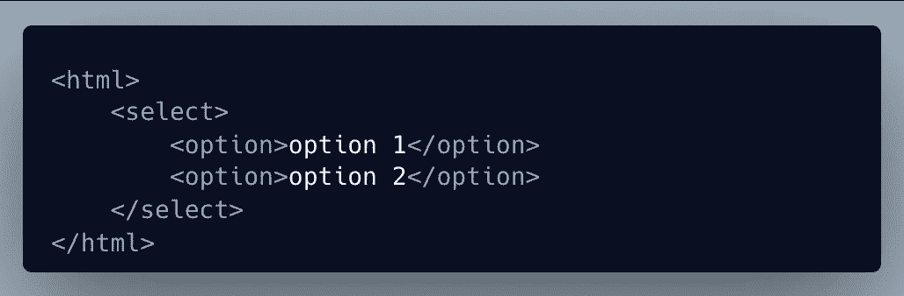
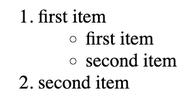

# HTML 的基础

> 原文：<https://levelup.gitconnected.com/the-basics-of-html-d7c856518ab7>

这是 HTML 基础知识的快速入门和参考文档。尽情享受吧！

所有格式正确的 HTML 文档都像上面的图片一样开始。它们有一个外部的`html`包装器，然后有多个子部分来布局页面。

第一个子部分是`head`标签。该子部分首先由您的浏览器加载，通常包括所需的所有依赖项。一些例子是页面标题、样式表、字体、样式块(如上所示)和其他库，如 jQuery。

第二小节是`body`标签，是网页主要内容的位置。您可以使用`header`来指定页面的标题，然后使用`main`来指定主要内容。从那里，您可以混合和匹配不同的 HTML 元素，向用户显示您的内容。

最后一个子部分是`footer`，这里是公司信息、联系信息或其他有用的参考资料。

*我将对下面的例子使用简写，但是注意内容应该放在嵌套在* `*html*` *标签下的* `*body*` *标签内。*

`div`

这可能是编写 HTML 时最常用的 HTML 元素。默认网页布局从上到下和从左到右渲染。`div`是一个`block`元素，这意味着默认情况下它将在自己的行上呈现。您可以使用 inline `style`或 CSS 来覆盖这种行为。

`span`

当您想要呈现一个`inline`元素时，`span`是您将触及的典型元素。一个`inline`元素将呈现在同一行上，不会中断到下一行。例如，多个`span`元素将呈现在同一行上，即使它们被构造在多行上。

`h1`至`h6`

这些是您的标题标签，可用于定义网页主要内容中的章节标题。`h1`标签是最大的，而`h6`标签是最小的，它们都具有默认的粗体样式。你也可以使用一个`div`,然后使用 CSS 样式化内容来完成类似的结果，但是这些提供了浏览器的一些默认行为。

`label`和`input`

这些元素是您接收用户输入的主要方式。大多数情况下，这些输入被嵌套在一个`form`元素中，这样信息就可以被发送到后端服务器。如果将`input`嵌套在`label`元素中并使用`for`属性，那么当有人点击`label`文本时，它会自动将焦点放在`input`中。

对于`input`的风格有我不同的`type`参数。最常见的是文本、密码、日期和复选框。点击查看完整列表[。](https://www.w3schools.com/html/html_form_input_types.asp)

`textarea`

该输入可用于大量文本，其行为类似于带有`label`的`input`字段，但可以动态调整大小。

`select`

这个元素是让用户从预定义选项列表中进行选择的方式。您可以用`label`做类似的嵌套，然后根据需要提供尽可能多的`option`元素。

`ol`和`ul`

这些元素是您使用 HTML 定义内容列表的方式。`ol`是一个有序列表，默认情况下会在其中包含的任何`li`元素的左边提供连续的数字。是一个无序列表，默认情况下会提供点。使用 CSS 可以覆盖这些默认选项中的任何一个。

请注意，您可以将每个列表嵌套在另一个列表中，这样您就可以像下面的示例一样处理列表的子部分。

`table`

如果您想将内容或数据组织到一个表格中，那么将这个元素与`tr`一起用于表格的每一行，将`th`或`td`分别用于标题或内容列。

`img`

使用`img`可以将图像添加到网页中，而`src`属性可以是外部图像的 URL，也可以是来自您自己的网页资源的本地引用。

请注意，如果您引用的 URL 不再存在，用户将会看到一个损坏的图像图标。

`a`

链接到其他网页或您自己网站中的其他页面会使用锚或`a`标签。为`href`属性提供一个有效值，并为您想要显示的文本提供一些文本。

`p`

写大段文字时，使用`p`或段落标签。你的浏览器会自动在`p`标签前后添加一个空行。

如果您想要加粗或斜体某些文本，请分别使用`b`或`italics`标签。

`button`

在你的网页中包含一个按钮就像使用`button`标签一样简单。为按钮提供您想要的文本，以及它应该是什么样的`type`。如果在`form`中使用，那么你通常会使用“提交”`type`。

如果您有希望从`button`触发的 JavaScript，请确保包含一个`name`或`id`以便可以引用。

如果你喜欢这篇文章，考虑[订阅 Medium](https://medium.com/@ascourter/membership) ！

如果你或你的公司有兴趣找人进行技术面试，那么请在 Twitter ( [@Exosyphon](http://twitter.com/Exosyphon) )上给我发 DM，或者访问我的[网站](https://andrewcourter.com/)。如果你喜欢这样的话题，你可能也会喜欢我的 [Youtube 频道](https://www.youtube.com/channel/UCx3Vist13GWLzRPvhUxQ3Jg)。如果你喜欢 3D 打印的东西，去看看我的 Etsy 商店。祝您愉快！