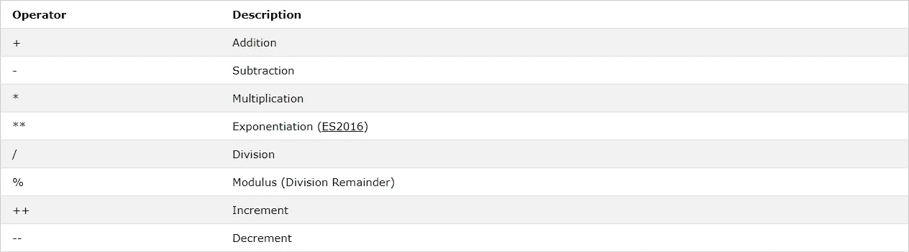
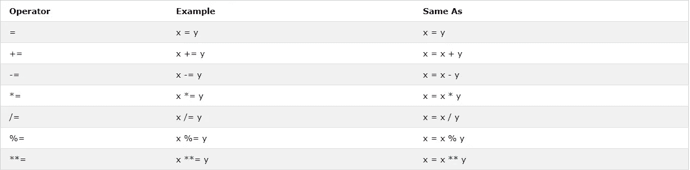
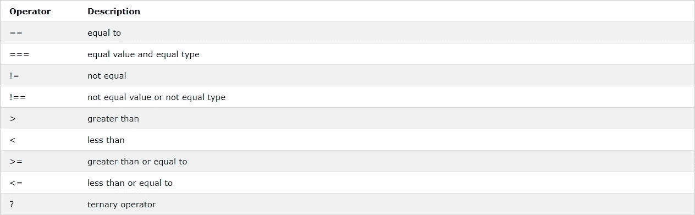
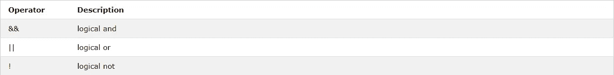
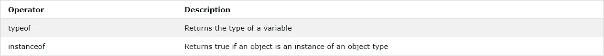

# JavaScript 运算符的基础知识

> 原文：<https://levelup.gitconnected.com/the-basics-of-javascript-operators-c00e50290300>

运算符是我们在代码中用来执行特定任务的符号。从简单的加减数字到比较代码中的数据类型。熟悉尽可能多的操作符不会有什么坏处，知道什么时候使用它们可以为您节省很多挫折和时间，并在编码时改善您的整体体验。今天我们将讨论最常见的方法以及如何使用它们。如果您需要回来查找一个操作符或者它是如何工作的，那么这篇文章也可以作为一个参考，因为有很多内容需要了解。

# 算术运算符

当你需要做一些数学和/或处理数字时，算术运算符是很有用的。这些可能是最容易理解的运算符，包括基本的数学运算，如加、减、乘、除等。下面你可以看到所有算术运算符的列表。

[来源](https://www.w3schools.com/js/js_operators.asp)

正如你所看到的，这些是基本的数学运算，在需要的时候会非常有用。为了了解它们的工作原理，我们来看一些简单的例子。

请记住，递增(`++`)和递减(`—-`)运算符会将值增加/减少 1。

# 赋值运算符

接下来我们有赋值操作符，它给变量赋值。这些操作类似于算术运算符，可以让我们做一些同样的事情，只是用不同的方式编写。

[来源](https://www.w3schools.com/js/js_operators.asp)

为了更好地理解赋值操作符的工作原理，我们来看一个减法赋值操作符的例子。

如果您猜测 6 将被打印到控制台，那么您是正确的。所有其他赋值操作符都以同样的方式工作，非常简单。如果您正在争论是使用算术运算符还是赋值运算符，请记住，当您处理变量时，使用赋值运算符要容易得多。

# 比较运算符

现在我们进入一些更复杂的操作符，需要更多的解释。首先，让我们看看所有不同的比较操作符及其描述。

[来源](https://www.w3schools.com/js/js_operators.asp)

这些操作符做许多不同的事情，所以为了使它们更容易理解，让我们把这个表分成三个部分。让我们首先从表格上看到的前 4 名运营商开始:`==`、`===`、`!=`和`!==`。

太好了！现在我们知道了`=`、`==`、`===`、`!=`和`!==`的区别。如果您仍然感到困惑，您可以自己研究一下这段代码，将我们的变量值更改为不同的数字，以查看控制台的反应。现在让我们来看看接下来的 4 个比较运算符:`>`、`<`、`>=`和`<=`。

现在剩下要看的就是三元运算符了。三元运算符分为三个不同的部分:条件、条件为真时的结果和条件为假时的结果。三元运算符非常有用，因为它们可以作为编写 if-else 语句的一种更快捷的方式。让我们来看一个三元运算符的例子！

正如你在这里看到的，我们把汽车的颜色变成了红色。三元运算符首先检查汽车是否是蓝色的。由于它不是蓝色的，因此为 false，三元运算符选择第二个表达式，而不是第一个表达式。

# 逻辑运算符和类型运算符

让我们以逻辑操作符和类型操作符结束。首先看逻辑操作符，只有 3 个，而且非常简单。

[来源](https://www.w3schools.com/js/js_operators.asp)

让我们深入一些简单的逻辑运算符示例，看看它们是如何工作的！

我们现在知道算术、赋值、比较和逻辑运算符是如何工作的了！剩下要介绍的是两个类型操作符，typeof 和 instanceof。第一个操作符 typeof 非常简单，它会告诉我们变量的数据类型是什么。第二个，instanceof 有点复杂，它将
“如果一个对象是一个对象类型的实例，则返回 true”。

[来源](https://www.w3schools.com/js/js_operators.asp)

最后，让我们看看操作符的类型和操作符的实例。

# 结束语

我知道这篇文章中有大量代码，可能会让人不知所措，但是请记住，这篇文章的目的是为 JavaScript 操作符提供参考，以防您记不住它们。如果你想了解更多关于操作符的知识，下面的视频将介绍所有的操作符，包括一些我在本文中没有提到的操作符，比如位操作符和字符串操作符。

*来源*:

[https://www.w3schools.com/js/js_operators.asp](https://www.w3schools.com/js/js_operators.asp)

[https://www . c-sharp corner . com/article/difference-between-and-in-JavaScript 2/](https://www.c-sharpcorner.com/article/difference-between-and-in-javascript2/)

[https://developer . Mozilla . org/en-US/docs/Web/JavaScript/Reference/Operators/instance of](https://developer.mozilla.org/en-US/docs/Web/JavaScript/Reference/Operators/instanceof)

【https://youtu.be/ULNJSTSJc7s 