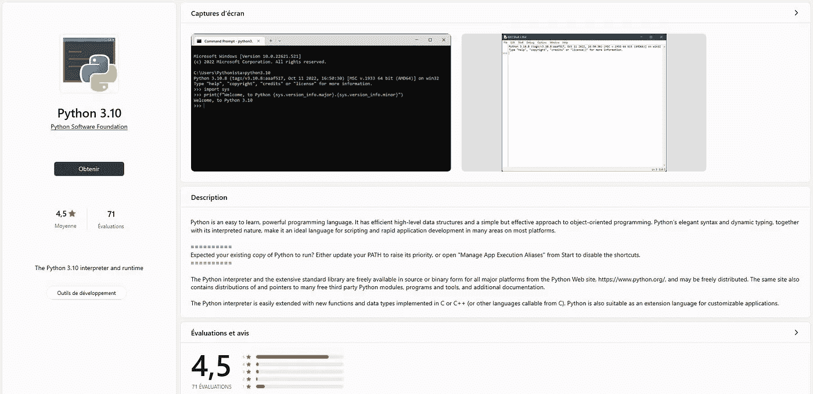

# 数据科学的 Python 基础

> 原文：<https://levelup.gitconnected.com/the-basics-of-python-for-data-science-7f9662e921d1>

## Python 的安装和主要概念

# Python 语言的介绍

Python 是一种流行的解释编程语言:用于 web、桌面应用、物联网、视频游戏和数据科学。

目前**在开发者社区最感兴趣的语言中排名第一**([TIOBE 排名](https://www.tiobe.com/tiobe-index/))。众所周知，它很容易学习，接近人类语言，甚至在一些欧洲国家的小学里教授。

此外，大多数软件开发人员说[文档非常好](https://www.python.org/)。

如果你想做数据分析或数据科学，学习 Python 是至关重要的，因为大多数数据团队都将 Python 作为他们的主要编程语言。

> 此外，数据可视化职位被称为入门级工作，因此这是开始数据分析或数据科学职业生涯的绝佳方式。

**在本文**中，我将介绍学习数据分析、数据科学和数据可视化所需的所有 Python 基础知识。

您可以利用 SQL 的基础知识和商业智能软件(如 Power BI 或 Tableau)来完成您将在这里学到的内容。


**用于数据科学的 Python 基础知识**，作者 mickal A(mid journey v4)

## 变量赋值和数据类型

您将为要赋值的变量命名。

Python 知道数字类型(整数、浮点数、小数、负数)、字符串和布尔值。

Python 还有许多更复杂的数据类型(您称之为“对象”)，以适应您的数据科学需求。

例如，您将使用“ **datetime”对象**来比较两个日期，而不是将出生日期存储为字符串。

## 用于调试的函数示例

您将使用函数 **print()** 进行调试:它允许显示任何变量。

它接受一个或多个用逗号分隔的变量:

## Python 中的数据类型概述

以下是 Python 中标准数据类型的列表和示例，因此一旦安装了 Python，您就可以尝试这些类型:


# 如何安装 Python

这取决于你使用的操作系统，是 Windows、Mac OS X 还是 Ubuntu。

> 如果你还不想安装 Python，使用[谷歌合作实验室](https://colab.research.google.com/)或 [Deepnote](https://deepnote.com/) 。

先说最流行的操作系统:微软 Windows。

## 检查您的 Python 安装

您可能已经在计算机上安装了 Python！

我的电脑上有以下输出:我已经安装了 Python，可以执行 Python 脚本。

```
❯ python --version
Python 3.9.1
```

要进行检查，请打开终端窗口(Mac OS X 上的终端，Microsoft Windows 上的 PowerShell)并执行以下操作:

```
python
```

> 这也是检查 Python 安装是否成功的方法。

## 在 Windows 上安装 Python

在 Microsoft Windows 上安装 Python 的最简单方法是使用 Microsoft Store。

打开搜索 Python，选择**最近的一个** (3.10 或 3.11):



我个人电脑上的例子

如果你需要一个完整的教程，你可以看看这篇文章:

[](https://medium.com/co-learning-lounge/how-to-download-install-python-on-windows-2021-44a707994013) [## 在 Windows 上下载、设置和安装 Python[2021]

### 在 Windows 中安装 Python 的分步说明

medium.com](https://medium.com/co-learning-lounge/how-to-download-install-python-on-windows-2021-44a707994013) 

## 在 Mac OSX 上安装 Python

虽然 OS X 附带了许多 Unix 实用程序，但熟悉 Linux 系统的人会注意到缺少一个关键组件:包管理器。[家酿](https://brew.sh/)填补了这一空白。

为了[安装 Homebrew](https://brew.sh/#install) ，打开`Terminal`应用程序，并运行该单行指令:

```
$ /bin/bash -c "**$(**curl -fsSL https://raw.githubusercontent.com/Homebrew/install/master/install.sh**)**"
```

该脚本将解释它将进行哪些更改，并在安装开始前提示您。

一旦你安装了 Homebrew，在你的`**PATH**`环境变量的顶部插入 Homebrew 目录。你可以通过在你的`~/.profile`文件的底部添加下面一行来实现:

```
export PATH="/usr/local/opt/python/libexec/bin:$PATH"
```

现在，您可以安装最新版本的 Python:

```
$ brew install python
```

如果需要更多信息，可以阅读本文的“Python 安装”一节:

[](https://medium.com/big-data-2/install-python-data-analysis-related-libraties-on-mac-osx-ac34fa6dc9) [## 在 Mac OSX 上安装 Python 数据分析相关库

### 包括 NumPy，SciPy，matplotlib，pandas，IPython

medium.com](https://medium.com/big-data-2/install-python-data-analysis-related-libraties-on-mac-osx-ac34fa6dc9) 

## 在 Ubuntu(或任何基于 Debian 的操作系统)上安装 Python

> 大多数时候，Python 已经安装在 Ubuntu 上了。

但是如果您需要安装它，请打开终端窗口并输入以下指令:

```
sudo apt update && sudo apt install python3
```

这个指令看起来非常简单，但是如果它失败了，您可以看看这篇文章中的另一个安装指南:

[](https://medium.com/hacking-and-slacking/managing-multiple-versions-of-python-on-ubuntu-20-04-46a0d810e087) [## 在 Ubuntu 20.04 上管理多个版本的 Python

### 在 Ubuntu 20.04 或更新版本上轻松安装和管理多个版本的 Python。

medium.com](https://medium.com/hacking-and-slacking/managing-multiple-versions-of-python-on-ubuntu-20-04-46a0d810e087) 

# Python 的基础知识

现在 Python 安装好了，你对 Python 是什么，为什么要学习 Python 有了基本的了解。

是时候学习处理数据所需的最基本的 Python 知识了:

*   功能
*   情况
*   环
*   用线串
*   和字典

开始了。

## 功能

编程语言最重要的兴趣之一是能够非常快速地执行大量简单操作！

> 当计算机科学为你的需要服务时，它会节省时间。

功能是允许执行一个或多个计算机操作的结构。

例如，假设您想在屏幕上显示目录中的产品特征。第一种选择是使用**打印**和**变量**:

在我的计算机上，我有以下输出(*在尝试示例*之前，不要忘记执行 ***python*** *):*


你有几种产品，所以你必须为目录中的每一种产品写下这些说明。下面是我们如何定义一个函数以及如何使用它:

一个函数有一个名称，这里是用关键字 **def** 定义的 **display_product** 。它可以接受可在功能块中访问的参数，这里是 4 个。

第一行称为函数定义，以“ **:** ”结尾:

```
def display_product(name, color, sizes, price):
```

接下来，您会找到函数的描述，使用带有三个“引号”字符的特定语法进行区分。该语句将被函数忽略，但被显示函数文档的 **help()** 函数使用。

```
def display_product(name, color, sizes, price):
 """Display product properties and price"""
```

> 您可能已经注意到，我们将代码指令移动了一个空格或制表符。事实上，Python 是一种使用缩进来定义操作执行顺序的语言。

函数的指令“移动”了一个关于其定义的制表符。如果你忘记正确组织你的指令，看看下面会发生什么:


对你最有帮助的消息是 **IndentationError** 警告:你弄乱了空格或制表符缩进，Python 不能理解指令流。

如果你想了解更多关于 Python 缩进的工作原理，你可以阅读这篇文章:

[](https://medium.com/geekculture/python-tips-how-indentation-works-8c3953b98c1a) [## Python 提示—缩进是如何工作的

### Python 中你可能不知道的缩进规则

medium.com](https://medium.com/geekculture/python-tips-how-indentation-works-8c3953b98c1a) 

函数可以返回一个或多个值，称为返回值。您用 **return** 关键字指定返回值:

## 情况

这些条件允许定义包含或排除数据的逻辑。在 Python 语言中，条件是“If，Else If，Then”类型，使用关键字 **if** 、 **elif、**和 **else** :

在我的电脑上，我有以下输出(*在尝试示例*之前，不要忘记执行***python****):*


定义函数时，条件(如循环)是可用的。例如，根据您的年龄决定是否允许您访问网站的功能:

**多个条件**

Python 语言允许您使用**、**和**或**关键字管理多个条件:

## 环

Python 语言允许您操作将在您创建或使用的函数中可用的元素列表。

**“for，in”语句**
第一个循环类型使用关键字对“for/in”，它将翻译为“对于列表中命名元素的每个元素”。

例如，考虑以下 Python 代码块:

**“while”语句**
关键字“while”在这里会翻译成“只要”。如果您只想列出一定数量的项目，这很方便。

例如，考虑以下 Python 代码块:

列表是 Python 中一种特殊的数据类型，它允许你列出和存储几个条目。

创建列表最简单的方法是使用“带括号的语法”。

例如，产品列表:

```
products = ['Polar socks', 'Evening dress', 'Bandana', 'Leggin']
```

有时，您可能还想访问每个元素的索引，即它在列表中的位置。为此，您将需要使用 **enumerate()** 函数:

**访问列表元素**
如果你只想访问列表中的某些元素，你必须使用它们的索引，即它们在列表中的位置。

这是不合逻辑的，但是列表从 0 开始，而不是从 1 开始。

例如，如果要显示“晚礼服”，则必须指定索引值 1，而不是 2:

```
print(products[1]) # "Evening dress"
```

您也可以选择**从特定索引**中检索所有元素，在这种情况下，您必须在索引后添加字符“:”:

```
print(products[1:]) # ['Evening dress', 'Bandana', 'Leggin']
```

最后，您可以通过使用**负索引**以相反的顺序访问列表的元素(例如，检索最后两部分):

```
print(products[-2:]) # ['Bandana', 'Leggin']
```

**在列表中添加和删除元素**
要向列表中添加元素，您将使用 **append()** 函数:

要从列表中删除一个项目，您将使用 **remove()** 函数，传递要删除的列表项目的值:

## **琴弦**

在 Python 中，单词被认为是字符序列，属于“字符串”类型，或者更确切地说是 **str** 。

```
type("Hello World") # str
```

这些序列被“引号”(引文中的“’”和“”字符)包围，引号可以是单引号、双引号或三引号。

例如，所有这些“拼写”都是等效的:

三重引号还有一个额外的特性，即它们接受多行字符串:

当您想在我们的字符串中写一个“引号”时，您可以通过在它前面加上“反斜杠”字符 **\** 来转义该字符:

**字符串串联**
串联是描述两个或多个字符串组装的过程。

要允许将一个字符串添加到另一个字符串，可以使用“+”字符，如果只添加一个字符串，可以省略该字符:

```
'Py' + 'thon' # "Python"'Py' 'thon' # "Python"
```

有趣的是，乘法运算符处理字符:

**在字符串**
中搜索和索引字符或“字符串”的工作方式类似于列表。您可以从数字索引中访问特定的字符。

> 提醒:列表的索引从 0 开始。

此公式在处理字符串时提供了有价值的信息:

```
name = name[:x] + name[x:]
```

其中 x 小于字符串的大小，即其字符数。

```
print(name[:2] + name[2:]) # 'Valeria'
print(name[:3] + name[3:]) # 'Valeria'
print(name[:4] + name[4:]) # 'Valeria'
```

**一个字符串的长度**
要测量一个字符串的大小，你将使用 **len()** 函数:

> 你会注意到空格被计算在内！这就是为什么越南名字“Mỹ林”有 7 个字符，而不是你想象的 6 个字符。

**格式函数**
到目前为止，你已经看到了 **print()** 函数来显示我们的信息，但是你使用这个函数是为了调试的目的。

format()函数允许您显示和格式化文本值。

让我们以一个带有名称、价格和可用尺寸的产品描述为例。

以下是展示该产品的方式:

**格式**函数将允许我们用传递的值替换表达式——在本例中，是大括号({})。

该函数按照出现的顺序用可用变量替换大括号，但是您还没有格式化任何内容。

考虑一下我们的牛仔裤降价 25%的情况。那么有效价格就是 0.75 * 29.99 或者 22.4925€:如何保持一个有两位小数的价格？

在大括号之间，您可以定义传递值的格式:

```
{:.2f}
```

*   添加冒号“ **:** ”激活格式；
*   角色们。 **2** 允许指定所需精度到 2 位小数；
*   字母 **f** 表示您想要格式化作为十进制(或浮点)传递的变量；

> 该操作也执行正舍入。

您会得到以下结果，这正是您想要做的:

**将数字转换成字符串**

有时我们的数据中会有数字作为标识符或布尔值。标识符 123456 标识客户“mickal Andrieu ”, 1 表示是，0 表示否。

> **在 Python 中，每个数据都有一个类型，这些数据类型各有其功能。**

例如，如果使用打印功能显示文本，那么所有内容都必须是文本:

如果您想像处理字符串一样处理数字，您可以使用 **str()** 函数来转换它们:

> format 函数无需“转换”值即可工作，即无需转换数据类型。

## 字典

字典是能够存储多个元素的结构，比如列表。

那又怎样？既然你已经学会了操作列表项，为什么还需要字典呢？

尽管列表的创建和操作非常方便，但它有几个缺点:

*   你必须记住元素在列表中的数字位置才能找到它:

*   存储和组织业务元素并不简单；

让我们考虑一个有名称、价格和描述的产品。

您可以按产品创建一个列表，然后使用 Python 列表对这些产品进行分组。但是如何检索或比较产品的价格呢？

字典是 **"key < - > value"** 结构。

> 一个词(**一个键**对应一个定义(**一个值**)。

以下是如何使用字典来为产品建模:

因为现在你的数据是结构化的，所以更容易操作！

例如，下面是如何检索产品列表:

**浏览字典**

> 浏览字典不同于浏览列表。

您在列表中使用了 **enumerate()** 函数来访问索引(相当于键):

这次您将使用字典可用的 **items()** 方法:

这第一篇文章就结束了。感谢您的阅读！

> 下一部已经上映了，所以你已经可以看了:

[](/how-to-collect-data-with-pandas-5fbff0a9cbf4) [## 如何用熊猫收集数据

### TLDR:使用 Python 从文件和网站中提取数据

levelup.gitconnected.com](/how-to-collect-data-with-pandas-5fbff0a9cbf4) 

如果您需要提高您的 Python 知识，请关注我的 3 个月免费计划:

[](/master-python-10-minutes-a-day-5aeab489e227) [## 如何学习 Python，每天 10 分钟

### 这就是我作为数据/人工智能顾问如何跟上时代的方法

levelup.gitconnected.com](/master-python-10-minutes-a-day-5aeab489e227) [](https://dataforeveryone.medium.com/membership) [## 加入我的推荐链接媒体-数据 4 每个人！

### 作为一个媒体会员，你的会员费的一部分会给你阅读的作家，你可以完全接触到每一个故事…

dataforeveryone.medium.com](https://dataforeveryone.medium.com/membership) 

如果您有任何问题，请随时发表评论，如果您喜欢这篇文章，[关注我](https://mickael-andrieu.medium.com/)，当我下一次发布时，您会收到通知。