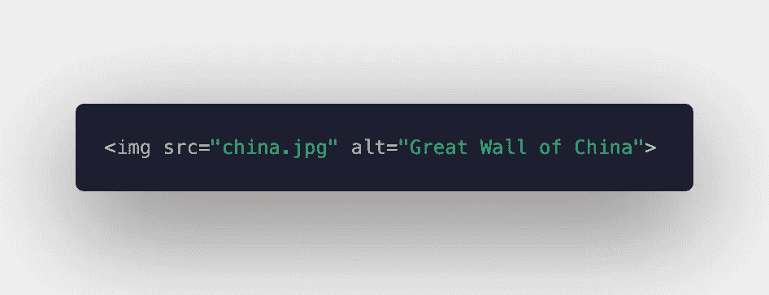
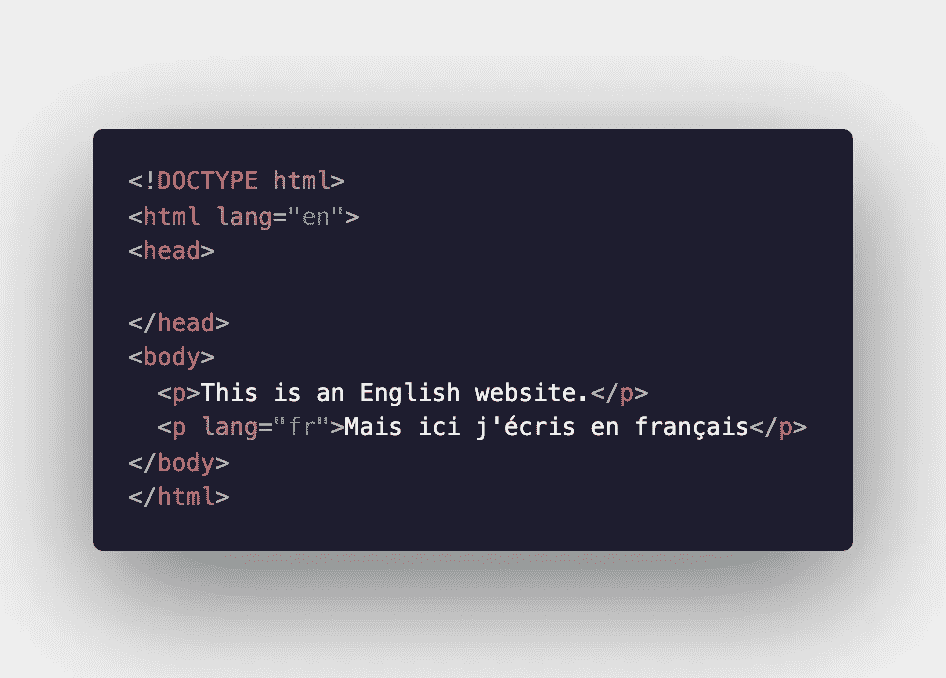

# 网页设计可及性的基础

> 原文：<https://levelup.gitconnected.com/the-basics-of-web-design-accessibility-af8b642124c4>

当你建立一个网站时，你可能会关注一些令人兴奋或具有挑战性的东西——网站的功能和设计。要记住的一个重要方面是可访问性特性，以便任何可能访问您的站点的人都可以使用它。为了做到这一点，有很多事情要记住，但是我将在这里只回顾一些基本的东西，这样你就可以开始了。

# 替代文本

您网站的访问者可能由于视觉障碍或其他原因而使用屏幕阅读器。屏幕阅读器向用户大声朗读页面内容。当然，它不能大声读出图像。如果一个用户无法知道你网站上的图片描述了什么，他或她就错过了一些提供给其他用户的信息——特别是当图片特别有信息性或者对理解你网站上的信息非常重要的时候。

通过在站点的 HTML 中将可选文本作为属性添加到图像中，您为屏幕阅读器提供了一些文本，以便向站点的访问者大声朗读。让这段文字简短、清晰、有描述性是很重要的。当您的网站上的图像由于图像所在的网站、用户的互联网连接等错误而无法加载时，此文本也很有用。用户可以看到您提供的文本，而不是空白的正方形。

如何在 HTML 中给图像标签添加可选文本的例子

# 声明语言

当设置 HTML 文件的基本样板结构时，用 **lang** 属性声明语言是很重要的。这有助于屏幕阅读器，因为它们使用该代码向用户提供给定语言的正确发音。如果你的网站完全是用英语写的，你通常会使用缩写“en”，除非你想指定另一种口音(如英式英语“en-gb”)。[语言代码的完整列表可以在这里找到](https://www.sitepoint.com/iso-2-letter-language-codes/)。

如果您的网站的任何部分包含另一种语言的文本，您应该使用 lang 属性来声明该部分的语言。

一个 HTML 的例子，文档声明为英语，但一个段落声明为法语

# 色对比度

当你选择网站的颜色时，记住背景和文本的对比是很重要的。对于患有各种色盲的用户来说，网站的可用性是按等级划分的。色盲有很多种形式，不考虑它会阻碍用户体验你创建的网站。你可以通过网站查看你选择的颜色是否通过测试。这里有一个这样的网站的例子，但是还有很多。

浅焦点的多色墙

# 调整大小

虽然你可能已经把重点放在使你的网站反应灵敏，以便它可以在任何屏幕上使用，从智能手表到大屏幕，你也应该记住，一些用户可能需要放大文本，以便舒适地阅读你写的东西。确保在你的网站设计中考虑到这一点。文本应该缩放得很好，任何其他周围的元素也应该相应地响应。

城市公园里一个巨大的“哟”字装置

有很多方法可以让你的网站具有可访问性。希望这个简短的指南介绍了一些基本的可访问性，这样你就可以开始让你的网站更加用户友好了！

阿曼达·特劳特勒