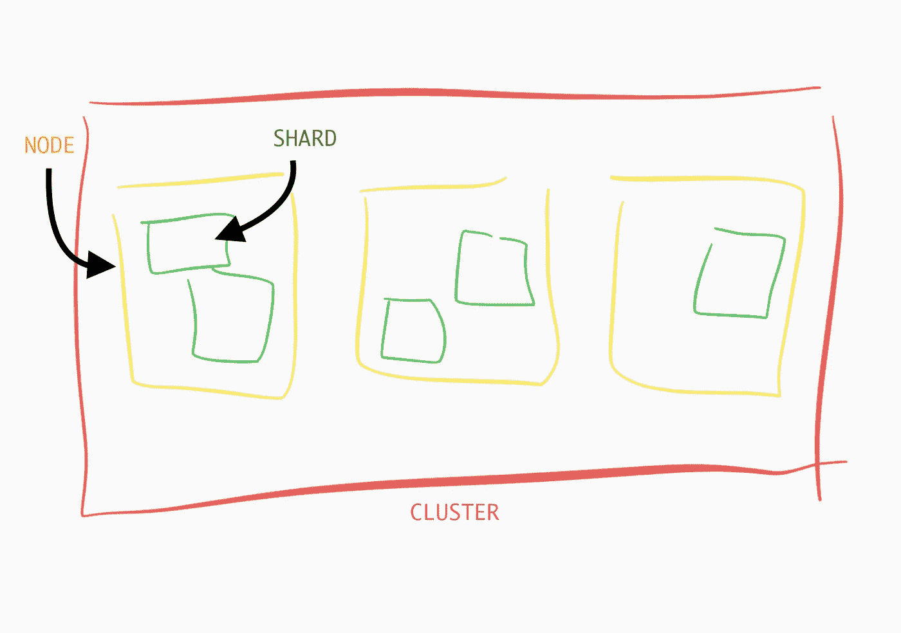
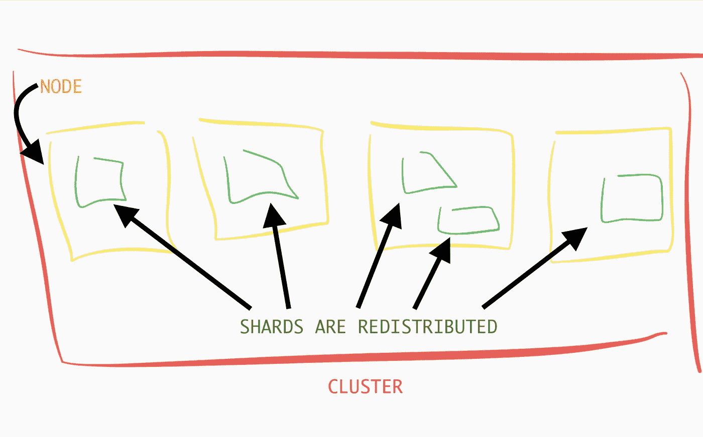

# 弹性研究初学者指南

> 原文：<https://levelup.gitconnected.com/the-beginners-guide-to-elasticsearch-8fc237fc3209>

## 这个强大的分析型搜索引擎的概念分解。


马库斯·斯皮斯克在 [Unsplash](https://unsplash.com?utm_source=medium&utm_medium=referral) 上的照片

Elasticsearch 是一个分布式、可扩展的分析搜索引擎，支持非结构化数据的复杂聚合。

**与 NoSQL 数据商店类似，Elasticsearch 旨在处理非结构化数据格式，并动态确定字段的数据类型。**它的主要数据格式是 JSON *(Javascript 对象表示法)*文档。JSON 的无模式格式允许灵活的数据存储，并且无需管理或创建关系就能轻松添加数据。

然而，Elasticsearch 不一定能与 NoSQL 数据库互换。 **Elasticsearch 不同于 NoSQL 数据库，有其自身的局限性。**比如 Elasticsearch 分布式系统，在执行交易时增加了一层复杂性。尽管进行分布式事务并非不可能，但如果可能的话，最好避免分布式事务，以简化流程。

Elasticsearch 还假设为其实例提供了足够的内存。因此，它不太热衷于处理内存错误。

Elasticsearch 通常与其他类型的数据库一起作为辅助工具使用。**记住弹性搜索是为速度而生的，这一点很重要。它非常适合搜索和过滤文档。**

## 节点和集群。

**Elasticsearch 由多个节点*(也称为 Elasticsearch 实例)*组成，一组连接的节点称为一个集群。**集群中的所有节点都知道同一集群中的其他节点。集群中的每个节点都可以通过 HTTP 请求执行 CRUD 操作 *(POST、GET、PUT、DELETE)* 。该模型允许节点将客户端请求转移到能够满足请求的其他节点。



1 个集群，3 个节点(es 实例)，5 个碎片

## 索引和碎片

索引有时被误解为关系数据库索引。然而，理解其中的区别是至关重要的。**弹性搜索索引是碎片的集合，文档均匀分布在碎片中。**如果没有指定，那么默认情况下，在 Elasticsearch v.7.0 之前，Elasticsearch 为每个索引分配五个主碎片。该模型如上图所示。**但是在 Elasticsearch v.7.0+中，默认为每个索引创建一个碎片。**

例如，您可以将`products`定义为一个索引。在该索引中，存在不同的产品文档，如下所示:

```
[{
 "title": "Apple MacBook Pro 13-Inch 'Core i7' 2.4",
 "price": "$2559",
 "sku": "123SampleBLK20",
 "itemCondition": "New",
 "availability": "IN_STOCK",
},
{
 "title": "Apple iPad Pro 12.9 (Wi-Fi Only - 4th Gen) 128GB",
 "price": "$699",
 "sku": "123SampleBLK21",
 "itemCondition": "Used",
 "availability": "IN_STOCK",
},
{
 "title": "Samsung Galaxy S20 - 128GB",
 "price": "$1199",
 "sku": "123SampleBLK22",
 "itemCondition": "New",
 "availability": "OUT_OF_STOCK",
}]
```

当文档被添加到索引中时，Elasticsearch 将决定哪个碎片将保存该文档。**碎片均匀分布在集群中的节点上。**如果新的节点被添加到系统中，Elasticsearch 将在集群内均匀地重新分配碎片。



请注意，集群中添加了一个额外的节点，现在碎片均匀地重新分布。

## 复制品

副本是碎片的一种，只是它们用于提高搜索性能，并作为主碎片的备份。**每个索引都有一个副本。**

副本碎片是一种可靠的故障转移，因为它们从不与它们正在复制的碎片分配在同一个节点上。如果你熟悉 RAID *(独立磁盘冗余阵列)*，那么副本碎片听起来应该有些相似。数据被镜像到一个冗余磁盘上，或者在这种情况下，被镜像到 shard 上。因为碎片在一个单独的节点上，如果包含主碎片的节点出现故障，那么副本仍然可用。并且具有副本和主碎片的节点同时发生故障的风险相对较低。

## 澄清“关系数据库”的类比

Elasticsearch 理解起来可能有点复杂。这种混乱主要是由于 Elasticsearch 团队用来描述这些概念的不准确的类比。此后，Elasticsearch 团队试图纠正这一误解。

互联网上的大多数资源都将索引与一个单独的关系数据库相比较。现在，您可能会想，*“索引不是更像一个表而不是一个数据库吗？”*

你说得对。它确实看起来像一张桌子。然而，在 Elasticsearch v.6 之前，曾经有过映射**类型**的概念。类型表示索引中文档的类型。例如，如果" *twitter"* 是一个索引，那么可以描述两种类型的 *"twitter"* 文档:"*tweet "**和*"用户。"类型有很多问题，我不会在本文中深入探讨，但本质上，类型模拟关系数据库表。**

*我的建议是不要与关系数据库建立联系。它会迷惑你，就像它迷惑我一样。*

# *安装和入门。*

***如前所述，与 Elasticsearch 交互的主要方式是通过 HTTP 请求(RESTFUL APIs)。**在这一节中，我们将回顾一些索引到 Elasticsearch 实例的基本方法，以帮助您入门。*

*要开始使用 Elasticsearch，安装 Docker 并创建一个目录`data/elasticsearch`。然后运行下面的 docker 命令下载 Elasticsearch Docker 映像并启动容器。*

```
*docker run --restart=always -d --name elasticsearch \\
    -e "discovery.type=single-node"  \\
    -v ~/data/elasticsearch:/usr/share/elasticsearch/data \\
    -p 9200:9200 \\
    -p 9300:9300 \\
    docker.elastic.co/elasticsearch/elasticsearch:7.9.2*
```

*您现在可以通过`[http://localhost:9200](http://localhost:9200)`访问所有的 Elasticsearch API*

## *创建新索引*

*您可以通过两种方式之一创建文档，通过 PUT 请求或 POST 请求。由于我将使用 Elasticsearch v.7，我将避免类型的话题。我们将坚持使用 Elasticsearch 默认类型`_doc`。并处理索引和文档。*

*我们可以创建一个空索引，如下所示:*

*`PUT [http://localhost:9200](http://localhost:9200)/products`*

*我们还可以通过在所需的索引名称下插入文档来创建索引，如下所示:*

```
*POST: [http://localhost:9200/product/_doc/](http://localhost:9200/product/_doc/){
 "title": "Apple MacBook Pro 13-Inch 'Core i7' 2.4",
 "price": "$2559",
 "sku": "123SampleBLK20",
 "itemCondition": "New",
 "availability": "IN_STOCK",
}*
```

*上述请求将产生以下响应:*

```
*{ "_index": "product",
  "_type": "_doc",
  "_id": "xUs3MHYBPq6LuxBgrCHN",
  "_version": 1,
  "result": "created",
  "_shards": {
    "total": 2,
    "successful": 1,
    "failed": 0
},
  "_seq_no": 6,
  "_primary_term": 1
}*
```

*上面的响应为插入的文档随机生成一个标识符`_id`。但是，如果要指定标识符，请将 POST 请求更改为 PUT 请求，并将标识符添加到请求的末尾，如下所示:*

```
*PUT: [http://localhost:9200/product/_doc/](http://localhost:9200/product/_doc/)1*
```

*回到响应，注意总共有两个片段，其中一个成功了。这个响应告诉我们，数据是从总共两个活动碎片*(其中一个是副本碎片)*中的一个碎片获取的。*

*我们可以通过执行 CAT *(压缩和对齐文本)* API 调用来验证碎片的数量，如下所示:*

```
*GET http://localhost:9200/_cat/shards/product*
```

*卡特彼勒 API 请求是关于我们的 Elasticsearch 集群的统计查询。我们可以查询节点、分片、索引、模板和其他弹性搜索功能。*

*上述请求的结果产生了以下内容:*

```
*product 0 p STARTED    4 7kb 1xx.xx.x.x a6ffefa157e8
product 0 r UNASSIGNED*
```

*这个响应告诉我们，在索引`product`处，被标识的碎片*(在本例中，它们都被标记为 0)* 要么是副本 *r* 要么是主 *p，*，并且它的状态为*开始*或*未分配。*它还告诉我们碎片中的文档数量、磁盘大小、IP 地址和节点 id。*

*要获得卡特彼勒 API 请求的完整列表，我们可以发出以下请求:*

```
*GET http://localhost:9200/_cat/*
```

*我建议把这个请求放在身边。在你学习的时候很方便。*

## *搜索索引*

*Elasticsearch 庞大的搜索能力是不可能用几段话概括的。我将提供两个基础知识来帮助您入门:**获取索引中的所有文档，并按其标识符获取文档。我将在另一篇文章中讨论更复杂和有趣的搜索查询。***

*我们可以通过以下请求来请求索引中的所有文档:*

```
*GET http://localhost:9200/product/_search*
```

*然而，默认情况下，Elasticsearch 一次只会返回 10 个文档。但是我们可以通过指定查询字符串`size`来增加这个限制，如下所示:*

```
*GET http://localhost:9200/product/_search?size=100*
```

*通过标识符获取单个文档与添加文档一样简单，只是我们将 POST 请求改为 GET 请求，如下所示:*

```
*GET http://localhost:9200/product_entity/_doc/1*
```

## *最后的想法*

*Elasticsearch 是一个强大的分析搜索引擎。然而，操作起来可能非常复杂。*

*在本文中，我介绍了一些基本概念，以帮助您入门。尽管如此，我还是强烈推荐浏览一下 [Elasticsearch v.7.9 或更高版本的文档](https://www.elastic.co/guide/en/elasticsearch/reference/7.9/index.html)和 [Elasticsearch 博客](https://www.elastic.co/blog/)来扩展你的理解。*