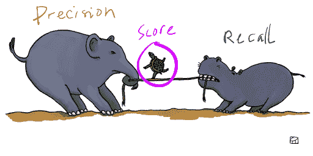
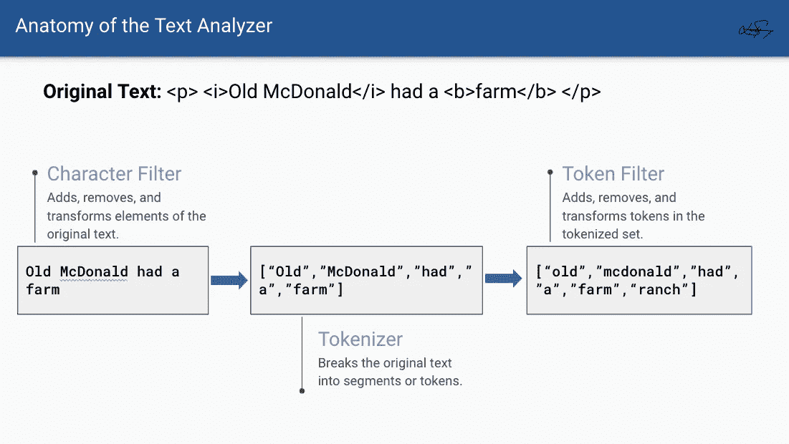
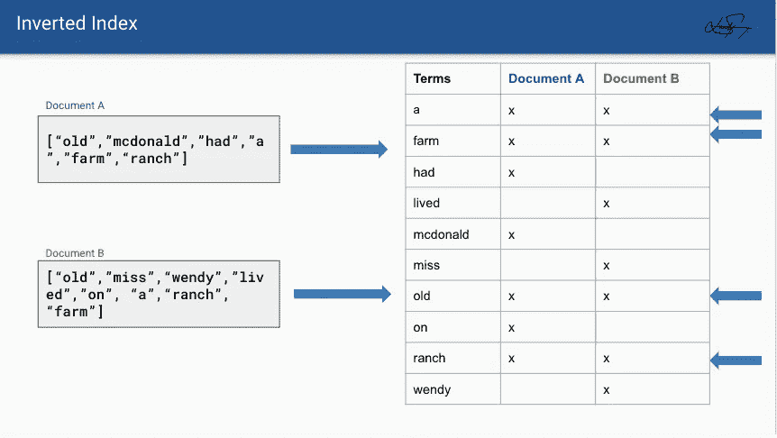
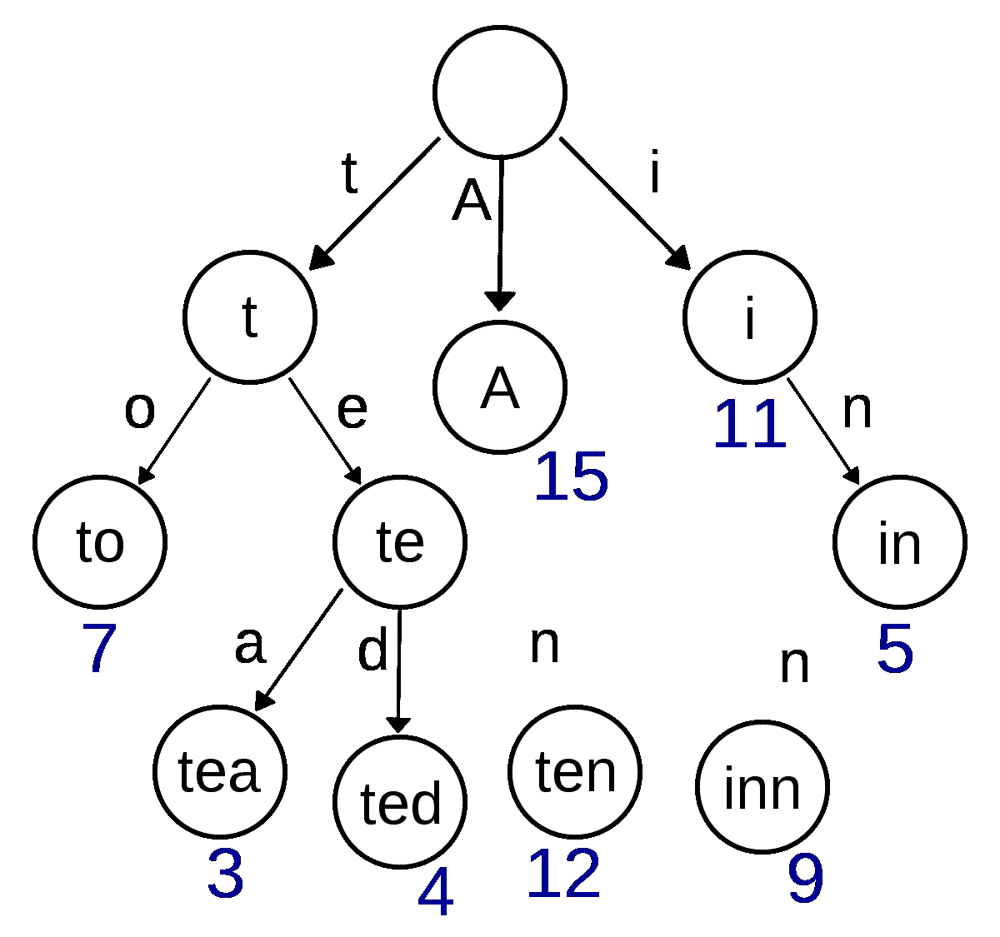
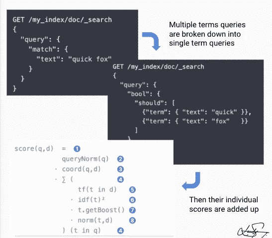

# 用 Elasticsearch 搜索相关性的初学者指南

> 原文：<https://levelup.gitconnected.com/the-beginners-guide-to-search-relevance-with-elasticsearch-e7ee61f0695f>

## 使用这个强大的引擎优化搜索功能的分析概念纲要。

斯蒂芬·菲利普斯-Hostreviews.co.uk 在 [Unsplash](https://unsplash.com?utm_source=medium&utm_medium=referral) 上的照片

Elasticsearch 是一个分布式、可扩展的分析搜索引擎，支持非结构化数据的复杂聚合。这是一个基于 Apache Lucene(一个 Java 搜索引擎库)的免费开源基础设施。

这种健壮的封装架构使得水平扩展和管理系统的不同部分变得很容易。与 NoSQL 数据存储类似，Elasticsearch 的主要数据格式是 JSON (Javascript 对象表示法)，这允许灵活的数据存储。在这篇文章中，我想讨论 Elasticsearch 如何改进搜索功能。

通常，我们选择在实践中开发一个简单的搜索实现，我们在数据集上迭代匹配用户查询的数据。但是，迭代求解至少需要 O(n)时间才能完成，这对于大型数据集来说不是最佳选择。总的来说，幼稚的解决方案通常不能满足用户的需求或期望。这个理论回避了一个非常普遍的问题，*“这份文件相关吗？”*不幸的是，要获得相关数据，这不是一个令人满意的问题。此外，维护这种简单的解决方案可能成本高昂，尤其是当我们的数据持续增长时。

你可能想知道，我们如何改善这一点？

答案是 ***度量*** 。

# 搜索相关性

**搜索相关性**是对搜索查询和搜索结果之间准确性的度量。不要问“*这份文件相关吗？*“我们可以问，”*这份文件的相关性如何？*

它取决于两个基本指标:*精度和召回率。*

**回忆**就像是对数量的衡量。我们希望确保数据集的所有相关文档都包含在搜索结果中。

另一方面，精确度就像是质量的衡量标准。我们希望确保搜索结果中的所有数据都是相关的。

这些听起来可能相似，所以让我们看一个例子。

想象一片色彩斑斓的水生生物的海洋；鱼、螃蟹、水母、鲨鱼、海豚，甚至可能还有海绵宝宝。在那片海里，你在寻找紫色的鱼。

在高精度的情况下，我们只能捕捉纯紫色的鱼。这似乎是可取的，但如果有紫色斑点的鱼，或一半紫色一半黄色的鱼呢？从技术上讲，这些鱼仍然与我们的搜索有关。

相反，在高回忆的情况下，我们会提取任何紫色的东西或者是鱼的东西。因此，这将包括紫蟹，鲨鱼，海豚和水母。尽管我们指定了“*鱼*”，其他生物也是相关的，因为它们是*紫色*。但是，它也包括不同颜色的普通鱼，因为它们是*鱼*。那不是一个理想的结果。

在这两种情况下，我们都获取了相关的结果，但是我们要么过度获取了结果，要么获取的结果不足。

*有道理吗？*

精确度和召回率经常是相互矛盾的，因为提高一个会损害另一个。

**然而，两者的平衡可以帮助我们生成一个分数，我们可以用它来获取相关的结果。**

你可能想知道，我们如何计算这个分数？*好问题。*

**Elasticsearch 使用搜索相关性对数据集的文档进行评分。**它返回按相关性分数排序的有序数据列表。我们可以通过添加和修改变量来定制分数，这些变量将在精确度和召回率之间转换。

# 它是如何工作的？

**Elasticsearch 使用文本分析器将文本转化为优化的可搜索数据。**它们用于两种情况，查询数据和插入数据。

Elasticsearch 的文本分析器有三个部分:**字符过滤器、记号赋予器和记号过滤器。**文本分析器是高度可定制的，这意味着它的每一部分都可以定制或修改以适应特定的用例。

幻灯片来自我的演示，这是对 ES 文本分析器的剖析。步骤 1 是字符过滤器，步骤 2 是记号赋予器，步骤 3 是记号过滤器。

**字符过滤器**负责添加、删除和转换文本元素。例如，它可以删除 HTML 字符并替换出现的某些字符串。

记号赋予器将文本分解成记号，也称为术语。默认的记号赋予器是空白记号赋予器，每当它遇到空白时，它就分解文本。但是，其他记号赋予器，如字母记号赋予器，每当遇到非字母字符时，就会分割文本。

最后，**令牌过滤器**是一个类似的字符过滤器。它可以添加、删除和转换令牌。有一些很酷的过滤器，比如同义词标记过滤器，可以添加同义词。

## 倒排索引

结果数据被添加到倒排索引中。倒排索引将标记映射到文档。这种架构设计允许我们将术语映射到多个文档，并使按术语搜索文档比迭代解决方案更有效。

来自我的 PowerToFly 演示文稿的幻灯片。文档 A 和文档 B 的术语在索引中，每个术语映射回文档本身。

然而，请不要把这种数据结构混淆为散列表*，因为* *是我的第一个假设。在 Elasticsearch 的基础上，Apache Lucene 使用了一种叫做 BlockTree 术语字典的特殊数据结构。*

块树术语词典帮助我们使用前缀树通过前缀找到术语。

每个字符占据一个节点，树的叶子是术语。

这种数据结构有助于我们避免使用子字符串或带有复合词的语言，如德语或挪威语。它还可以返回有用的建议，比如，*“你的意思是？<单词>，*或者纠正用户的拼写错误。

## TF/IDF 和字段长度标准

倒排指数有助于 TF/IDF 的测量。

**TF 代表词频，**衡量一个词在特定文档中出现的次数。可以把它想象成一个页面上的 CTRL+F 搜索，它会找到所有搜索查询出现的次数，并告诉您出现的次数。

**IDF 代表逆文档频率**，它在 Elasticsearch 中查看多个文档，并告诉我们如果某个术语出现得太频繁，那么它就有更高的可能性不相关。

例如，如果我们提到一本书的索引，就有一些特殊的术语被排除在外。类似于*“大约”、“那里”、“T11”和*“来自”*的术语不包括在索引中。这些术语出现了太多次，以至于失去了相关性。*

最后，**字段长度规范**是一个字段的长度，我说的字段是指标题字段或者描述字段。字段长度越短，该字段中的术语越相关，而字段长度越长，术语越不相关。

狐狸这个词的权重是 0.15。TF 是 1，IDF 是 0.3，字段长度范数是 0.5

Elasticsearch 将这三个指标结合起来，计算并存储为特定术语的权重。然而，由于查询可以包含多个术语，如*“紫斑鱼”，* Elasticsearch 使用向量空间模型来比较针对文档的多术语查询。

**向量空间模型**是一个多维数组，包含查询中每个词的权重。

# 相似性算法

本质上，所有这些组件结合起来，*或多或少*，创建了一种相似性算法，Elasticsearch 称之为 **Lucene 实用评分函数**。该函数生成一个相关性分数，当请求数据时，Elasticsearch 使用该分数对文档进行排序。

一个多项查询被分解成多个单项查询，然后通过上一节描述的 Lucene 实用评分算法步骤。

其他类型的相似性算法使用类似的度量，如 TF/IDF，但使用不同的排名函数或度量框架。幸运的是，Elasticsearch 支持其中一些相似性算法。例如，Elasticsearch 支持 Okapi BM25，它使用概率模型，而不是向量空间模型。

尽管与简单的解决方案相比，Elasticsearch 引入了一些复杂性，但其代价是一个可扩展的智能系统，具有自我维持的潜力。无论用户行为如何，无论我们的数据机会如何，无论我们的数据增长到多大，我们都有信心这个系统能够提供最佳的结果。

最终，当我们花时间在可扩展的环境中实施时，我们就为自己的成功做好了准备。感谢像 Elasticsearch 这样的基础设施，我们没有被学习数据分析和复杂的数学模型的开销所困扰。所有这些都可以方便地抽象出来，只要理解理论就足够了，这样我们就可以修改暴露的变量。

最终，业务是快乐的，因为用户是快乐的，我们也是快乐的，因为我们不必在每次有小的变化或不便时都不断地修改我们的代码。

听起来是不是很棒？

我希望你喜欢这篇文章！编码快乐！